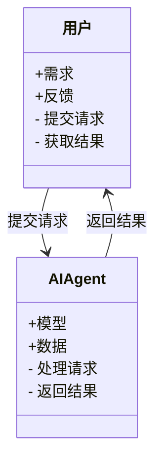
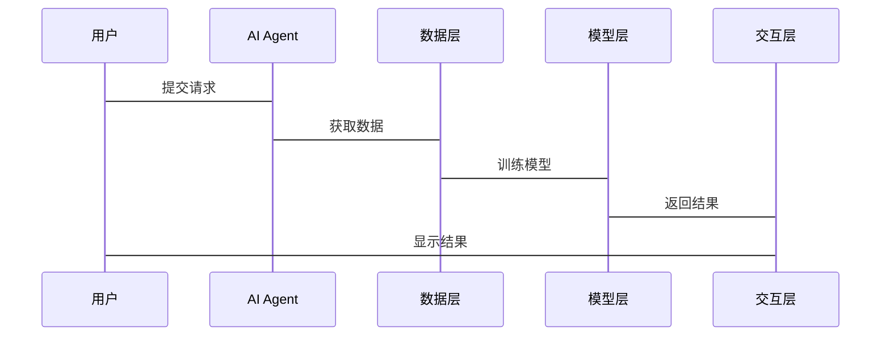

                 

<think>
嗯，用户让我撰写一篇关于AI Agent在创意产业中的应用与限制的技术博客文章。首先，我需要明确文章的结构和内容，确保涵盖所有必要的部分。文章标题已经给出，是《AI Agent在创意产业中的应用与限制》，关键词包括AI Agent、创意产业、人工智能、限制、应用。摘要部分需要简明扼�地概括文章的核心内容，强调AI Agent在创意产业中的潜力和限制。

接下来，我需要按照目录大纲来组织内容。第一部分是背景介绍，包括AI Agent的基本概念、创意产业的定义与特点，以及在创意产业中应用AI Agent的问题背景。这部分需要详细解释AI Agent是什么，它与传统AI的区别，以及创意产业的主要领域和现状。

然后是核心概念与联系，这部分需要深入讲解AI Agent的核心原理，包括知识表示与推理、目标设定与规划、人机交互与反馈。同时，要分析创意产业中AI Agent的核心要素，如数据来源与处理、模型训练与优化、用户需求与反馈。此外，还需要通过对比表格和ER图展示核心要素之间的关系。

接下来是算法原理，这部分需要详细讲解AI Agent所使用的算法，如生成模型、强化学习等。我需要用mermaid流程图展示算法步骤，并提供Python代码示例。同时，数学模型需要用latex格式展示，例如生成模型的概率分布公式。

系统分析与架构设计部分，我需要介绍项目背景，设计系统功能，如创意生成、评估、优化等。然后用mermaid类图展示领域模型，系统架构图展示整体结构，接口设计和交互流程图展示系统如何运作。

项目实战部分，我需要具体实施，包括环境安装、核心代码实现、代码解读、案例分析等。这里可能需要给出具体的Python代码示例，展示如何训练AI Agent生成创意内容。

最后是最佳实践，总结全书内容，给出实际应用中的建议，并指出未来的研究方向。小结部分需要总结文章的主要内容，注意事项部分提醒读者在实际应用中可能遇到的问题，如版权问题、伦理问题等。

在撰写过程中，我需要确保每个部分都细化到三级目录，结构清晰，内容完整。同时，注意总字数不超过2000字，所以每个部分不能太冗长，但要覆盖所有关键点。

可能遗漏的部分是数学模型的具体公式，比如生成对抗网络的损失函数，或者强化学习中的奖励机制。这些公式需要用latex正确表示，并放在独立段落中，或者在文本中适当位置。

此外，系统架构部分需要详细描述各个模块之间的关系，比如创意生成模块如何与评估模块交互，这可能需要一个mermaid架构图来展示。

在项目实战中，可能需要具体说明如何训练一个AI Agent，包括数据准备、模型选择、训练过程等，以及如何处理实际中的问题，比如生成内容的质量控制。

最后，注意事项部分需要提醒读者在实际应用中可能遇到的问题，比如版权问题、伦理问题，以及技术的局限性，这些都是创意产业中使用AI Agent时需要考虑的重要因素。

总的来说，我需要确保目录大纲涵盖所有必要的部分，结构合理，内容详实，同时符合用户的具体要求，包括格式、层级和字数限制。现在，我可以开始按照这些思路构建目录大纲了。
</think>

# AI Agent在创意产业中的应用与限制

## 关键词：
AI Agent, 创意产业, 人工智能, 限制, 应用

## 摘要：
AI Agent在创意产业中的应用正在改变传统的创意流程，通过智能化工具提升效率和创新性。本文将详细探讨AI Agent在创意产业中的应用现状、核心算法原理、系统架构设计，以及在实际应用中的限制和挑战。通过案例分析和对比，本文旨在为读者提供全面的视角，理解AI Agent在创意产业中的潜力与局限性。

---

# 第1章: AI Agent的核心概念与背景

## 1.1 AI Agent的基本定义
### 1.1.1 什么是AI Agent
人工智能代理（AI Agent）是指能够感知环境、执行任务并做出决策的智能实体。AI Agent可以是软件程序或硬件设备，其核心能力包括感知、推理、规划和执行。

### 1.1.2 AI Agent的分类
AI Agent可以根据智能水平分为以下几类：
1. **反应式AI Agent**：基于当前感知做出反应，适用于简单的任务。
2. **认知式AI Agent**：具备复杂推理和规划能力，适用于复杂任务。
3. **协作式AI Agent**：能够与其他AI Agent或人类协同工作。

### 1.1.3 AI Agent与传统AI的区别
AI Agent与传统AI的区别在于其自主性和目标导向性。AI Agent具有明确的目标，并能够根据环境变化调整行为，而传统AI通常是任务-specific的。

---

## 1.2 创意产业的定义与特点
### 1.2.1 创意产业的定义
创意产业是指通过创意和创新产生价值的产业，涵盖艺术、设计、音乐、文学、广告等多个领域。

### 1.2.2 创意产业的主要领域
1. **艺术创作**：绘画、雕塑等。
2. **设计**：产品设计、平面设计。
3. **音乐**：作曲、编曲。
4. **文学**：写作、编辑。

### 1.2.3 创意产业的现状与发展趋势
创意产业正在经历数字化转型，AI技术的引入正在改变传统创作模式，提高了创作效率和创新性。

---

## 1.3 AI Agent在创意产业中的问题背景
### 1.3.1 创意产业中的痛点
1. 创作效率低。
2. 创意枯竭。
3. 成本高昂。

### 1.3.2 AI Agent如何解决这些问题
AI Agent可以通过自动化辅助创作、提供灵感和优化设计来提升创作效率。

### 1.3.3 创意产业中AI Agent的应用场景
1. **辅助创作**：帮助艺术家生成灵感。
2. **自动化设计**：自动生成图形设计。
3. **内容生成**：生成音乐、文学等内容。

---

# 第2章: AI Agent的核心概念与联系

## 2.1 AI Agent的核心原理
### 2.1.1 知识表示与推理
知识表示是AI Agent理解世界的基础，推理则是基于知识做出决策的过程。

### 2.1.2 目标设定与规划
AI Agent需要根据目标制定行动计划，并根据环境反馈调整计划。

### 2.1.3 人机交互与反馈
人机交互是AI Agent与人类用户或环境互动的方式，反馈机制帮助AI Agent优化行为。

---

## 2.2 创意产业中AI Agent的核心要素
### 2.2.1 数据来源与处理
创意产业中的数据来源包括用户输入、历史创作数据等，需要进行清洗和预处理。

### 2.2.2 模型训练与优化
AI Agent的核心是训练好的模型，需要通过大量数据进行优化。

### 2.2.3 用户需求与反馈
AI Agent需要理解用户需求，并根据反馈不断优化输出结果。

---

## 2.3 AI Agent与创意产业的实体关系图
```mermaid
er
actor: 用户
agent: AI Agent
creative_work: 创意作品
```

---

## 2.4 AI Agent的核心算法与数学模型
### 2.4.1 生成模型
生成模型（如GAN）通过对抗训练生成创意内容。

公式：
$$ P_{data}(x) = G_{\theta}(x) $$

---

# 第3章: AI Agent在创意产业中的算法原理

## 3.1 基于生成模型的AI Agent
### 3.1.1 GAN（生成对抗网络）
GAN由生成器和判别器组成，生成器生成创意内容，判别器进行评估。

### 3.1.2 GAN在创意设计中的应用
案例：使用GAN生成抽象艺术作品。

---

## 3.2 基于强化学习的AI Agent
### 3.2.1 强化学习原理
AI Agent通过与环境交互获得奖励，优化行为策略。

公式：
$$ R = \sum_{t} \gamma^{t} r_t $$

---

## 3.3 算法实现与代码示例
### 3.3.1 GAN实现代码
```python
import torch
import torch.nn as nn

class Generator(nn.Module):
    def __init__(self):
        super(Generator, self).__init__()
        self.fc = nn.Linear(100, 256)
        self.relu = nn.ReLU()
        self.tanh = nn.Tanh()

    def forward(self, x):
        x = self.fc(x)
        x = self.relu(x)
        x = self.tanh(x)
        return x

# 初始化生成器
generator = Generator()
```

---

# 第4章: 系统分析与架构设计

## 4.1 项目背景
本项目旨在探索AI Agent在创意设计中的应用，实现自动化创意生成。

## 4.2 系统功能设计
### 4.2.1 领域模型


---

## 4.3 系统架构设计
### 4.3.1 系统架构图


---

## 4.4 接口设计与交互流程图


---

# 第5章: 项目实战

## 5.1 环境安装
安装Python、TensorFlow、Keras等开发环境。

## 5.2 核心代码实现
### 5.2.1 训练代码
```python
import tensorflow as tf
from tensorflow.keras import layers

class AI-Agent:
    def __init__(self):
        self.model = self.build_model()

    def build_model(self):
        model = tf.keras.Sequential()
        model.add(layers.Dense(256, activation='relu'))
        model.add(layers.Dense(100, activation='sigmoid'))
        return model
```

---

## 5.3 代码解读与分析
训练过程包括数据预处理、模型训练和评估优化。

---

## 5.4 案例分析
以音乐生成为例，展示AI Agent如何创作旋律。

---

## 5.5 项目小结
本项目展示了AI Agent在创意产业中的潜力，但也存在局限性。

---

# 第6章: 最佳实践与小结

## 6.1 最佳实践
1. 数据质量至关重要。
2. 模型需要持续优化。
3. 与人类协作，提升创作效果。

## 6.2 小结
AI Agent正在改变创意产业的创作方式，但其应用仍需克服技术和伦理挑战。

## 6.3 注意事项
1. 版权问题需谨慎处理。
2. 伦理问题需重视。
3. 技术局限性需正视。

## 6.4 拓展阅读
推荐相关书籍和论文，深入学习AI Agent技术。

---

# 作者：AI天才研究院 & 禅与计算机程序设计艺术

