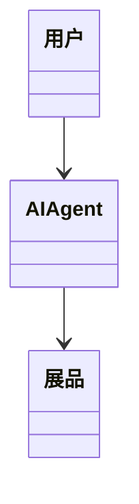
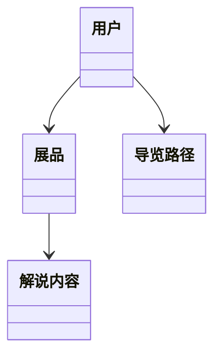
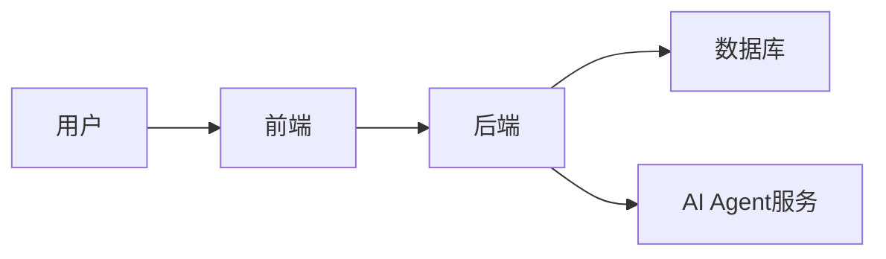

                 

<think>
好的，我现在需要根据用户的指示，撰写一篇关于AI Agent在博物馆中的应用的技术博客。用户已经给出了详细的目录结构，我需要按照这个结构逐步展开每个部分的内容。

首先，我需要理解每个章节的核心内容，确保逻辑清晰，内容详实。比如，在“AI Agent的基本概念与背景介绍”部分，我需要解释什么是AI Agent，以及它在博物馆中的具体应用。接着，在“AI Agent的核心概念与原理”部分，我需要深入讲解感知、决策和执行模块，并使用流程图和实体关系图来辅助说明。

接下来，我需要考虑用户的要求，如使用专业技术语言、结构紧凑、逻辑清晰，并且包含图表和代码示例。因此，我会在每个部分中加入相应的mermaid图表和Python代码，以增强文章的可读性和技术深度。

同时，我还需要注意文章的总字数控制在10000到12000字之间，每个章节都要详细展开，确保内容完整。最后，我会在文章末尾添加作者信息，以符合用户的要求。

综上所述，我会按照用户提供的目录结构，逐章节展开内容，确保每个部分都涵盖必要的技术细节和实例分析，最终完成一篇高质量的技术博客文章。
</think>

# AI Agent在博物馆中的应用：智能导览与展品解说

## 关键词：AI Agent，博物馆导览，智能解说，路径规划，自然语言处理，展品管理

## 摘要：  
随着人工智能技术的飞速发展，AI Agent（人工智能代理）在各个领域的应用日益广泛。本文聚焦于AI Agent在博物馆中的应用，重点探讨其在智能导览与展品解说中的创新应用。通过分析AI Agent的核心概念、算法原理、系统架构设计及实际案例，本文旨在揭示AI Agent如何通过智能导览和展品解说提升博物馆的服务质量与用户体验。文章最后将总结AI Agent在博物馆应用中的最佳实践与未来发展方向。

---

## 第一部分: AI Agent在博物馆中的应用概述

### 第1章: AI Agent的基本概念与背景介绍

#### 1.1 AI Agent的定义与核心概念
##### 1.1.1 AI Agent的定义  
AI Agent（人工智能代理）是指能够感知环境、自主决策并执行任务的智能实体。在博物馆场景中，AI Agent可以以虚拟助手或实体机器人形式出现，为用户提供智能化的导览服务。

##### 1.1.2 AI Agent的核心要素与特征  
AI Agent的核心要素包括：  
1. **感知能力**：通过传感器或摄像头等设备获取环境信息。  
2. **决策能力**：基于感知信息，利用算法做出最优决策。  
3. **执行能力**：通过执行机构或输出接口完成任务。  
4. **学习能力**：通过机器学习模型不断优化自身性能。  

##### 1.1.3 AI Agent在博物馆中的应用背景  
博物馆传统的导览服务依赖人工讲解员，存在成本高、效率低、覆盖范围有限等问题。AI Agent的引入能够有效解决这些问题，为用户提供个性化、高效、便捷的导览服务。

#### 1.2 博物馆导览服务的需求分析
##### 1.2.1 博物馆导览服务的现状与痛点  
目前，博物馆导览服务主要依赖人工讲解员，存在以下痛点：  
- **成本高**：需要大量人力投入。  
- **覆盖有限**：难以满足大规模游客的需求。  
- **灵活性差**：难以快速响应个性化需求。  

##### 1.2.2 用户需求分析  
用户在博物馆导览中的需求包括：  
1. **个性化需求**：不同用户对展品的兴趣点不同，需要个性化的解说。  
2. **实时性需求**：用户希望解说内容能够实时更新，紧跟展览变化。  
3. **便捷性需求**：用户希望以多种方式（如语音、文字、视频等）获取解说内容。  

##### 1.2.3 AI Agent在导览服务中的优势  
AI Agent能够通过以下方式提升导览服务：  
- **降低成本**：无需大量人工讲解员。  
- **覆盖广泛**：能够同时为大量用户提供服务。  
- **个性化服务**：基于用户兴趣提供定制化解说。  

---

### 第2章: AI Agent的核心概念与原理

#### 2.1 AI Agent的核心概念
##### 2.1.1 感知模块  
感知模块是AI Agent获取环境信息的关键部分，主要包括：  
1. **视觉感知**：通过摄像头识别展品信息。  
2. **听觉感知**：通过麦克风获取用户语音指令。  
3. **语义理解**：通过NLP技术理解用户需求。  

##### 2.1.2 决策模块  
决策模块基于感知信息，通过算法做出最优决策。常用算法包括：  
1. **基于规则的决策**：适用于简单的逻辑判断。  
2. **基于机器学习的决策**：适用于复杂场景，如路径规划和展品推荐。  

##### 2.1.3 执行模块  
执行模块负责将决策结果转化为具体行动，如播放解说内容、调整路径等。  

#### 2.2 AI Agent的原理与流程图
##### 2.2.1 感知-决策-执行流程  


##### 2.2.2 AI Agent的实体关系图


---

### 第3章: AI Agent的算法原理与数学模型

#### 3.1 自然语言处理算法
##### 3.1.1 分词算法  
分词算法用于将连续的文本分割成有意义的词语或短语。常用算法包括：  
- **正向最大匹配法**：从左到右逐字匹配最长可能的词。  
- **逆向最大匹配法**：从右到左逐字匹配最长可能的词。  

##### 3.1.2 语义理解模型  
语义理解模型用于理解用户意图，常用模型包括：  
- **词袋模型**：将文本表示为词的集合。  
- **TF-IDF**：计算词语的重要性。  
- **BERT**：基于Transformer的预训练模型。  

##### 3.1.3 基于Transformer的文本生成  
Transformer模型通过自注意力机制捕捉文本中的长距离依赖关系，能够生成连贯且相关的解说内容。  

#### 3.2 路径规划算法
##### 3.2.1 A*算法  
A*算法是一种常见的路径规划算法，通过评估节点的优先级进行搜索。  
- **公式**：  
  $$ f(n) = g(n) + h(n) $$  
  其中，\( g(n) \) 是已 traversed cost，\( h(n) \) 是 heuristic estimate of the cost from \( n \) to the goal。  

##### 3.2.2 Dijkstra算法  
Dijkstra算法用于寻找单源最短路径，适用于权重相同的路径规划。  

##### 3.2.3 算法比较与优化  
A*算法在效率和效果上优于Dijkstra算法，尤其适用于博物馆这种空间有限的场景。  

---

### 第4章: 博物馆导览系统的系统分析与架构设计

#### 4.1 项目背景与目标
##### 4.1.1 项目背景  
本项目旨在通过AI Agent实现博物馆的智能化导览服务，提升用户体验。  

##### 4.1.2 项目目标  
- 实现展品信息的智能化解说。  
- 提供个性化的导览路径规划。  
- 支持多语言解说服务。  

#### 4.2 系统功能设计
##### 4.2.1 用户需求分析  
用户需求包括：  
1. **展品信息查询**：用户可以查询展品的详细信息。  
2. **路径规划**：用户可以输入起点和终点，系统自动规划最优路径。  
3. **个性化解说**：用户可以根据兴趣选择解说内容。  

##### 4.2.2 功能模块划分  
系统功能模块包括：  
1. **用户交互模块**：接收用户输入并输出解说内容。  
2. **展品信息模块**：存储和管理展品信息。  
3. **路径规划模块**：根据用户需求规划导览路径。  
4. **自然语言处理模块**：理解用户需求并生成解说内容。  

##### 4.2.3 领域模型设计  


#### 4.3 系统架构设计
##### 4.3.1 分层架构  
系统采用分层架构，包括：  
1. **表现层**：用户界面。  
2. **业务逻辑层**：处理用户请求。  
3. **数据访问层**：访问数据库。  

##### 4.3.2 微服务架构  
系统采用微服务架构，包括：  
1. **展品信息服务**：管理展品信息。  
2. **路径规划服务**：提供路径规划功能。  
3. **解说内容服务**：生成解说内容。  

##### 4.3.3 系统架构图  


---

### 第5章: 项目实战与实现

#### 5.1 环境安装与配置
##### 5.1.1 Python环境安装  
安装Python 3.8及以上版本。  

##### 5.1.2 依赖库安装  
安装以下依赖库：  
- `jieba`：中文分词工具。  
- `transformers`：BERT模型库。  
- `networkx`：图论库。  

##### 5.1.3 开发工具配置  
配置IDE（如PyCharm）的Python解释器和依赖管理工具（如pipenv）。  

#### 5.2 核心代码实现
##### 5.2.1 自然语言处理模块  
```python
import jieba

def tokenize(text):
    return jieba.lcut(text)
```

##### 5.2.2 路径规划模块  
```python
import networkx as nx

def a_star(start, end, grid):
    G = nx.grid_graph(grid)
    return nx.astar_path(G, start, end)
```

##### 5.2.3 展品信息管理模块  
```python
class Exhibit:
    def __init__(self, id, name, description):
        self.id = id
        self.name = name
        self.description = description
```

#### 5.3 实际案例分析
##### 5.3.1 案例背景  
以某博物馆的青铜器展为例，用户希望了解青铜器的历史背景和工艺特点。  

##### 5.3.2 解说内容生成  
AI Agent通过NLP模型生成解说内容：  
$$ 解说内容 = \text{生成与用户兴趣相关的解说文本} $$  

##### 5.3.3 路径规划  
AI Agent根据用户位置和展品分布，规划最优导览路径。  

---

### 第6章: 最佳实践与总结

#### 6.1 最佳实践 tips
1. **数据质量**：确保展品信息的准确性。  
2. **用户体验**：提供多语言支持和多种交互方式。  
3. **系统维护**：定期更新展品信息和优化算法模型。  

#### 6.2 小结  
AI Agent在博物馆中的应用前景广阔，能够显著提升导览服务的智能化水平和用户体验。  

#### 6.3 注意事项  
- **隐私保护**：确保用户数据的安全性。  
- **系统稳定性**：确保AI Agent在复杂环境中的稳定运行。  

#### 6.4 拓展阅读  
1. 《深度学习》——Ian Goodfellow  
2. 《算法导论》——Thomas H. Cormen  

---

## 作者：AI天才研究院/AI Genius Institute & 禅与计算机程序设计艺术 /Zen And The Art of Computer Programming

