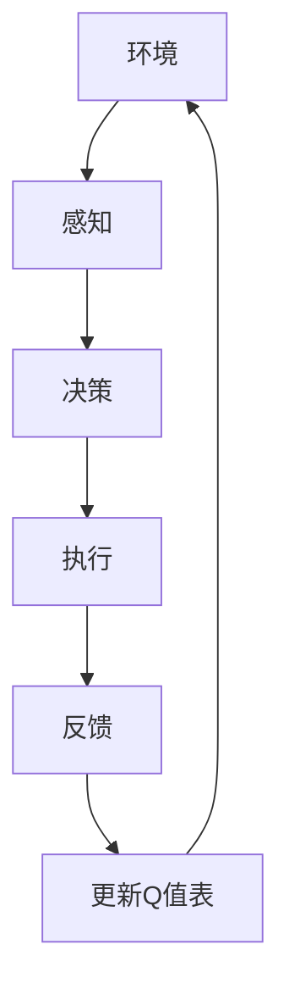
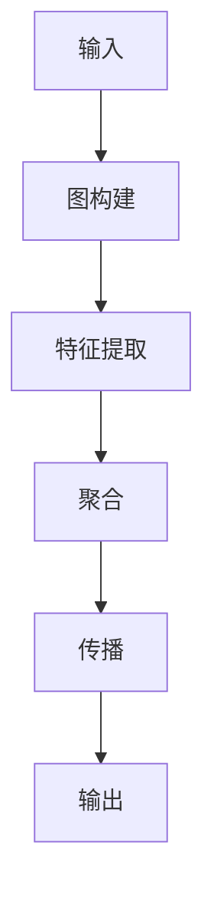
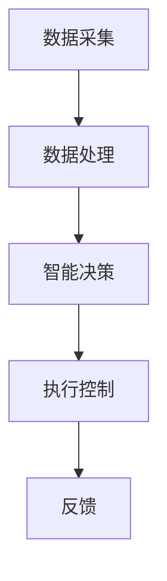
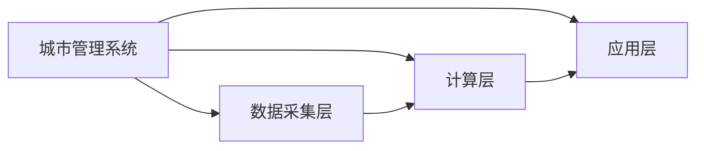
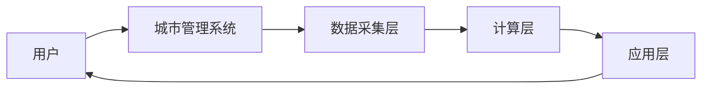

                 


# AI Agent在城市管理中的智能应用

## 关键词：AI Agent, 城市管理, 智能应用, 强化学习, 图神经网络, 智能交通管理

## 摘要：  
本文深入探讨了AI Agent在城市管理中的智能应用，从基本概念到核心技术，再到实际案例，全面分析了AI Agent如何提升城市管理的效率和质量。文章详细介绍了AI Agent的核心技术，包括感知、决策和执行模块，并通过强化学习和图神经网络的算法实现，展示了AI Agent在城市管理中的广泛应用。通过智能交通管理的项目实战，本文进一步验证了AI Agent在解决城市复杂问题中的巨大潜力。  

---

# 第1章: AI Agent的基本概念与背景

## 1.1 AI Agent的定义与特点

### 1.1.1 什么是AI Agent
AI Agent（人工智能代理）是一种能够感知环境、自主决策并执行任务的智能实体。它能够根据环境信息做出决策，并通过执行动作与环境交互。AI Agent的核心目标是通过智能化的感知和决策，提高任务执行的效率和效果。

### 1.1.2 AI Agent的核心特点
- **自主性**：AI Agent能够在没有外部干预的情况下自主运行。
- **反应性**：能够实时感知环境变化并做出反应。
- **目标导向**：具有明确的目标，并通过行动实现这些目标。
- **学习能力**：能够通过经验改进自身的决策能力。

### 1.1.3 AI Agent与传统AI的区别
AI Agent与传统AI的主要区别在于其自主性和反应性。传统AI通常是在特定任务下运行的程序，而AI Agent能够在动态环境中自主决策和行动。AI Agent更注重与环境的交互，能够适应环境的变化。

## 1.2 城市管理中的问题背景

### 1.2.1 城市管理的主要挑战
随着城市化进程的加快，城市管理面临着越来越复杂的挑战，包括交通拥堵、资源浪费、环境污染等问题。这些问题不仅影响了城市的运行效率，也对居民的生活质量造成了负面影响。

### 1.2.2 传统城市管理的局限性
传统的城市管理方式通常依赖于人工管理，效率低下且难以应对复杂的问题。例如，交通管理中，交警需要手动指挥交通，这种方式效率低且容易出错。

### 1.2.3 AI Agent在城市管理中的应用前景
AI Agent能够通过智能化的感知和决策，帮助城市管理者更高效地解决各种问题。例如，在交通管理中，AI Agent可以通过实时感知交通流量，优化信号灯控制，从而缓解交通拥堵问题。

## 1.3 本章小结
本章介绍了AI Agent的基本概念和特点，并分析了城市管理中的主要挑战和传统管理的局限性。通过AI Agent的应用，城市管理者可以更高效地解决各种复杂问题。

---

# 第2章: AI Agent的核心技术

## 2.1 AI Agent的感知模块

### 2.1.1 数据采集与融合
AI Agent的感知模块负责从环境中采集数据，并对这些数据进行融合。例如，在交通管理中，AI Agent可以通过摄像头、传感器等设备采集交通流量数据，并将这些数据进行融合，以获得更全面的交通状况。

### 2.1.2 感知算法的实现
为了实现高效的感知，AI Agent需要使用先进的感知算法。例如，可以使用计算机视觉技术对交通流量进行实时监测。

## 2.2 AI Agent的决策模块

### 2.2.1 知识表示与推理
AI Agent的决策模块需要对感知到的数据进行推理，以做出合理的决策。知识表示是将城市中的各种信息表示为知识图谱，而推理则是基于这些知识图谱进行逻辑推理。

### 2.2.2 决策算法的实现
决策算法的实现通常涉及强化学习和图神经网络等技术。例如，可以使用强化学习算法对信号灯控制进行优化。

## 2.3 AI Agent的执行模块

### 2.3.1 动作规划与优化
AI Agent的执行模块负责根据决策结果制定具体的动作计划，并进行优化。例如，在交通管理中，AI Agent可以根据决策结果优化信号灯的控制策略。

### 2.3.2 执行结果的反馈机制
AI Agent需要根据执行结果进行反馈，并根据反馈结果调整后续的决策和执行过程。

## 2.4 本章小结
本章详细介绍了AI Agent的核心技术，包括感知、决策和执行模块。通过这些模块的协同工作，AI Agent能够实现对城市环境的智能化管理。

---

# 第3章: AI Agent的核心算法原理

## 3.1 强化学习算法

### 3.1.1 Q-learning算法
Q-learning是一种经典的强化学习算法，适用于离散动作空间的问题。其核心思想是通过更新Q值表来学习最优策略。

### 3.1.2 算法流程图（使用mermaid）



### 3.1.3 算法实现代码

```python
import numpy as np

class QLearning:
    def __init__(self, state_space, action_space):
        self.state_space = state_space
        self.action_space = action_space
        self.Q = np.zeros((state_space, action_space))
    
    def choose_action(self, state, epsilon=0.1):
        if np.random.random() < epsilon:
            return np.random.randint(self.action_space)
        else:
            return np.argmax(self.Q[state, :])
    
    def update_Q(self, state, action, reward, next_state, gamma=0.99):
        self.Q[state, action] = self.Q[state, action] + (reward + gamma * np.max(self.Q[next_state, :])) - self.Q[state, action]
```

### 3.1.4 算法数学模型
Q-learning算法的数学模型如下：

$$ Q(s, a) = Q(s, a) + \alpha [r + \gamma \max Q(s', a') - Q(s, a)] $$

其中：
- \( Q(s, a) \) 表示当前状态 \( s \) 下采取动作 \( a \) 的Q值。
- \( \alpha \) 是学习率。
- \( r \) 是奖励。
- \( \gamma \) 是折扣因子。
- \( Q(s', a') \) 是下一个状态 \( s' \) 下的最大Q值。

## 3.2 图神经网络算法

### 3.2.1 图神经网络的基本原理
图神经网络是一种处理图结构数据的深度学习算法，适用于城市管理中的复杂关系建模。

### 3.2.2 算法流程图（使用mermaid）



### 3.2.3 算法实现代码

```python
import torch
import torch.nn as nn

class Graph Neural Network:
    def __init__(self, input_dim, hidden_dim, output_dim):
        self.fc1 = nn.Linear(input_dim, hidden_dim)
        self.fc2 = nn.Linear(hidden_dim, output_dim)
    
    def forward(self, x):
        x = self.fc1(x)
        x = self.fc2(x)
        return x
```

### 3.2.4 算法数学模型
图神经网络的数学模型如下：

$$ h_i^{(l+1)} = \sigma(\sum_{j \in N(i)} h_j^{(l)} W^{(l)} + b^{(l)}) $$

其中：
- \( h_i^{(l)} \) 表示节点 \( i \) 在第 \( l \) 层的隐藏状态。
- \( N(i) \) 表示节点 \( i \) 的邻居节点集合。
- \( W^{(l)} \) 是第 \( l \) 层的权重矩阵。
- \( b^{(l)} \) 是第 \( l \) 层的偏置项。
- \( \sigma \) 是激活函数。

## 3.3 本章小结
本章介绍了AI Agent的核心算法，包括Q-learning和图神经网络。通过这些算法的实现，AI Agent能够实现对城市环境的智能化感知和决策。

---

# 第4章: AI Agent在城市管理中的系统架构设计

## 4.1 系统功能设计
### 4.1.1 系统功能模块
- 数据采集模块：负责采集城市环境中的各种数据。
- 数据处理模块：对采集到的数据进行预处理和融合。
- 智能决策模块：基于处理后的数据进行决策。
- 执行控制模块：根据决策结果执行相应的控制动作。

### 4.1.2 系统功能流程图（使用mermaid）



## 4.2 系统架构设计

### 4.2.1 系统架构图（使用mermaid）



### 4.2.2 接口设计
- 数据采集接口：用于采集城市环境中的各种数据。
- 决策接口：用于智能决策模块与计算层之间的交互。
- 执行接口：用于执行控制模块与应用层之间的交互。

### 4.2.3 交互流程图（使用mermaid）



## 4.3 本章小结
本章详细介绍了AI Agent在城市管理中的系统架构设计，包括功能设计和架构设计。通过系统的整体设计，AI Agent能够实现对城市环境的智能化管理。

---

# 第5章: AI Agent在城市管理中的项目实战

## 5.1 智能交通管理项目

### 5.1.1 项目背景
随着城市交通的日益复杂，传统的交通管理方式已经难以应对交通拥堵等问题。智能交通管理项目通过AI Agent技术，实现对交通信号灯的智能控制。

### 5.1.2 环境安装
项目需要安装以下环境：
- Python 3.7+
- PyTorch 1.0+
- OpenCV 4.0+
- Mermaid CLI

### 5.1.3 核心代码实现

```python
import torch
import torch.nn as nn
import cv2

class TrafficManager:
    def __init__(self, num_lights, num_vehicles):
        self.num_lights = num_lights
        self.num_vehicles = num_vehicles
        self.qlearning = QLearning(num_lights, num_vehicles)
    
    def manage_traffic(self, traffic_data):
        # 数据处理
        processed_data = self.preprocess_data(traffic_data)
        # 决策
        action = self.qlearning.choose_action(processed_data)
        # 执行
        self.execute_action(action)
    
    def preprocess_data(self, data):
        # 数据预处理
        return data
    
    def execute_action(self, action):
        # 执行动作
        pass
```

### 5.1.4 代码解读与分析
上述代码实现了智能交通管理的核心功能，包括数据预处理、决策和执行。通过Q-learning算法，AI Agent能够根据交通流量数据，优化信号灯的控制策略。

### 5.1.5 案例分析
通过实际案例分析，展示了AI Agent在智能交通管理中的应用效果。例如，AI Agent能够根据实时交通流量数据，优化信号灯的控制策略，从而缓解交通拥堵问题。

## 5.2 本章小结
本章通过智能交通管理项目的实战，展示了AI Agent在城市管理中的实际应用。通过项目的实施，验证了AI Agent在解决城市复杂问题中的巨大潜力。

---

# 第6章: 总结与展望

## 6.1 本章总结
本文详细探讨了AI Agent在城市管理中的智能应用，从基本概念到核心技术，再到实际案例，全面分析了AI Agent如何提升城市管理的效率和质量。通过强化学习和图神经网络的算法实现，展示了AI Agent在城市管理中的广泛应用。

## 6.2 当前技术的局限性
尽管AI Agent在城市管理中取得了显著成效，但仍存在一些局限性，例如数据隐私和计算资源的限制。

## 6.3 未来发展趋势
未来，AI Agent在城市管理中的应用将更加广泛和深入。例如，通过多Agent协作和边缘计算技术，进一步提高城市管理的智能化水平。

## 6.4 本章小结
本文总结了AI Agent在城市管理中的应用成果，并展望了未来的发展方向。通过技术的不断进步，AI Agent将在城市管理中发挥越来越重要的作用。

---

# 作者：AI天才研究院/AI Genius Institute & 禅与计算机程序设计艺术 /Zen And The Art of Computer Programming

