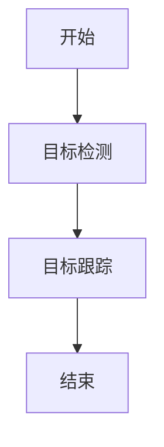
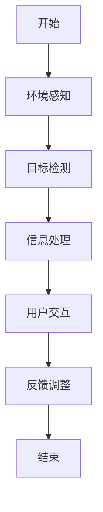
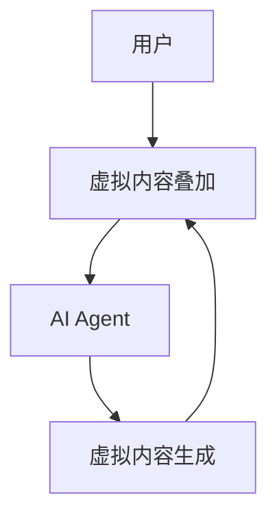

                 


# AI Agent在增强现实中的应用：实时信息叠加与交互

## 关键词：AI Agent, 增强现实, 实时信息叠加, 用户交互, 信息处理

## 摘要：本文探讨AI Agent在增强现实（AR）中的应用，重点分析实时信息叠加与交互的技术原理。通过结合AI Agent的智能模型与AR技术，实现高效的用户交互和信息处理。文章从AI Agent与AR的基本概念出发，详细讲解其在AR中的算法实现、系统架构设计和实际应用场景，最后通过项目实战案例，展示如何利用Python代码实现AI Agent驱动的AR应用。

---

# 第一部分：AI Agent与增强现实概述

## 第1章：AI Agent与增强现实概述

### 1.1 AI Agent的基本概念
#### 1.1.1 AI Agent的定义与特点
AI Agent（人工智能代理）是一种能够感知环境、自主决策并执行任务的智能实体。其特点包括：
- **自主性**：能够自主决策，无需外部干预。
- **反应性**：能够实时感知环境并做出反应。
- **目标导向性**：具有明确的目标，行为围绕目标展开。
- **学习能力**：能够通过经验改进自身性能。

#### 1.1.2 AI Agent的核心功能与类型
AI Agent的核心功能包括：
- **感知**：通过传感器或其他输入方式获取环境信息。
- **决策**：基于感知信息，利用算法做出决策。
- **执行**：通过执行机构或接口将决策转化为实际操作。

AI Agent的类型主要分为：
- **反应式AI Agent**：基于当前感知做出反应，不依赖历史信息。
- **认知式AI Agent**：具备复杂推理和规划能力，能够处理复杂任务。

#### 1.1.3 增强现实（AR）的基本概念
AR是一种将虚拟信息叠加在现实世界上的技术，用户可以通过AR设备（如眼镜、手机）看到虚拟内容与真实环境的结合。AR的核心技术包括：
- **图像识别**：识别现实环境中的物体或位置。
- **三维建模**：生成虚拟物体的三维模型。
- **实时渲染**：将虚拟内容实时叠加在真实环境中。

### 1.2 AI Agent在增强现实中的应用背景
#### 1.2.1 增强现实技术的发展历程
AR技术起源于20世纪60年代，经历了从早期的军事应用到如今的民用普及。近年来，随着计算机视觉和人工智能技术的进步，AR在教育、医疗、游戏等领域得到了广泛应用。

#### 1.2.2 AI Agent在AR中的作用与价值
AI Agent在AR中的作用主要体现在：
- **实时信息处理**：通过AI算法实时分析环境信息，生成相应的虚拟内容。
- **用户交互**：通过AI Agent实现与用户的自然交互，提升用户体验。
- **智能决策**：根据用户行为和环境变化，动态调整AR内容。

#### 1.2.3 当前AR应用的主要挑战
AR技术目前面临的主要挑战包括：
- **实时性要求高**：需要在极短的时间内处理大量数据。
- **环境复杂性**：复杂多变的环境增加了AI Agent的决策难度。
- **硬件性能限制**：AR设备的计算能力有限，影响实时处理效果。

### 1.3 AI Agent与增强现实的结合
#### 1.3.1 AI Agent在AR中的核心任务
AI Agent在AR中的核心任务包括：
- **目标检测与识别**：识别现实环境中的物体或位置。
- **信息叠加**：根据检测结果，生成相应的虚拟信息并叠加在真实环境中。
- **用户行为预测**：预测用户的下一步操作，提前做好准备。

#### 1.3.2 AI Agent与AR技术的协同工作
AI Agent与AR技术协同工作的流程如下：
1. AR设备采集环境信息。
2. AI Agent对采集的信息进行分析和处理。
3. 根据处理结果生成虚拟内容。
4. 将虚拟内容叠加在真实环境中。
5. 用户与虚拟内容进行交互，产生新的输入。
6. AI Agent根据新的输入调整虚拟内容。

#### 1.3.3 未来AR应用中AI Agent的发展趋势
随着AI技术的不断进步，未来AR中的AI Agent将更加智能化和个性化：
- **更加智能化**：AI Agent将具备更强的学习能力和推理能力。
- **更加个性化**：根据用户的偏好和习惯，提供定制化的AR体验。
- **更加实时化**：处理速度更快，响应时间更短。

### 1.4 本章小结
本章介绍了AI Agent和AR的基本概念，探讨了AI Agent在AR中的应用背景和作用，分析了当前AR应用的主要挑战，并展望了未来的发展趋势。

---

# 第二部分：AI Agent的核心概念与原理

## 第2章：AI Agent的核心概念与原理

### 2.1 AI Agent的核心概念
#### 2.1.1 AI Agent的智能模型
AI Agent的智能模型通常包括感知层、决策层和执行层。感知层负责获取环境信息，决策层负责制定决策，执行层负责执行决策。

#### 2.1.2 AI Agent的行为决策机制
AI Agent的行为决策机制主要包括：
- **基于规则的决策**：根据预定义的规则做出决策。
- **基于学习的决策**：通过机器学习算法学习决策策略。
- **基于推理的决策**：通过逻辑推理得出决策。

#### 2.1.3 AI Agent的学习与自适应能力
AI Agent可以通过监督学习、无监督学习和强化学习等方式不断提升自身的性能。例如，通过监督学习训练AI Agent识别图像中的物体，通过强化学习训练AI Agent在复杂环境中做出最优决策。

### 2.2 增强现实中的信息叠加与交互
#### 2.2.1 AR中的信息叠加技术
AR中的信息叠加技术包括：
- **图像识别**：识别现实环境中的物体或位置。
- **三维建模**：生成虚拟物体的三维模型。
- **图像融合**：将虚拟内容与真实环境无缝融合。

#### 2.2.2 AR中的用户交互方式
AR中的用户交互方式包括：
- **手势交互**：通过手势控制虚拟内容。
- **语音交互**：通过语音指令控制虚拟内容。
- **触觉交互**：通过触觉反馈与虚拟内容互动。

#### 2.2.3 AR中的实时性要求
AR要求虚拟内容与真实环境同步更新，因此对实时性要求非常高。AI Agent需要在极短的时间内处理大量数据，并做出实时反馈。

### 2.3 AI Agent与增强现实的结合原理
#### 2.3.1 AI Agent在AR中的任务分解
AI Agent在AR中的任务分解如下：
1. **环境感知**：通过传感器获取环境信息。
2. **目标检测**：识别环境中的物体或位置。
3. **信息处理**：根据检测结果生成虚拟内容。
4. **用户交互**：与用户进行实时互动，调整虚拟内容。

#### 2.3.2 AI Agent与AR系统的协同工作流程
AI Agent与AR系统的协同工作流程如下：
1. AR设备采集环境信息。
2. AI Agent对环境信息进行分析和处理。
3. 根据处理结果生成虚拟内容。
4. 将虚拟内容叠加在真实环境中。
5. 用户与虚拟内容进行交互，产生新的输入。
6. AI Agent根据新的输入调整虚拟内容。

#### 2.3.3 AI Agent在AR中的数据处理与反馈机制
AI Agent在AR中的数据处理与反馈机制包括：
- **数据采集**：通过传感器获取环境信息。
- **数据处理**：利用算法对数据进行分析和处理。
- **反馈调整**：根据用户的反馈调整虚拟内容。

### 2.4 本章小结
本章详细讲解了AI Agent的核心概念与原理，分析了AI Agent在AR中的任务分解和协同工作流程，探讨了数据处理与反馈机制。

---

# 第三部分：AI Agent在增强现实中的算法原理

## 第3章：AI Agent的算法原理

### 3.1 AI Agent的核心算法
#### 3.1.1 目标检测与跟踪算法
目标检测与跟踪是AI Agent在AR中的核心算法之一。常用的算法包括YOLO、Faster R-CNN等。以下是YOLO算法的流程图：



#### 3.1.2 实时信息处理算法
实时信息处理算法需要在极短的时间内处理大量数据。常用的算法包括滑动窗口算法、队列处理算法等。

#### 3.1.3 用户行为预测算法
用户行为预测算法可以通过机器学习模型预测用户的下一步操作。常用的模型包括随机森林、支持向量机等。

### 3.2 增强现实中的图像处理算法
#### 3.2.1 图像识别与分类算法
图像识别与分类算法是AR中的核心技术。常用的算法包括卷积神经网络（CNN）、区域卷积神经网络（R-CNN）等。

#### 3.2.2 图像增强与修复算法
图像增强与修复算法用于改善图像质量。常用的算法包括直方图均衡化、中值滤波等。

#### 3.2.3 图像融合算法
图像融合算法用于将虚拟内容与真实环境无缝融合。常用的算法包括基于像素的融合、基于区域的融合等。

### 3.3 AI Agent与增强现实结合的算法实现
#### 3.3.1 算法流程图
以下是AI Agent与增强现实结合的算法流程图：



#### 3.3.2 算法实现
以下是基于YOLO算法的目标检测代码：

```python
import numpy as np
from tensorflow.keras.models import load_model

model = load_model('yolov4.h5')

def detect_objects(image):
    # 缩放图片
    resized_image = cv2.resize(image, (416, 416))
    # 预测
    predictions = model.predict(np.array([resized_image]))
    # 解析预测结果
    boxes = decode_predictions(predictions)
    return boxes
```

### 3.4 本章小结
本章详细讲解了AI Agent在AR中的核心算法，包括目标检测、实时信息处理和用户行为预测算法，并通过代码示例展示了算法的实现过程。

---

# 第四部分：系统分析与架构设计

## 第4章：系统分析与架构设计

### 4.1 项目介绍
本项目旨在开发一个基于AI Agent的AR系统，实现实时信息叠加与用户交互。

### 4.2 系统功能设计
系统功能包括：
- **环境感知**：通过传感器获取环境信息。
- **目标检测**：识别环境中的物体或位置。
- **信息处理**：根据检测结果生成虚拟内容。
- **用户交互**：与用户进行实时互动，调整虚拟内容。

### 4.3 系统架构设计
以下是系统架构设计图：



### 4.4 系统接口设计
系统接口设计包括：
- **输入接口**：接收用户的输入。
- **输出接口**：输出虚拟内容。
- **数据接口**：处理环境数据和用户反馈。

### 4.5 本章小结
本章详细讲解了系统的功能设计和架构设计，展示了系统的组成部分和协作流程。

---

# 第五部分：项目实战

## 第5章：项目实战

### 5.1 环境搭建
项目需要以下环境：
- **硬件环境**：具备AR功能的设备（如AR眼镜、智能手机）。
- **软件环境**：安装Python、OpenCV、TensorFlow等开发工具。

### 5.2 系统核心实现
以下是系统核心实现代码：

```python
import cv2
import numpy as np

def main():
    # 初始化摄像头
    cap = cv2.VideoCapture(0)
    while True:
        # 读取视频流
        ret, frame = cap.read()
        if not ret:
            break
        # 目标检测
        boxes = detect_objects(frame)
        # 信息叠加
        overlay = add_overlay(frame, boxes)
        # 显示结果
        cv2.imshow('AR', overlay)
        if cv2.waitKey(1) & 0xFF == ord('q'):
            break
    cap.release()
    cv2.destroyAllWindows()

if __name__ == '__main__':
    main()
```

### 5.3 代码应用解读与分析
代码解读：
- **目标检测**：通过YOLO算法检测环境中的物体。
- **信息叠加**：将检测结果叠加到视频流上。
- **用户交互**：用户可以通过键盘操作调整虚拟内容。

### 5.4 实际案例分析
以下是一个实际案例分析：
1. 用户佩戴AR眼镜，进入一个陌生的房间。
2. 系统通过摄像头采集环境信息。
3. AI Agent检测到房间中的物体（如桌子、椅子）。
4. 系统将虚拟信息（如物体名称）叠加在物体上。
5. 用户与虚拟内容进行交互（如点击物体获取更多信息）。

### 5.5 本章小结
本章通过实际案例展示了AI Agent在AR中的应用，详细讲解了项目的实现过程和代码实现。

---

# 第六部分：总结与展望

## 第6章：总结与展望

### 6.1 本章总结
本文详细探讨了AI Agent在增强现实中的应用，分析了其实时信息叠加与交互的技术原理。通过结合AI Agent的智能模型与AR技术，实现高效的用户交互和信息处理。

### 6.2 当前技术的优缺点
当前技术的优点包括：
- **实时性高**：AI Agent能够在极短的时间内处理大量数据。
- **智能化强**：AI Agent具备自主学习和决策能力。

当前技术的缺点包括：
- **计算资源消耗大**：需要高性能的硬件支持。
- **环境适应性有限**：在复杂环境中表现不佳。

### 6.3 未来的发展方向
未来的发展方向包括：
- **提高计算效率**：优化算法，降低计算资源消耗。
- **增强环境适应性**：提升AI Agent在复杂环境中的表现。
- **提升用户体验**：通过更加自然的交互方式提升用户体验。

### 6.4 本章小结
本章总结了全文内容，分析了当前技术的优缺点，并展望了未来的发展方向。

---

# 作者

作者：AI天才研究院/AI Genius Institute & 禅与计算机程序设计艺术 /Zen And The Art of Computer Programming

---

希望这篇文章能够满足您的需求！如果需要进一步修改或补充，请随时告诉我。

