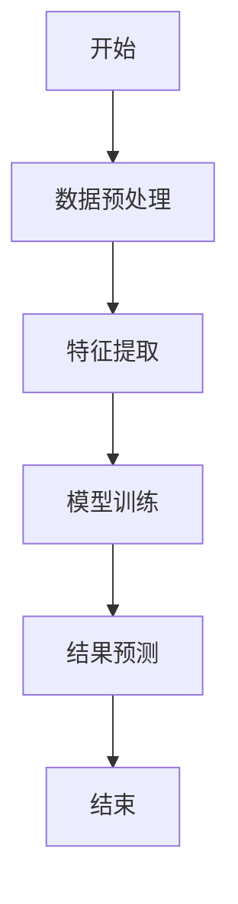
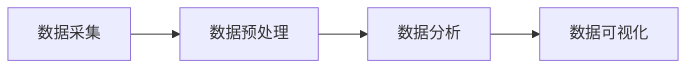
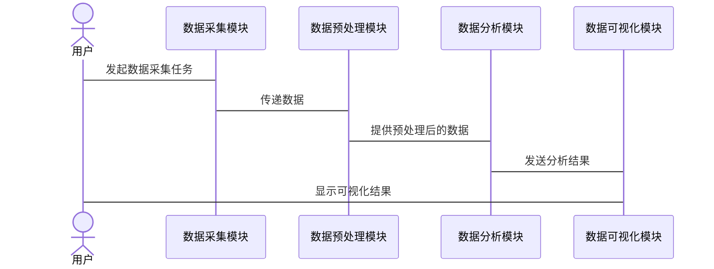

                 


# AI Agent在天文学中的应用：数据处理与模式识别

## 关键词：
AI Agent, 天文学, 数据处理, 模式识别, 机器学习, 天文学数据, AI在天文学中的应用

## 摘要：
本文探讨了AI Agent在天文学数据处理与模式识别中的应用，详细分析了AI Agent的基本原理、天文学数据处理的核心概念、模式识别的关键技术，并结合实际案例，展示了AI Agent在天文学中的优势和潜力。文章还深入讲解了相关算法原理，提供了系统设计与架构的详细方案，并给出了项目实战的代码实现和案例分析，最后总结了最佳实践和注意事项。

---

# 第一部分: AI Agent与天文学的结合基础

## 第1章: AI Agent与天文学的背景介绍

### 1.1 问题背景
#### 1.1.1 天文学数据处理的挑战
天文学数据的复杂性、多样性以及海量性使得传统的数据处理方法效率低下，难以应对大规模数据的分析需求。

#### 1.1.2 模式识别在天文学中的重要性
模式识别在天文学中用于发现星体特征、识别天体结构、预测天体现象等，是天文学研究的重要手段。

#### 1.1.3 AI Agent在天文学中的应用潜力
AI Agent具有自主性、反应性、目标导向性等特性，能够有效处理天文学中的复杂问题，提升数据处理与模式识别的效率。

### 1.2 问题描述
#### 1.2.1 天文学数据的复杂性
天文学数据包括光谱数据、图像数据、时序数据等多种类型，数据量大且维度高，传统的数据处理方法难以高效处理。

#### 1.2.2 模式识别的难点
天文学中的模式识别需要处理噪声干扰、数据稀疏性等问题，传统算法在复杂场景下表现不佳。

#### 1.2.3 AI Agent的优势与局限性
AI Agent能够通过学习和自适应优化处理复杂数据，但在天文学中的应用仍面临数据稀缺性和模型解释性等挑战。

### 1.3 问题解决
#### 1.3.1 AI Agent在数据处理中的应用
AI Agent可以通过数据预处理、特征提取等步骤，帮助天文学家高效处理海量数据。

#### 1.3.2 AI Agent在模式识别中的应用
AI Agent能够通过深度学习算法识别天体特征，如恒星分类、星系识别等。

#### 1.3.3 AI Agent与传统方法的结合
结合传统数据处理方法，AI Agent能够充分发挥其优势，提升整体数据处理与模式识别的效率。

### 1.4 边界与外延
#### 1.4.1 AI Agent的边界条件
AI Agent的应用受到数据质量和计算能力的限制，需要在特定条件下才能发挥最佳效果。

#### 1.4.2 模式识别的边界条件
模式识别的有效性依赖于数据质量和算法性能，需要在特定范围内进行应用。

#### 1.4.3 AI Agent与天文学的外延领域
AI Agent在天文学中的应用可以扩展到其他领域，如地球科学、环境监测等。

### 1.5 概念结构与核心要素
#### 1.5.1 AI Agent的核心要素
AI Agent包括感知能力、决策能力、执行能力和学习能力等核心要素。

#### 1.5.2 天文学数据处理的核心要素
天文学数据处理包括数据采集、数据预处理、数据分析和数据可视化等核心要素。

#### 1.5.3 模式识别的核心要素
模式识别包括特征提取、模型训练、结果评估和模型优化等核心要素。

---

## 第2章: AI Agent的核心概念与原理

### 2.1 AI Agent的基本原理
#### 2.1.1 AI Agent的定义
AI Agent是一种具有自主性、目标导向性和社会性的智能体，能够感知环境并采取行动以实现目标。

#### 2.1.2 AI Agent的基本架构
AI Agent的架构包括感知层、推理层、决策层和执行层，能够实现数据处理、信息推理、决策制定和任务执行。

#### 2.1.3 AI Agent的核心算法
AI Agent的核心算法包括机器学习算法、自然语言处理算法和强化学习算法等。

### 2.2 天文学数据处理的核心概念
#### 2.2.1 数据特征提取
数据特征提取是从天文学数据中提取有意义的信息，例如星体光谱特征提取。

#### 2.2.2 数据预处理
数据预处理包括数据清洗、数据标准化和数据增强等步骤，为后续分析提供高质量的数据。

#### 2.2.3 数据分析与建模
数据分析与建模通过统计分析和机器学习模型，从数据中提取规律和模式。

### 2.3 模式识别的核心概念
#### 2.3.1 模式识别的定义
模式识别是通过计算机技术对数据中的模式进行识别和分类。

#### 2.3.2 模式识别的关键技术
模式识别的关键技术包括特征提取、分类器设计和模型优化等。

#### 2.3.3 模式识别的应用场景
模式识别在天文学中的应用场景包括恒星分类、星系识别和天体现象预测等。

---

## 第3章: AI Agent与天文学数据处理的核心概念与联系

### 3.1 核心概念的原理
#### 3.1.1 AI Agent在数据处理中的作用
AI Agent能够通过自主学习和自适应优化，提升天文学数据处理的效率和准确性。

#### 3.1.2 数据特征提取的原理
数据特征提取通过降维和选择关键特征，减少数据的复杂性，提升模型的性能。

#### 3.1.3 数据预处理的原理
数据预处理通过清洗和标准化，消除数据中的噪声，提升数据的质量。

### 3.2 核心概念的属性特征对比
| 核心概念       | AI Agent在数据处理中的作用 | 数据特征提取 | 数据预处理 |
|----------------|---------------------------|--------------|------------|
| 定义           | 具有自主性和目标导向性的智能体 | 提取有意义特征 | 清洗和标准化 |
| 核心算法       | 机器学习、深度学习       | 主成分分析   | 数据清洗   |
| 应用场景       | 天文学数据处理与模式识别 | 恒星分类     | 数据分析   |

### 3.3 ER实体关系图架构

```mermaid
erd
  actor(AI Agent)
    role 处理数据 --> entity 数据特征
  entity 数据特征
    --> attribute 特征1
    --> attribute 特征2
  entity 数据预处理
    --> attribute 清洗后数据
  entity 数据分析
    --> attribute 分析结果
```

---

## 第4章: AI Agent与天文学数据处理的核心概念与联系

### 4.1 核心概念的原理
#### 4.1.1 AI Agent在数据处理中的作用
AI Agent能够通过自主学习和自适应优化，提升天文学数据处理的效率和准确性。

#### 4.1.2 数据特征提取的原理
数据特征提取通过降维和选择关键特征，减少数据的复杂性，提升模型的性能。

#### 4.1.3 数据预处理的原理
数据预处理通过清洗和标准化，消除数据中的噪声，提升数据的质量。

### 4.2 核心概念的属性特征对比
| 核心概念       | AI Agent在数据处理中的作用 | 数据特征提取 | 数据预处理 |
|----------------|---------------------------|--------------|------------|
| 定义           | 具有自主性和目标导向性的智能体 | 提取有意义特征 | 清洗和标准化 |
| 核心算法       | 机器学习、深度学习       | 主成分分析   | 数据清洗   |
| 应用场景       | 天文学数据处理与模式识别 | 恒星分类     | 数据分析   |

### 4.3 ER实体关系图架构

```mermaid
erd
  actor(AI Agent)
    role 处理数据 --> entity 数据特征
  entity 数据特征
    --> attribute 特征1
    --> attribute 特征2
  entity 数据预处理
    --> attribute 清洗后数据
  entity 数据分析
    --> attribute 分析结果
```

---

## 第5章: AI Agent在天文学数据处理中的算法原理与数学模型

### 5.1 算法原理
#### 5.1.1 算法流程图


#### 5.1.2 算法实现
```python
def preprocess_data(data):
    # 数据清洗
    cleaned_data = data.dropna()
    # 数据标准化
    normalized_data = (cleaned_data - cleaned_data.mean()) / cleaned_data.std()
    return normalized_data

def feature_extraction(normalized_data):
    # 主成分分析
    from sklearn.decomposition import PCA
    pca = PCA(n_components=2)
    features = pca.fit_transform(normalized_data)
    return features

def model_training(features, labels):
    # 使用支持向量机进行分类
    from sklearn import svm
    clf = svm.SVC()
    clf.fit(features, labels)
    return clf

def predict_results(model, new_data):
    # 预测结果
    predicted_labels = model.predict(new_data)
    return predicted_labels
```

#### 5.1.3 数学模型
公式1: $y = f(x)$，其中$f$是机器学习模型的预测函数。

公式2: $p(y|x) = \frac{P(x|y)P(y)}{P(x)}$，贝叶斯定理用于分类问题。

公式3: $L(w) = \sum_{i=1}^{n} (y_i - \hat{y}_i)^2$，损失函数用于模型优化。

### 5.2 数学模型详细解读
#### 5.2.1 公式1: $y = f(x)$
该公式表示AI Agent通过学习得到一个函数$f$，用于将输入$x$映射到输出$y$。

#### 5.2.2 公式2: $p(y|x) = \frac{P(x|y)P(y)}{P(x)}$
贝叶斯定理用于计算在给定$x$的条件下，$y$的概率，常用于分类任务。

#### 5.2.3 公式3: $L(w) = \sum_{i=1}^{n} (y_i - \hat{y}_i)^2$
损失函数用于衡量模型预测值与真实值之间的差距，用于优化模型参数。

---

## 第6章: AI Agent在天文学数据处理中的系统设计与架构方案

### 6.1 系统功能设计
#### 6.1.1 数据采集模块
负责从天文观测设备中采集数据。

#### 6.1.2 数据预处理模块
对采集到的数据进行清洗、标准化和增强。

#### 6.1.3 数据分析模块
通过机器学习算法对数据进行分析和建模。

#### 6.1.4 数据可视化模块
将分析结果以可视化的方式呈现，便于用户理解和分析。

### 6.2 系统架构设计


### 6.3 系统接口设计
- 数据采集接口：接收天文观测设备的数据。
- 数据预处理接口：对数据进行清洗和标准化。
- 数据分析接口：调用机器学习模型进行预测。
- 数据可视化接口：将分析结果展示给用户。

### 6.4 系统交互设计


---

## 第7章: AI Agent在天文学数据处理中的项目实战

### 7.1 环境安装
- 安装Python环境：使用Anaconda或虚拟环境。
- 安装依赖库：numpy、pandas、scikit-learn、matplotlib等。

### 7.2 系统核心实现
#### 7.2.1 数据采集模块
```python
import numpy as np

def collect_data():
    # 模拟数据采集
    data = np.random.rand(100, 5)
    return data
```

#### 7.2.2 数据预处理模块
```python
import pandas as pd
from sklearn.preprocessing import StandardScaler

def preprocess_data(data):
    df = pd.DataFrame(data)
    # 数据清洗
    df = df.dropna()
    # 数据标准化
    scaler = StandardScaler()
    normalized_data = scaler.fit_transform(df)
    return normalized_data
```

#### 7.2.3 数据分析模块
```python
from sklearn.svm import SVC

def analyze_data(normalized_data, labels):
    # 划分训练集和测试集
    from sklearn.model_selection import train_test_split
    X_train, X_test, y_train, y_test = train_test_split(normalized_data, labels, test_size=0.2)
    # 模型训练
    clf = SVC()
    clf.fit(X_train, y_train)
    # 模型预测
    y_pred = clf.predict(X_test)
    return y_pred
```

#### 7.2.4 数据可视化模块
```python
import matplotlib.pyplot as plt

def visualize_results(true_labels, predicted_labels):
    plt.figure(figsize=(10, 6))
    plt.scatter(range(len(true_labels)), true_labels, color='blue', label='真实标签')
    plt.scatter(range(len(predicted_labels)), predicted_labels, color='red', label='预测标签')
    plt.legend()
    plt.show()
```

### 7.3 实际案例分析
#### 7.3.1 案例背景
分析恒星分类问题，使用天文学光谱数据。

#### 7.3.2 数据分析与实现
使用上述代码进行数据预处理、模型训练和结果预测。

#### 7.3.3 案例结果
通过可视化模块展示恒星分类的预测结果，验证模型的准确性。

### 7.4 项目小结
通过实际案例，展示了AI Agent在天文学数据处理中的应用，验证了其在数据预处理、特征提取和模式识别方面的优势。

---

## 第8章: AI Agent在天文学数据处理中的最佳实践与注意事项

### 8.1 最佳实践
- 数据预处理是关键，确保数据质量和完整性。
- 选择合适的算法，根据数据特点调整模型参数。
- 定期更新模型，保持模型的高性能。

### 8.2 小结
本文详细介绍了AI Agent在天文学数据处理与模式识别中的应用，从理论到实践，为读者提供了全面的指导。

### 8.3 注意事项
- 数据隐私与安全问题需要高度重视。
- 模型的可解释性需要进一步研究。
- 天文学数据的特殊性要求算法具有一定的鲁棒性。

### 8.4 拓展阅读
推荐阅读相关领域的书籍和论文，深入学习AI Agent和天文学数据处理的最新研究成果。

---

## 作者：AI天才研究院 & 禅与计算机程序设计艺术

本文作者是AI天才研究院，致力于探索人工智能与天文学的交叉研究，禅与计算机程序设计艺术则专注于将哲学思维与计算机科学相结合，共同推动AI技术的发展与创新。

