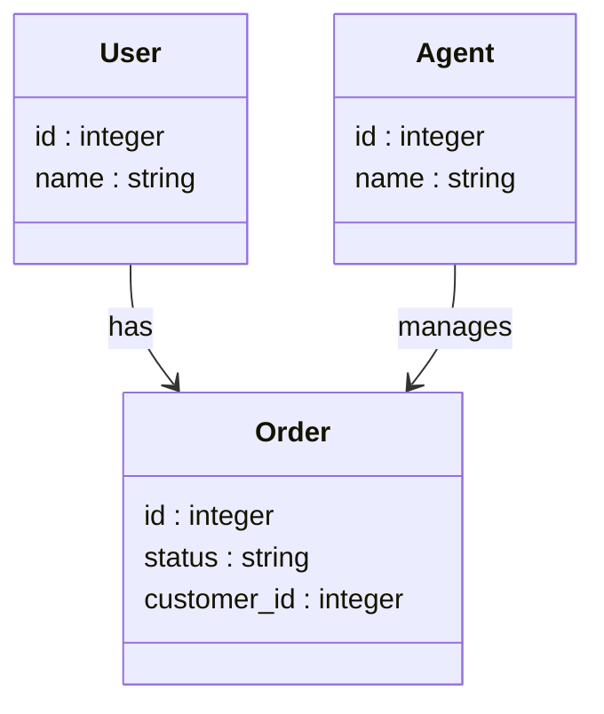

                 


# AI Agent在客户服务中的革新作用

> 关键词：AI Agent, 自然语言处理, 客户服务, 机器学习, 对话系统, 人工智能

> 摘要：本文将深入探讨AI Agent在客户服务中的革新作用，从技术基础到系统架构，再到实际应用，全面解析AI Agent如何通过自然语言处理、机器学习等技术，革新传统客户服务模式，提升客户体验和企业效率。

---

## 第一部分: AI Agent在客户服务中的背景概述

### 第1章: AI Agent的基本概念与背景

#### 1.1 AI Agent的定义与特点

##### 1.1.1 AI Agent的定义
AI Agent（人工智能代理）是一种能够感知环境、理解用户需求并执行相应操作的智能系统。它通过自然语言处理（NLP）、机器学习（ML）和知识图谱等技术，为用户提供智能化的交互体验。

##### 1.1.2 AI Agent的核心特点
- **智能化**：能够理解用户的意图并提供个性化的服务。
- **自动化**：无需人工干预，自动完成任务。
- **学习能力**：通过机器学习不断优化自身的性能。
- **多渠道支持**：支持多种交互渠道，如文本、语音和视频。

##### 1.1.3 AI Agent与传统客服系统的主要区别
| 特性                | AI Agent                          | 传统客服系统                  |
|---------------------|-----------------------------------|------------------------------|
| **交互方式**        | 多渠道、自动化                   | 单一渠道、人工为主           |
| **响应速度**        | 实时响应                         | 依赖人工，响应较慢           |
| **服务质量**        | 高度个性化                       | 标准化服务，缺乏个性化         |
| **扩展性**          | 易扩展，支持海量用户             | 扩展性有限，成本较高           |

#### 1.2 客户服务的现状与挑战

##### 1.2.1 当前客户服务的主要模式
- **电话客服**：传统的主要方式，但效率低、成本高。
- **在线聊天**：逐步普及，但依赖人工，难以满足大规模需求。
- **自动回复机器人**：基于规则的简单回复，缺乏深度。

##### 1.2.2 传统客户服务中的痛点与不足
1. **效率问题**：人工客服响应慢，无法满足大规模需求。
2. **服务质量参差不齐**：依赖人工，服务质量不稳定。
3. **缺乏个性化**：无法根据用户需求提供个性化服务。
4. **成本高**：人工客服需要大量培训和管理，成本高昂。

##### 1.2.3 客户对智能化服务的需求趋势
- **24/7可用性**：客户期望随时获得服务。
- **个性化体验**：客户希望服务能够理解其需求并提供定制化解决方案。
- **高效性**：客户期望快速得到问题解决，减少等待时间。

---

### 第2章: AI Agent的技术基础

#### 2.1 自然语言处理（NLP）在AI Agent中的应用

##### 2.1.1 NLP的核心技术与应用场景
- **分词**：将用户输入的文本分割成词语或短语。
- **词性标注**：对词语进行词性分类，如名词、动词等。
- **句法分析**：分析句子的语法结构。
- **情感分析**：识别用户情感倾向。

##### 2.1.2 AI Agent中的对话理解机制
AI Agent通过NLP技术理解用户的意图，例如：

**示例：**
用户输入：我的订单状态是什么？
AI Agent解析：用户的意图是查询订单状态。

##### 2.1.3 基于上下文的对话管理
AI Agent能够根据上下文理解用户的意图，例如：

**示例：**
用户1：我的订单号是12345。
用户2：什么时候能发货？
AI Agent理解：用户2的问题与用户1的订单相关，需要查询订单号12345的发货时间。

#### 2.2 机器学习与深度学习在AI Agent中的作用

##### 2.2.1 机器学习的基本原理
机器学习是一种通过数据训练模型的技术，用于预测和分类。例如：

- **监督学习**：使用标记的数据训练模型，预测新数据的类别。
- **无监督学习**：从无标记数据中发现模式。

##### 2.2.2 深度学习在自然语言处理中的应用
深度学习通过多层神经网络处理NLP任务，例如：

- **循环神经网络（RNN）**：用于处理序列数据，如对话历史。
- **Transformer架构**：用于大规模上下文理解，如BERT模型。

##### 2.2.3 知识图谱与语义理解
知识图谱是一种结构化的知识表示方式，用于帮助AI Agent理解语义。例如：

**示例：**
知识图谱中的关系：订单 → 客户 → 地区。

#### 2.3 强化学习在AI Agent行为决策中的应用

##### 2.3.1 强化学习的基本概念
强化学习是一种通过奖励机制训练模型的技术，用于优化行为决策。

##### 2.3.2 强化学习在对话策略中的应用
AI Agent通过强化学习优化对话策略，例如：

- **奖励机制**：当用户满意时，给予奖励，模型调整策略。

##### 2.3.3 行为决策的优化与评估
AI Agent通过强化学习不断优化决策，例如：

- **评估指标**：满意度、响应时间、准确性。

---

## 第二部分: AI Agent的核心概念与工作原理

### 第3章: AI Agent的核心概念与工作原理

#### 3.1 AI Agent的组成与功能模块

##### 3.1.1 输入解析模块
- **功能**：将用户的输入转化为结构化数据。
- **示例**：用户输入“订单查询”，解析为订单查询请求。

##### 3.1.2 对话理解模块
- **功能**：理解用户的意图和上下文。
- **示例**：用户输入“我的订单状态是什么？”，理解为查询订单状态。

##### 3.1.3 知识检索模块
- **功能**：从知识库中检索相关信息。
- **示例**：检索订单号12345的状态。

##### 3.1.4 行为决策模块
- **功能**：根据意图和知识库信息做出决策。
- **示例**：决定回复“订单已发货，预计明天送达。”

##### 3.1.5 输出生成模块
- **功能**：生成自然语言回复。
- **示例**：将决策信息生成“您的订单已发货，预计明天送达。”

#### 3.2 AI Agent的工作流程

##### 3.2.1 用户输入的接收与解析
- **步骤**：用户输入“订单查询”。
- **处理**：解析为订单查询请求。

##### 3.2.2 对话理解与意图识别
- **步骤**：理解用户意图，确定需要查询订单状态。
- **处理**：生成查询请求。

##### 3.2.3 知识检索与信息整合
- **步骤**：从知识库中检索订单信息。
- **处理**：整合相关信息。

##### 3.2.4 行为决策与输出生成
- **步骤**：根据检索结果生成回复。
- **处理**：生成“订单已发货，预计明天送达。”

#### 3.3 AI Agent的核心要素对比分析

##### 3.3.1 不同AI Agent的性能对比
| 参数       | AI Agent A | AI Agent B |
|------------|------------|------------|
| 响应速度   | 快          | 较慢        |
| 准确率     | 95%        | 90%        |
| 个性化     | 高          | 中          |

##### 3.3.2 不同技术路线的优缺点分析
- **基于规则的AI Agent**：简单易实现，但缺乏灵活性。
- **基于机器学习的AI Agent**：灵活性高，但需要大量数据训练。

##### 3.3.3 核心要素的特征对比表格
| 核心要素     | 特征描述                   |
|--------------|---------------------------|
| 输入解析     | 将输入转化为结构化数据     |
| 对话理解     | 理解用户的意图和上下文     |
| 知识检索     | 从知识库中检索相关信息     |
| 行为决策     | 根据意图和知识做出决策     |
| 输出生成     | 生成自然语言回复           |

#### 3.4 AI Agent的实体关系与架构设计

##### 3.4.1 实体关系图（ER图）
```mermaid
erDiagram
    customer/user {
        id : integer
        name : string
        }
    order {
        id : integer
        status : string
        customer_id : integer
        }
    agent {
        id : integer
        name : string
        }
    customer/user -> order : has
    agent -> order : manages
```

##### 3.4.2 系统架构图


##### 4.1.2 基于统计的对话理解
```python
from sklearn.feature_extraction.text import TfidfVectorizer
from sklearn.naive_bayes import MultinomialNB

# 训练数据
texts = ['订单查询', '帮助退款']
labels = ['order_query', 'refund_assistance']

# 向量化
vectorizer = TfidfVectorizer()
X = vectorizer.fit_transform(texts)

# 训练模型
model = MultinomialNB()
model.fit(X, labels)

# 预测
new_text = '订单状态'
new_X = vectorizer.transform([new_text])
predicted_label = model.predict(new_X)[0]
print(predicted_label)
```

##### 4.1.3 基于深度学习的对话理解
```python
import tensorflow as tf
from tensorflow.keras import layers

# 数据准备
train_data = ['订单查询', '帮助退款', '订单状态']
train_labels = ['order_query', 'refund_assistance', 'order_status']

# 向量化
tokenizer = tf.keras.preprocessing.text.Tokenizer(num_words=1000)
tokenizer.fit_on_texts(train_data)
sequences = tokenizer.texts_to_sequences(train_data)
X = tf.keras.preprocessing.sequence.pad_sequences(sequences, maxlen=5)
y = tf.keras.utils.to_categorical([0, 1, 2])

# 模型构建
model = tf.keras.Sequential()
model.add(layers.Embedding(100, 50))
model.add(layers.LSTM(32))
model.add(layers.Dense(3, activation='softmax'))
model.compile(optimizer='adam', loss='categorical_crossentropy', metrics=['accuracy'])

# 训练
model.fit(X, y, epochs=10, batch_size=32)
```

#### 4.2 知识检索与语义匹配

##### 4.2.1 知识检索算法
```python
def semantic_matching(query, knowledge_base):
    max_score = 0
    best_match = ''
    for doc in knowledge_base:
        score = cosine_similarity(query, doc)
        if score > max_score:
            max_score = score
            best_match = doc
    return best_match
```

##### 4.2.2 基于向量空间模型的语义理解
```latex
$$
\text{余弦相似度} = \frac{\vec{A} \cdot \vec{B}}{\|\vec{A}\| \|\vec{B}\|}
$$

其中，$\vec{A}$和$\vec{B}$分别是两个文本的向量表示。
```

#### 4.3 行为决策与策略优化

##### 4.3.1 基于强化学习的决策模型
```python
def reinforcement_learning(state, action, reward):
    # 状态更新
    new_state = state + action
    # 奖励函数
    if reward > 0:
        update_policy(new_state, action)
```

##### 4.3.2 基于马尔可夫决策过程的行为决策
- **状态（State）**：当前对话的上下文。
- **动作（Action）**：AI Agent的回复或操作。
- **奖励（Reward）**：用户的反馈或系统评估的结果。

---

## 第四部分: AI Agent的系统分析与架构设计

### 第5章: AI Agent的系统分析与架构设计

#### 5.1 项目背景与需求分析

##### 5.1.1 项目背景
随着客户需求的多样化，传统客服系统已无法满足高效、个性化的服务需求。

##### 5.1.2 项目目标
开发一个智能化的AI Agent，提升客户服务体验和效率。

#### 5.2 系统功能设计

##### 5.2.1 领域模型（Mermaid类图）


##### 5.2.2 系统架构（Mermaid架构图）


---

## 第五部分: AI Agent的项目实战

### 第6章: AI Agent的项目实战

#### 6.1 环境安装与配置

##### 6.1.1 安装依赖
```bash
pip install numpy scikit-learn tensorflow
```

#### 6.2 核心代码实现

##### 6.2.1 对话理解模块
```python
def understand_dialogue(input_text):
    # 分词
    words = input_text.split()
    # 判断意图
    if '订单' in words and '查询' in words:
        return 'order_query'
    elif '帮助' in words and '退款' in words:
        return 'refund_assistance'
    else:
        return 'unknown'
```

##### 6.2.2 知识检索模块
```python
def retrieveKnowledge(query, knowledge_base):
    max_score = 0
    best_match = ''
    for doc in knowledge_base:
        score = cosine_similarity(query, doc)
        if score > max_score:
            max_score = score
            best_match = doc
    return best_match
```

##### 6.2.3 行为决策模块
```python
def decide_action(state, action_space):
    # 简单的决策逻辑
    return action_space[0]
```

#### 6.3 实际案例分析与解读

##### 6.3.1 案例分析
用户输入：“我的订单状态是什么？”

**步骤**：
1. 对话理解模块解析输入，确定意图是查询订单状态。
2. 知识检索模块从知识库中检索订单信息。
3. 行为决策模块生成回复：“您的订单已发货，预计明天送达。”

##### 6.3.2 代码实现与解读
```python
# 示例代码
input_text = "我的订单状态是什么？"
intent = understand_dialogue(input_text)
knowledge = retrieveKnowledge(input_text, knowledge_base)
response = decide_action(intent, action_space)
print(response)
```

#### 6.4 项目总结与优化

##### 6.4.1 项目小结
通过本项目，我们实现了基于NLP和机器学习的AI Agent，能够理解用户意图并提供智能化服务。

##### 6.4.2 项目优化
- **优化意图识别**：引入更先进的NLP模型，如BERT。
- **优化知识检索**：构建更完善的知识图谱。
- **优化行为决策**：引入强化学习优化决策策略。

---

## 第六部分: AI Agent的最佳实践与总结

### 第7章: AI Agent的最佳实践

#### 7.1 最佳实践

##### 7.1.1 技术选型
- **选择合适的NLP模型**：根据需求选择预训练模型或自训练模型。
- **优化知识库**：构建高质量的知识图谱，确保检索准确率。

##### 7.1.2 系统设计
- **模块化设计**：确保系统易于扩展和维护。
- **高可用性设计**：确保系统稳定运行。

#### 7.2 小结与注意事项

##### 7.2.1 小结
AI Agent通过智能化技术革新了客户服务模式，提升了客户体验和企业效率。

##### 7.2.2 注意事项
- **数据隐私**：确保用户数据的安全性和隐私性。
- **系统稳定性**：确保系统在高并发情况下的稳定性。

#### 7.3 拓展阅读

##### 7.3.1 推荐书籍
- 《深度学习》（Deep Learning）- Ian Goodfellow
- 《自然语言处理实战》（Hands-On NLP with Python）- Srikant

##### 7.3.2 推荐博客与技术文章
- [AI Agent技术博客](https://example.com)
- [自然语言处理实战文章](https://example.com)

---

## 作者：AI天才研究院/AI Genius Institute & 禅与计算机程序设计艺术 /Zen And The Art of Computer Programming

---

# 完

本文详细介绍了AI Agent在客户服务中的革新作用，从技术基础到系统架构，再到实际应用，全面解析了AI Agent如何通过智能化技术提升客户体验和企业效率。

