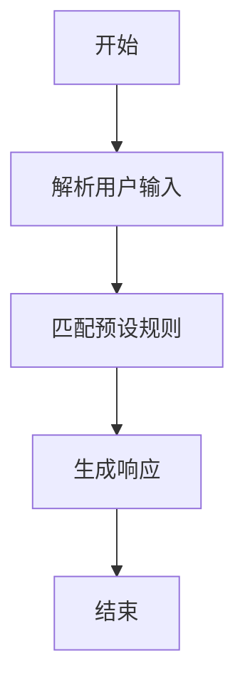
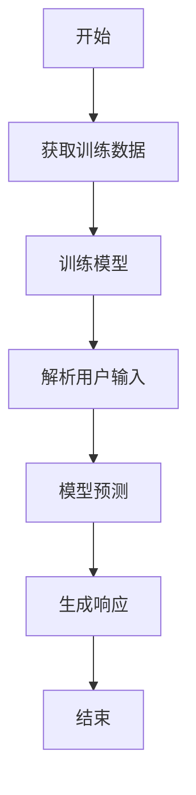
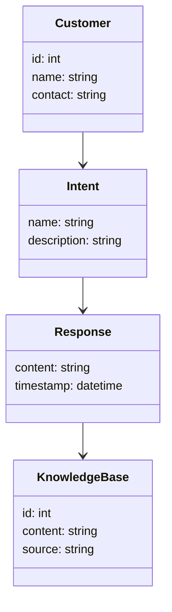
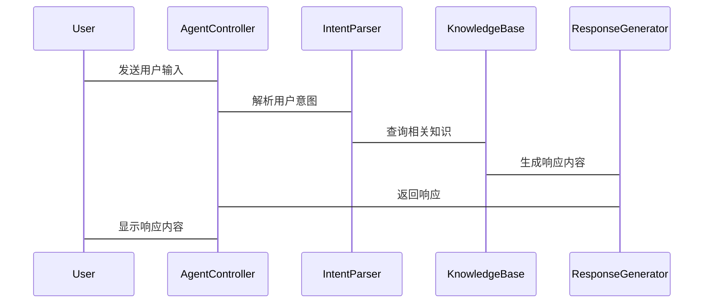

                 


# AI Agent在客户服务领域的应用实践

> 关键词：AI Agent、客户服务、智能交互、自然语言处理、机器学习、知识库、反馈优化

> 摘要：本文详细探讨了AI Agent在客户服务领域的应用，从基础概念到技术原理，再到实际应用案例，全面解析了AI Agent如何提升客户服务效率和用户体验。文章结合实际场景，通过算法原理、系统架构设计和项目实战，深入分析了AI Agent在客户服务中的优势和挑战，并展望了未来的发展方向。

---

# 第一部分: AI Agent在客户服务领域的背景与基础

## 第1章: AI Agent与客户服务概述

### 1.1 AI Agent的基本概念

#### 1.1.1 AI Agent的定义
AI Agent（人工智能代理）是一种能够感知环境、自主决策并执行任务的智能体。在客户服务领域，AI Agent通常以聊天机器人或虚拟助手的形式出现，能够通过自然语言处理与用户交互，并提供解决方案。

#### 1.1.2 AI Agent的核心特征
- **自主性**：能够在没有人工干预的情况下独立运行。
- **反应性**：能够实时感知用户需求并做出响应。
- **学习能力**：通过机器学习不断优化自身的交互能力和问题解决能力。
- **知识库集成**：依赖于丰富的知识库来提供准确的信息和建议。

#### 1.1.3 AI Agent与传统客服系统的区别
| 特性         | AI Agent                 | 传统客服系统           |
|--------------|--------------------------|------------------------|
| 响应速度     | 实时响应                 | 需要人工处理           |
| 可用性       | 24/7可用                | 仅在工作时间可用       |
| 个性化       | 可根据用户行为定制服务   | 服务相对固定           |
| 处理能力     | 可处理复杂问题           | 处理能力有限           |

### 1.2 客户服务领域的AI Agent应用背景

#### 1.2.1 客户服务行业的现状与挑战
- **人工成本高**：传统客服依赖大量人工坐席执行简单任务，成本高昂。
- **响应时间长**：用户在非工作时间遇到问题时无法及时得到解决。
- **服务一致性差**：不同客服人员的服务质量参差不齐，用户体验不稳定。

#### 1.2.2 AI技术在客户服务中的应用前景
- **提高效率**：AI Agent能够快速响应用户需求，大幅缩短问题解决时间。
- **降低成本**：通过自动化处理常见问题，减少对人工客服的依赖。
- **提升用户体验**：24/7可用性和个性化服务能够显著提升用户满意度。

#### 1.2.3 AI Agent在客户服务中的优势
- **7x24小时无休服务**：AI Agent能够全天候为用户提供支持。
- **快速响应**：基于自然语言处理技术，AI Agent能够快速理解用户需求并生成响应。
- **一致的服务质量**：AI Agent不受情绪影响，能够始终保持一致的服务质量。

---

## 第2章: AI Agent的核心概念与联系

### 2.1 AI Agent的核心概念

#### 2.1.1 知识表示与推理
知识表示是AI Agent理解世界的基础，常用的表示方法包括：
- **语义网络**：通过节点和边表示概念及其关系。
- **规则表示**：通过预设的规则（如IF-ELSE规则）进行推理。
- **概率表示**：基于概率模型进行不确定性推理。

#### 2.1.2 自然语言处理
自然语言处理（NLP）是AI Agent理解用户输入的关键技术，主要包含以下步骤：
1. **分词**：将用户输入的文本分割成词语或短语。
2. **词性标注**：识别每个词语的词性（如名词、动词、形容词）。
3. **句法分析**：分析句子的语法结构，识别主语、谓语等。
4. **语义分析**：理解文本的深层含义，提取用户意图。

#### 2.1.3 问题解决与决策
AI Agent通过以下步骤解决问题：
1. **问题建模**：将用户需求转化为问题模型。
2. **知识检索**：从知识库中检索相关的信息。
3. **推理与决策**：基于检索到的知识和预设规则生成解决方案。

### 2.2 AI Agent与相关技术的对比

#### 2.2.1 AI Agent与传统客服系统的对比
| 特性         | AI Agent                 | 传统客服系统           |
|--------------|--------------------------|------------------------|
| 技术基础     | 人工智能、机器学习       | 人工操作、固定脚本     |
| 响应速度     | 实时响应                 | 较慢                   |
| 可扩展性     | 高                      | 低                    |

#### 2.2.2 AI Agent与智能音箱的区别
智能音箱主要用于播放音乐、查询天气等场景，而AI Agent在客户服务中的应用更加广泛，能够处理复杂的咨询和问题解决。

#### 2.2.3 AI Agent与聊天机器人的差异
聊天机器人通常基于预设的规则和模板，而AI Agent具备更强的自主学习能力和问题解决能力。

### 2.3 AI Agent的ER实体关系图

```mermaid
er
    Customer: 客户
    Agent: AI Agent
    Interaction: 交互记录
    Intent: 意图
    Response: 响应
    KnowledgeBase: 知识库
    Feedback: 反馈
    CustomerSession: 会话
```

### 2.4 本章小结

---

## 第3章: AI Agent的算法原理

### 3.1 基于规则的AI Agent算法

#### 3.1.1 基于规则的算法流程



#### 3.1.2 规则库的构建与管理
规则库的构建需要结合领域知识和用户反馈，常见的规则形式包括：
- **条件判断**：如`IF用户提到“订单”，THEN查询订单状态`。
- **优先级排序**：根据规则的重要性进行排序，确保优先处理紧急问题。

### 3.2 基于机器学习的AI Agent算法

#### 3.2.1 基于机器学习的算法流程



#### 3.2.2 模型训练与优化
- **训练数据**：需要标注的用户查询和对应的意图或答案。
- **模型选择**：常用的模型包括TF-IDF、BM25、BERT等。
- **优化方法**：通过交叉验证和A/B测试不断优化模型性能。

### 3.3 AI Agent的数学模型与公式

#### 3.3.1 基于概率论的意图识别公式

$$ P(Intent|Input) = \frac{P(Input|Intent) \cdot P(Intent)}{P(Input)} $$

#### 3.3.2 基于向量空间模型的相似度计算公式

$$ sim(u, v) = \frac{u \cdot v}{\|u\| \|v\|} $$

---

## 第4章: AI Agent的系统分析与架构设计

### 4.1 系统功能设计

#### 4.1.1 领域模型设计



#### 4.1.2 系统架构设计


### 4.2 系统接口设计

#### 4.2.1 API接口设计
- **输入接口**：`POST /api/v1/agent/input`
  - 参数：`{ "text": "用户输入的文本" }`
- **输出接口**：`GET /api/v1/agent/response`
  - 参数：`{ "intent": "识别到的意图" }`

#### 4.2.2 交互流程设计



---

## 第5章: AI Agent的项目实战

### 5.1 环境安装与配置

```bash
pip install -r requirements.txt
```

### 5.2 系统核心实现

#### 5.2.1 基于规则的实现

```python
def handle_input(user_input):
    # 解析用户输入
    intent = identify_intent(user_input)
    # 查询知识库
    response = get_response(intent)
    return response
```

#### 5.2.2 基于机器学习的实现

```python
from sklearn.feature_extraction.text import TfidfVectorizer
from sklearn.metrics.pairwise import cosine_similarity

def calculate_similarity(text, corpus):
    vectorizer = TfidfVectorizer()
    text_vec = vectorizer.fit_transform([text])
    corpus_vec = vectorizer.transform(corpus)
    similarity_scores = cosine_similarity(text_vec, corpus_vec)
    return similarity_scores.max()
```

### 5.3 案例分析与解读

#### 5.3.1 案例场景
用户输入：“我的订单状态是什么？”

#### 5.3.2 系统处理流程
1. **解析意图**：识别用户的意图是查询订单状态。
2. **知识库查询**：从知识库中检索与订单状态相关的知识。
3. **生成响应**：基于检索到的知识生成响应内容。
4. **返回结果**：将响应内容返回给用户。

### 5.4 项目小结

---

## 第6章: 总结与展望

### 6.1 本章总结
本文详细探讨了AI Agent在客户服务领域的应用，从技术原理到实际应用案例，全面解析了AI Agent如何提升客户服务效率和用户体验。

### 6.2 未来展望
随着AI技术的不断进步，AI Agent在客户服务中的应用将更加广泛和深入，未来的挑战包括如何处理更复杂的问题以及如何提升系统的可解释性。

---

# 作者：AI天才研究院/AI Genius Institute & 禅与计算机程序设计艺术 /Zen And The Art of Computer Programming

