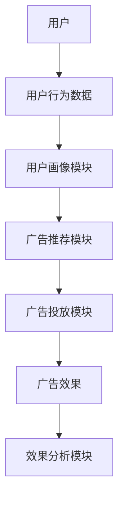

                 


```markdown
# AI Agent在广告投放中的精准定位

> 关键词：AI Agent, 广告投放, 精准定位, 人工智能, 数据分析

> 摘要：AI Agent在广告投放中的精准定位是一种基于人工智能技术的广告投放策略，通过分析用户行为、兴趣和需求，实现广告的精准投放。本文将从AI Agent的基本概念、广告投放的现状、精准定位的重要性入手，详细讲解AI Agent的核心概念与原理，推荐算法的实现，系统架构设计，项目实战案例，以及未来的发展趋势。

---

## 第1章: AI Agent与广告投放概述

### 1.1 AI Agent的基本概念
#### 1.1.1 AI Agent的定义
AI Agent（人工智能代理）是一种能够感知环境、自主决策并执行任务的智能体。在广告投放中，AI Agent通过分析用户数据，优化广告策略，实现精准定位。

#### 1.1.2 AI Agent的核心特征
- **自主性**：能够自主决策广告投放策略。
- **反应性**：实时感知用户行为并调整广告内容。
- **学习能力**：通过机器学习不断优化广告投放效果。
- **协作性**：与其他系统或AI Agent协同工作。

#### 1.1.3 AI Agent与传统广告投放的区别
- **传统广告投放**：基于规则和人工经验，缺乏精准性和灵活性。
- **AI Agent广告投放**：基于数据和机器学习，能够实时优化和调整策略，实现精准定位。

### 1.2 广告投放的背景与现状
#### 1.2.1 广告投放的基本流程
广告投放通常包括广告创意设计、目标用户定位、广告发布与监测、效果评估等步骤。

#### 1.2.2 当前广告投放的主要挑战
- **用户行为复杂**：用户需求多样，行为难以预测。
- **数据量大**：需要处理海量数据，计算复杂。
- **竞争激烈**：广告投放需要快速响应和精准定位。

#### 1.2.3 精准定位在广告投放中的重要性
精准定位能够提高广告点击率，降低广告成本，提升广告投放效果。

### 1.3 AI Agent在广告投放中的应用前景
#### 1.3.1 AI Agent在广告投放中的优势
- **实时响应**：能够快速调整广告策略。
- **数据驱动**：基于大数据分析，精准定位用户。
- **自动化优化**：通过机器学习不断优化广告效果。

#### 1.3.2 精准定位广告的目标用户
通过分析用户的兴趣、行为和需求，精准定位目标用户，提高广告的相关性和吸引力。

#### 1.3.3 AI Agent在广告投放中的未来发展趋势
随着AI技术的不断发展，AI Agent在广告投放中的应用将更加广泛，精准定位将更加智能化和个性化。

---

## 第2章: AI Agent的核心概念与原理

### 2.1 AI Agent的感知与决策机制
#### 2.1.1 数据采集与处理
通过收集用户的点击、浏览、购买等行为数据，构建用户画像。

#### 2.1.2 用户行为分析
使用数据挖掘和机器学习技术，分析用户行为模式，识别用户需求。

#### 2.1.3 用户画像构建
基于用户数据，构建详细的用户画像，包括兴趣、偏好、消费习惯等。

#### 2.1.4 广告内容生成
根据用户画像，生成个性化广告内容，提高广告的相关性和吸引力。

#### 2.1.5 广告效果预测
通过机器学习模型，预测广告的点击率和转化率，优化广告投放策略。

### 2.2 AI Agent的决策模块
#### 2.2.1 决策规则的制定
基于用户画像和广告目标，制定广告投放规则。

#### 2.2.2 决策模型的构建
使用机器学习算法，构建广告投放决策模型，优化广告投放效果。

#### 2.2.3 决策优化策略
通过A/B测试、多目标优化等方法，不断优化广告投放策略。

### 2.3 AI Agent的执行机制
#### 2.3.1 广告投放策略
根据决策结果，制定具体的广告投放策略，包括投放时间、渠道、频率等。

#### 2.3.2 广告投放效果评估
通过监测广告投放效果，评估广告策略的有效性，进行实时优化。

#### 2.3.3 精准定位的实现方式
通过用户画像和机器学习模型，实现广告的精准投放，提高广告点击率和转化率。

---

## 第3章: AI Agent的算法原理与数学模型

### 3.1 AI Agent的推荐算法
#### 3.1.1 基于协同过滤的推荐算法
协同过滤是一种常用的推荐算法，通过分析用户行为，找到相似用户的偏好，推荐相似的广告内容。

#### 3.1.2 基于内容的推荐算法
内容推荐算法通过分析广告内容的特征，推荐与用户兴趣匹配的广告。

#### 3.1.3 基于深度学习的推荐算法
深度学习推荐算法通过神经网络模型，学习用户行为和广告内容的特征，推荐个性化广告。

### 3.2 协同过滤算法的实现
#### 3.2.1 用户相似度计算
使用余弦相似度或欧氏距离等方法，计算用户之间的相似度。

#### 3.2.2 物品相似度计算
基于广告内容的特征，计算广告之间的相似度。

#### 3.2.3 推荐结果生成
根据用户相似度和物品相似度，生成个性化推荐结果。

### 3.3 深度学习模型的实现
#### 3.3.1 神经网络结构设计
设计深度学习模型的网络结构，包括输入层、隐藏层和输出层。

#### 3.3.2 模型训练过程
使用训练数据，调整模型参数，优化模型性能。

#### 3.3.3 模型优化策略
通过正则化、学习率调整等方法，优化深度学习模型的性能。

### 3.4 算法对比与优化
#### 3.4.1 不同推荐算法的优缺点分析
- 协同过滤：简单易实现，但计算量大。
- 基于内容的推荐：内容特征明显，但忽略用户行为。
- 深度学习推荐：性能高，但实现复杂。

#### 3.4.2 算法优化策略
结合多种推荐算法，设计混合推荐模型，提高推荐效果。

---

## 第4章: AI Agent的系统架构设计

### 4.1 系统功能设计
#### 4.1.1 用户画像模块
收集和分析用户行为数据，构建用户画像。

#### 4.1.2 广告推荐模块
基于用户画像，生成个性化广告内容。

#### 4.1.3 广告投放模块
根据推荐结果，制定广告投放策略，优化广告效果。

#### 4.1.4 效果分析模块
监测广告投放效果，评估广告策略的有效性。

### 4.2 系统架构设计
#### 4.2.1 系统架构图


#### 4.2.2 系统模块交互
用户行为数据通过用户画像模块，生成用户画像，广告推荐模块基于用户画像推荐广告内容，广告投放模块根据推荐结果优化广告策略，效果分析模块监测广告效果，评估广告策略的有效性。

---

## 第5章: AI Agent的项目实战

### 5.1 项目背景
本项目旨在通过AI Agent实现广告的精准定位，提高广告点击率和转化率。

### 5.2 项目环境
- **数据准备**：收集用户行为数据、广告数据。
- **工具安装**：安装Python、TensorFlow、Scikit-learn等工具。

### 5.3 核心实现
#### 5.3.1 数据处理
使用Python读取数据，清洗数据，构建用户画像。

#### 5.3.2 模型训练
使用深度学习模型，训练广告推荐模型，优化模型性能。

#### 5.3.3 广告投放
根据模型推荐结果，优化广告投放策略，提高广告效果。

### 5.4 实战案例
#### 5.4.1 广告点击率预测
通过机器学习模型，预测广告的点击率，优化广告投放策略。

#### 5.4.2 广告转化率优化
通过A/B测试，优化广告内容和投放策略，提高广告转化率。

### 5.5 项目小结
通过本项目，我们实现了AI Agent在广告投放中的精准定位，验证了AI Agent在广告投放中的应用价值。

---

## 第6章: 总结与展望

### 6.1 本章总结
本文详细讲解了AI Agent在广告投放中的精准定位，涵盖AI Agent的基本概念、核心原理、算法实现、系统架构和项目实战。

### 6.2 未来展望
随着AI技术的不断发展，AI Agent在广告投放中的应用将更加广泛，精准定位将更加智能化和个性化。

### 6.3 最佳实践 tips
- 数据是关键，确保数据质量。
- 模型优化是关键，不断优化广告推荐模型。
- 实时反馈是关键，及时调整广告投放策略。

### 6.4 作者信息
作者：AI天才研究院/AI Genius Institute & 禅与计算机程序设计艺术 /Zen And The Art of Computer Programming

---

通过本文，读者可以全面了解AI Agent在广告投放中的精准定位，掌握其实现原理和应用方法，为实际应用提供理论支持和实践指导。
```

