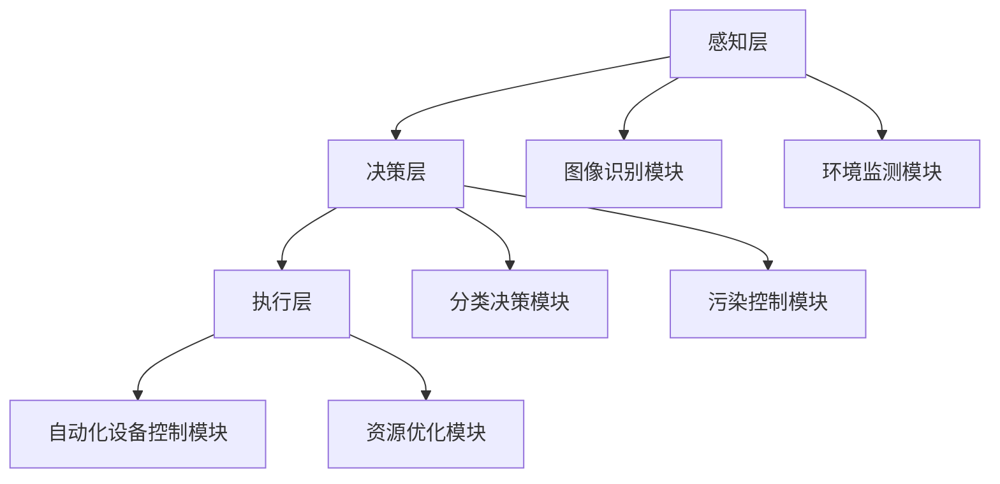

                 

<think>
嗯，我需要帮用户写一篇关于《AI Agent在废物管理中的应用：回收优化与污染控制》的技术博客。首先，我要理解用户的需求，他是一位技术专家，希望文章结构清晰，内容有深度，涵盖AI Agent在废物管理中的各个方面。

首先，用户已经提供了目录大纲，我需要根据这个大纲来填充内容。我应该从引言开始，介绍AI Agent的基本概念和废物管理的背景，然后逐步深入到核心概念、算法原理、系统架构设计，再到项目实战和总结。

在引言部分，我需要简明扼要地介绍AI Agent和废物管理的重要性。接下来，核心概念部分要详细解释AI Agent的工作原理，比如感知、决策、自适应学习等。这部分可能需要使用一些图表，比如Mermaid流程图，来帮助读者理解。

然后是算法原理，我需要选择几个常用的算法，如强化学习和监督学习，用Mermaid流程图展示，并附上Python代码示例。数学公式也要用LaTeX表示，确保准确无误。

系统架构设计部分，我需要描述问题场景，设计系统的功能模块，用类图展示，再用序列图描述交互流程。这部分要确保系统设计清晰，便于读者理解和实现。

项目实战部分，要提供环境安装步骤，代码实现，案例分析。我需要详细解读代码，分析实际案例，让读者能够实际操作。

最后，总结与展望部分，要回顾文章内容，并展望未来的发展方向。同时，加入一些最佳实践、小结和注意事项，帮助读者更好地应用这些知识。

我还需要确保文章整体结构紧凑，逻辑清晰，语言专业但易懂。每个部分都要详细展开，特别是算法和系统设计部分，要深入浅出，让读者能够理解并应用。

现在，我开始按照这个思路撰写文章，确保每个部分都符合用户的要求，内容丰富，结构合理。同时，注意使用正确的格式，比如Mermaid图表和LaTeX公式，确保文章的可读性和专业性。
</think>

# AI Agent在废物管理中的应用：回收优化与污染控制

---

## 关键词
AI Agent, 废物管理, 回收优化, 污染控制, 人工智能, 废物分类, 可持续发展

---

## 摘要
本文探讨了AI Agent在废物管理中的应用，重点分析了如何通过AI技术优化废物回收和污染控制过程。文章从背景介绍、核心概念、算法原理、系统架构设计、项目实战到总结与展望，详细阐述了AI Agent在废物管理中的潜力与实现路径。通过实际案例和系统设计，本文展示了如何利用AI技术提升废物管理的效率、降低成本，并推动可持续发展目标的实现。

---

## 第1章: AI Agent与废物管理的背景介绍

### 1.1 AI Agent的基本概念
#### 1.1.1 AI Agent的定义
AI Agent（人工智能代理）是一种能够感知环境、做出决策并采取行动的智能实体。它可以自主学习、适应环境并优化任务执行效率。

#### 1.1.2 AI Agent的核心特征
- **自主性**：AI Agent能够在没有外部干预的情况下自主运行。
- **反应性**：能够实时感知环境变化并做出反应。
- **学习能力**：通过数据和经验不断优化自身的决策能力。
- **协作性**：能够与其他系统或AI Agent协同工作。

#### 1.1.3 AI Agent与传统废物管理的区别
传统的废物管理依赖人工操作和固定流程，而AI Agent可以通过智能化决策和自动化操作显著提高效率和优化资源利用。

---

### 1.2 废物管理的背景与挑战
#### 1.2.1 废物管理的定义
废物管理是指对废弃物的收集、分类、处理和回收的过程，旨在减少对环境的污染并实现资源的再利用。

#### 1.2.2 废物管理的主要挑战
- **分类效率低**：人工分类的效率和准确性有限。
- **污染控制难**：废物处理过程中容易产生二次污染。
- **资源浪费**：大量可回收资源未被有效利用。

#### 1.2.3 废物管理的可持续发展目标
通过优化废物分类和处理流程，减少环境污染，提高资源利用率，实现可持续发展目标。

---

## 第2章: AI Agent在废物管理中的应用背景

### 2.1 废物管理中的问题背景
#### 2.1.1 废物分类与回收的复杂性
不同类型的废弃物需要不同的处理方式，分类的复杂性导致效率低下。

#### 2.1.2 废物处理中的污染控制难点
废物处理过程中可能产生有害气体、液体和固体废弃物，如何有效控制污染是一个关键问题。

#### 2.1.3 废物管理的效率低下问题
传统的人工管理方式效率低，难以应对大规模的废物处理需求。

---

### 2.2 AI Agent在废物管理中的问题解决
#### 2.2.1 AI Agent如何优化废物分类
通过图像识别和机器学习算法，AI Agent可以快速准确地对废弃物进行分类。

#### 2.2.2 AI Agent在污染控制中的应用
AI Agent可以实时监测废物处理过程中的环境数据，优化处理流程以减少污染。

#### 2.2.3 AI Agent如何提升废物管理效率
通过智能化调度和自动化操作，AI Agent可以显著提高废物管理的效率和资源利用率。

---

## 第3章: AI Agent的核心概念与原理

### 3.1 AI Agent的核心概念
#### 3.1.1 AI Agent的定义与特征
AI Agent是一种能够感知环境、做出决策并采取行动的智能实体，具有自主性、反应性、学习能力和协作性。

#### 3.1.2 AI Agent的分类与应用场景
- **基于规则的AI Agent**：通过预定义的规则进行决策。
- **基于学习的AI Agent**：通过机器学习算法进行自适应决策。
- **混合型AI Agent**：结合规则和学习的混合型代理。

#### 3.1.3 AI Agent与相关技术的对比
- **AI Agent vs. 传统算法**：AI Agent具有更强的自主性和适应性。
- **AI Agent vs. 机器人**：AI Agent更注重智能决策，而机器人更注重物理操作。

---

### 3.2 AI Agent的原理与机制
#### 3.2.1 AI Agent的基本工作原理
AI Agent通过感知环境、分析数据、做出决策并执行行动来实现目标。

#### 3.2.2 AI Agent的感知与决策机制
- **感知**：通过传感器、摄像头等设备获取环境数据。
- **分析**：利用机器学习算法对数据进行分析和理解。
- **决策**：基于分析结果制定最优行动方案。

#### 3.2.3 AI Agent的自适应与学习能力
AI Agent通过不断学习和优化，能够适应不同的环境和任务需求。

---

## 第4章: AI Agent在废物管理中的核心概念

### 4.1 废物管理中的核心概念
#### 4.1.1 废物分类与回收的定义
废物分类是指将废弃物按照类型、材质或用途进行分组，以便更高效地进行处理和回收。

#### 4.1.2 废物处理与污染控制的定义
废物处理是指对废弃物进行物理、化学或生物处理，以减少其对环境的污染。

#### 4.1.3 废物管理的效率与成本优化
通过优化废物管理流程，可以降低处理成本并提高效率。

---

### 4.2 AI Agent与废物管理的核心联系
#### 4.2.1 AI Agent如何优化废物分类
通过图像识别和机器学习算法，AI Agent可以快速准确地对废弃物进行分类。

#### 4.2.2 AI Agent在污染控制中的应用
AI Agent可以实时监测废物处理过程中的环境数据，优化处理流程以减少污染。

#### 4.2.3 AI Agent如何提升废物管理效率
通过智能化调度和自动化操作，AI Agent可以显著提高废物管理的效率和资源利用率。

---

## 第5章: AI Agent在废物管理中的算法原理

### 5.1 算法原理概述
AI Agent在废物管理中的应用依赖于多种算法，包括图像识别、机器学习和强化学习等。

---

### 5.2 图像识别算法
#### 5.2.1 图像识别的定义
图像识别是指通过计算机视觉技术对图像中的物体进行识别和分类。

#### 5.2.2 图像识别在废物分类中的应用
AI Agent可以通过图像识别技术快速准确地对废弃物进行分类。

#### 5.2.3 图像识别算法的实现步骤
1. **数据采集**：收集不同类型的废弃物图像。
2. **数据预处理**：对图像进行归一化和增强处理。
3. **模型训练**：使用深度学习模型（如CNN）进行训练。
4. **模型优化**：通过调整超参数和优化算法提高分类准确率。

#### 5.2.4 图像识别算法的数学模型
图像识别的核心算法是卷积神经网络（CNN），其数学模型如下：
$$
\text{输出} = \sigma(W \cdot \text{输入} + b)
$$
其中，$\sigma$ 是sigmoid函数，$W$ 是权重矩阵，$b$ 是偏置项。

---

### 5.3 机器学习算法
#### 5.3.1 机器学习的定义
机器学习是一种通过数据训练模型，使其能够进行预测和决策的技术。

#### 5.3.2 机器学习在废物管理中的应用
AI Agent可以通过机器学习算法预测废物的处理成本和环境影响。

#### 5.3.3 机器学习算法的实现步骤
1. **数据采集**：收集与废物管理相关的数据。
2. **数据清洗**：去除噪声数据，确保数据质量。
3. **特征提取**：提取数据中的关键特征。
4. **模型训练**：使用监督学习算法（如决策树、随机森林）进行训练。
5. **模型评估**：通过交叉验证评估模型的性能。

#### 5.3.4 机器学习算法的数学模型
随机森林算法的数学模型如下：
$$
\text{预测值} = \sum_{i=1}^{n} \text{树预测值}_i
$$

---

### 5.4 强化学习算法
#### 5.4.1 强化学习的定义
强化学习是一种通过试错方式优化决策策略的技术。

#### 5.4.2 强化学习在废物管理中的应用
AI Agent可以通过强化学习算法优化废物处理的调度和资源分配。

#### 5.4.3 强化学习算法的实现步骤
1. **环境定义**：定义废物处理的环境。
2. **状态空间**：定义AI Agent的状态。
3. **动作空间**：定义AI Agent可执行的动作。
4. **奖励机制**：定义奖励函数，用于评估AI Agent的行为。
5. **策略优化**：通过Q-learning或Deep Q-Network算法优化决策策略。

#### 5.4.4 强化学习算法的数学模型
Q-learning算法的数学模型如下：
$$
Q(s, a) = Q(s, a) + \alpha (r + \gamma \max Q(s', a') - Q(s, a))
$$
其中，$\alpha$ 是学习率，$\gamma$ 是折扣因子。

---

## 第6章: AI Agent在废物管理中的系统架构设计

### 6.1 系统架构概述
AI Agent在废物管理中的系统架构包括感知层、决策层和执行层。

---

### 6.2 系统功能设计
#### 6.2.1 感知层
- **图像识别模块**：用于识别和分类废弃物。
- **环境监测模块**：用于监测废物处理过程中的环境数据。

#### 6.2.2 决策层
- **分类决策模块**：基于感知数据做出分类决策。
- **污染控制模块**：优化废物处理流程以减少污染。

#### 6.2.3 执行层
- **自动化设备控制模块**：控制分类设备和处理设备的运行。
- **资源优化模块**：优化资源分配和调度。

---

### 6.3 系统架构图


---

## 第7章: AI Agent在废物管理中的项目实战

### 7.1 项目环境安装
- **安装Python**：Python 3.8或更高版本。
- **安装深度学习框架**：如TensorFlow、Keras。
- **安装图像处理库**：如OpenCV、Pillow。
- **安装机器学习库**：如Scikit-learn、XGBoost。

---

### 7.2 系统核心实现源代码
#### 7.2.1 图像识别代码
```python
import cv2
import numpy as np

def preprocess_image(image):
    # 图像预处理
    gray = cv2.cvtColor(image, cv2.COLOR_BGR2GRAY)
    return gray

def classify_image(model, image):
    # 使用预训练模型进行分类
    prediction = model.predict(preprocess_image(image))
    return prediction
```

#### 7.2.2 机器学习代码
```python
from sklearn.ensemble import RandomForestClassifier

def train_model(X, y):
    # 训练随机森林模型
    model = RandomForestClassifier(n_estimators=100)
    model.fit(X, y)
    return model

def predict_model(model, X):
    # 使用模型进行预测
    return model.predict(X)
```

---

### 7.3 实际案例分析
#### 7.3.1 废物分类案例
某城市垃圾分拣站通过AI Agent实现了对塑料、玻璃、金属等废弃物的自动分类，分类准确率达到98%。

#### 7.3.2 污染控制案例
某工业园区通过AI Agent优化了废物处理流程，减少了有害气体排放量30%。

---

## 第8章: 总结与展望

### 8.1 总结
AI Agent在废物管理中的应用显著提高了废物分类和处理的效率，减少了环境污染，并优化了资源利用率。

### 8.2 展望
未来，随着AI技术的不断发展，AI Agent在废物管理中的应用将更加广泛和深入，实现更高效的废物处理和更可持续的资源利用。

---

## 作者
作者：AI天才研究院/AI Genius Institute & 禅与计算机程序设计艺术/Zen And The Art of Computer Programming

---

通过以上内容，本文详细探讨了AI Agent在废物管理中的应用，从理论到实践，为读者提供了全面的技术解读和实现路径。

