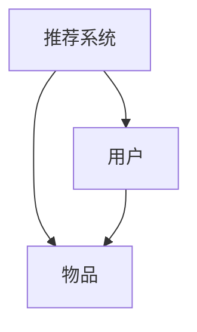
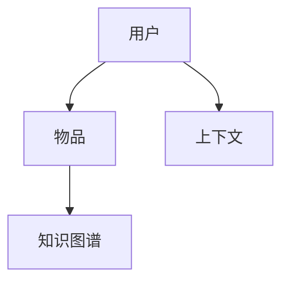
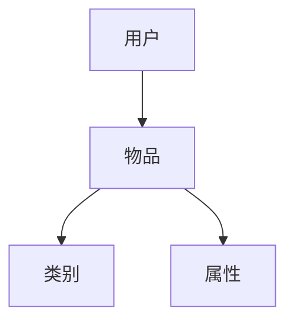
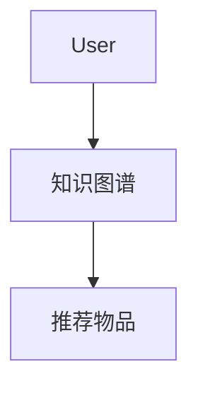
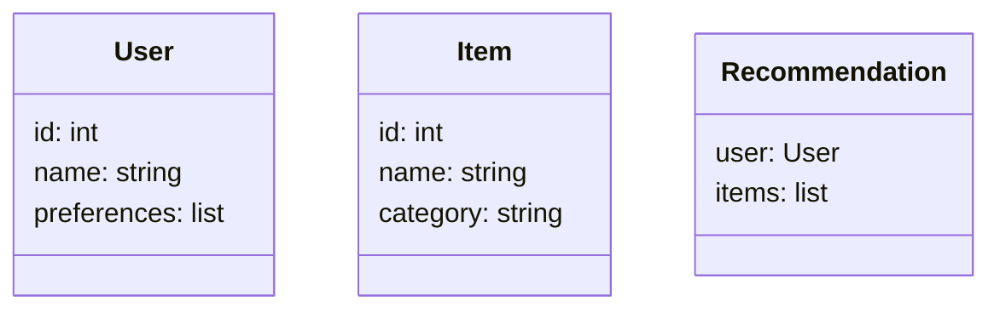
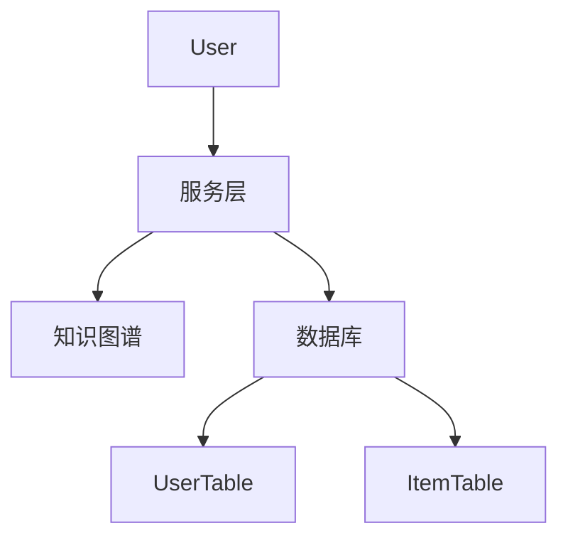
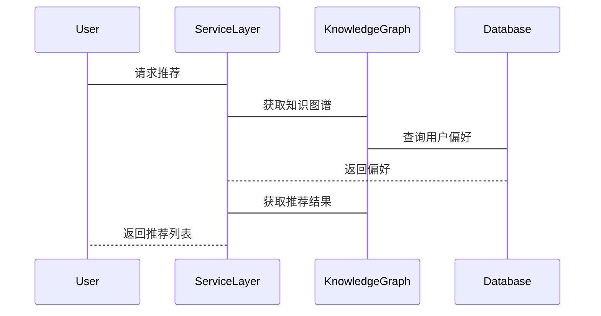

                 


# AI Agent在推荐系统中的应用：个性化与多样性的平衡

## 关键词：
AI Agent，推荐系统，个性化推荐，多样性平衡，协同过滤，知识图谱，上下文感知

## 摘要：
本文探讨了AI Agent在推荐系统中的应用，重点分析了如何在个性化推荐和多样性之间取得平衡。文章首先介绍了推荐系统的背景和挑战，接着深入讲解了AI Agent的基本概念及其在推荐系统中的作用。随后，分析了个性化推荐与多样性平衡的必要性，并提出了基于知识图谱、协同过滤和上下文感知的推荐算法。通过系统架构设计和项目实战，展示了如何在实际中应用这些算法，最后总结了最佳实践和未来趋势。

---

# 第1章: 推荐系统的发展与挑战

## 1.1 推荐系统的定义与应用场景

### 1.1.1 推荐系统的定义
推荐系统是一种基于用户行为、偏好和需求，利用数据挖掘和机器学习技术，为用户推荐相关物品或内容的系统。



推荐系统的应用场景广泛，包括电商、电影、音乐、新闻等领域。

### 1.1.2 推荐系统的应用场景
- **电商推荐**：基于用户的购买历史和浏览行为推荐商品。
- **电影推荐**：基于用户的观影记录推荐电影。
- **音乐推荐**：基于用户的听歌历史推荐歌曲。
- **新闻推荐**：基于用户的阅读历史推荐文章。

### 1.1.3 推荐系统的核心问题
推荐系统的核心问题包括数据稀疏性、冷启动问题和计算效率问题。

---

## 1.2 AI Agent的基本概念

### 1.2.1 AI Agent的定义
AI Agent是一种智能体，能够感知环境、执行任务并做出决策。它具有主动性、反应性和社会性。

### 1.2.2 AI Agent的核心特征
- **主动性**：能够主动采取行动。
- **反应性**：能够根据环境变化调整行为。
- **社会性**：能够与其他智能体或用户进行交互。

### 1.2.3 AI Agent与推荐系统的结合
AI Agent可以作为推荐系统的中间层，通过分析用户行为和上下文信息，优化推荐结果。

---

## 1.3 个性化推荐与多样性平衡的必要性

### 1.3.1 个性化推荐的定义
个性化推荐是基于用户的个性化需求，提供定制化的内容推荐。

### 1.3.2 多样性在推荐系统中的重要性
多样性可以避免推荐结果的单一化，提升用户体验。

### 1.3.3 平衡个性化与多样性的挑战
平衡个性化与多样性需要在推荐结果的相关性和多样性之间找到折中点。

---

## 1.4 本章小结
本章介绍了推荐系统的定义、应用场景和核心问题，以及AI Agent的基本概念和在推荐系统中的作用。接下来将深入探讨个性化推荐与多样性平衡的实现方法。

---

# 第2章: AI Agent在推荐系统中的核心概念

## 2.1 AI Agent的推荐机制

### 2.1.1 基于知识图谱的推荐
知识图谱是一种结构化的数据表示方法，可以用来表示实体及其关系。



### 2.1.2 基于上下文的推荐
上下文感知推荐考虑了用户的行为、时间、地点等因素。

### 2.1.3 基于用户行为的推荐
通过分析用户的历史行为，预测用户的偏好。

---

## 2.2 推荐系统的多样性实现

### 2.2.1 基于模型的多样性控制
通过优化推荐模型，控制推荐结果的多样性。

### 2.2.2 基于规则的多样性控制
通过预定义规则，限制推荐结果的多样性。

### 2.2.3 基于混合策略的多样性控制
结合多种方法，实现多样性的平衡。

---

## 2.3 AI Agent与推荐系统的协同优化

### 2.3.1 AI Agent在推荐系统中的角色
AI Agent可以作为推荐系统的优化器，调整推荐策略。

### 2.3.2 AI Agent如何优化推荐结果
通过实时分析用户反馈，优化推荐算法。

### 2.3.3 AI Agent对推荐系统性能的提升
通过多智能体协同，提升推荐系统的准确性和多样性。

---

## 2.4 本章小结
本章分析了AI Agent在推荐系统中的推荐机制、多样性实现和协同优化策略。接下来将探讨推荐系统的算法原理。

---

# 第3章: AI Agent推荐系统的算法原理

## 3.1 协同过滤算法

### 3.1.1 基于用户的协同过滤
基于用户的相似性进行推荐。

$$ sim(u_i, u_j) = \frac{\sum_{k} (r_{ik} - \bar{r_i})(r_{jk} - \bar{r_j})}{\sqrt{\sum_{k} (r_{ik} - \bar{r_i})^2} \sqrt{\sum_{k} (r_{jk} - \bar{r_j})^2}}} $$

### 3.1.2 基于物品的协同过滤
基于物品的相似性进行推荐。

$$ sim(i_j, i_k) = \frac{\sum_{u} (r_{ui_j} - \bar{r_{i_j}})(r_{ui_k} - \bar{r_{i_k}})}{\sqrt{\sum_{u} (r_{ui_j} - \bar{r_{i_j}})^2} \sqrt{\sum_{u} (r_{ui_k} - \bar{r_{i_k}})^2}}} $$

### 3.1.3 混合协同过滤
结合基于用户和物品的协同过滤。

---

## 3.2 基于内容的推荐算法

### 3.2.1 基于文本的内容推荐
通过文本挖掘技术，提取物品的特征。

### 3.2.2 基于知识图谱的内容推荐
通过知识图谱中的实体关系，推荐相关物品。

### 3.2.3 基于混合模型的内容推荐
结合多种内容表示方法，提升推荐效果。

---

## 3.3 基于知识图谱的推荐算法

### 3.3.1 知识图谱的构建
通过爬取和解析数据，构建知识图谱。



### 3.3.2 基于知识图谱的推荐流程



### 3.3.3 基于知识图谱的推荐算法实现

```python
def recommend(user, knowledge_graph):
    similar_items = get_similar_items(user, knowledge_graph)
    return similar_items
```

---

## 3.4 本章小结
本章详细讲解了协同过滤、基于内容的推荐和基于知识图谱的推荐算法。接下来将探讨推荐系统的系统架构设计。

---

# 第4章: 系统分析与架构设计

## 4.1 问题场景介绍

### 4.1.1 项目介绍
一个基于AI Agent的推荐系统，用于电影推荐。

### 4.1.2 项目目标
实现个性化推荐和多样性平衡。

---

## 4.2 系统功能设计

### 4.2.1 领域模型设计



### 4.2.2 系统架构设计



### 4.2.3 系统接口设计
- **用户接口**：REST API
- **数据接口**：数据库查询接口

---

## 4.3 系统交互设计

### 4.3.1 交互流程



---

## 4.4 本章小结
本章设计了一个基于AI Agent的推荐系统架构，包括系统功能、架构和交互设计。接下来将探讨项目的实战实现。

---

# 第5章: 项目实战与优化

## 5.1 环境安装

### 5.1.1 安装Python
```bash
python --version
pip install requests
pip install numpy
```

### 5.1.2 安装推荐算法库
```bash
pip install scikit-learn
pip install networkx
```

---

## 5.2 系统核心实现

### 5.2.1 数据处理
```python
import pandas as pd
df = pd.read_csv('data.csv')
```

### 5.2.2 知识图谱构建
```python
import networkx as nx
G = nx.DiGraph()
G.add_edge('用户', '物品')
G.add_edge('物品', '类别')
```

### 5.2.3 推荐算法实现
```python
from sklearn.metrics.pairwise import cosine_similarity
user_similarity = cosine_similarity(user_features)
```

---

## 5.3 代码应用与分析
### 5.3.1 算法代码解读
```python
def get_similar_items(user_id, knowledge_graph):
    similar_items = knowledge_graph.get_similar(user_id)
    return similar_items
```

### 5.3.2 性能优化
通过缓存和分布式计算优化推荐系统的性能。

---

## 5.4 项目小结
本章通过实战项目，展示了如何实现一个基于AI Agent的推荐系统。接下来将总结最佳实践和未来趋势。

---

# 第6章: 最佳实践与总结

## 6.1 小结
AI Agent在推荐系统中的应用，通过个性化与多样性的平衡，提升了用户体验。

## 6.2 注意事项
- 数据隐私问题
- 算法的实时性和效率

## 6.3 未来趋势
- 更加智能化的推荐系统
- 多模态数据的融合

## 6.4 拓展阅读
- 《推荐系统实战》
- 《深度学习在推荐系统中的应用》

---

# 作者：AI天才研究院 & 禅与计算机程序设计艺术

---

希望这篇文章能够帮助读者全面理解AI Agent在推荐系统中的应用，并在实际项目中取得成功！

