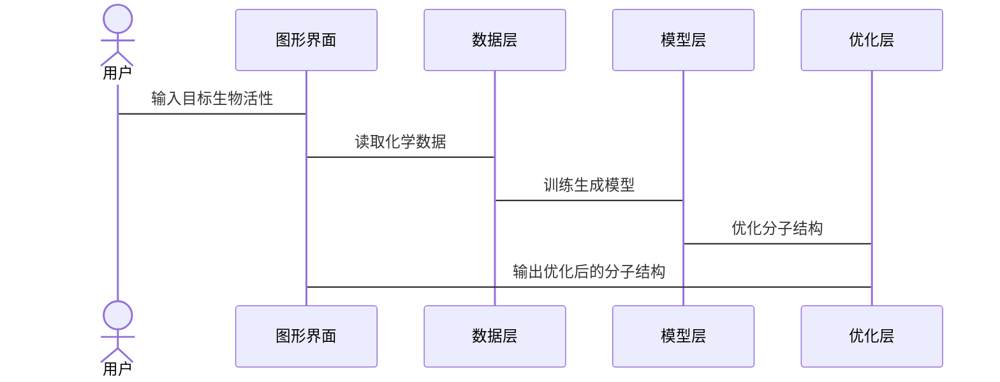

                 


### 思考过程：

---

# 第一部分: AI Agent在新药研发中的分子设计应用概述

## 第1章: 背景介绍

### 1.1 问题背景

#### 1.1.1 新药研发的挑战与痛点

新药研发是一个复杂而昂贵的过程，涉及多个阶段，包括药物发现、临床前研究和临床试验。传统的新药研发依赖于大量的实验和试错，耗时长、成本高，且成功率低。据统计，一款新药从研发到上市的平均成本约为20亿美元，且需要10-15年的时间。这种低效性使得新药研发成为一项极具挑战性的任务。

#### 1.1.2 传统药物研发的低效性

传统的新药研发过程依赖于经验丰富的科学家和大量的实验。研究人员通过试错法筛选化合物库，寻找具有特定生物活性的分子。这种方法不仅耗时，而且效率低下，因为化合物库可能包含数百万个分子，而只有少数几个可能符合要求。

#### 1.1.3 AI技术在药物研发中的潜力

随着人工智能（AI）技术的快速发展，AI在新药研发中的应用逐渐成为研究的热点。AI技术可以通过分析大量的化学和生物数据，帮助研究人员快速识别潜在的候选药物分子。AI Agent（智能体）作为一种能够自主决策和优化的AI系统，可以在分子设计中发挥重要作用。

---

### 1.2 问题描述

#### 1.2.1 分子设计的核心问题

分子设计的核心问题在于如何设计出具有特定生物活性的分子结构。这需要考虑分子的化学性质、生物活性、药代动力学（如溶解性和代谢稳定性）等因素。传统的分子设计方法依赖于化学直觉和经验，而AI技术可以通过数据驱动的方法，提供更高效的解决方案。

#### 1.2.2 AI Agent在分子设计中的应用场景

AI Agent在分子设计中的应用场景包括：

1. **分子生成**：AI Agent可以根据目标生物活性生成潜在的分子结构。
2. **分子优化**：AI Agent可以优化已知分子的结构，提高其生物活性和药代动力学性质。
3. **虚拟筛选**：AI Agent可以从化合物库中筛选出具有特定性质的分子。

#### 1.2.3 当前技术的局限性与改进方向

尽管AI技术在分子设计中展现出巨大潜力，但当前技术仍存在一些局限性：

- 数据不足：分子设计需要大量高质量的实验数据，而这些数据可能难以获取。
- 模型的泛化能力：现有的AI模型可能在特定任务上表现良好，但在复杂的真实环境下可能不够 robust。
- 解释性：AI模型的决策过程可能不够透明，影响研究人员对模型的信任。

---

### 1.3 问题解决

#### 1.3.1 AI Agent在分子设计中的解决方案

AI Agent可以通过以下方式解决分子设计中的问题：

1. **数据驱动的分子生成**：AI Agent可以根据已知的生物活性数据生成新的分子结构。
2. **强化学习优化**：通过强化学习，AI Agent可以不断优化分子结构，以提高其生物活性。
3. **多目标优化**：AI Agent可以在多个目标（如生物活性、溶解性、代谢稳定性）之间进行权衡，找到最优的分子结构。

#### 1.3.2 技术路线的选择与优化

AI Agent在分子设计中的技术路线可以包括以下步骤：

1. **数据准备**：收集和整理相关的化学和生物数据。
2. **模型训练**：使用深度学习模型（如生成对抗网络、变分自编码器）进行训练。
3. **分子生成与优化**：通过AI Agent生成和优化分子结构。
4. **实验验证**：通过实验室实验验证生成的分子的生物活性。

#### 1.3.3 实际案例分析

以某种疾病（如癌症）为例，AI Agent可以通过分析已知的抗癌药物数据，生成新的候选药物分子，并优化其结构以提高疗效和减少副作用。

---

### 1.4 边界与外延

#### 1.4.1 AI Agent在分子设计中的应用边界

AI Agent在分子设计中的应用边界包括：

- 数据的局限性：AI Agent的表现依赖于数据的质量和数量。
- 模型的泛化能力：AI Agent在不同任务和环境中的表现可能不同。
- 实验验证的必要性：AI Agent生成的分子仍需要通过实验验证其有效性。

#### 1.4.2 相关领域的联系与区别

- **与传统药物研发的区别**：传统方法依赖于试错法，而AI Agent可以通过数据驱动的方法快速筛选和优化分子。
- **与计算化学的联系**：计算化学是分子设计的基础，而AI Agent可以提供更高效的计算方法。

#### 1.4.3 技术的未来发展与可能性

未来，AI Agent在分子设计中的应用可能会更加广泛。随着模型的改进和数据的积累，AI Agent可能会在药物研发的多个阶段发挥作用，如先导化合物的发现、优化和临床前研究。

---

### 1.5 核心要素组成

#### 1.5.1 数据集与特征提取

数据集是AI Agent训练的基础。分子设计需要大量的化学和生物数据，包括分子结构、生物活性、药代动力学性质等。特征提取是将这些数据转化为模型可以理解的形式，如分子指纹或向量表示。

#### 1.5.2 模型构建与优化

模型构建是AI Agent的核心部分。常用的模型包括生成对抗网络（GAN）和变分自编码器（VAE）。这些模型需要通过大量的数据进行训练，并通过优化算法（如梯度下降）进行优化。

#### 1.5.3 结果验证与反馈机制

结果验证是确保AI Agent生成分子的正确性的重要步骤。通过实验验证生成的分子的生物活性和药代动力学性质，并将结果反馈给模型，以进一步优化。

---

## 第2章: AI Agent与分子设计的核心概念

### 2.1 AI Agent的基本原理

#### 2.1.1 AI Agent的定义与分类

AI Agent是一种能够感知环境并采取行动以实现目标的智能系统。根据智能水平，AI Agent可以分为简单反应式智能体和基于模型的智能体。在分子设计中，通常使用基于模型的智能体，因为它们可以利用环境中的信息进行决策。

#### 2.1.2 基于强化学习的AI Agent

基于强化学习的AI Agent通过与环境的交互获得奖励，并通过最大化累积奖励来优化其行为。在分子设计中，环境可以是化学空间，奖励可以是分子的生物活性。

#### 2.1.3 分子设计中的AI Agent特点

- **自主性**：AI Agent可以自主决策和优化分子结构。
- **适应性**：AI Agent可以根据反馈不断优化其行为。
- **高效性**：AI Agent可以通过数据驱动的方法快速筛选和优化分子。

---

### 2.2 分子设计的基本原理

#### 2.2.1 分子结构与药物活性的关系

分子结构决定了其生物活性。例如，特定的官能团或化学键可能与目标受体具有较高的亲和力，从而表现出特定的药效。

#### 2.2.2 分子设计的目标函数

分子设计的目标函数通常包括生物活性、溶解性、代谢稳定性等。目标函数的定义直接影响AI Agent的优化方向。

#### 2.2.3 常用分子设计方法

常用的分子设计方法包括：

- **基于片段的药物设计**：通过拼接已知的药效片段，设计新的分子。
- **基于骨架的药物设计**：在某个骨架上进行修饰，以优化分子的性质。
- **计算机辅助药物设计（CADD）**：利用计算机模拟技术辅助药物设计。

---

### 2.3 AI Agent与分子设计的联系

#### 2.3.1 AI Agent在分子设计中的优势

- **高效性**：AI Agent可以通过数据驱动的方法快速筛选和优化分子结构。
- **全局优化**：AI Agent可以在化学空间中进行全局优化，找到最优的分子结构。
- **多目标优化**：AI Agent可以在多个目标之间进行权衡，设计出更优的分子。

#### 2.3.2 AI Agent与传统分子设计方法的对比

| 特性               | AI Agent                      | 传统方法                     |
|--------------------|-------------------------------|-----------------------------|
| 效率               | 高                           | 低                           |
| 全局优化能力       | 强                           | 弱                           |
| 多目标优化能力     | 强                           | 一般                         |
| 数据依赖性         | 高                           | 较低                         |

#### 2.3.3 AI Agent在分子设计中的创新点

AI Agent可以通过强化学习和生成模型，实现分子结构的创新设计。与传统方法相比，AI Agent可以生成更多新颖的分子结构，从而提高药物研发的成功率。

---

## 第3章: 核心概念对比与ER实体关系图

### 3.1 AI Agent与传统AI的区别

#### 3.1.1 AI Agent的自主性与适应性

AI Agent具有自主决策的能力，可以在动态环境中自主调整其行为。例如，在分子设计中，AI Agent可以根据实验结果调整分子的优化方向。

#### 3.1.2 传统AI的局限性

传统AI通常依赖于固定的规则和数据，缺乏自主性和适应性。例如，基于规则的药物设计方法需要依赖专家的知识和经验。

#### 3.1.3 AI Agent在动态环境中的优势

AI Agent可以在动态环境中自主调整其行为，从而适应新的数据和变化的需求。例如，在分子设计中，AI Agent可以根据新的实验结果优化分子结构。

---

### 3.2 分子设计中的实体关系

#### 3.2.1 分子、目标函数与优化算法的关系

分子是AI Agent设计的目标，目标函数是优化的方向，优化算法是实现优化的工具。三者之间的关系可以通过ER图表示：

```mermaid
er
    actor 剧本 {
        分子 -- 目标函数
        目标函数 -- 优化算法
    }
```

---

### 3.3 AI Agent与分子设计的ER实体关系图

AI Agent在分子设计中的实体关系可以表示为：

```mermaid
er
    actor 分子设计系统 {
        AI Agent -- 分子
        分子 -- 目标函数
        目标函数 -- 优化算法
    }
```

---

## 第4章: 算法原理讲解

### 4.1 生成模型的选择与对比

#### 4.1.1 生成对抗网络（GAN）

生成对抗网络由生成器和判别器组成。生成器的目标是生成与真实数据相似的分子结构，判别器的目标是区分生成的分子和真实的分子。通过对抗训练，生成器可以生成高质量的分子结构。

#### 4.1.2 变分自编码器（VAE）

变分自编码器通过编码和解码过程生成分子结构。编码器将分子结构编码为潜在空间中的向量，解码器将潜在向量解码为分子结构。VAE的优势在于可以生成多样化的分子结构。

#### 4.1.3 比较与选择

GAN和VAE各有优缺点。GAN生成的分子结构质量较高，但训练过程可能不稳定。VAE生成的分子结构多样性较好，但质量可能不如GAN。在实际应用中，可以根据具体需求选择合适的模型。

---

### 4.2 生成模型的数学模型和公式

#### 4.2.1 GAN的数学模型

生成器的损失函数为：

$$ L_G = \mathbb{E}_{z} [\log D(G(z))] $$

判别器的损失函数为：

$$ L_D = -\mathbb{E}_{x} [\log D(x)] - \mathbb{E}_{z} [\log (1 - D(G(z)))] $$

其中，$x$ 是真实分子，$z$ 是潜在向量，$G$ 是生成器，$D$ 是判别器。

#### 4.2.2 VAE的数学模型

VAE的目标是最小化重构损失和KL散度：

$$ \mathcal{L} = \mathbb{E}_{x} [\log p_{\text{recon}}(x|z)] - \text{KL}(q(z|x) || p(z)) $$

其中，$p_{\text{recon}}(x|z)$ 是解码器的概率分布，$q(z|x)$ 是编码器的概率分布，$p(z)$ 是先验分布。

---

### 4.3 算法实现与代码解读

以下是使用生成对抗网络进行分子生成的Python代码示例：

```python
import numpy as np
import tensorflow as tf
from tensorflow.keras import layers

# 定义生成器
def generator():
    model = tf.keras.Sequential()
    model.add(layers.Dense(256, activation='relu', input_shape=(128,)))
    model.add(layers.Dense(512, activation='relu'))
    model.add(layers.Dense(1024, activation='sigmoid'))
    return model

# 定义判别器
def discriminator():
    model = tf.keras.Sequential()
    model.add(layers.Dense(512, activation='relu', input_shape=(1024,)))
    model.add(layers.Dense(256, activation='relu'))
    model.add(layers.Dense(1, activation='sigmoid'))
    return model

# 初始化生成器和判别器
generator = generator()
discriminator = discriminator()

# 定义损失函数
cross_entropy = tf.keras.losses.BinaryCrossentropy()

# 生成器的损失
def generator_loss(fake_output):
    return cross_entropy(tf.ones_like(fake_output), fake_output)

# 判别器的损失
def discriminator_loss(real_output, fake_output):
    real_loss = cross_entropy(tf.ones_like(real_output), real_output)
    fake_loss = cross_entropy(tf.zeros_like(fake_output), fake_output)
    return real_loss + fake_loss

# 优化器
generator_optimizer = tf.keras.optimizers.Adam(0.0002)
discriminator_optimizer = tf.keras.optimizers.Adam(0.0002)

# 训练过程
@tf.function
def train_step(real_molecules):
    noise = tf.random.normal([BATCH_SIZE, 128])
    fake_molecules = generator(noise)
    real_output = discriminator(real_molecules)
    fake_output = discriminator(fake_molecules)

    # 计算损失
    gen_loss = generator_loss(fake_output)
    disc_loss = discriminator_loss(real_output, fake_output)

    # 更新参数
    generator_optimizer.minimize(gen_loss, generator.trainable_variables)
    discriminator_optimizer.minimize(disc_loss, discriminator.trainable_variables)

    return gen_loss, disc_loss
```

---

## 第5章: 系统分析与架构设计方案

### 5.1 问题场景介绍

AI Agent在分子设计中的应用场景包括药物发现、先导化合物优化和临床前研究。系统需要能够处理大量的化学数据，并生成和优化分子结构。

### 5.2 系统功能设计

系统功能设计包括：

1. 数据预处理：将化学数据转化为模型可以理解的形式。
2. 模型训练：训练生成对抗网络或变分自编码器。
3. 分子生成：通过AI Agent生成潜在的分子结构。
4. 分子优化：优化生成的分子结构，以提高其生物活性。
5. 实验验证：通过实验室实验验证生成分子的性质。

### 5.3 系统架构设计

系统架构设计包括：

1. 数据层：存储化学和生物数据。
2. 模型层：实现生成模型（GAN或VAE）。
3. 交互层：用户可以通过图形界面与系统交互。
4. 优化层：实现分子优化算法。


---

### 5.4 接口设计与交互流程

系统接口设计包括：

1. 数据接口：用于读取和存储化学数据。
2. 模型接口：用于训练和生成分子结构。
3. 优化接口：用于优化分子结构。

交互流程如下：

1. 用户通过图形界面输入目标生物活性。
2. 系统读取化学数据并生成分子结构。
3. 用户对生成的分子结构进行优化。
4. 系统输出优化后的分子结构。



---

## 第6章: 项目实战

### 6.1 环境安装

#### 6.1.1 安装Python环境

```bash
python --version
pip install --upgrade pip
pip install numpy tensorflow keras
```

#### 6.1.2 安装化学数据处理库

```bash
pip install rdkit
pip install openeye
```

### 6.2 系统核心实现源代码

以下是AI Agent在分子设计中的核心代码示例：

```python
import numpy as np
import rdkit
from rdkit import Chem
from rdkit.Chem import Draw

# 定义生成器和判别器
def generator():
    model = tf.keras.Sequential()
    model.add(layers.Dense(256, activation='relu', input_shape=(128,)))
    model.add(layers.Dense(512, activation='relu'))
    model.add(layers.Dense(1024, activation='sigmoid'))
    return model

def discriminator():
    model = tf.keras.Sequential()
    model.add(layers.Dense(512, activation='relu', input_shape=(1024,)))
    model.add(layers.Dense(256, activation='relu'))
    model.add(layers.Dense(1, activation='sigmoid'))
    return model

# 初始化生成器和判别器
generator = generator()
discriminator = discriminator()

# 定义损失函数和优化器
cross_entropy = tf.keras.losses.BinaryCrossentropy()
generator_optimizer = tf.keras.optimizers.Adam(0.0002)
discriminator_optimizer = tf.keras.optimizers.Adam(0.0002)

# 训练过程
@tf.function
def train_step(real_molecules):
    noise = tf.random.normal([BATCH_SIZE, 128])
    fake_molecules = generator(noise)
    real_output = discriminator(real_molecules)
    fake_output = discriminator(fake_molecules)

    # 计算损失
    gen_loss = generator_loss(fake_output)
    disc_loss = discriminator_loss(real_output, fake_output)

    # 更新参数
    generator_optimizer.minimize(gen_loss, generator.trainable_variables)
    discriminator_optimizer.minimize(disc_loss, discriminator.trainable_variables)

    return gen_loss, disc_loss
```

### 6.3 代码应用解读与分析

代码解读：

- **生成器**：生成器将潜在向量（噪声）映射到分子结构空间。
- **判别器**：判别器将分子结构映射到概率空间，判断分子是否为真实数据。
- **训练过程**：通过对抗训练，生成器和判别器交替优化，最终生成高质量的分子结构。

### 6.4 实际案例分析与详细讲解

以抗癌药物设计为例，AI Agent可以通过生成对抗网络生成多种潜在的抗癌分子结构，并通过优化算法选择最优的分子。生成的分子可以通过实验验证其生物活性和药代动力学性质。

### 6.5 项目小结

通过本章的实战，我们可以看到AI Agent在分子设计中的巨大潜力。通过训练生成模型，我们可以快速生成和优化分子结构，显著提高新药研发的效率。

---

## 第7章: 最佳实践、小结、注意事项、拓展阅读

### 7.1 最佳实践 tips

1. **数据质量**：确保数据的准确性和完整性。
2. **模型选择**：根据具体任务选择合适的生成模型（GAN或VAE）。
3. **实验验证**：生成的分子仍需要通过实验验证其性质。

### 7.2 小结

通过本文的介绍，我们了解了AI Agent在新药研发中的分子设计应用。从背景介绍到算法原理，再到系统设计和项目实战，我们可以看到AI技术在药物研发中的巨大潜力。

### 7.3 注意事项

- **数据隐私**：在处理化学数据时，需要注意数据的隐私和安全。
- **模型解释性**：需要提高AI模型的解释性，以便研究人员更好地理解模型的决策过程。
- **实验验证**：生成的分子仍需要通过实验验证其性质。

### 7.4 拓展阅读

- **生成对抗网络**：学习更多关于生成对抗网络的知识，了解其在其他领域的应用。
- **分子设计工具**：了解其他分子设计工具（如AutoDock、PyMOL）的工作原理。
- **药物研发流程**：深入了解新药研发的整个流程，包括临床试验和监管审批。

---

# 第二部分: 总结

通过本文的详细介绍，我们全面了解了AI Agent在新药研发中的分子设计应用。从背景介绍到算法原理，再到系统设计和项目实战，我们可以看到AI技术在药物研发中的巨大潜力。未来，随着AI技术的不断发展，AI Agent将在新药研发中发挥越来越重要的作用。

---

作者：AI天才研究院/AI Genius Institute & 禅与计算机程序设计艺术 /Zen And The Art of Computer Programming
```

