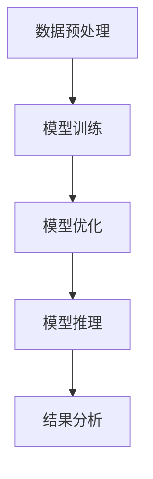
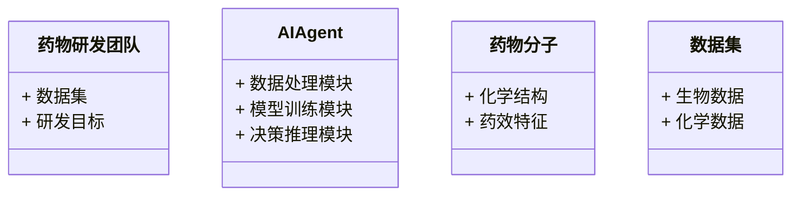

                 

<think>
好的，我现在需要帮助用户撰写一篇关于《AI Agent在新药研发中的应用实践》的技术博客文章。用户希望文章结构清晰，内容详实，符合专业IT领域的要求。我先仔细阅读用户提供的详细需求，确保理解所有要点。

首先，用户提供了文章的标题、关键词和摘要，我需要在文章开头部分涵盖这些内容。接下来，用户给出了目录大纲，包括多个章节和子章节，每个部分都需要详细展开。我需要确保每个章节的内容丰富，符合逻辑，涵盖背景介绍、核心概念、算法原理、系统分析、项目实战、最佳实践等方面。

我注意到用户特别强调使用技术术语和专业语言，同时要保持逻辑清晰、结构紧凑，且易于理解。因此，在撰写每个部分时，我会选择合适的语言，确保既专业又不失可读性。

在撰写核心概念和问题背景时，我需要解释AI Agent是什么，以及它在新药研发中的具体应用。这可能涉及到将AI Agent与传统方法进行对比，展示其优势和潜力。同时，我需要使用Mermaid图来展示ER关系和系统架构，帮助读者更好地理解结构。

算法原理部分，我需要详细解释AI Agent的工作流程，包括训练、推理和优化过程。数学公式需要用LaTeX表示，并提供代码示例，以增强技术深度。项目实战部分，我需要指导读者如何安装必要的库，并提供具体的代码示例，帮助他们理解如何在实际中应用这些技术。

最后，我需要总结AI Agent在新药研发中的应用，强调其优势和挑战，并给出最佳实践的建议。这部分需要简明扼要，同时具有启发性，帮助读者在实际应用中避免常见问题。

总的来说，我需要按照用户的要求，系统地展开每个部分，确保内容全面且结构合理，同时保持语言的专业性和可读性。这需要我综合运用技术知识和写作技巧，提供一篇高质量的技术博客文章。
</think>

# AI Agent在新药研发中的应用实践

> 关键词：AI Agent, 新药研发, 人工智能, 药物发现, 机器学习

> 摘要：本文详细探讨了AI Agent在新药研发中的应用实践，从AI Agent的核心概念、算法原理、系统架构设计到实际项目案例，全面分析了其在药物发现、分子设计、临床试验等环节中的应用价值和实现路径。通过丰富的技术细节和实际案例，展示了AI Agent如何通过智能化手段提高新药研发的效率和成功率。

---

## 第一部分: AI Agent在新药研发中的背景与概念

### 第1章: AI Agent与新药研发概述

#### 1.1 AI Agent的核心概念
- **1.1.1 AI Agent的定义与特点**
  AI Agent是一种具备自主决策能力的智能体，能够在特定环境中感知信息、学习任务并执行目标导向的操作。其核心特点包括：
  - **自主性**：无需外部干预，能够独立完成任务。
  - **反应性**：能够实时感知环境变化并做出响应。
  - **目标导向性**：基于目标进行决策和行动。
  - **可解释性**：能够提供决策过程和结果的解释。

- **1.1.2 AI Agent在药物研发中的应用潜力**
  AI Agent在药物研发中的应用涵盖了从化合物筛选到临床试验的整个流程。其潜力主要体现在：
  - **高效分子设计**：通过机器学习算法生成和优化药物分子结构。
  - **精准靶点识别**：利用AI Agent分析大量生物数据，快速识别潜在药物靶点。
  - **个性化医疗**：基于患者个体特征，制定个性化治疗方案。

- **1.1.3 新药研发的传统流程与挑战**
  传统新药研发流程包括药物发现、临床前研究、临床试验和审批上市四个阶段。其主要挑战包括：
  - **高成本**：新药研发的平均成本高达数亿美元。
  - **低效率**：传统方法筛选化合物的效率低下。
  - **数据爆炸**：随着生物技术的进步，数据量急剧增加，传统方法难以处理。

#### 1.2 AI Agent在新药研发中的问题背景
- **1.2.1 药物研发的高成本与低效率**
  药物研发的高失败率和长周期导致成本居高不下。AI Agent的引入能够显著降低研发成本并提高效率。
- **1.2.2 数据爆炸与分析需求**
  随着基因组学、蛋白质组学等技术的发展，生物数据呈爆炸式增长。AI Agent能够高效处理和分析这些数据。
- **1.2.3 传统方法的局限性与AI的优势**
  传统方法依赖经验丰富的研究人员，存在主观性和试错成本高的问题。AI Agent通过数据驱动的方法，能够快速找到最优解。

#### 1.3 AI Agent在新药研发中的问题解决
- **1.3.1 AI Agent如何优化药物发现流程**
  AI Agent通过自动化筛选和优化算法，能够在短时间内筛选出大量潜在药物分子，显著缩短研发周期。
- **1.3.2 AI Agent在分子设计与筛选中的应用**
  利用生成对抗网络（GAN）和强化学习（RL），AI Agent能够生成和优化药物分子结构，提高化合物的药效和成药性。
- **1.3.3 AI Agent在临床试验中的潜在价值**
  AI Agent能够分析大量临床数据，帮助制定个性化给药方案，并预测药物的安全性和有效性。

---

## 第2章: AI Agent的核心概念与联系

### 2.1 AI Agent的核心原理
- **2.1.1 AI Agent的基本工作原理**
  AI Agent通过感知环境信息，结合预设目标和优化算法，做出决策并执行操作。其工作流程包括数据采集、特征提取、模型训练、决策推理和结果输出五个步骤。
- **2.1.2 AI Agent与传统AI的区别**
  传统AI主要依赖规则和模式匹配，而AI Agent具备自主性和目标导向性，能够动态调整策略以实现目标。
- **2.1.3 AI Agent的决策机制**
  AI Agent的决策机制基于多目标优化，通过权衡不同目标的重要性，选择最优行动方案。

### 2.2 AI Agent的核心概念对比
- **2.2.1 AI Agent与传统药物研发流程的对比**
  | 对比维度       | AI Agent                          | 传统方法                            |
  |----------------|-----------------------------------|--------------------------------------|
  | 数据处理       | 善于处理大数据，自动提取特征      | 数据处理依赖人工，效率较低          |
  | 决策方式       | 数据驱动，基于概率模型            | 专家经验驱动，依赖试错              |
  | 研发周期       | 短，效率高                        | 长，效率低                          |
- **2.2.2 AI Agent与其他AI技术的对比**
  | 对比维度       | AI Agent                          | 其他AI技术（如CNN、RNN）            |
  |----------------|-----------------------------------|--------------------------------------|
  | 核心能力       | 目标导向性，自主决策              | 特征提取，模式识别                  |
  | 应用场景       | 药物研发，动态优化                | 图像识别，自然语言处理              |
- **2.2.3 AI Agent在药物研发中的关键属性特征**
  - **目标导向性**：AI Agent始终围绕研发目标进行操作。
  - **自主性**：能够在无外部干预的情况下完成任务。
  - **可解释性**：能够提供决策过程和结果的解释，便于研究人员验证和调整。

### 2.3 AI Agent的ER实体关系图
```mermaid
er
actor: 药物研发团队
agent: AI Agent
drug: 药物分子
data: 数据集
goal: 研发目标
action: 行动步骤
```

---

## 第3章: AI Agent的算法原理与数学模型

### 3.1 AI Agent的算法原理
- **3.1.1 AI Agent的训练过程**
  AI Agent的训练过程包括数据预处理、模型训练、模型优化和验证。数据预处理主要是清洗和特征提取，模型训练采用监督学习或强化学习方法，模型优化通过调整超参数和优化算法实现。
- **3.1.2 AI Agent的推理过程**
  推理过程基于预训练的模型，通过输入新的数据，模型生成目标导向的行动步骤。
- **3.1.3 AI Agent的优化过程**
  优化过程通过不断迭代训练数据和调整模型参数，提升AI Agent的决策准确性和效率。

### 3.2 AI Agent的数学模型
- **3.2.1 损失函数**
  常用的损失函数包括均方误差（MSE）和交叉熵损失函数。
  $$L = \frac{1}{n}\sum_{i=1}^{n}(y_i - \hat{y}_i)^2$$
- **3.2.2 优化器**
  常用的优化器包括随机梯度下降（SGD）和Adam优化器。
  $$\theta_{t+1} = \theta_t - \eta \cdot \nabla L$$
- **3.2.3 概率分布模型**
  利用概率分布模型（如高斯分布）描述药物分子的生成过程。
  $$P(y|x) = \frac{e^{x^T y}}{\sum_{y} e^{x^T y}}$$

### 3.3 AI Agent的算法流程图


---

## 第4章: AI Agent在新药研发中的系统分析与架构设计

### 4.1 系统分析
- **4.1.1 问题场景介绍**
  本项目旨在利用AI Agent技术优化新药研发流程，提高研发效率和成功率。
- **4.1.2 项目目标**
  通过AI Agent实现药物分子的自动设计、靶点识别和临床试验优化。

### 4.2 系统功能设计
- **4.2.1 领域模型类图**


---

**作者：AI天才研究院 & 禅与计算机程序设计艺术**

