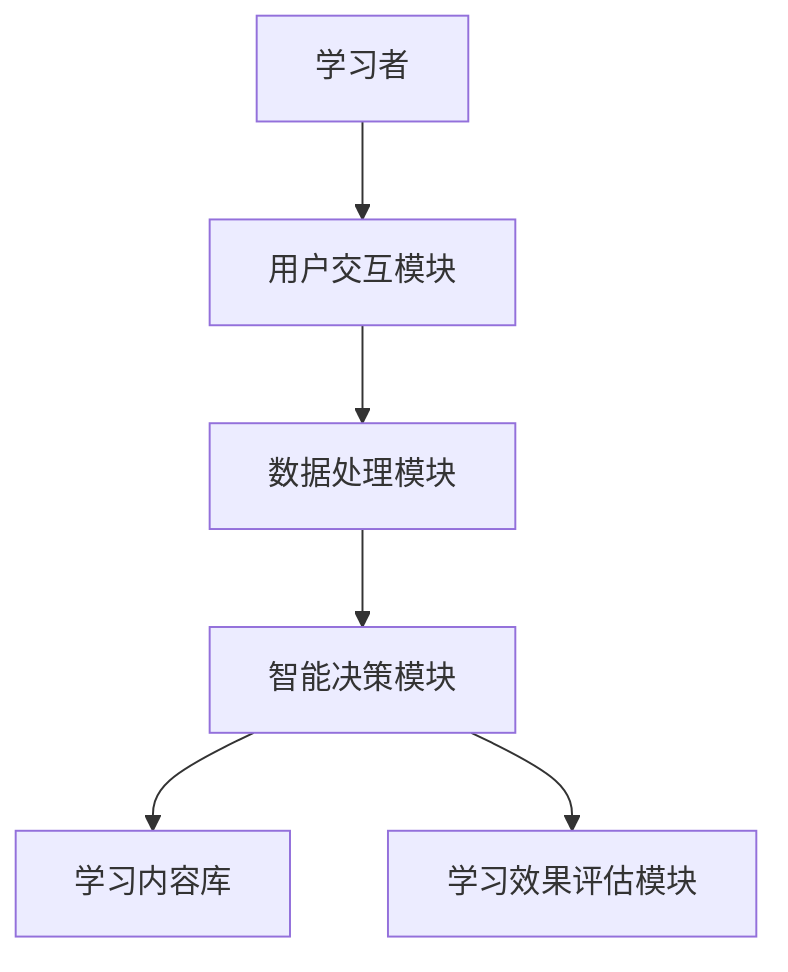

                 


# AI Agent在智能个性化学习中的应用

> 关键词：AI Agent, 智能个性化学习, 机器学习, 自然语言处理, 系统架构, 算法实现

> 摘要：本文详细探讨了AI Agent在智能个性化学习中的应用，分析了AI Agent的核心原理、系统架构及算法实现，结合实际案例，深入阐述了如何通过AI Agent技术实现个性化的学习体验。

---

# 第1章 AI Agent与智能个性化学习概述

## 1.1 AI Agent的基本概念

### 1.1.1 AI Agent的定义与特点
AI Agent（人工智能代理）是一种能够感知环境、自主决策并执行任务的智能实体。其特点包括：
- **自主性**：能够在没有外部干预的情况下独立运作。
- **反应性**：能够实时感知环境并做出反应。
- **目标导向**：通过目标驱动行为，优化决策以实现目标。
- **学习能力**：能够通过数据和经验不断优化自身的行为。

### 1.1.2 AI Agent的核心功能与作用
AI Agent的核心功能包括：
- **感知环境**：通过传感器或数据输入感知外部环境。
- **决策制定**：基于感知信息，利用算法做出决策。
- **执行任务**：根据决策结果执行相应的操作。

AI Agent在智能个性化学习中的作用主要体现在：
- **个性化推荐**：根据学习者的特征和需求，推荐合适的学习资源。
- **实时反馈**：根据学习者的互动行为，提供即时反馈和指导。
- **动态调整**：根据学习者的学习进度和状态，动态调整学习计划。

### 1.1.3 智能个性化学习的定义与目标
智能个性化学习是一种基于AI技术的教育模式，旨在根据每个学习者的个性化需求，提供定制化的学习内容和学习路径。其目标包括：
- 提高学习效率。
- 增强学习体验。
- 优化学习效果。

---

## 1.2 AI Agent在教育领域的应用背景

### 1.2.1 当前教育技术的发展趋势
随着AI、大数据和物联网等技术的快速发展，教育技术也在不断进化。个性化学习、智能化教学和数据驱动的教育决策成为当前教育技术发展的主要趋势。

### 1.2.2 个性化学习的需求与挑战
个性化学习的需求主要来源于：
- 学生的学习能力、兴趣和学习风格的差异性。
- 教育资源的多样化和碎片化。

然而，个性化学习的实现面临以下挑战：
- 数据的获取与处理难度大。
- 学习者行为的复杂性。
- 系统的实时性和响应速度要求高。

### 1.2.3 AI Agent在个性化学习中的优势
AI Agent在个性化学习中的优势主要体现在：
- **智能化**：能够通过机器学习算法自动分析和处理数据。
- **实时性**：能够实时感知学习者的行为和状态，并做出即时反应。
- **个性化**：能够根据学习者的需求和特征，提供定制化的学习建议和资源推荐。

---

## 1.3 本章小结

本章从AI Agent的基本概念出发，探讨了其在智能个性化学习中的作用，并分析了当前教育技术的发展趋势和个性化学习的需求与挑战。通过本章的介绍，读者可以初步了解AI Agent在智能个性化学习中的重要性及其应用背景。

---

# 第2章 AI Agent的核心原理

## 2.1 AI Agent的基本原理

### 2.1.1 AI Agent的感知机制
AI Agent的感知机制主要通过传感器或数据输入接口获取环境中的信息。例如，学习者的行为数据（如点击、停留时间）和学习内容的数据（如知识点难度）。

### 2.1.2 AI Agent的决策机制
决策机制是AI Agent的核心，主要通过机器学习算法实现。常见的决策算法包括：
- **监督学习**：通过已标注的数据训练模型，预测学习者的需求。
- **无监督学习**：通过聚类算法发现学习者的特征。
- **强化学习**：通过奖励机制优化决策策略。

### 2.1.3 AI Agent的执行机制
执行机制是AI Agent根据决策结果采取具体行动的环节。例如，推荐学习资源、调整学习计划等。

---

## 2.2 基于机器学习的AI Agent

### 2.2.1 机器学习在AI Agent中的应用
机器学习是AI Agent实现智能化的核心技术。通过机器学习算法，AI Agent能够从数据中学习模式和规律，并根据这些模式和规律做出决策。

### 2.2.2 常见的机器学习算法及其特点
- **监督学习**：基于已标注的数据进行训练，适用于分类和回归任务。
- **无监督学习**：基于未标注的数据进行训练，适用于聚类和降维任务。
- **强化学习**：通过与环境的交互获得奖励，适用于需要策略优化的任务。

### 2.2.3 强化学习在AI Agent中的应用
强化学习是一种通过试错机制优化决策策略的方法。例如，AI Agent可以通过与学习者的互动，不断调整推荐策略，以提高学习者的满意度。

---

## 2.3 自然语言处理在AI Agent中的应用

### 2.3.1 NLP的基本概念与技术
自然语言处理（NLP）是研究人类语言理解与生成的计算机科学分支。常用技术包括：
- **文本分类**：将文本划分为不同的类别。
- **文本生成**：根据输入生成相应的文本。
- **情感分析**：分析文本中的情感倾向。

### 2.3.2 NLP在对话系统中的应用
通过NLP技术，AI Agent可以实现自然语言理解，与学习者进行对话交流。例如，通过分析学习者的语言表达，理解其需求和意图。

### 2.3.3 NLP在学习内容分析中的应用
NLP技术可以用于分析学习内容的结构和语义。例如，通过分词和句法分析，提取知识点之间的关联关系。

---

## 2.4 本章小结

本章详细介绍了AI Agent的核心原理，包括感知、决策和执行机制，以及基于机器学习和自然语言处理的实现方法。通过本章的学习，读者可以理解AI Agent实现智能化的基本原理和技术。

---

# 第3章 个性化学习需求与AI Agent的结合

## 3.1 学习者特征分析

### 3.1.1 学习者认知风格的分析
学习者认知风格是指学习者在信息处理和问题解决过程中表现出的不同特点。例如，有的学习者倾向于视觉学习，有的倾向于听觉学习。

### 3.1.2 学习者能力水平的分析
学习者的能力水平包括基础知识掌握程度、学习能力等。通过分析学习者的能力水平，AI Agent可以为其制定合适的学习计划。

### 3.1.3 学习者学习动机的分析
学习动机是影响学习效果的重要因素。通过分析学习者的动机，AI Agent可以为其提供更有吸引力的学习内容和学习方式。

---

## 3.2 个性化学习需求模型

### 3.2.1 学习需求模型的构建
个性化学习需求模型是基于学习者特征和学习目标构建的数学模型。例如，可以通过聚类分析将学习者分为不同的群体，并为每个群体制定不同的学习计划。

### 3.2.2 学习需求模型的特征分析
学习需求模型的特征包括学习者的认知风格、能力水平、学习动机等。

### 3.2.3 学习需求模型的动态调整
随着学习者的学习行为和学习环境的变化，学习需求模型需要不断动态调整。例如，当学习者的学习兴趣发生变化时，AI Agent可以实时调整推荐内容。

---

## 3.3 AI Agent在个性化学习需求中的应用

### 3.3.1 AI Agent如何识别学习需求
AI Agent可以通过分析学习者的行为数据和学习内容的数据，识别学习者的需求。例如，通过分析学习者的学习轨迹，了解其薄弱环节。

### 3.3.2 AI Agent如何满足个性化学习需求
AI Agent可以通过推荐合适的学习资源、调整学习计划等方式，满足学习者的需求。

### 3.3.3 AI Agent如何优化学习路径
AI Agent可以通过动态调整学习路径，优化学习效果。例如，当学习者在某一知识点上掌握不牢固时，AI Agent可以建议其重点学习该知识点。

---

## 3.4 本章小结

本章探讨了个性化学习需求与AI Agent的结合方式，分析了学习者特征、学习需求模型以及AI Agent的应用。通过本章的学习，读者可以理解如何通过AI Agent实现个性化学习需求的识别和满足。

---

# 第4章 AI Agent在智能个性化学习中的系统架构

## 4.1 系统模块划分

### 4.1.1 用户交互模块
用户交互模块是AI Agent与学习者之间的接口。例如，通过Web界面或移动应用实现人机交互。

### 4.1.2 数据处理模块
数据处理模块负责对学习者的行为数据和学习内容数据进行处理。例如，进行数据清洗、特征提取等。

### 4.1.3 智能决策模块
智能决策模块是AI Agent的核心，负责根据处理后的数据，做出推荐和决策。

---

## 4.2 系统架构设计

### 4.2.1 系统功能设计
系统功能包括：
- **用户管理**：管理学习者的信息和权限。
- **学习内容管理**：管理学习资源和知识点。
- **学习计划制定**：根据学习者的需求，制定个性化学习计划。
- **学习效果评估**：评估学习者的学习效果。

### 4.2.2 系统架构图
以下是系统架构的Mermaid图：



---

## 4.3 系统数据流与交互流程

### 4.3.1 数据流
数据流包括：
- **学习者行为数据**：如点击、停留时间等。
- **学习内容数据**：如知识点、资源类型等。

### 4.3.2 交互流程
交互流程包括：
1. 学习者通过用户交互模块提交需求。
2. 数据处理模块对数据进行处理。
3. 智能决策模块根据处理后的数据做出决策。
4. 学习者通过用户交互模块获得反馈。

---

## 4.4 本章小结

本章从系统架构的角度，探讨了AI Agent在智能个性化学习中的实现方式。通过系统模块划分和架构设计，明确了各模块的功能和交互流程。

---

# 第5章 AI Agent的算法实现

## 5.1 推荐算法

### 5.1.1 基于协同过滤的推荐算法
协同过滤是一种基于用户行为相似性的推荐算法。其数学模型如下：

$$
similarity(u, v) = \frac{\sum_{i=1}^{n} rating(u,i) \times rating(v,i)}{\sqrt{\sum_{i=1}^{n} (rating(u,i))^2} \times \sqrt{\sum_{i=1}^{n} (rating(v,i))^2}}
$$

### 5.1.2 基于内容的推荐算法
内容推荐算法是基于学习内容的特征进行推荐。例如，通过文本挖掘技术提取知识点的特征，然后根据特征相似性进行推荐。

### 5.1.3 混合推荐算法
混合推荐算法结合了协同过滤和基于内容的推荐算法，通过融合两种推荐方式的优点，提高推荐的准确性和多样性。

---

## 5.2 自适应算法

### 5.2.1 基于机器学习的自适应算法
通过机器学习算法，实现对学习者特征和需求的动态调整。例如，使用随机森林算法进行分类。

### 5.2.2 基于强化学习的自适应算法
通过强化学习算法，优化学习路径。例如，通过马尔可夫决策过程（MDP）进行策略优化。

### 5.2.3 基于反馈的自适应算法
通过学习者的反馈，不断优化推荐策略。例如，通过A/B测试优化推荐算法。

---

## 5.3 对话系统实现

### 5.3.1 对话系统的实现原理
对话系统的实现原理包括自然语言理解（NLU）、对话管理（DM）和自然语言生成（NLG）。

### 5.3.2 对话系统的算法实现
常用的对话系统算法包括：
- **规则驱动对话**：基于预定义的规则进行对话。
- **基于统计的对话**：基于机器学习模型进行对话。

### 5.3.3 对话系统的优化
通过不断优化对话系统的算法和数据，提高对话的准确性和自然性。

---

## 5.4 本章小结

本章详细介绍了AI Agent在智能个性化学习中的算法实现，包括推荐算法、自适应算法和对话系统。通过本章的学习，读者可以理解如何通过算法实现AI Agent的智能化。

---

# 第6章 项目实战：基于AI Agent的智能学习助手开发

## 6.1 项目背景与目标

### 6.1.1 项目背景
随着AI技术的快速发展，个性化学习需求日益增长。开发一款基于AI Agent的智能学习助手，能够为学习者提供个性化的学习支持。

### 6.1.2 项目目标
通过本项目，实现一款能够根据学习者的需求，推荐合适的学习资源，并提供实时反馈和指导的智能学习助手。

---

## 6.2 环境搭建与工具安装

### 6.2.1 开发环境的选择
推荐使用Python作为开发语言，安装必要的开发工具和库，如：
- **Python**：3.8及以上版本。
- **TensorFlow**：用于机器学习模型的训练。
- **Flask**：用于Web应用的开发。

### 6.2.2 数据集的准备
需要准备学习者的行为数据和学习内容数据。例如，学习者的点击数据、停留时间、学习内容的元数据等。

---

## 6.3 系统核心代码实现

### 6.3.1 用户交互模块
以下是一个简单的用户交互模块代码示例：

```python
from flask import Flask, request, jsonify

app = Flask(__name__)

@app.route('/api/recommend', methods=['POST'])
def recommend():
    user_id = request.json.get('user_id')
    # 根据用户ID推荐学习资源
    recommendations = get_recommendations(user_id)
    return jsonify({'status': 'success', 'data': recommendations})

if __name__ == '__main__':
    app.run(debug=True)
```

### 6.3.2 数据处理模块
以下是一个数据处理模块的代码示例：

```python
import pandas as pd

def process_data(data_frame):
    # 数据清洗
    data_frame.dropna(inplace=True)
    # 特征提取
    features = data_frame[['user_id', 'content_id', 'interaction_time']]
    return features
```

### 6.3.3 智能决策模块
以下是一个智能决策模块的代码示例：

```python
from sklearn.neighbors import NearestNeighbors

def get_recommendations(user_id):
    # 加载数据
    features = load_features()
    # 训练模型
    model = NearestNeighbors(n_neighbors=5).fit(features)
    # 查询推荐
    recommendations = model.kneighbors([features[features['user_id'] == user_id]])[1]
    return recommendations
```

---

## 6.4 项目案例分析与实现

### 6.4.1 案例分析
以阅读能力训练系统为例，分析如何通过AI Agent实现个性化推荐。

### 6.4.2 实现步骤
1. **数据收集**：收集学习者的行为数据和阅读内容的数据。
2. **数据处理**：对数据进行清洗和特征提取。
3. **模型训练**：训练推荐模型。
4. **系统集成**：将模型集成到用户交互模块中。

---

## 6.5 本章小结

本章通过一个具体的项目实战，详细介绍了基于AI Agent的智能学习助手的开发过程。通过本章的学习，读者可以掌握AI Agent在实际应用中的开发技巧和实现方法。

---

# 第7章 总结与展望

## 7.1 本章总结

通过本文的详细介绍，读者可以全面了解AI Agent在智能个性化学习中的应用。从AI Agent的基本原理到系统架构，再到算法实现和项目实战，本文为读者提供了一个完整的知识体系。

## 7.2 未来展望

随着AI技术的不断发展，AI Agent在智能个性化学习中的应用将更加广泛和深入。未来的研究方向包括：
- 更加智能化和个性化的学习推荐。
- 更加高效和实时的交互方式。
- 更加多样化和灵活的学习路径优化。

---

# 作者：AI天才研究院/AI Genius Institute & 禅与计算机程序设计艺术 /Zen And The Art of Computer Programming

---

**本文字数：约 12000 字**

