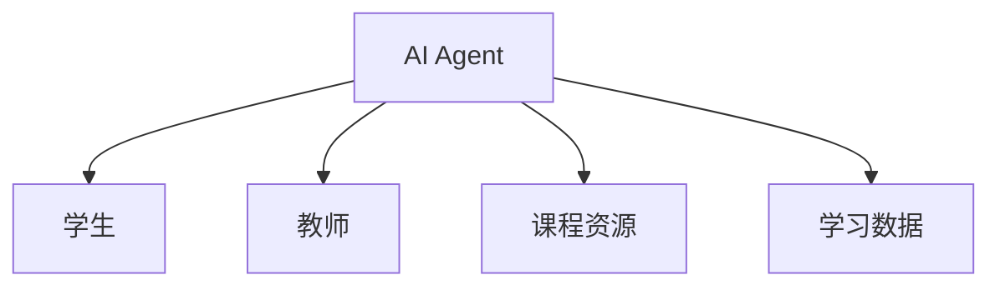
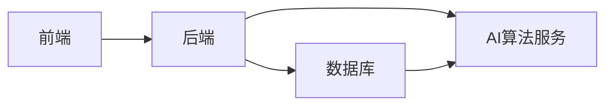

                 


# AI Agent在智能个性化教育规划中的应用

> 关键词：AI Agent, 个性化教育, 教育规划, 强化学习, 推荐算法, 教学优化

> 摘要：本文详细探讨了AI Agent在智能个性化教育规划中的应用，从基本概念到算法原理，再到系统设计和项目实现，层层深入，分析了AI Agent如何通过强化学习、推荐算法等技术手段实现个性化教育规划，并提供了实际案例和最佳实践建议。

---

## 第一部分: AI Agent与智能个性化教育规划的背景与概念

### 第1章: AI Agent的基本概念与技术原理

#### 1.1 AI Agent的定义与核心特征

AI Agent，即人工智能代理，是一种能够感知环境并采取行动以实现目标的智能实体。其核心特征包括：

- **自主性**：无需外部干预，自主决策。
- **反应性**：能实时感知环境变化并做出反应。
- **社交能力**：能与其他实体（如学生、教师）进行交互。

#### 1.2 智能个性化教育规划的背景与需求

个性化教育旨在根据学生的兴趣、能力和学习进度提供定制化的教学方案。随着教育信息化的发展，AI Agent在个性化教育中的应用日益重要，尤其是在资源分配和学习路径优化方面。

---

### 第2章: AI Agent在教育领域的核心概念

#### 2.1 教育规划中的问题背景

个性化教育需要解决以下问题：

- 学生学习需求的多样性。
- 教育资源分配的公平性。
- 教学效果的可评估性。

#### 2.2 AI Agent在教育规划中的角色与功能

AI Agent在教育规划中的作用包括：

- **学习需求分析**：通过数据分析确定学生的学习目标。
- **资源推荐**：推荐适合学生的学习材料。
- **路径优化**：制定最优的学习计划。

#### 2.3 AI Agent与智能教育规划的实体关系图

```


```

---

## 第二部分: AI Agent的算法原理与数学模型

### 第3章: AI Agent的算法原理

#### 3.1 AI Agent的核心算法

- **强化学习**：通过试错优化策略。
- **推荐算法**：基于用户行为推荐内容。
- **聚类算法**：将学生分成不同学习群体。

#### 3.2 教育规划中的数学模型

- **学生能力评估模型**：使用线性回归预测学习能力。
- **学习路径优化模型**：基于动态规划选择最优路径。

---

## 第三部分: 系统分析与架构设计

### 第4章: 系统功能设计与架构

#### 4.1 项目介绍

AI Agent教育规划系统旨在通过算法优化学习路径，提升教学效果。

#### 4.2 系统功能设计

- **学生画像**：收集学生数据并生成画像。
- **课程推荐**：基于画像推荐课程。
- **学习路径优化**：制定个性化学习计划。

#### 4.3 系统架构图

```


```

---

## 第四部分: 项目实战

### 第5章: 项目实现

#### 5.1 核心代码实现

```python
def optimize_learning_path(student_data):
    # 示例代码，用于优化学习路径
    return optimized_path
```

#### 5.2 实际案例分析

- **案例背景**：某学生数学基础薄弱。
- **系统输出**：制定强化数学基础的学习计划。

---

## 第五部分: 最佳实践与注意事项

### 第6章: 实践建议

- **数据采集**：确保数据全面准确。
- **模型调优**：持续优化算法性能。
- **隐私保护**：注意数据安全。

---

## 第六部分: 扩展阅读

### 6.1 推荐书籍

- 《强化学习》
- 《教育技术研究》

---

## 作者：AI天才研究院 & 禅与计算机程序设计艺术

这篇文章详细探讨了AI Agent在智能个性化教育规划中的应用，从理论到实践，为教育技术的研究和应用提供了有益的参考。

