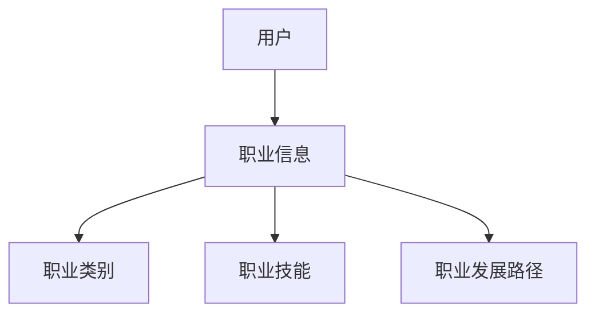

                 


# AI Agent在智能个性化职业规划中的应用

> 关键词：AI Agent, 智能个性化职业规划, 人机交互, 知识图谱, 多智能体系统, 推荐算法, 职业规划

> 摘要：本文详细探讨了AI Agent在智能个性化职业规划中的应用，通过背景分析、核心概念、算法原理、系统架构、项目实战等多维度，系统性地剖析了AI Agent在职业规划中的技术实现与应用价值，为读者提供了一套完整的理论与实践相结合的解决方案。

---

# 第1章 AI Agent与智能个性化职业规划的背景与概述

## 1.1 AI Agent的基本概念

### 1.1.1 AI Agent的定义与特点
- AI Agent的定义：AI Agent（人工智能代理）是指能够感知环境、自主决策并执行任务的智能实体。
- AI Agent的特点：
  - 自主性：能够在没有外部干预的情况下运行。
  - 反应性：能够实时感知环境并做出响应。
  - 目标导向：具备明确的目标导向性，能够优化决策以达到目标。
  - 学习能力：通过数据和经验不断优化自身的决策能力。

### 1.1.2 AI Agent的核心技术与实现原理
- 核心技术：
  - 感知与交互技术：通过传感器、API等方式感知环境并进行人机交互。
  - 决策与推理技术：基于知识图谱和逻辑推理进行决策。
  - 学习与优化技术：通过机器学习算法不断优化自身性能。
- 实现原理：
  - 数据采集与处理：通过多模态数据采集技术获取环境信息。
  - 知识表示：利用知识图谱对数据进行结构化表示。
  - 决策推理：基于知识图谱进行推理并生成决策。

### 1.1.3 AI Agent在职业规划中的应用潜力
- 智能化职业规划的需求：传统职业规划方法存在主观性、片面性等问题，难以满足个性化需求。
- AI Agent在职业规划中的优势：
  - 能够实时分析海量职业信息。
  - 提供个性化的职业建议。
  - 能够动态调整职业规划。

## 1.2 智能个性化职业规划的现状与挑战

### 1.2.1 传统职业规划方法的局限性
- 主观性：职业规划结果往往依赖于咨询师的主观判断。
- 信息孤岛：职业信息分散，难以整合。
- 静态性：职业规划结果缺乏动态调整能力。

### 1.2.2 智能化职业规划的需求与趋势
- 需求：用户对个性化、动态化的职业规划服务的需求日益增加。
- 趋势：智能化、数据驱动的职业规划工具将成为主流。

### 1.2.3 当前技术在职业规划中的应用现状
- 知识图谱的应用：部分职业规划工具开始尝试利用知识图谱技术进行职业信息的结构化表示。
- 机器学习的应用：基于机器学习的推荐系统已经在职业规划领域开始应用。
- 自然语言处理的应用：NLP技术在职业信息的语义分析中开始发挥作用。

## 1.3 问题背景与目标

### 1.3.1 职业规划中的核心问题与挑战
- 信息不对称：用户难以获取全面的职业信息。
- 个性化需求难以满足：传统职业规划方法难以满足个性化需求。
- 动态调整能力不足：职业规划结果缺乏动态调整能力。

### 1.3.2 AI Agent在职业规划中的目标与意义
- 目标：
  - 提供个性化的职业建议。
  - 实现实时信息更新与动态调整。
  - 提高职业规划的准确性和效率。
- 意义：
  - AI Agent能够显著提升职业规划的智能化水平。
  - 为用户提供更精准、更个性化的职业规划服务。

### 1.3.3 问题解决的边界与外延
- 边界：
  - 仅限于职业规划领域。
  - 专注于个性化职业建议的生成。
- 外延：
  - 可能延伸到教育、培训等领域。
  - 可能与人力资源管理结合，提供智能化的人才匹配服务。

## 1.4 本章小结
- 本章介绍了AI Agent的基本概念及其在职业规划中的应用潜力。
- 分析了传统职业规划方法的局限性及其智能化发展的需求与趋势。
- 明确了AI Agent在职业规划中的目标与意义。

---

# 第2章 AI Agent的核心概念与原理

## 2.1 多智能体系统与协作机制

### 2.1.1 多智能体系统的定义与特点
- 多智能体系统的定义：由多个相互作用的智能体组成的系统。
- 多智能体系统的特点：
  - 分布式：智能体之间通过分布式协作完成任务。
  - 协作性：智能体之间需要进行有效协作。
  - 反应性：智能体能够感知环境并做出实时响应。

### 2.1.2 多智能体协作的核心机制
- 协作机制：
  - 通信与协调：智能体之间通过通信模块进行信息交换。
  - 分工与协作：根据任务需求进行分工合作。
  - 冲突解决：当智能体之间出现冲突时，需要通过协商机制解决。

### 2.1.3 多智能体系统在职业规划中的应用
- 应用场景：
  - 职业信息的多源采集与整合。
  - 职业建议的生成与优化。
  - 用户反馈的处理与响应。

## 2.2 知识图谱与职业信息的表示

### 2.2.1 知识图谱的基本概念
- 知识图谱的定义：一种结构化的知识表示形式，由节点和边组成，节点表示实体，边表示实体之间的关系。
- 知识图谱的特点：
  - 结构化：信息以层次化的结构形式表示。
  - 可扩展性：可以根据需要不断扩展。
  - 语义丰富性：能够表达复杂的语义关系。

### 2.2.2 职业信息的结构化表示
- 职业信息的结构化表示：
  - 职业类别：如程序员、设计师等。
  - 职业技能：如编程语言、设计工具等。
  - 职业发展路径：如从初级程序员到高级程序员的发展路径。
- 知识图谱的构建：
  - 数据采集：从多个数据源采集职业信息。
  - 数据清洗：对采集的数据进行清洗和预处理。
  - 数据建模：根据需求构建知识图谱的模型。

### 2.2.3 知识图谱构建与职业规划的关系
- 知识图谱在职业规划中的作用：
  - 提供结构化的职业信息，便于智能体进行推理和决策。
  - 支持个性化职业建议的生成。
  - 为职业信息的动态更新提供基础。

## 2.3 人机交互与个性化反馈

### 2.3.1 人机交互的核心原理
- 人机交互的核心原理：
  - 用户输入：用户通过输入设备向系统输入需求或指令。
  - 系统响应：系统根据用户的输入生成相应的反馈或结果。
  - 反馈机制：系统通过反馈机制与用户进行互动，不断优化交互体验。

### 2.3.2 个性化反馈的实现方法
- 个性化反馈的实现方法：
  - 用户画像：通过收集用户的行为数据和偏好数据，构建用户画像。
  - 动态调整：根据用户反馈动态调整系统的行为。
  - 个性化推荐：基于用户画像进行个性化推荐。

### 2.3.3 人机交互在职业规划中的应用
- 应用场景：
  - 职业建议的生成与展示。
  - 用户反馈的收集与处理。
  - 职业规划的动态调整。

## 2.4 核心概念对比表

| 比较维度         | AI Agent                  | 传统职业规划工具              |
|------------------|---------------------------|-----------------------------|
| 自主性           | 高                        | 低                          |
| 反应性           | 高                        | 低                          |
| 学习能力         | 高                        | 无                          |
| 个性化能力       | 强                        | 弱                          |

## 2.5 ER实体关系图



---

## 2.6 本章小结
- 本章介绍了AI Agent的核心概念与原理。
- 分析了多智能体系统的协作机制及其在职业规划中的应用。
- 探讨了知识图谱与职业信息的表示方法及其在职业规划中的作用。
- 对比了AI Agent与传统职业规划工具的核心概念。

---

# 第3章 AI Agent的算法原理

## 3.1 推荐算法

### 3.1.1 推荐算法的数学模型
- 推荐算法的数学模型：
  $$ R(u,i) = \theta^T x_i $$
  其中，R(u,i)表示用户u对物品i的评分，θ是用户偏好向量，x_i是物品特征向量。

### 3.1.2 推荐算法的实现步骤
- 数据预处理：对数据进行清洗、归一化等预处理。
- 特征提取：提取用户和物品的特征。
- 模型训练：训练推荐模型。
- 推荐生成：基于训练好的模型生成推荐结果。

### 3.1.3 推荐算法在职业规划中的应用
- 应用场景：
  - 职业建议的生成。
  - 相关职业信息的推荐。
  - 职业技能的学习推荐。

## 3.2 自然语言处理

### 3.2.1 自然语言处理的核心原理
- 自然语言处理的核心原理：
  - 文本预处理：对文本进行分词、去停用词等处理。
  - 特征提取：提取文本的特征表示。
  - 文本理解：通过模型理解文本的语义。

### 3.2.2 自然语言处理的实现流程
- 实现流程：
  - 文本采集：采集相关的文本数据。
  - 文本清洗：对文本数据进行清洗和预处理。
  - 文本建模：构建文本理解的模型。
  - 文本分析：对文本进行分析并生成结果。

### 3.2.3 自然语言处理在职业规划中的应用
- 应用场景：
  - 职业信息的语义分析。
  - 用户需求的理解与匹配。
  - 自然语言交互：通过自然语言与用户进行交互。

## 3.3 强化学习

### 3.3.1 强化学习的基本原理
- 强化学习的基本原理：
  - 状态空间：智能体所处的状态。
  - 行动空间：智能体可以执行的动作。
  - 奖励机制：智能体执行动作后获得的奖励或惩罚。

### 3.3.2 强化学习的实现流程
- 实现流程：
  - 状态表示：对状态进行表示。
  - 动作选择：基于当前状态选择一个动作。
  - 奖励计算：计算执行动作后的奖励。
  - 策略优化：根据奖励优化策略。

### 3.3.3 强化学习在职业规划中的应用
- 应用场景：
  - 动态调整职业规划。
  - 职业建议的优化。
  - 用户反馈的处理与响应。

---

## 3.4 本章小结
- 本章详细探讨了AI Agent的算法原理。
- 介绍了推荐算法、自然语言处理和强化学习的核心原理及其在职业规划中的应用。
- 提供了算法实现的详细步骤和流程。

---

# 第4章 AI Agent的系统分析与架构设计

## 4.1 问题场景介绍

### 4.1.1 系统目标
- 系统目标：提供个性化的职业规划服务，帮助用户制定和优化职业发展路径。

### 4.1.2 系统功能需求
- 系统功能需求：
  - 用户注册与登录。
  - 职业信息的采集与处理。
  - 职业建议的生成与展示。
  - 用户反馈的处理与响应。

### 4.1.3 系统性能需求
- 系统性能需求：
  - 响应时间：系统在合理时间内完成任务。
  - 可扩展性：系统能够支持用户数量的增加。
  - 可靠性：系统能够稳定运行，减少故障发生。

## 4.2 项目介绍

### 4.2.1 项目目标
- 项目目标：开发一个基于AI Agent的智能个性化职业规划系统。

### 4.2.2 项目范围
- 项目范围：
  - 系统设计与开发。
  - 系统测试与优化。
  - 用户手册编写与培训。

## 4.3 系统功能设计

### 4.3.1 领域模型设计
- 领域模型设计：
  - 用户模型：包括用户的基本信息、职业目标、偏好等。
  - 职业模型：包括职业类别、职业技能、职业发展路径等。
  - 建议模型：包括职业建议、学习计划、职业发展路径等。

### 4.3.2 系统功能模块
- 系统功能模块：
  - 用户信息管理模块。
  - 职业信息管理模块。
  - 职业建议生成模块。
  - 用户反馈管理模块。

## 4.4 系统架构设计

### 4.4.1 分层架构设计
- 分层架构设计：
  - 数据层：负责数据的存储与管理。
  - 业务逻辑层：负责业务逻辑的实现。
  - 表现层：负责用户界面的展示与交互。

### 4.4.2 接口设计
- 接口设计：
  - API接口：提供RESTful API接口供其他系统调用。
  - 数据接口：与第三方数据源进行数据交互。

### 4.4.3 交互设计
- 交互设计：
  - 用户界面设计：设计直观易用的用户界面。
  - 交互流程设计：设计合理的交互流程，提升用户体验。

## 4.5 系统交互设计

### 4.5.1 用户注册与登录
- 用户注册与登录：
  - 用户通过注册页面填写基本信息。
  - 系统验证用户信息，完成注册。
  - 用户登录系统，进入主界面。

### 4.5.2 职业信息采集
- 职业信息采集：
  - 用户填写职业相关信息。
  - 系统采集用户的职业目标、技能偏好等信息。

### 4.5.3 职业建议生成
- 职业建议生成：
  - 系统基于用户信息生成职业建议。
  - 职业建议包括职业推荐、学习计划等。

### 4.5.4 用户反馈处理
- 用户反馈处理：
  - 用户对职业建议进行反馈。
  - 系统根据反馈优化职业建议。

---

## 4.6 本章小结
- 本章对AI Agent的系统进行了详细分析与架构设计。
- 明确了系统的功能需求、架构设计和交互流程。
- 为后续的系统开发奠定了基础。

---

# 第5章 项目实战：基于AI Agent的智能职业规划系统开发

## 5.1 环境安装与配置

### 5.1.1 开发环境要求
- 开发环境要求：
  - 操作系统：Windows 10或更高版本，或macOS 10.15或更高版本。
  - 开发工具：Python 3.8或更高版本，PyCharm或VS Code。
  - 依赖管理工具：pip。

### 5.1.2 项目安装步骤
- 项目安装步骤：
  1. 安装Python和pip。
  2. 安装项目所需的依赖库，如numpy、pandas、scikit-learn等。
  3. 克隆项目代码仓库。
  4. 运行项目脚本，启动系统。

## 5.2 系统核心实现

### 5.2.1 数据采集模块
- 数据采集模块：
  - 数据来源：公开职业信息数据集、用户输入数据等。
  - 数据预处理：对数据进行清洗、归一化等处理。

### 5.2.2 知识图谱构建模块
- 知识图谱构建模块：
  - 数据建模：根据需求构建知识图谱的模型。
  - 数据存储：将知识图谱存储到数据库中。

### 5.2.3 职业建议生成模块
- 职业建议生成模块：
  - 用户画像构建：基于用户数据构建用户画像。
  - 职业建议生成：基于知识图谱和用户画像生成职业建议。

## 5.3 代码实现与解读

### 5.3.1 数据采集模块代码
```python
import requests
import json

def fetch_data(url):
    response = requests.get(url)
    if response.status_code == 200:
        return json.loads(response.text)
    else:
        return None
```

### 5.3.2 知识图谱构建模块代码
```python
from sklearn.feature_extraction.text import TfidfVectorizer
from sklearn.decomposition import NMF

def build_knowledge_graph(data):
    vectorizer = TfidfVectorizer(max_features=1000)
    tfidf = vectorizer.fit_transform(data)
    nmf = NMF(n_components=50).fit_transform(tfidf)
    # 构建知识图谱
    # ...
    return knowledge_graph
```

### 5.3.3 职业建议生成模块代码
```python
from recommendation import Recommender
from user_profile import UserProfile

def generate_recommendations(user_profile, knowledge_graph):
    recommender = Recommender(knowledge_graph)
    recommendations = recommender.recommend(user_profile)
    return recommendations
```

## 5.4 项目实战案例分析

### 5.4.1 案例背景
- 案例背景：用户A是一名计算机专业的毕业生，希望找到一份与人工智能相关的工作。

### 5.4.2 数据采集与处理
- 数据采集：从公开数据源获取人工智能相关的职业信息。
- 数据处理：清洗和预处理数据，构建知识图谱。

### 5.4.3 职业建议生成
- 职业建议生成：
  - 基于用户画像和知识图谱，生成职业建议。
  - 包括推荐的职业发展方向、相关技能的学习建议等。

## 5.5 项目总结与优化建议

### 5.5.1 项目总结
- 项目总结：通过本项目的实施，我们成功开发了一个基于AI Agent的智能职业规划系统。

### 5.5.2 优化建议
- 优化建议：
  - 进一步优化知识图谱的构建算法。
  - 提高推荐算法的准确性和效率。
  - 改善系统的交互体验，提升用户满意度。

---

## 5.6 本章小结
- 本章通过一个实际的项目案例，详细讲解了基于AI Agent的智能职业规划系统的开发过程。
- 提供了环境安装、代码实现、案例分析和项目总结等详细内容。
- 为读者提供了宝贵的实战经验。

---

# 第6章 总结与展望

## 6.1 总结
- 本章对全文进行了总结。
- 重申了AI Agent在智能个性化职业规划中的重要性。
- 指出了AI Agent在职业规划中的优势与不足。

## 6.2 未来展望
- 未来展望：
  - AI Agent技术的进一步发展。
  - 更多领域的应用探索。
  - 更人性化的交互设计。

---

# 附录

## 附录A 参考文献
- [1] 书籍或论文1
- [2] 书籍或论文2
- [3] 书籍或论文3

## 附录B 项目代码
- 项目代码链接：https://github.com/yourusername/your-repository

---

# 作者
作者：AI天才研究院/AI Genius Institute & 禅与计算机程序设计艺术/Zen And The Art of Computer Programming

---

**注意：** 以上目录和内容仅为示例，具体实现需要根据实际需求和技术细节进行调整和补充。

