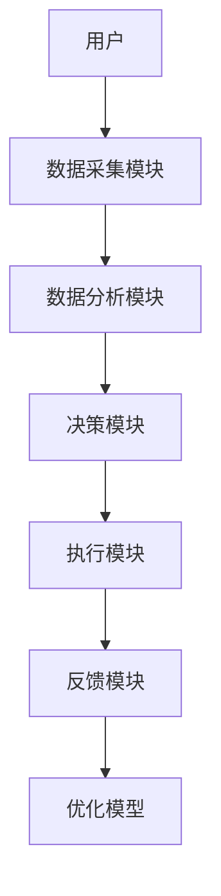
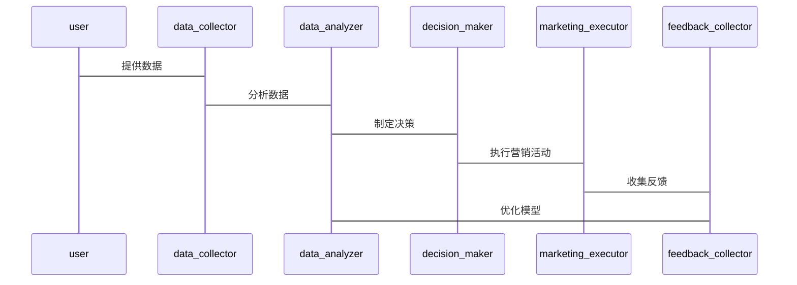

                 

<think>
好的，现在我要撰写一篇关于《AI Agent在智能个性化营销中的应用》的技术博客。首先，我需要理解AI Agent和智能个性化营销的基本概念。AI Agent，即人工智能代理，能够在不需要人类干预的情况下执行任务，它们利用机器学习、自然语言处理等技术来分析数据并做出决策。智能个性化营销则是通过利用这些技术，为每个用户提供量身定制的营销方案，以提高转化率和客户满意度。

接下来，我需要了解AI Agent在营销中的具体应用。这可能包括客户细分、预测客户行为、自动化营销活动等。比如，AI Agent可以通过分析客户的购买历史和浏览行为，预测他们可能感兴趣的产品，并自动触发相应的营销策略。

然后，我需要深入探讨AI Agent的核心原理。这包括数据采集与分析、决策制定和执行反馈。AI Agent的数据来源可能包括网站点击流数据、社交媒体互动、客户数据库等。这些数据通过机器学习模型进行分析，生成客户画像和需求预测。决策模块则基于这些分析结果，制定个性化的营销策略，例如推荐特定产品或发送定制优惠券。执行模块则负责将这些决策转化为实际的营销行动，如发送邮件或展示广告。

接下来，我需要考虑系统的架构设计。这部分可能需要使用Mermaid图来展示系统的各个模块及其交互。系统架构可能包括数据采集模块、数据分析模块、决策模块、执行模块和反馈模块。每个模块都有其特定的功能，例如数据采集模块负责收集客户数据，分析模块利用这些数据进行建模和预测，决策模块根据预测结果制定策略，执行模块将策略转化为实际操作，最后反馈模块收集执行结果以优化后续决策。

在算法原理部分，我需要详细讲解推荐算法和自然语言处理技术。例如，协同过滤算法用于推荐系统，它基于用户过去的购买行为和相似用户的偏好来预测用户的兴趣。此外，深度学习模型如神经网络也可以用于更复杂的模式识别任务。我需要使用Mermaid图来展示这些算法的流程，并提供Python代码示例，以便读者理解实现过程。

项目实战部分，我需要指导读者如何安装必要的库，如TensorFlow、Scikit-learn等，并展示如何实现一个简单的AI Agent营销系统。这可能包括数据预处理、模型训练和部署等步骤。通过实际案例分析，读者可以更好地理解AI Agent在实际营销中的应用，并学习如何优化系统以提高效果。

最后，我需要总结整个内容，并展望未来的发展趋势。强调AI Agent在智能营销中的重要性，并提醒读者在实际应用中需要注意的事项，如数据隐私和模型泛化能力等。同时，提供一些最佳实践的建议，帮助读者更好地实施AI Agent驱动的营销策略。

通过以上步骤，我将逐步构建出一篇结构清晰、内容详实的技术博客，全面介绍AI Agent在智能个性化营销中的应用。
</think>

# AI Agent在智能个性化营销中的应用

> 关键词：AI Agent, 智能个性化营销, 机器学习, 数据分析, 推荐系统, 自然语言处理, 营销自动化

> 摘要：本文深入探讨AI Agent在智能个性化营销中的应用，涵盖从基础概念到系统架构的各个方面，结合实际案例和算法原理，帮助读者全面理解并掌握AI Agent在现代营销中的核心作用和实现方法。

---

## 第一章：AI Agent与智能个性化营销的背景与概念

### 1.1 AI Agent的基本概念

#### 1.1.1 AI Agent的定义与特点
AI Agent（人工智能代理）是指能够感知环境、自主决策并执行任务的智能实体。AI Agent的特点包括智能性、自主性、反应性、社会性和学习性。它们能够通过传感器或数据接口获取信息，并利用内部算法进行分析和决策。

#### 1.1.2 AI Agent的核心功能与应用场景
AI Agent的核心功能包括数据采集与分析、决策制定和行动执行。应用场景广泛，如个性化推荐、自动化客户服务、精准广告投放等。例如，电商网站中的推荐系统就是一个典型的AI Agent应用。

#### 1.1.3 AI Agent与传统营销工具的对比
与传统营销工具相比，AI Agent具有更高的智能化和自动化能力。传统营销工具如邮件营销、短信营销等需要人工设置规则，而AI Agent能够根据实时数据动态调整策略，提供更个性化的服务。

### 1.2 智能个性化营销的背景与重要性

#### 1.2.1 数字营销的演变历程
从传统广告到精准营销，再到智能个性化营销，数字营销经历了多个阶段的发展。随着技术的进步，营销方式逐渐从批量推送转向个性化定制。

#### 1.2.2 个性化营销的定义与目标
个性化营销是以客户为中心，根据客户的个性化需求提供定制化的产品和服务。其目标是提高客户满意度和忠诚度，同时提升营销效果和转化率。

#### 1.2.3 智能个性化营销的优势与挑战
优势包括提高效率、降低成本、提升客户体验等。然而，技术复杂性、数据隐私和模型泛化能力不足是当前面临的主要挑战。

### 1.3 AI Agent在智能个性化营销中的作用

#### 1.3.1 AI Agent如何实现个性化营销
AI Agent通过收集和分析客户数据，利用机器学习模型预测客户行为和偏好，制定个性化的营销策略并执行相应的营销活动。

#### 1.3.2 AI Agent在营销中的核心价值
AI Agent能够实时分析数据，快速调整策略，提供精准的营销方案，从而提高转化率和客户满意度。同时，它们能够处理大量数据，节省人力成本。

#### 1.3.3 案例分析：AI Agent在实际营销中的应用
例如，电商平台上，AI Agent可以根据用户的浏览和购买历史推荐相关产品，提升用户购买意愿。

---

## 第二章：AI Agent的核心原理与系统架构

### 2.1 AI Agent的核心原理

#### 2.1.1 AI Agent的感知、决策与执行模块
- **感知模块**：通过传感器或数据接口获取环境信息，如用户行为数据、市场趋势等。
- **决策模块**：利用机器学习算法分析数据，制定最优决策。
- **执行模块**：根据决策结果执行相应的行动，如发送邮件、展示广告等。

#### 2.1.2 AI Agent的核心算法与技术
包括机器学习（如协同过滤、深度学习）、自然语言处理（NLP）、数据挖掘等技术。这些算法帮助AI Agent理解和预测用户需求。

#### 2.1.3 AI Agent与智能系统的协同工作
AI Agent需要与其他系统（如CRM、广告平台）协同工作，实现数据共享和任务协作。

### 2.2 智能个性化营销的系统架构

#### 2.2.1 系统功能模块设计
- **数据采集模块**：收集用户行为数据。
- **数据分析模块**：利用机器学习模型进行数据建模。
- **决策模块**：制定个性化营销策略。
- **执行模块**：执行营销活动。
- **反馈模块**：收集执行结果并优化模型。

#### 2.2.2 系统架构设计（Mermaid图）


#### 2.2.3 数据流与交互流程
数据从用户端流入系统，经过分析和决策后，触发相应的营销活动，并将结果反馈给系统以优化后续操作。

---

## 第三章：AI Agent在智能个性化营销中的算法原理

### 3.1 推荐系统算法

#### 3.1.1 协同过滤算法（Collaborative Filtering）
协同过滤是一种常见的推荐算法，分为基于用户的协同过滤和基于物品的协同过滤。例如，基于用户的协同过滤会找到与当前用户相似的用户群体，推荐他们喜欢的产品。

#### 3.1.2 基于内容的推荐（Content-Based Filtering）
基于内容的推荐算法通过分析产品的属性和用户的历史偏好，推荐与用户兴趣相符的产品。

#### 3.1.3 深度学习模型（Neural Networks）
深度学习模型如神经网络可以用于更复杂的推荐任务，通过学习高维特征来提高推荐的准确性。

#### 3.1.4 推荐算法的实现代码（Python示例）
```python
from sklearn.metrics.pairwise import cosine_similarity

# 假设用户-物品矩阵为X
X = ...  # 用户-物品矩阵

# 计算相似度矩阵
similarity_matrix = cosine_similarity(X.T)

# 找出最相似的用户
user_id = ...  # 当前用户ID
similar_users = similarity_matrix[user_id]

# 推荐物品
recommended_items = similar_users.argsort()[-3:][::-1]
```

### 3.2 自然语言处理技术

#### 3.2.1 词嵌入（Word Embedding）
词嵌入技术如Word2Vec可以将词语转换为低维向量，用于分析文本数据。

#### 3.2.2 情感分析（Sentiment Analysis）
情感分析用于判断文本中的情感倾向，帮助企业了解用户对产品或服务的评价。

#### 3.2.3 基于NLP的客户意图识别
通过分析客户的文本数据，识别客户的购买意图，从而制定相应的营销策略。

#### 3.2.4 NLP算法的实现代码（Python示例）
```python
from tensorflow.keras.models import Sequential
from tensorflow.keras.layers import Dense, Embedding, GlobalAveragePooling1D

model = Sequential()
model.add(Embedding(vocab_size, embedding_dim, input_length=max_len))
model.add(GlobalAveragePooling1D())
model.add(Dense(1, activation='sigmoid'))
model.compile(optimizer='adam', loss='binary_crossentropy', metrics=['accuracy'])
```

---

## 第四章：AI Agent的项目实战与系统实现

### 4.1 项目实战

#### 4.1.1 环境安装与配置
安装必要的库如TensorFlow、Scikit-learn、NLTK等，并配置开发环境。

#### 4.1.2 系统核心实现
实现数据采集、分析、决策和执行模块，具体包括数据预处理、模型训练、策略制定和营销活动执行。

#### 4.1.3 代码实现与解读
展示如何使用Python代码实现推荐系统和情感分析模块，并进行详细解读。

#### 4.1.4 实际案例分析
通过具体案例分析AI Agent在实际营销中的应用效果，如提升用户购买率、降低广告点击率等。

### 4.2 系统架构与接口设计

#### 4.2.1 系统架构设计（Mermaid图）


#### 4.2.2 系统接口设计
定义各个模块之间的接口，如数据输入输出格式、API调用方式等。

#### 4.2.3 系统交互流程（Mermaid图）


---

## 第五章：总结与展望

### 5.1 总结
本文详细介绍了AI Agent在智能个性化营销中的应用，从基础概念到系统架构，再到算法实现和项目实战，帮助读者全面理解其核心价值和实现方法。

### 5.2 未来展望
随着技术的进步，AI Agent在智能营销中的应用将更加广泛和深入。未来可能的发展趋势包括更智能的算法、更强大的数据处理能力以及更广泛的应用场景。

---

## 作者信息

作者：AI天才研究院（AI Genius Institute） & 禅与计算机程序设计艺术（Zen And The Art of Computer Programming）

---

通过以上章节的详细分析和具体实现，读者可以全面掌握AI Agent在智能个性化营销中的应用，从理论到实践，逐步深入理解其技术原理和实际价值。

