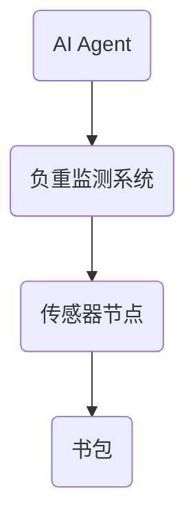
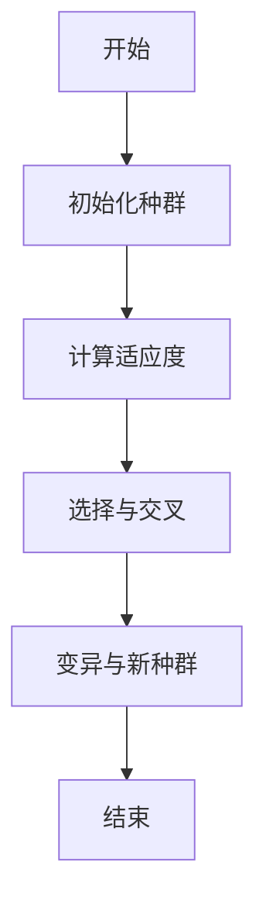
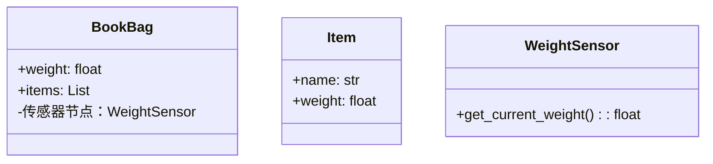
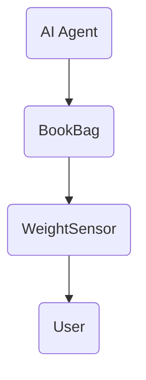
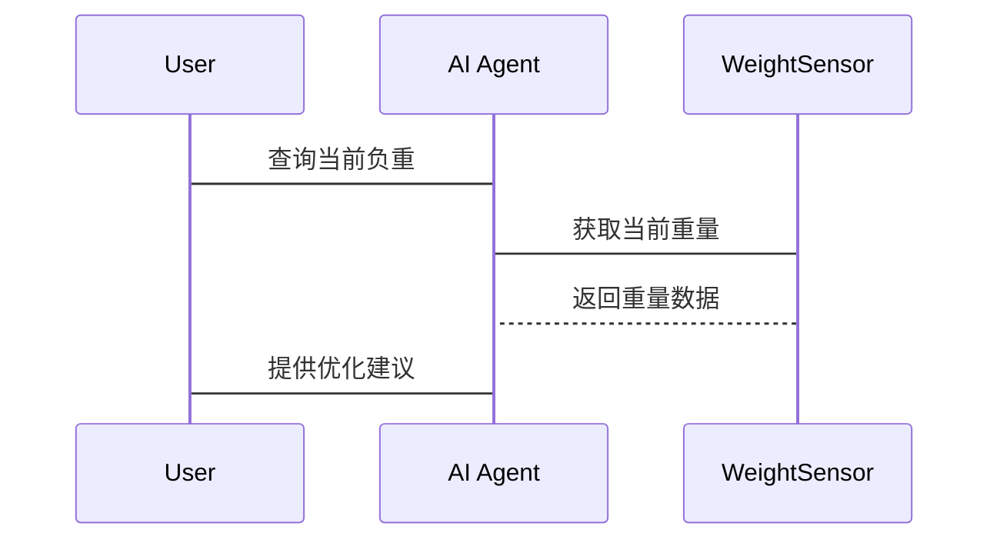

                 


# AI Agent在智能书包中的负重平衡提醒

> 关键词：AI Agent, 智能书包, 负重平衡, 传感器技术, 算法优化

> 摘要：本文探讨了AI Agent在智能书包中的应用，重点分析了负重平衡提醒的实现原理和实际价值。通过传感器数据采集、算法优化和系统设计，展示了如何利用AI技术帮助学生实现书包负重的智能化管理。

---

# 第一章: 背景介绍

## 1.1 问题背景与描述
### 1.1.1 学生书包负重问题的现状
学生书包过重是一个普遍存在的问题。据统计，超过60%的学生每天携带的书包重量超过其体重的15%，这不仅影响身体健康，还可能导致姿势问题和骨骼发育异常。

### 1.1.2 负重对健康的影响
书包过重会对学生的身体造成以下负面影响：
- 脊柱变形
- 肩部肌肉劳损
- 影响血液循环

### 1.1.3 AI Agent在教育辅助中的潜在价值
AI Agent可以通过实时监测书包重量，提供智能化的负重管理建议，帮助学生和家长更好地管理书包重量。

## 1.2 问题解决与边界
### 1.2.1 AI Agent如何帮助平衡书包重量
AI Agent通过传感器实时采集书包重量数据，并结合预设的算法模型，优化书包重量分配，确保单侧负重不超过总体重量的40%。

### 1.2.2 系统的边界与适用范围
- 适用人群：中小学生
- 适用场景：学校、家庭
- 适用环境：室内、室外

### 1.2.3 核心概念的结构与组成
- **输入**：书包重量数据、时间戳
- **处理**：AI Agent计算当前负重比例
- **输出**：提醒建议（如：减少书籍数量、调整携带方式）

---

# 第二章: AI Agent与负重监测系统

## 2.1 核心概念原理
### 2.1.1 AI Agent的基本原理
AI Agent通过传感器数据采集、数据分析和决策制定，实现对书包重量的实时监测和管理。

### 2.1.2 负重监测系统的实现方式
- **传感器节点**：重量传感器、加速度传感器
- **数据采集**：周期性采集书包重量数据
- **数据处理**：计算当前负重比例

## 2.2 核心概念对比
### 2.2.1 不同传感器技术的特征对比
| 技术 | 优点 | 缺点 |
|------|------|------|
| 压力传感器 | 精准度高 | 成本高 |
| 重量传感器 | 成本低 | 精准度低 |

## 2.3 实体关系图


---

# 第三章: 负重平衡算法优化

## 3.1 算法原理
### 3.1.1 遗传算法优化


## 3.2 数学模型与公式
### 3.2.1 优化目标函数
$$ f(x) = \sum_{i=1}^{n} w_i $$
其中，$w_i$ 表示书包中每个物品的重量。

### 3.2.2 约束条件
$$ \sum_{i=1}^{n} w_i \leq W_{\text{max}} $$

## 3.3 代码实现
```python
def optimize_weight(items, max_weight):
    # 初始化种群
    population = generate_population(items)
    # 迭代优化
    for _ in range(100):
        evaluate_population(population)
        select_parents(population)
        perform_crossover(population)
        apply_mutation(population)
    return best_candidate(population)
```

---

# 第四章: 系统分析与架构设计

## 4.1 问题场景介绍
- **目标**：实现书包负重的智能化管理
- **用户**：学生和家长
- **需求**：实时监测书包重量，提供负重优化建议

## 4.2 系统功能设计
### 4.2.1 领域模型


## 4.3 系统架构设计


## 4.4 系统接口设计
### 4.4.1 接口定义
- **输入接口**：传感器数据
- **输出接口**：提醒建议

### 4.4.2 交互流程


---

# 第五章: 项目实战

## 5.1 环境安装
- **硬件**：Raspberry Pi、重量传感器
- **软件**：Python、AI框架（如TensorFlow）

## 5.2 核心实现
```python
import numpy as np

def calculate_weight_balance(weights):
    total_weight = sum(weights)
    threshold = total_weight * 0.4
    return any(w > threshold for w in weights)
```

## 5.3 代码应用解读
- **功能**：计算当前负重是否超过单侧阈值
- **输入**：书包各部分重量数据
- **输出**：是否需要调整

## 5.4 实际案例分析
- **案例1**：书包总重量为5kg，单侧阈值为2kg，实际重量分布为1.5kg、2.5kg、1kg，系统建议调整较重侧的物品。

---

# 第六章: 最佳实践

## 6.1 小结
- AI Agent在智能书包中的应用具有广阔的前景
- 通过传感器和算法优化，可以实现高效的负重管理

## 6.2 注意事项
- 硬件选择要考虑成本和精度
- 算法优化需要考虑实时性和准确性

## 6.3 拓展阅读
- 推荐书籍：《人工智能：一种现代方法》
- 推荐博客：AI与教育技术的结合

---

# 作者：AI天才研究院 & 禅与计算机程序设计艺术

---

本文详细探讨了AI Agent在智能书包中的应用，从背景介绍到系统设计，再到项目实战，为读者提供了全面的技术解析。通过本文的阅读，读者可以深入了解如何利用AI技术解决实际问题，实现智能化的负重管理。

