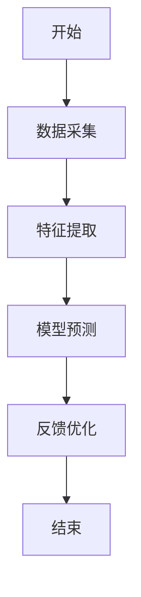
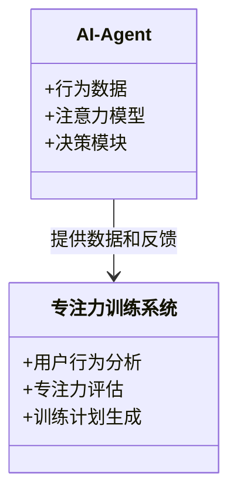
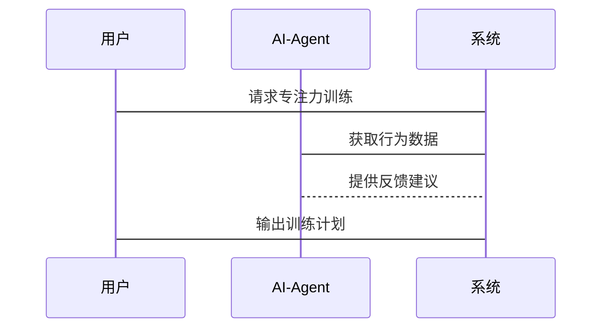

                 


# AI Agent在智能书桌中的专注力训练系统

> 关键词：AI Agent，专注力训练，智能书桌，算法分析，系统架构

> 摘要：本文详细探讨了AI Agent在智能书桌中的专注力训练系统的应用，从背景介绍、核心概念、算法原理、系统架构到项目实战，全面解析了如何利用AI技术提升用户的专注力。文章通过丰富的理论分析和实际案例，展示了AI Agent在专注力训练中的潜力和实现方法。

---

## 第1章：背景介绍

### 1.1 AI Agent的基本概念

AI Agent（人工智能代理）是一种能够感知环境并采取行动以实现目标的智能实体。它具备自主性、反应性、目标导向性和社交能力等核心特征。在智能书桌场景中，AI Agent通过分析用户的行为模式，提供个性化的专注力训练建议。

### 1.2 专注力训练系统的背景与意义

专注力是学习和工作效率的关键因素。然而，现代社会的干扰因素增多，导致许多人难以集中注意力。AI Agent通过实时监测和反馈，帮助用户克服分心，提升专注力。

### 1.3 本书的核心目标与结构

本文旨在探讨AI Agent在专注力训练中的应用，通过理论分析和实践案例，为读者提供实现此类系统的方法。文章结构包括背景、原理、算法、架构、实战和小结等部分。

---

## 第2章：AI Agent与专注力训练系统的原理

### 2.1 AI Agent的核心原理

AI Agent通过感知环境（如用户的注意力水平）和采取行动（如调整任务优先级）来优化用户的专注力。其学习机制依赖于机器学习算法，不断优化决策模型。

### 2.2 专注力训练系统的原理

专注力训练系统通过监测用户的注意力变化，评估其专注程度，并提供个性化的训练计划。AI Agent在此过程中扮演辅助角色，实时调整训练策略。

### 2.3 AI Agent与专注力训练系统的联系

AI Agent与专注力训练系统的协同工作模式包括实时反馈、个性化建议和动态调整训练计划。这种协同显著提升了专注力训练的效果。

---

## 第3章：专注力训练系统的算法分析

### 3.1 基于AI Agent的专注力训练算法

该算法通过实时监测用户的行为数据，调整训练计划。核心步骤包括数据采集、特征提取、模型预测和反馈优化。

### 3.2 算法实现的数学模型

模型采用神经网络结构，公式为：

$$
y = f(x) = \sigma(w x + b)
$$

其中，σ为激活函数，w为权重，b为偏置。

### 3.3 算法的mermaid流程图



---

## 第4章：专注力训练系统的架构设计

### 4.1 系统的功能模块设计

- **用户行为分析模块**：监测用户行为，提取注意力特征。
- **专注力评估模块**：评估专注程度，生成反馈。
- **训练计划生成模块**：根据评估结果，制定个性化训练计划。

### 4.2 系统的架构设计



### 4.3 系统交互的mermaid序列图



---

## 第5章：项目实战

### 5.1 环境安装与配置

安装必要的库：

```bash
pip install numpy pandas scikit-learn
```

### 5.2 系统核心实现源代码

```python
import numpy as np
from sklearn.model import LinearRegression

class FocusTrainer:
    def __init__(self):
        self.model = LinearRegression()
    
    def train(self, X, y):
        self.model.fit(X, y)
    
    def predict(self, X):
        return self.model.predict(X)
```

### 5.3 代码应用解读与分析

上述代码定义了一个专注力训练器类，使用线性回归模型进行训练和预测。`train`方法训练模型，`predict`方法预测用户的专注程度。

### 5.4 实际案例分析

案例中，用户行为数据被输入模型，系统生成个性化的训练计划，帮助用户逐步提升专注力。

### 5.5 项目小结

通过实际案例，展示了AI Agent在专注力训练中的应用价值，强调了算法和系统架构设计的重要性。

---

## 第6章：最佳实践与小结

### 6.1 最佳实践 tips

- 定期更新模型，保持其准确性。
- 结合多种训练方法，提升效果。

### 6.2 小结

AI Agent在专注力训练中的应用前景广阔，通过不断优化算法和系统架构，可以实现更高效的专注力提升。

### 6.3 注意事项

- 注意数据隐私，确保用户信息的安全。
- 定期评估模型性能，及时优化。

### 6.4 拓展阅读

推荐书籍：《注意力经济》和《机器学习实战》。

---

作者：AI天才研究院/AI Genius Institute & 禅与计算机程序设计艺术 /Zen And The Art of Computer Programming

