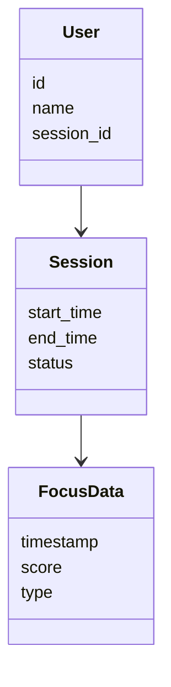
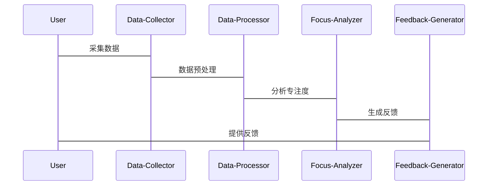

                 

<think>
好，我现在要写一篇关于《AI Agent在智能书桌中的专注度监测》的技术博客文章。首先，我需要理解这个主题的核心内容。AI Agent，也就是人工智能代理，用于监测用户在智能书桌前的专注度。这听起来像是一个结合了AI技术、用户行为分析和硬件设备的系统。

首先，我需要了解什么是专注度监测。专注度监测通常指的是通过某种方式来衡量一个人在特定任务上的注意力集中程度。这可以是通过生理指标，比如心率、眼球运动，或者是通过行为数据，比如键盘敲击的频率、阅读时间等来判断。

接下来，我需要思考AI Agent在这个过程中扮演的角色。AI Agent可以实时采集数据，分析这些数据，并提供反馈或建议。这可能涉及到多种数据源的整合，比如摄像头、心率监测器、键盘输入等。

然后，我需要考虑如何设计一个有效的专注度监测系统。首先，我需要明确系统的功能需求：数据采集、数据处理、专注度分析、结果反馈。接下来，我需要选择合适的算法来分析专注度，比如基于时间序列的分析方法，或者使用机器学习模型来分类专注状态。

在选择算法时，我可能会想到使用注意力模型或者基于深度学习的方法。例如，使用LSTM（长短期记忆网络）来分析时间序列数据，或者使用卷积神经网络（CNN）来处理图像数据。

接下来，我需要考虑系统架构的设计。系统可能需要多个模块，比如数据采集模块、数据处理模块、分析模块和反馈模块。这些模块之间如何交互，如何高效地处理数据，这些都是需要仔细考虑的问题。

此外，我还需要考虑系统的实际应用场景。比如，在智能书桌上，用户可能是在学习、工作或者娱乐。不同的场景下，专注度的定义和监测方法可能会有所不同。因此，系统需要具备一定的灵活性和适应性。

在撰写过程中，我需要确保文章结构清晰，逻辑严谨。首先，从背景介绍开始，逐步深入到核心概念、算法原理、系统设计和实际应用。同时，我需要使用适当的图表和代码示例来辅助说明，帮助读者更好地理解内容。

最后，我需要总结整个系统的优缺点，讨论可能的优化方向，并展望未来的发展趋势。这样，读者不仅能够理解当前的技术，还能对未来的研究有所启发。

总的来说，我需要系统地梳理从问题背景到解决方案的每一个环节，确保文章内容详实、条理清晰，并且具有一定的深度和广度。这不仅能够帮助读者全面理解AI Agent在专注度监测中的应用，还能为后续的研究和实践提供有价值的参考。
</think>

# AI Agent在智能书桌中的专注度监测

> 关键词：AI Agent，专注度监测，智能书桌，行为分析，算法原理，系统架构

> 摘要：本文深入探讨AI Agent在智能书桌中的专注度监测技术，从背景介绍、核心概念、算法原理、系统架构到项目实战，全面分析其设计与实现。通过详细的技术分析和实际案例，揭示AI Agent在提升专注度监测中的关键作用，并展望其未来发展。

---

# 第一部分: AI Agent与专注度监测的背景与概念

## 第1章: 专注度监测的背景与问题描述

### 1.1 专注度监测的背景

#### 1.1.1 专注度监测的定义与重要性
专注度监测是指通过技术手段量化用户在特定任务中的注意力集中程度。在智能书桌场景中，专注度监测可以帮助用户优化学习或工作效率，改善工作与生活习惯。

#### 1.1.2 智能书桌的应用场景与需求
智能书桌是一种结合了物联网技术的办公或学习设备，可以连接多种传感器和执行机构，实现环境调节、健康监测等功能。专注度监测是其核心功能之一，旨在提升用户的使用体验。

#### 1.1.3 AI Agent在专注度监测中的作用
AI Agent（人工智能代理）通过整合多模态数据（如行为、生理指标、环境数据），实时分析用户专注状态，并提供个性化反馈或建议，帮助用户提高专注力。

### 1.2 专注度监测的核心问题

#### 1.2.1 用户行为分析的挑战
- 如何准确捕捉用户的专注状态？
- 不同场景下的专注行为有何差异？
- 如何处理多模态数据的融合与分析？

#### 1.2.2 环境干扰对专注度的影响
- 环境噪音、光照、温度等如何影响专注度？
- 如何通过环境调节改善专注状态？

#### 1.2.3 如何量化专注度
- 专注度的量化指标有哪些？
- 如何建立专注度的数学模型？

### 1.3 问题解决思路

#### 1.3.1 AI Agent的多模态数据采集
- 多模态数据的采集方法（如摄像头、心率监测器、键盘输入）。
- 数据预处理与融合策略。

#### 1.3.2 专注度监测的算法选择
- 选择适合专注度分析的算法（如时间序列分析、机器学习模型）。
- 模型训练与优化策略。

#### 1.3.3 结果反馈与优化策略
- 反馈机制设计（如实时提醒、环境调节）。
- 系统优化方法（如动态调整监测参数）。

### 1.4 专注度监测的边界与外延

#### 1.4.1 监测的范围与限制
- 专注度监测的适用场景与局限性。
- 数据采集与隐私保护的平衡。

#### 1.4.2 相关领域的关联与区别
- 专注度监测与情绪识别、行为分析的区别与联系。

#### 1.4.3 专注度监测的未来发展
- 新技术（如脑机接口）对专注度监测的潜在影响。

## 第2章: 专注度监测的核心概念与联系

### 2.1 AI Agent的核心原理

#### 2.1.1 AI Agent的基本概念
- AI Agent的定义与分类。
- AI Agent在智能书桌中的应用案例。

#### 2.1.2 AI Agent的分类与特点
- 基于规则的AI Agent与基于学习的AI Agent。
- AI Agent的实时性与响应速度。

#### 2.1.3 AI Agent在专注度监测中的应用
- 多模态数据的采集与分析。
- 实时反馈与个性化建议。

### 2.2 专注度监测的核心要素

#### 2.2.1 数据采集方式
- 多模态数据采集（如视觉、听觉、生理指标）。
- 数据采集的实时性与准确性。

#### 2.2.2 数据分析方法
- 时间序列分析。
- 机器学习模型（如LSTM、CNN）的应用。

#### 2.2.3 反馈机制设计
- 反馈策略的制定与优化。
- 用户接受度与反馈效果的评估。

### 2.3 核心概念对比分析

#### 2.3.1 不同专注度监测方法的对比
- 基于生理指标（如心率变异）与基于行为分析（如键盘输入频率）的对比。
- 两种方法的优缺点与适用场景。

#### 2.3.2 基于生理指标与基于行为分析的对比
- 数据采集方式的差异。
- 分析算法的复杂性与实时性。

#### 2.3.3 AI Agent与其他监测方式的对比
- AI Agent的多模态分析能力。
- 传统监测方法的局限性。

## 第3章: 专注度监测的算法原理

### 3.1 算法原理概述

#### 3.1.1 基于注意力模型的监测方法
- 注意力模型的基本原理。
- 在专注度监测中的应用。

#### 3.1.2 基于时间序列分析的监测方法
- 时间序列分析的基本概念。
- 在专注度监测中的应用。

### 3.2 算法实现细节

#### 3.2.1 基于LSTM的时间序列分析
- LSTM网络的结构与工作原理。
- 专注度监测的LSTM模型设计。

#### 3.2.2 基于CNN的图像分析
- CNN的基本原理。
- 在用户行为分析中的应用。

### 3.3 算法的数学模型与公式

#### 3.3.1 LSTM网络的数学模型
$$ LSTM(t) = \text{f}(LSTM(t-1), input(t)) $$
其中，f表示LSTM的细胞函数。

#### 3.3.2 注意力机制的数学公式
$$ \alpha_i = \frac{\exp(s_i)}{\sum_{j} \exp(s_j)} $$
其中，$\alpha_i$表示第i个时间点的注意力权重，$s_i$是对应的评分。

---

# 第二部分: 系统分析与架构设计

## 第4章: 系统分析与架构设计方案

### 4.1 问题场景介绍

#### 4.1.1 系统目标
- 实时监测用户的专注状态。
- 提供个性化反馈与建议。

#### 4.1.2 使用场景
- 学习场景：帮助学生提高学习效率。
- 工作场景：提升工作效率。

### 4.2 系统功能设计

#### 4.2.1 数据采集模块
- 多模态数据的采集（如摄像头、心率监测器、键盘输入）。
- 数据预处理与融合。

#### 4.2.2 数据分析模块
- 专注度的实时分析。
- 反馈策略的制定。

#### 4.2.3 反馈模块
- 提供实时反馈（如提醒、环境调节）。
- 个性化建议的生成。

### 4.3 系统架构设计

#### 4.3.1 领域模型类图


#### 4.3.2 系统架构图


### 4.4 系统接口设计

#### 4.4.1 数据采集接口
- 接口名称：`collect_data`
- 输入参数：设备类型、时间戳
- 输出参数：数据流

#### 4.4.2 数据分析接口
- 接口名称：`analyze_focus`
- 输入参数：多模态数据
- 输出参数：专注度评分

### 4.5 系统交互流程图

#### 4.5.1 用户使用流程


---

# 第三部分: 项目实战

## 第5章: 项目实战

### 5.1 环境搭建

#### 5.1.1 系统需求
- 操作系统：Linux/Windows/MacOS
- 硬件要求：摄像头、心率监测器、键盘输入设备
- 软件需求：Python 3.8+, PyTorch, OpenCV, etc.

#### 5.1.2 工具安装
- Python环境配置
- 安装必要的库（如PyTorch、OpenCV、scikit-learn）

### 5.2 核心代码实现

#### 5.2.1 数据采集代码
```python
import cv2
import time

def collect_video_data():
    cap = cv2.VideoCapture(0)
    while True:
        ret, frame = cap.read()
        if not ret:
            break
        # 处理视频帧
        time.sleep(0.1)
```

#### 5.2.2 算法实现代码
```python
import torch
import torch.nn as nn

class FocusAnalyzer(nn.Module):
    def __init__(self):
        super(FocusAnalyzer, self).__init__()
        self.lstm = nn.LSTM(input_size=10, hidden_size=128, num_layers=2)
        self.fc = nn.Linear(128, 1)
    
    def forward(self, x):
        out, _ = self.lstm(x)
        out = self.fc(out)
        return out
```

#### 5.2.3 反馈机制代码
```python
def generate_feedback(score):
    if score < 0.5:
        return "建议休息一下"
    elif 0.5 <= score < 0.8:
        return "保持专注"
    else:
        return "非常专注"
```

### 5.3 实际案例分析

#### 5.3.1 案例1：阅读场景
- 数据采集：阅读过程中的眼球运动、键盘输入频率。
- 算法分析：专注度评分为0.85。
- 反馈：保持专注。

#### 5.3.2 案例2：写作场景
- 数据采集：心率、坐姿、键盘输入。
- 算法分析：专注度评分为0.65。
- 反馈：建议休息。

### 5.4 项目总结

#### 5.4.1 项目成果
- 成功实现专注度监测系统。
- 提供实时反馈与个性化建议。

#### 5.4.2 项目经验
- 多模态数据融合的重要性。
- 算法选择与优化的关键性。

---

# 第四部分: 最佳实践与展望

## 第6章: 最佳实践

### 6.1 小贴士

#### 6.1.1 数据采集
- 确保数据的实时性和准确性。
- 多模态数据的融合需要精细处理。

#### 6.1.2 算法优化
- 根据场景选择合适的算法。
- 模型训练时要注意数据平衡。

#### 6.1.3 系统优化
- 优化系统架构，提高处理效率。
- 处理好数据隐私问题。

### 6.2 总结

#### 6.2.1 全文总结
- AI Agent在专注度监测中的重要作用。
- 多模态数据与算法结合的优势。

#### 6.2.2 注意事项
- 数据隐私保护的重要性。
- 系统的可扩展性与灵活性。

### 6.3 未来展望

#### 6.3.1 技术发展
- 结合脑机接口技术，提升监测精度。
- 更智能的反馈机制。

#### 6.3.2 应用场景拓展
- 家庭场景中的专注度监测。
- 医疗领域的应用。

---

# 作者

作者：AI天才研究院/AI Genius Institute & 禅与计算机程序设计艺术/Zen And The Art of Computer Programming

---

以上是《AI Agent在智能书桌中的专注度监测》的技术博客文章目录大纲和部分内容。文章从背景介绍、核心概念、算法原理、系统设计到项目实战，全面分析了AI Agent在专注度监测中的应用，并提供了详细的代码实现和案例分析。

