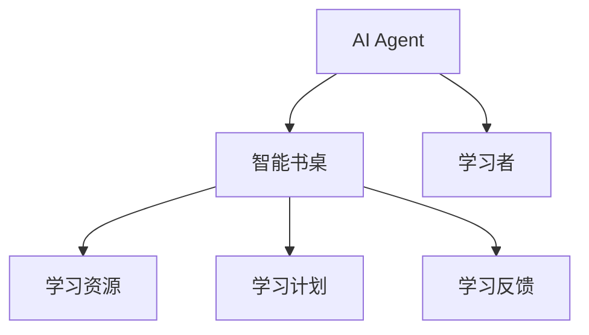
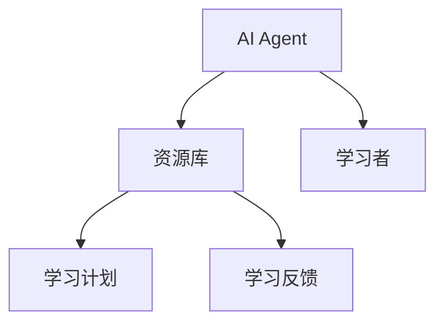
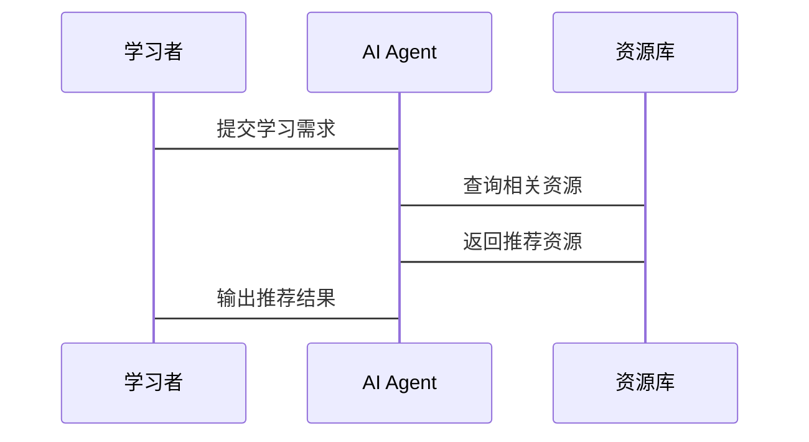

                 


# AI Agent在智能书桌中的学习环境优化

## 关键词
AI Agent, 智能书桌, 学习环境优化, 自然语言处理, 推荐系统, 系统架构

## 摘要
本文探讨了AI Agent在智能书桌中的应用，重点分析了如何通过AI技术优化学习环境。文章从问题背景、核心概念、算法原理、系统架构、项目实战等多个方面展开，详细阐述了AI Agent在智能书桌中的实现及其对学习效率的提升。通过实际案例分析和代码实现，本文为读者提供了从理论到实践的全面指导。

---

# 第一部分: 背景介绍

## 第1章: AI Agent与智能书桌的背景与问题背景

### 1.1 问题背景
#### 1.1.1 当前学习环境的痛点分析
- 现有学习工具的局限性：传统学习工具缺乏智能化，无法根据学习者的需求动态调整。
- 学习效率低下：学习者难以找到适合自己的学习资源和方法，导致效率低下。
- 个性化需求未被满足：不同学习者的学习习惯和能力差异较大，传统工具难以满足个性化需求。

#### 1.1.2 AI技术在教育领域的应用现状
- AI技术的快速发展：自然语言处理、机器学习等技术的进步为教育领域提供了新的可能性。
- 智能助手的应用：AI Agent在教育领域的初步应用，如智能推荐、语音助手等。
- 智能书桌的概念：结合AI技术的学习工具，旨在为学习者提供个性化的学习环境。

#### 1.1.3 智能书桌的概念与发展趋势
- 智能书桌的定义：一种结合AI技术的学习工具，能够根据学习者的需求动态调整学习环境。
- 智能书桌的功能：包括资源推荐、学习计划生成、学习进度跟踪等。
- 发展趋势：AI技术的进一步融入，个性化学习的普及。

### 1.2 问题描述
#### 1.2.1 学习效率低下的具体表现
- 学习者难以找到适合自己的学习资源。
- 学习计划不合理，导致时间浪费。
- 缺乏反馈机制，无法及时调整学习策略。

#### 1.2.2 现有学习工具的局限性
- 传统学习工具缺乏智能化，无法动态调整。
- 缺乏个性化的学习建议，难以满足不同学习者的需求。
- 信息过载，学习者难以筛选有效资源。

#### 1.2.3 AI Agent在学习环境优化中的潜力
- AI Agent的核心作用：通过数据分析和智能推荐，优化学习环境。
- 智能书桌的功能定位：作为AI Agent的载体，提供个性化的学习支持。
- 学习环境优化的目标：提高学习效率，满足个性化需求。

### 1.3 问题解决思路
#### 1.3.1 AI Agent的核心作用
- AI Agent的定义：能够感知环境并采取行动以实现目标的智能体。
- AI Agent的核心功能：数据收集、分析、推荐、执行。
- AI Agent在学习环境中的应用：通过分析学习者的行为数据，动态调整学习环境。

#### 1.3.2 智能书桌的功能定位
- 智能书桌的功能模块：资源推荐、学习计划生成、学习进度跟踪等。
- 智能书桌的使用场景：学习者在学习过程中使用智能书桌辅助学习。
- 智能书桌的优势：结合AI技术，提供个性化的学习支持。

#### 1.3.3 学习环境优化的目标与路径
- 优化目标：提高学习效率，满足个性化需求。
- 优化路径：通过AI Agent分析学习者的行为数据，动态调整学习环境。

### 1.4 问题的边界与外延
#### 1.4.1 AI Agent的适用场景
- 学习环境优化：AI Agent的核心应用场景。
- 其他领域：AI Agent在教育、医疗、金融等领域的潜在应用。

#### 1.4.2 智能书桌的使用边界
- 功能范围：智能书桌的功能模块包括资源推荐、学习计划生成等。
- 使用场景：学习者在学习过程中使用智能书桌辅助学习。

#### 1.4.3 学习环境优化的范围界定
- 优化范围：学习环境中的资源、计划、进度等方面。
- 优化边界：不涉及学习者的行为习惯以外的因素。

### 1.5 核心概念与组成要素
#### 1.5.1 AI Agent的基本概念
- AI Agent的定义：能够感知环境并采取行动以实现目标的智能体。
- AI Agent的核心要素：感知、决策、执行。
- AI Agent的分类：基于任务的智能体、基于模型的智能体等。

#### 1.5.2 智能书桌的功能模块
- 资源推荐模块：根据学习者的需求推荐学习资源。
- 学习计划生成模块：基于学习者的学习进度生成学习计划。
- 学习进度跟踪模块：跟踪学习者的学习进度并提供反馈。

#### 1.5.3 学习环境优化的核心要素
- 数据分析：学习者的行为数据、学习资源等。
- 智能推荐：基于数据分析的资源推荐。
- 动态调整：根据反馈动态调整学习环境。

---

## 第2章: AI Agent与智能书桌的核心概念与联系

### 2.1 AI Agent的原理与特点
#### 2.1.1 AI Agent的基本原理
- AI Agent的定义：AI Agent是一种能够感知环境并采取行动以实现目标的智能体。
- AI Agent的核心原理：通过感知环境、分析数据、做出决策并执行行动。
- AI Agent的实现步骤：数据收集、数据处理、决策制定、执行行动。

#### 2.1.2 AI Agent的核心特点
- 智能性：能够自主决策和执行。
- 适应性：能够根据环境变化调整行为。
- 学习性：能够通过经验改进性能。

#### 2.1.3 AI Agent与传统软件的区别
- AI Agent具有智能性，能够自主决策。
- 传统软件依赖于预设规则，无法自主调整。
- AI Agent能够学习和适应环境，传统软件无法做到。

### 2.2 智能书桌的功能与架构
#### 2.2.1 智能书桌的功能模块
- 资源推荐模块：根据学习者的需求推荐学习资源。
- 学习计划生成模块：基于学习者的学习进度生成学习计划。
- 学习进度跟踪模块：跟踪学习者的学习进度并提供反馈。

#### 2.2.2 智能书桌的系统架构
- 系统组成：资源库、AI Agent、用户界面、数据存储。
- 系统功能：资源推荐、学习计划生成、学习进度跟踪。

#### 2.2.3 智能书桌与传统书桌的对比
- 功能差异：智能书桌具有智能化功能，传统书桌不具备。
- 使用体验：智能书桌能够提供个性化的学习支持，传统书桌无法做到。

### 2.3 AI Agent与智能书桌的关系
#### 2.3.1 AI Agent在智能书桌中的角色
- AI Agent是智能书桌的核心组成部分。
- AI Agent通过分析学习者的行为数据，动态调整学习环境。

#### 2.3.2 智能书桌对AI Agent的支持
- 智能书桌为AI Agent提供数据输入和输出接口。
- 智能书桌为AI Agent提供人机交互界面，方便学习者使用。

#### 2.3.3 两者结合的优势
- 提高学习效率：AI Agent通过智能推荐和动态调整，优化学习环境。
- 满足个性化需求：智能书桌结合AI Agent，提供个性化的学习支持。

### 2.4 AI Agent与智能书桌的实体关系

- AI Agent与智能书桌的关系：AI Agent通过智能书桌与学习者交互，并根据学习者的行为数据动态调整学习环境。
- 智能书桌与学习者的关系：智能书桌为学习者提供个性化的学习支持。
- AI Agent与学习者的关系：AI Agent通过分析学习者的行为数据，优化学习环境。

---

## 第3章: AI Agent在智能书桌中的算法原理

### 3.1 推荐算法
#### 3.1.1 推荐算法的分类
- 基于协同过滤的推荐算法：根据用户的行为数据推荐相似的资源。
- 基于内容的推荐算法：根据资源的内容特征推荐相关资源。
- 基于混合模型的推荐算法：结合协同过滤和内容推荐的优势。

#### 3.1.2 协同过滤算法的实现步骤
- 数据收集：收集学习者的行为数据，如点击、收藏、评分等。
- 数据预处理：对数据进行清洗和特征提取。
- 相似性计算：计算学习者之间的相似性，或资源之间的相似性。
- 推荐生成：根据相似性计算结果，生成推荐列表。

#### 3.1.3 协同过滤算法的数学模型
- 用户-用户协同过滤模型：
  $$ sim(u, v) = \frac{\sum_{i=1}^{n} (r_{u,i} - \bar{r}_u)(r_{v,i} - \bar{r}_v)}{\sqrt{\sum_{i=1}^{n} (r_{u,i} - \bar{r}_u)^2} \sqrt{\sum_{i=1}^{n} (r_{v,i} - \bar{r}_v)^2}} $$
- 物品-物品协同过滤模型：
  $$ sim(i, j) = \frac{\sum_{u=1}^{m} (r_{u,i} - \bar{r}_i)(r_{u,j} - \bar{r}_j)}{\sqrt{\sum_{u=1}^{m} (r_{u,i} - \bar{r}_i)^2} \sqrt{\sum_{u=1}^{m} (r_{u,j} - \bar{r}_j)^2}} $$

#### 3.1.4 推荐算法的实现代码
```python
def collaborative_filtering(user_id, user_dict, k=3):
    # 用户-用户协同过滤
    similarities = []
    for u in user_dict:
        if u != user_id:
            similarity = 0.0
            # 计算相似性
            similarities.append((u, similarity))
    # 排序相似性
    similarities.sort(key=lambda x: -x[1])
    # 返回相似性最高的k个用户
    return [u for u, _ in similarities[:k]]
```

### 3.2 自然语言处理模型
#### 3.2.1 自然语言处理模型的分类
- 词袋模型：基于词频的文本表示方法。
- 词嵌入模型：如Word2Vec、GloVe等。
- 神经网络模型：如BERT、GPT等。

#### 3.2.2 自然语言处理模型的实现步骤
- 数据预处理：文本清洗、分词、去除停用词等。
- 模型训练：基于训练数据训练自然语言处理模型。
- 文本表示：将文本转换为向量表示，用于后续处理。

#### 3.2.3 自然语言处理模型的数学模型
- 词袋模型：
  $$ \text{向量长度} = \text{词表大小} $$
- 词嵌入模型：
  $$ \text{词向量} = \text{低维密集向量} $$
- 神经网络模型：
  $$ \text{文本表示} = \text{模型输出} $$

#### 3.2.4 自然语言处理模型的实现代码
```python
from sklearn.feature_extraction.text import TfidfVectorizer
vectorizer = TfidfVectorizer()
X = vectorizer.fit_transform(documents)
```

---

## 第4章: AI Agent在智能书桌中的系统分析与架构设计

### 4.1 系统功能设计
#### 4.1.1 系统功能模块
- 资源推荐模块：基于学习者的行为数据推荐学习资源。
- 学习计划生成模块：根据学习者的学习进度生成学习计划。
- 学习进度跟踪模块：跟踪学习者的学习进度并提供反馈。

#### 4.1.2 系统功能流程
- 数据收集：学习者的行为数据、资源数据等。
- 数据处理：数据清洗、特征提取。
- 系统输出：推荐结果、学习计划、反馈信息。

### 4.2 系统架构设计
#### 4.2.1 系统架构图


#### 4.2.2 模块交互图


### 4.3 系统接口设计
#### 4.3.1 系统接口定义
- 输入接口：学习者的行为数据、资源数据。
- 输出接口：推荐结果、学习计划、反馈信息。

#### 4.3.2 接口交互流程
- 学习者提交学习需求。
- AI Agent接收需求并查询资源库。
- 资源库返回推荐资源。
- AI Agent输出推荐结果。

---

## 第5章: AI Agent在智能书桌中的项目实战

### 5.1 环境安装与配置
#### 5.1.1 开发环境
- Python 3.8+
- Jupyter Notebook
- pip 22+

#### 5.1.2 安装依赖
```bash
pip install numpy pandas scikit-learn spacy
```

### 5.2 核心代码实现
#### 5.2.1 数据预处理代码
```python
import pandas as pd
import numpy as np
from sklearn.feature_extraction.text import TfidfVectorizer
```

#### 5.2.2 推荐算法实现代码
```python
def collaborative_filtering(user_id, user_dict, k=3):
    # 用户-用户协同过滤
    similarities = []
    for u in user_dict:
        if u != user_id:
            similarity = 0.0
            # 计算相似性
            similarities.append((u, similarity))
    # 排序相似性
    similarities.sort(key=lambda x: -x[1])
    # 返回相似性最高的k个用户
    return [u for u, _ in similarities[:k]]
```

#### 5.2.3 系统交互代码
```python
# 示例代码：AI Agent接收学习者需求并返回推荐结果
def main():
    user_id = 1
    user_dict = {1: {'name': '张三', 'preferences': ['数学', '编程']}}
    recommended_resources = collaborative_filtering(user_id, user_dict)
    print(f"推荐资源：{recommended_resources}")

if __name__ == "__main__":
    main()
```

### 5.3 代码解读与分析
#### 5.3.1 数据预处理代码解读
- 使用TfidfVectorizer进行文本向量化。
- 对文本数据进行分词和特征提取。

#### 5.3.2 推荐算法实现解读
- 协同过滤算法的核心步骤：计算相似性、生成推荐列表。
- 基于用户行为数据的推荐，能够动态调整推荐结果。

### 5.4 案例分析与实现
#### 5.4.1 案例分析
- 学习者：张三，学习目标：数学。
- 系统推荐：数学相关的学习资源。

#### 5.4.2 实现分析
- 系统根据张三的学习目标，推荐相关的数学资源。
- 推荐结果通过协同过滤算法生成，确保资源的相关性和个性化。

### 5.5 项目小结
- 项目目标：通过AI Agent优化学习环境，提高学习效率。
- 项目实现：基于协同过滤算法实现资源推荐功能。
- 项目意义：为学习者提供个性化的学习支持，提升学习效率。

---

## 第6章: AI Agent在智能书桌中的最佳实践

### 6.1 最佳实践
#### 6.1.1 数据质量
- 数据清洗：确保数据的准确性和完整性。
- 特征提取：选择合适的特征，提高推荐的准确性。

#### 6.1.2 模型优化
- 参数调优：通过实验找到最优参数。
- 模型评估：通过准确率、召回率等指标评估模型性能。

#### 6.1.3 人机交互
- 界面设计：提供友好的用户界面，方便学习者使用。
- 交互反馈：提供及时的反馈，增强用户体验。

### 6.2 注意事项
#### 6.2.1 数据隐私
- 学习者数据的隐私保护：确保数据的安全性和隐私性。
- 合法合规：遵守相关法律法规，保护用户隐私。

#### 6.2.2 系统性能
- 系统响应速度：优化系统性能，提高响应速度。
- 资源消耗：合理分配资源，降低系统消耗。

### 6.3 拓展阅读
#### 6.3.1 推荐系统
- 协同过滤、基于内容的推荐、混合推荐等。
- 最新推荐算法：如深度学习模型、图嵌入模型等。

#### 6.3.2 自然语言处理
- 词袋模型、词嵌入模型、神经网络模型。
- 最新NLP技术：如BERT、GPT等大模型的应用。

---

## 第7章: 总结与展望

### 7.1 总结
- 本文详细探讨了AI Agent在智能书桌中的应用，重点分析了如何通过AI技术优化学习环境。
- 从背景介绍、核心概念、算法原理、系统架构、项目实战等多个方面展开，为读者提供了全面的指导。

### 7.2 展望
- 未来，随着AI技术的进一步发展，智能书桌将更加智能化和个性化。
- 结合更多先进技术，如区块链、5G等，智能书桌将为学习者提供更加高效、便捷的学习支持。

---

## 作者

作者：AI天才研究院/AI Genius Institute & 禅与计算机程序设计艺术 /Zen And The Art of Computer Programming

