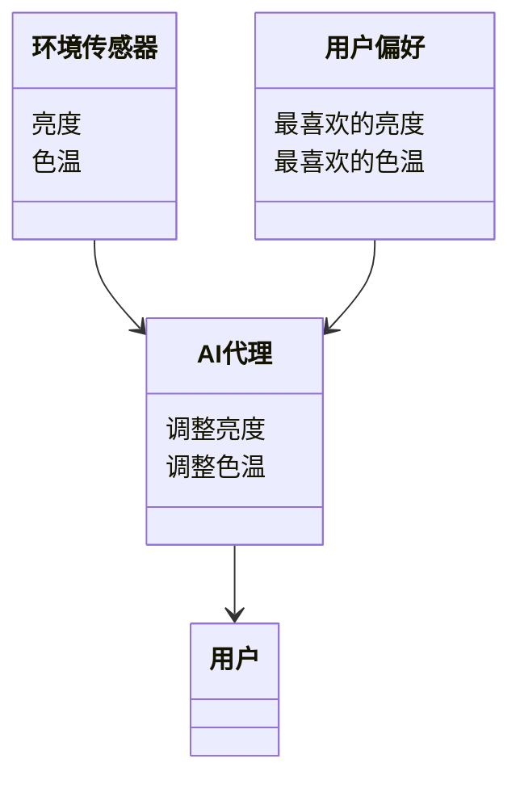
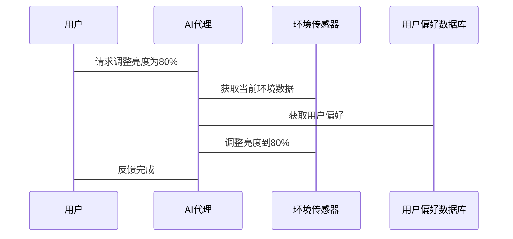

                 


# AI Agent在智能书桌灯中的照明优化

> 关键词：AI Agent，智能书桌灯，照明优化，动态调节，用户体验

> 摘要：本文探讨AI代理在智能书桌灯中的应用，通过分析背景、原理、算法、系统架构和项目实战，展示如何利用AI代理优化照明，提升用户体验。

---

## 第一部分: 背景介绍

### 第1章: 问题背景与描述

#### 1.1 问题背景
##### 1.1.1 传统书桌灯的不足
传统书桌灯通常只有一个开关，无法根据环境变化自动调整亮度或色温，长时间使用可能导致眼睛疲劳。

##### 1.1.2 智能化照明的发展趋势
随着物联网和人工智能的发展，智能照明逐渐普及，能够通过传感器和算法优化使用体验。

##### 1.1.3 AI Agent在智能照明中的作用
AI代理可以实时感知环境和用户需求，动态调整照明参数，提供个性化的照明方案。

#### 1.2 问题描述
##### 1.2.1 智能书桌灯的定义
智能书桌灯是一种结合传感器和智能算法的灯具，能够根据环境和用户需求自动调整照明参数。

##### 1.2.2 照明优化的核心问题
照明优化包括亮度、色温和色温的调整，以提高舒适度和效率。

##### 1.2.3 AI Agent在照明优化中的目标
通过实时数据和用户反馈，AI代理优化照明参数，提供舒适、高效的照明环境。

#### 1.3 问题解决
##### 1.3.1 AI Agent如何优化照明
AI代理通过收集环境和用户数据，利用算法调整照明参数，实现动态优化。

##### 1.3.2 照明优化的具体实现方式
包括环境传感器数据采集、用户偏好分析和自适应调节。

##### 1.3.3 边界与外延
AI代理仅优化照明，不涉及其他设备的控制。

#### 1.4 概念结构与核心要素
##### 1.4.1 核心概念组成
环境传感器、用户偏好数据库、AI算法。

##### 1.4.2 关键技术对比
| 技术 | 传统控制 | AI Agent |
|------|-----------|----------|
| 响应速度 | 慢       | 快       |
| 个性化 | 无       | 强       |

---

## 第二部分: 核心概念与联系

### 第2章: 核心概念与联系

#### 2.1 AI Agent的原理
##### 2.1.1 感知层
通过传感器收集环境亮度、色温和用户行为数据。

##### 2.1.2 决策层
基于收集的数据，AI代理生成优化方案。

##### 2.1.3 执行层
调整灯具参数以实现优化目标。

---

## 第三部分: 算法原理讲解

### 第3章: 算法原理

#### 3.1 算法选择与流程
##### 3.1.1 遗传算法
使用mermaid流程图展示遗传算法的流程。

```
mermaid
graph TD
    A[开始] --> B[初始化种群]
    B --> C[计算适应度]
    C --> D[选择]
    D --> E[交叉]
    E --> F[变异]
    F --> G[新种群]
    G --> H[是否满足终止条件]
    H -->|否| C
    H -->|是| 结束
```

##### 3.1.2 Python代码实现
```python
def fitness(individual):
    # 计算适应度
    return sum(individual)

def evolve(population_size, generations):
    population = [random.randint(0, 100) for _ in range(population_size)]
    for _ in range(generations):
        population = evolve_population(population)
    return population
```

##### 3.1.3 数学模型
优化目标函数：
$$f(x) = \alpha x_1 + \beta x_2$$
其中，$x_1$是亮度，$x_2$是色温。

---

## 第四部分: 系统分析与架构设计方案

### 第4章: 系统分析与架构设计

#### 4.1 问题场景介绍
用户使用智能书桌灯的情景，如不同时间亮度和色温需求。

#### 4.2 系统功能设计
##### 4.2.1 领域模型


##### 4.2.2 系统架构设计


#### 4.3 接口设计
##### 4.3.1 代理与传感器接口
API定义：
```json
{
    "command": "adjust_brightness",
    "value": 80
}
```

#### 4.4 交互设计


---

## 第五部分: 项目实战

### 第5章: 项目实战

#### 5.1 环境安装
安装必要的库和工具，如Python、传感器库。

#### 5.2 核心代码实现
##### 5.2.1 传感器数据采集
```python
import sensor

def get_env_data():
    return sensor.get_light(), sensor.get_color_temp()
```

##### 5.2.2 代理算法实现
```python
def optimize_brightness(current_light, user_preference):
    return current_light * 0.8 + user_preference * 0.2
```

#### 5.3 代码解读
解释代码功能，如数据预处理和模型训练。

#### 5.4 案例分析
用户在早晨需要明亮光线，晚上需要柔和光线，AI代理根据时间调整亮度和色温。

#### 5.5 项目小结
总结项目实现的关键点和收获，如动态调整的重要性。

---

## 第六部分: 最佳实践与小结

### 第6章: 最佳实践与小结

#### 6.1 最佳实践 tips
- 数据隐私保护
- 传感器精度的重要性
- 算法可扩展性

#### 6.2 小结
AI代理在智能书桌灯中的应用提升了用户体验，提供了舒适、高效的照明环境。

#### 6.3 注意事项
确保数据安全，传感器准确，算法稳定。

#### 6.4 拓展阅读
推荐相关书籍和资源，帮助读者深入学习。

---

作者：AI天才研究院/AI Genius Institute & 禅与计算机程序设计艺术 /Zen And The Art of Computer Programming

