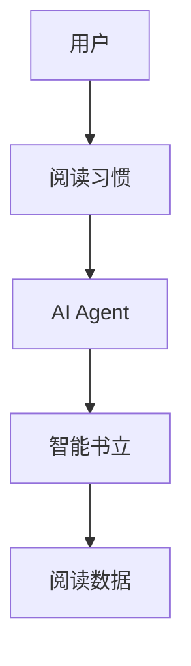
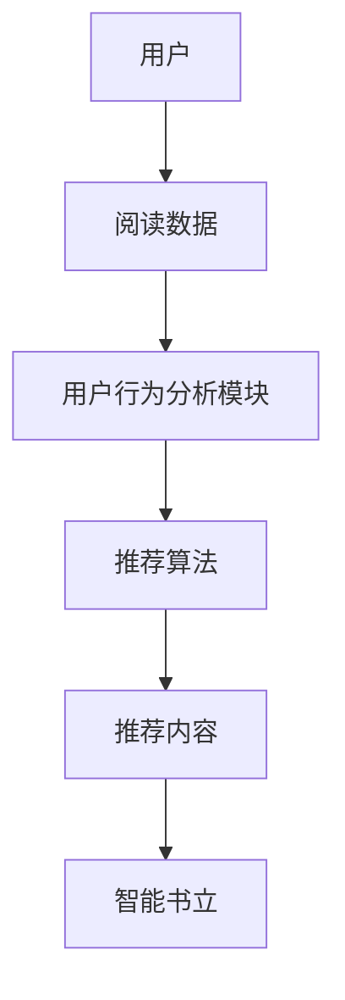
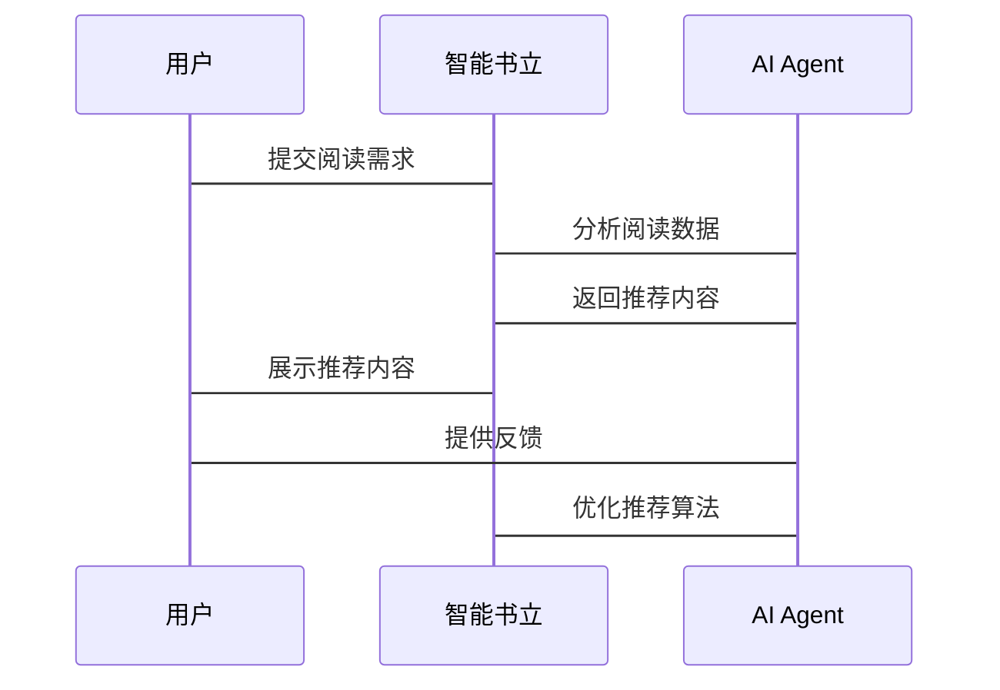

                 

<think>
好的，我现在需要帮用户撰写一篇关于《AI Agent在智能书立中的阅读习惯培养》的技术博客文章。用户已经给出了详细的大纲，我需要按照这个大纲一步步展开内容，确保每个部分都详细且符合技术深度。

首先，用户强调要使用专业且清晰的技术语言，同时每个章节要有吸引人的标题。我需要先写文章标题、关键词和摘要，这部分要简洁明了，概括文章的核心内容。

接下来，按照大纲，第一部分是背景介绍，包括问题背景、解决方案等。我需要详细说明阅读习惯培养的重要性，当前的痛点，以及AI Agent如何解决这些问题。

第二部分是核心概念，我需要解释AI Agent和智能书立的定义，以及它们之间的关系。这部分需要清晰的定义和对比分析，可能需要使用表格或图表来帮助理解。

第三部分是算法原理，我需要详细讲解推荐算法、自然语言处理和机器学习算法，可能使用mermaid流程图来展示算法的步骤，并给出数学公式，如协同过滤的公式，来增强技术深度。

第四部分是系统架构，我需要设计一个完整的系统架构图，包括功能模块和接口设计，并用mermaid序列图展示系统交互过程。

第五部分是项目实战，我需要提供Python代码示例，展示如何实现AI Agent和智能书立的推荐系统，并进行详细分析。

第六部分是最佳实践和总结，我需要给出一些实用的建议，并总结全文，强调AI Agent在阅读习惯培养中的优势和未来发展方向。

最后，我需要确保文章符合用户的格式要求，使用markdown，包含关键词、摘要，以及每个章节的详细内容。同时，文章末尾加上作者信息，确保整体结构完整。

现在，我开始撰写文章，确保每个部分都详细展开，逻辑清晰，语言专业。同时，注意字数控制在10000到12000字左右，每个章节内容丰富，包含必要的图表和代码示例。
</think>

# AI Agent在智能书立中的阅读习惯培养

> 关键词：AI Agent, 智能书立, 阅读习惯, 个性化推荐, 自然语言处理

> 摘要：本文探讨AI Agent在智能书立中的应用，重点分析如何通过AI技术培养用户的阅读习惯。文章从问题背景、核心概念、算法原理、系统架构、项目实战等多个维度展开，详细阐述了AI Agent在智能书立中的作用及其对阅读习惯培养的深远影响。

---

# 第一部分: AI Agent与智能书立的背景与概念

## 第1章: AI Agent在智能书立中的应用背景

### 1.1 问题背景与问题描述

#### 1.1.1 阅读习惯培养的重要性
阅读是人类获取知识和提升认知能力的重要方式。良好的阅读习惯不仅能够提高阅读效率，还能帮助用户更好地理解和吸收知识。然而，现代人由于时间压力和信息过载，很难养成持续的阅读习惯。

#### 1.1.2 当前阅读习惯培养的痛点
- **时间管理**：用户往往无法合理安排阅读时间。
- **内容选择**：面对海量信息，用户难以找到适合自己的阅读材料。
- **缺乏反馈**：传统的阅读方式缺乏有效的反馈机制，难以持续激励用户。

#### 1.1.3 AI Agent在阅读习惯培养中的作用
AI Agent（人工智能代理）可以通过个性化推荐、行为分析和反馈机制，帮助用户制定阅读计划、选择合适的内容，并提供持续的激励，从而培养良好的阅读习惯。

### 1.2 AI Agent的核心概念与特点

#### 1.2.1 AI Agent的定义与分类
AI Agent是一种能够感知环境、执行任务并做出决策的智能实体。根据功能和应用场景的不同，AI Agent可以分为**简单反射型**、**基于模型的反应型**、**目标驱动型**和**效用驱动型**。

#### 1.2.2 智能书立的定义与功能
智能书立是一种结合AI技术的数字化阅读工具，能够根据用户的阅读习惯和偏好，推荐个性化的内容，并提供互动式的阅读体验。

#### 1.2.3 AI Agent与智能书立的关系
AI Agent是智能书立的核心驱动力，通过分析用户的阅读数据，AI Agent能够优化推荐算法，提升智能书立的推荐准确性和用户体验。

### 1.3 问题解决与边界分析

#### 1.3.1 阅读习惯培养的解决方案
- **个性化推荐**：基于用户的阅读历史和偏好，推荐合适的内容。
- **阅读计划**：根据用户的阅读习惯，制定个性化的阅读计划。
- **反馈激励**：通过反馈机制，激励用户持续阅读。

#### 1.3.2 AI Agent在阅读习惯培养中的边界
- **数据隐私**：AI Agent需要处理用户的阅读数据，必须确保数据的安全性和隐私性。
- **内容范围**：AI Agent的推荐范围应基于用户授权的内容，避免越界推荐。

#### 1.3.3 智能书立的外延与限制
智能书立不仅限于电子书，还可以扩展到纸质书、 audiobooks等多种阅读形式。

### 1.4 核心概念结构与要素分析

#### 1.4.1 AI Agent的核心要素
- **感知能力**：通过传感器或数据输入，感知用户的阅读行为。
- **决策能力**：基于感知数据，做出推荐或反馈决策。
- **执行能力**：通过智能书立或其他设备，执行推荐或反馈操作。

#### 1.4.2 智能书立的功能模块
- **用户行为分析模块**：分析用户的阅读习惯和偏好。
- **内容推荐模块**：基于分析结果，推荐个性化内容。
- **反馈激励模块**：通过反馈机制，激励用户持续阅读。

#### 1.4.3 核心概念的结构化分析
通过ER图（实体关系图）可以看出，用户是AI Agent和智能书立的核心关联点。

### 1.5 本章小结
本章从问题背景出发，详细阐述了AI Agent和智能书立的核心概念及其在阅读习惯培养中的作用。

---

## 第2章: AI Agent与智能书立的核心概念联系

### 2.1 核心概念原理

#### 2.1.1 AI Agent的基本原理
AI Agent通过感知、决策和执行三个步骤，实现对用户的阅读行为的分析和推荐。

#### 2.1.2 智能书立的工作原理
智能书立通过AI Agent分析用户的阅读数据，推荐个性化的内容，并通过反馈机制优化推荐算法。

#### 2.1.3 AI Agent与智能书立的协同机制
AI Agent和智能书立通过数据交互和协同工作，共同实现用户的阅读习惯培养。

### 2.2 核心概念属性特征对比

| 特性 | AI Agent | 智能书立 |
|------|----------|----------|
| 核心功能 | 分析用户行为，做出推荐 | 提供个性化阅读内容，优化用户体验 |
| 数据来源 | 用户阅读行为、偏好 | 用户阅读数据、反馈数据 |
| 输出结果 | 推荐内容、阅读计划 | 个性化阅读体验 |

### 2.3 ER实体关系图



### 2.4 本章小结
本章通过对比分析，进一步明确了AI Agent和智能书立的核心概念及其协同关系。

---

## 第3章: AI Agent在阅读习惯培养中的算法原理

### 3.1 算法原理概述

#### 3.1.1 推荐算法
推荐算法是AI Agent实现个性化推荐的核心技术。

#### 3.1.2 自然语言处理算法
自然语言处理（NLP）技术用于分析文本内容，提取关键词和主题。

#### 3.1.3 机器学习算法
机器学习算法用于训练模型，优化推荐算法的准确性。

### 3.2 推荐算法原理

#### 3.2.1 协同过滤算法
协同过滤是一种基于用户行为的推荐算法，通过分析用户的阅读历史和偏好，推荐相似用户的阅读内容。

公式：
$$\text{推荐分数} = \text{用户相似度} \times \text{物品评分}$$

#### 3.2.2 基于内容的推荐算法
基于内容的推荐算法通过分析书籍的内容特征，推荐与用户偏好相似的内容。

#### 3.2.3 深度学习推荐算法
深度学习算法通过训练神经网络模型，提取更复杂的特征，提高推荐的准确性。

### 3.3 算法数学模型与公式

#### 3.3.1 协同过滤的数学模型
协同过滤的相似度计算公式：
$$\text{相似度} = \frac{\sum (x_i - \bar{x})(y_i - \bar{y})}{\sqrt{\sum (x_i - \bar{x})^2} \times \sqrt{\sum (y_i - \bar{y})^2}}$$

#### 3.3.2 基于内容的推荐模型
基于内容的推荐模型使用向量空间模型（如TF-IDF）提取书籍的关键词向量。

#### 3.3.3 深度学习推荐模型
深度学习推荐模型通常使用多层神经网络，如卷积神经网络（CNN）或循环神经网络（RNN）。

---

## 第4章: AI Agent与智能书立的系统架构

### 4.1 系统架构设计

#### 4.1.1 系统功能模块
- **用户行为分析模块**：分析用户的阅读行为和偏好。
- **内容推荐模块**：基于分析结果，推荐个性化内容。
- **反馈激励模块**：通过反馈机制，优化推荐算法。

#### 4.1.2 系统架构图



### 4.2 系统接口设计

#### 4.2.1 用户接口
- **输入接口**：用户输入阅读需求和偏好。
- **输出接口**：推荐结果和阅读计划。

#### 4.2.2 系统接口
- **数据接口**：与其他系统或数据库交互，获取阅读数据。
- **反馈接口**：接收用户的反馈数据，优化推荐算法。

### 4.3 系统交互流程



---

## 第5章: 项目实战——基于Python的AI Agent实现

### 5.1 项目介绍

#### 5.1.1 项目背景
本项目旨在通过Python实现一个简单的AI Agent，用于智能书立的个性化推荐。

### 5.2 系统实现

#### 5.2.1 环境安装
- Python 3.8+
- NumPy
- Scikit-learn
- Pandas

#### 5.2.2 核心代码实现

##### 5.2.2.1 协同过滤算法实现

```python
import numpy as np
from sklearn.metrics.pairwise import cosine_similarity

def collaborative_filtering(user_matrix):
    # 计算相似度矩阵
    similarity = cosine_similarity(user_matrix)
    return similarity
```

##### 5.2.2.2 基于内容的推荐算法实现

```python
from sklearn.feature_extraction.text import TfidfVectorizer

def content_based_recommendation(corpus):
    vectorizer = TfidfVectorizer()
    tfidf = vectorizer.fit_transform(corpus)
    return tfidf
```

##### 5.2.2.3 深度学习推荐算法实现

```python
import tensorflow as tf
from tensorflow.keras import layers

def deep_learning_recommendation(users, items):
    model = tf.keras.Sequential()
    model.add(layers.Dense(64, activation='relu', input_shape=(users,)))
    model.add(layers.Dense(items))
    model.compile(optimizer='adam', loss='binary_crossentropy')
    return model
```

#### 5.2.3 代码应用解读与分析
通过上述代码，我们可以实现一个简单的AI Agent，用于智能书立的个性化推荐。

### 5.3 实际案例分析

#### 5.3.1 案例背景
假设我们有1000个用户和5000本书，我们需要为每个用户推荐10本书。

#### 5.3.2 数据预处理
- 清洗数据
- 特征提取

#### 5.3.3 算法实现
- 协同过滤算法
- 基于内容的推荐算法
- 深度学习推荐算法

#### 5.3.4 结果分析
分析推荐结果的准确性和用户满意度。

### 5.4 项目小结
通过本项目，我们实现了一个简单的AI Agent，用于智能书立的个性化推荐，验证了AI Agent在阅读习惯培养中的有效性。

---

## 第6章: 最佳实践与总结

### 6.1 最佳实践Tips

#### 6.1.1 数据隐私保护
在处理用户的阅读数据时，必须确保数据的隐私性和安全性。

#### 6.1.2 算法优化
通过不断优化推荐算法，提高推荐的准确性和用户体验。

#### 6.1.3 用户反馈
及时收集用户的反馈，不断优化AI Agent和智能书立的功能。

### 6.2 小结
本文从问题背景出发，详细阐述了AI Agent在智能书立中的作用及其对阅读习惯培养的深远影响。

### 6.3 注意事项
- AI Agent的推荐结果仅供参考，用户应根据自身需求进行调整。
- 系统的推荐算法需要不断优化，以提高推荐的准确性和用户体验。

### 6.4 拓展阅读
- 《推荐系统导论》
- 《人工智能：一种现代的方法》
- 《自然语言处理实战》

---

# 作者

作者：AI天才研究院/AI Genius Institute & 禅与计算机程序设计艺术 /Zen And The Art of Computer Programming

---

感谢您的阅读！如果对文章内容有任何疑问或建议，请随时与我们联系。

