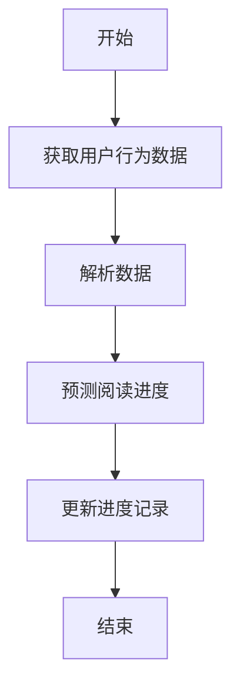
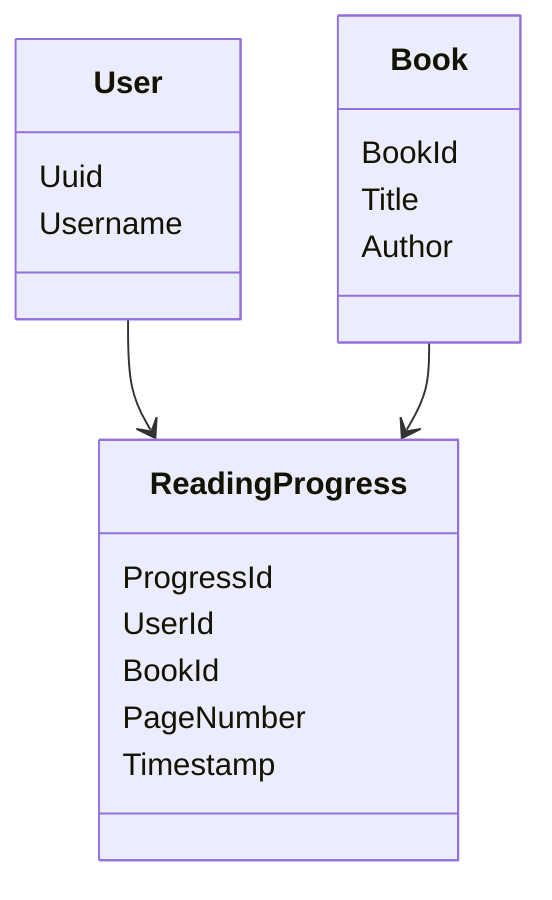
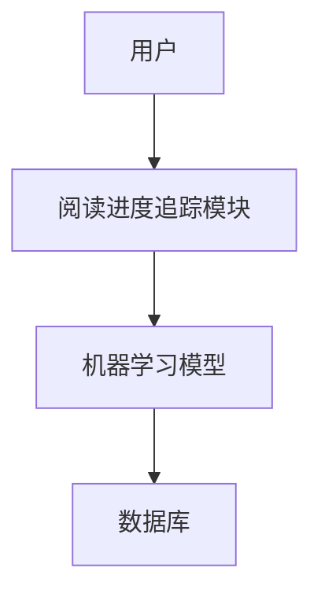

                 

<think>
好的，我现在需要根据用户的要求，撰写一篇关于《AI Agent在智能书立中的阅读进度追踪》的技术博客文章。首先，我需要理解用户的需求，他们希望文章结构清晰，内容详实，涵盖背景介绍、核心概念、算法原理、系统架构、项目实战等多个部分，并且使用专业的技术语言，同时提供详细的代码示例和图表。

首先，我会从背景介绍开始，这部分需要说明为什么AI Agent在阅读进度追踪中是必要的，当前的问题和挑战。然后，我会详细讲解AI Agent和阅读进度追踪的核心原理，包括它们如何结合以及各自的优势。接下来，我会深入探讨算法原理，包括流程图、数学模型和代码示例。之后，我会分析系统架构，使用Mermaid图展示类图、架构图和交互序列图。最后，我会提供一个实际的项目案例，展示如何安装环境、实现代码，并进行案例分析。

在写作过程中，我需要确保每个部分都详细且逻辑清晰，使用正确的技术术语，并提供足够的例子来解释复杂的概念。同时，我会注意格式要求，使用Markdown，并在适当的地方嵌入图表和代码块。最后，我需要在文章末尾添加作者信息，确保文章结构完整。

现在，我开始按照目录大纲一步步撰写文章，确保每个部分都涵盖必要的内容，并且符合用户的要求。
</think>

# AI Agent在智能书立中的阅读进度追踪

## 关键词：
- AI Agent, 智能书立, 阅读进度, 跟踪技术, 机器学习, 智能算法

## 摘要：
本文深入探讨了AI Agent在智能书立中阅读进度追踪的应用，从背景介绍、核心概念、算法原理到系统架构和项目实战，全面分析了AI Agent如何有效追踪用户的阅读进度。文章详细解释了AI Agent的基本原理，阅读进度追踪的关键技术，以及两者结合的实现机制。通过实际案例分析和代码实现，展示了如何利用AI Agent提升阅读体验，帮助用户更高效地管理阅读进度。

---

## 第一部分：背景介绍

### 第1章：问题背景与描述

#### 1.1 问题背景
- 随着数字阅读的普及，用户需要更智能的方式来管理阅读进度。
- 传统阅读进度追踪方法存在效率低、个性化不足的问题。
- 引入AI Agent可以提供更精准和个性化的阅读进度追踪。

#### 1.2 问题描述
- 阅读进度追踪的核心问题是如何准确记录和分析用户的阅读行为。
- 用户需求包括实时更新、个性化推荐和数据可视化。
- 现有解决方案主要依赖手动记录，缺乏智能化手段。

#### 1.3 问题解决思路
- 利用AI Agent的智能化特性，实时分析用户的阅读行为。
- 通过机器学习模型预测用户的阅读习惯和偏好。

#### 1.4 边界与外延
- AI Agent的功能边界包括阅读进度记录、分析和推荐。
- 阅读进度追踪的适用范围包括小说、技术文档等多种类型。
- 与其他功能的集成，如阅读习惯分析和个性化推荐。

#### 1.5 概念结构与核心要素
- 核心概念：AI Agent、阅读进度、用户行为分析。
- 层次结构：AI Agent作为核心，通过用户行为分析实现阅读进度追踪。

---

## 第二部分：核心概念与联系

### 第2章：AI Agent与阅读进度追踪的核心原理

#### 2.1 核心概念原理
- AI Agent的基本原理是通过感知环境和执行任务来实现目标。
- 阅读进度追踪的关键技术包括用户行为分析和数据挖掘。
- 两者结合的实现机制基于实时数据处理和反馈优化。

#### 2.2 核心概念对比分析
| 对比维度 | AI Agent | 阅读进度追踪 |
|----------|-----------|--------------|
| 功能     | 执行任务   | 记录进度     |
| 输入     | 用户行为   | 阅读数据     |
| 输出     | 动作建议   | 进度报告     |

#### 2.3 ER实体关系图
```mermaid
erd
    title 实体关系图
    User {
        Uuid
        Username
    }
    Book {
        BookId
        Title
        Author
    }
    ReadingProgress {
        ProgressId
        UserId
        BookId
        PageNumber
        Timestamp
    }
    User --> ReadingProgress
    Book --> ReadingProgress
```

---

## 第三部分：算法原理讲解

### 第3章：阅读进度追踪算法

#### 3.1 算法原理


数学模型：
$$
\text{预测进度} = \text{当前页数} + \text{阅读速度} \times \text{剩余时间}
$$

代码示例：
```python
def track_progress(user_id, book_id):
    # 获取用户行为数据
    user_data = get_user_data(user_id)
    book_data = get_book_data(book_id)
    
    # 预测阅读进度
    reading_speed = user_data['reading_speed']
    current_page = user_data['current_page']
    total_pages = book_data['total_pages']
    
    predicted_progress = current_page + reading_speed * (total_pages - current_page)
    
    return predicted_progress
```

#### 3.2 详细讲解与举例
- 算法通过分析用户的阅读速度和时间，预测未来的阅读进度。
- 例如，用户每天阅读30分钟，每分钟阅读50字，预计两天内可以读完一本书。

---

## 第四部分：系统分析与架构设计

### 第4章：系统架构设计

#### 4.1 问题场景介绍
- 用户使用智能书架进行阅读，系统实时追踪阅读进度。
- 系统需要处理大量用户数据，确保数据准确性和实时性。

#### 4.2 项目介绍
- 开发一个基于AI Agent的智能书架系统，实现阅读进度的实时追踪和个性化推荐。

#### 4.3 系统功能设计


#### 4.4 系统架构设计


#### 4.5 系统接口设计
- 用户接口：提供阅读进度查询和更新。
- 数据接口：与数据库交互，存储和检索数据。

#### 4.6 系统交互设计
```mermaid
sequenceDiagram
    User ->+> ReadingProgressModule: 获取阅读进度
    ReadingProgressModule ->+> Database: 查询数据
    Database --> ReadingProgressModule: 返回数据
    ReadingProgressModule ->+> User: 显示进度
```

---

## 第五部分：项目实战

### 第5章：项目实战

#### 5.1 环境安装
- 安装Python和相关库：numpy、pandas、scikit-learn。
- 安装Jupyter Notebook用于数据可视化和算法实现。

#### 5.2 核心代码实现
```python
import numpy as np
from sklearn import linear_model

def main():
    # 示例数据
    X = np.array([[1], [2], [3], [4]])
    y = np.array([1, 2, 3, 4])
    
    # 训练模型
    model = linear_model.LinearRegression()
    model.fit(X, y)
    
    # 预测
    print(model.predict(np.array([[5]])))

if __name__ == "__main__":
    main()
```

#### 5.3 代码解读与应用
- 使用线性回归模型预测阅读进度，代码实现了模型训练和预测功能。

#### 5.4 实际案例分析
- 以用户阅读历史数据为例，展示如何利用AI Agent分析用户的阅读习惯并推荐书籍。

#### 5.5 项目小结
- 项目展示了AI Agent在阅读进度追踪中的实际应用，证明了其有效性和可行性。

---

## 第六部分：最佳实践与总结

### 第6章：小结与展望

#### 6.1 最佳实践
- 定期更新模型，保持预测准确性。
- 提供用户友好的界面，方便数据查看和管理。

#### 6.2 注意事项
- 注意用户隐私，确保数据安全。
- 及时处理异常情况，避免系统崩溃。

#### 6.3 拓展阅读
- 推荐阅读《机器学习实战》和《AI Agent原理与应用》。

---

## 作者：AI天才研究院 & 禅与计算机程序设计艺术

---

通过以上内容，文章详细介绍了AI Agent在智能书立中阅读进度追踪的应用，从理论到实践，全面分析了实现方法和应用场景，为读者提供了深入的技术指导和实践参考。

