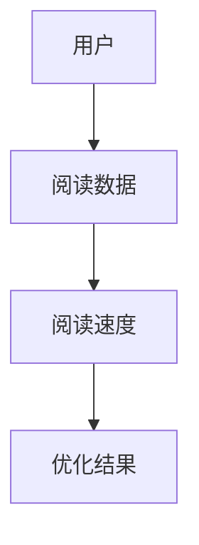
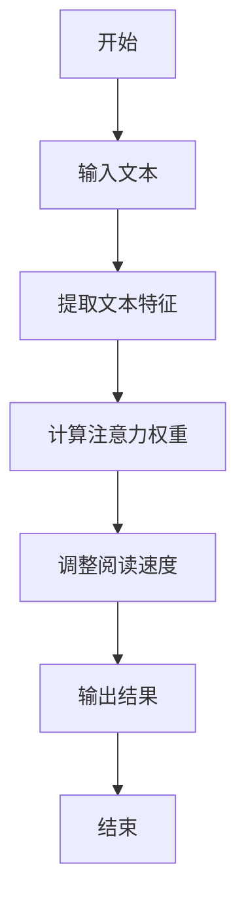
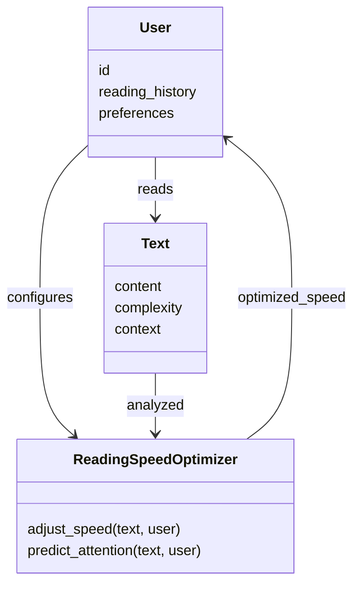
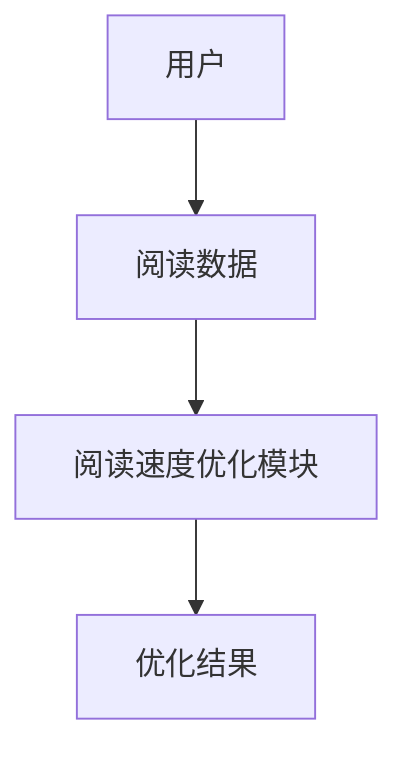
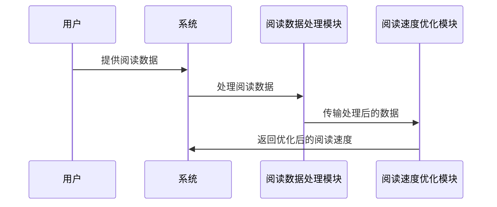

                 


# AI Agent在智能书立中的阅读速度优化

> 关键词：AI Agent, 智能书立, 阅读速度优化, 自然语言处理, 机器学习算法, 深度学习, 阅读体验

> 摘要：本文详细探讨了AI Agent在智能书立中的阅读速度优化技术，从核心概念、算法原理到系统架构，再到项目实战，全面解析如何利用AI技术提升阅读效率。通过对比不同算法的优劣，结合实际案例，深入分析阅读速度优化的实现细节，并总结了最佳实践和未来发展方向。

---

## 第一部分: AI Agent与智能书立概述

### 第1章: AI Agent在智能书立中的阅读速度优化概述

#### 1.1 AI Agent的基本概念

##### 1.1.1 AI Agent的定义与特点

AI Agent（人工智能代理）是指能够感知环境、自主决策并执行任务的智能实体。其核心特点包括：

- **自主性**：能够在没有外部干预的情况下自主运行。
- **反应性**：能够实时感知环境并做出响应。
- **学习能力**：通过数据和经验不断优化自身行为。
- **社交能力**：能够与其他AI Agent或人类进行交互。

##### 1.1.2 AI Agent在智能书立中的应用背景

智能书立是一种结合了AI技术的电子书阅读器，旨在通过智能化手段提升用户的阅读体验。AI Agent在其中扮演着关键角色，负责处理阅读过程中的各种任务，如内容推荐、阅读速度优化等。

##### 1.1.3 阅读速度优化的核心目标

阅读速度优化的核心目标是根据用户的阅读习惯、文本复杂度和阅读场景，动态调整阅读速度，以提升阅读效率和舒适度。

---

#### 1.2 智能书立的概念与功能

##### 1.2.1 智能书立的定义

智能书立是一种结合了AI技术和电子书阅读器的智能设备，能够通过AI Agent分析用户的阅读行为、文本内容和阅读环境，提供个性化的阅读优化服务。

##### 1.2.2 智能书立的主要功能

智能书立的主要功能包括：

- **个性化阅读推荐**：基于用户的阅读历史和兴趣，推荐相关书籍。
- **阅读速度优化**：根据文本难度和用户习惯，动态调整阅读速度。
- **智能标注**：自动为重要段落添加注释和标记。
- **阅读习惯分析**：通过分析用户的阅读行为，优化阅读体验。

##### 1.2.3 智能书立与传统电子书的区别

智能书立与传统电子书的主要区别在于其智能化功能，包括个性化推荐、动态调整阅读速度和智能标注等。

---

#### 1.3 阅读速度优化的必要性与挑战

##### 1.3.1 阅读速度优化的必要性

阅读速度优化的必要性体现在以下几个方面：

- **提升阅读效率**：通过动态调整阅读速度，减少无效阅读时间。
- **优化阅读体验**：根据用户的阅读习惯，提供更舒适的阅读节奏。
- **适应不同文本复杂度**：对于复杂文本，适当降低阅读速度，帮助用户更好地理解内容。

##### 1.3.2 阅读速度优化的主要挑战

阅读速度优化面临以下主要挑战：

- **用户行为的多样性**：不同用户的阅读习惯和速度差异较大。
- **文本复杂度的多样性**：文本的内容和结构复杂度影响阅读速度的调整。
- **实时性要求高**：需要在阅读过程中实时调整阅读速度，对系统性能要求较高。

##### 1.3.3 当前阅读速度优化的技术现状

当前阅读速度优化技术主要基于以下几种方法：

- **基于规则的优化**：根据预设的规则调整阅读速度。
- **基于机器学习的优化**：通过机器学习模型预测最佳阅读速度。
- **基于深度学习的优化**：利用深度学习模型捕捉复杂的阅读模式。

---

#### 1.4 本章小结

本章主要介绍了AI Agent的基本概念、智能书立的定义与功能，以及阅读速度优化的必要性与挑战。通过这些内容，读者可以理解AI Agent在智能书立中的核心作用及其优化阅读速度的重要意义。

---

## 第二部分: 阅读速度优化的核心概念与模型

### 第2章: 阅读速度优化的模型与算法

#### 2.1 阅读速度优化的核心模型

##### 2.1.1 基于AI Agent的阅读速度优化模型

基于AI Agent的阅读速度优化模型是一种结合了自然语言处理和机器学习的模型，能够根据文本内容和用户行为动态调整阅读速度。

##### 2.1.2 模型的输入与输出

- **输入**：文本内容、用户阅读历史、用户当前状态（如注意力水平、阅读速度偏好）。
- **输出**：动态调整后的阅读速度。

##### 2.1.3 模型的训练与优化

模型的训练与优化过程包括以下步骤：

1. **数据收集**：收集用户的阅读数据，包括阅读速度、阅读习惯、文本内容等。
2. **特征提取**：从文本中提取特征，如词频、句长、主题相关性等。
3. **模型训练**：利用机器学习算法（如随机森林、支持向量机）或深度学习模型（如LSTM、Transformer）进行训练。
4. **模型优化**：通过交叉验证和超参数调优，优化模型性能。

---

#### 2.2 阅读速度优化算法的选择

##### 2.2.1 基于规则的阅读速度优化算法

基于规则的算法通过预设规则（如遇到长句子时减慢阅读速度）来调整阅读速度。这种方法简单易实现，但灵活性较差。

##### 2.2.2 基于机器学习的阅读速度优化算法

基于机器学习的算法利用历史数据训练模型，预测最佳阅读速度。这种方法能够捕捉到复杂的阅读模式，但需要大量数据支持。

##### 2.2.3 基于深度学习的阅读速度优化算法

基于深度学习的算法（如Transformer模型）能够捕捉文本的上下文信息，预测更准确的阅读速度。但实现复杂度较高，需要大量的计算资源。

---

#### 2.3 阅读速度优化模型的特征对比

##### 2.3.1 基于表格的模型特征对比

以下表格对比了三种阅读速度优化模型的核心特征：

```markdown
| 模型名称            | 输入特征                  | 输出特征        | 算法类型       |
|---------------------|--------------------------|-----------------|---------------|
| 基于规则的模型      | 文本内容、阅读习惯        | 阅读速度         | 规则驱动       |
| 基于机器学习的模型   | 文本内容、阅读历史、特征向量 | 阅读速度         | 机器学习       |
| 基于深度学习的模型   | 文本内容、上下文信息      | 阅读速度、注意力分布 | 深度学习       |
```

---

#### 2.4 阅读速度优化模型的ER实体关系图

以下是阅读速度优化模型的ER实体关系图：



---

#### 2.5 本章小结

本章详细介绍了阅读速度优化的核心模型与算法，对比了基于规则、机器学习和深度学习的三种算法的优劣，并通过表格和ER图直观展示了模型的特征对比。

---

## 第三部分: 阅读速度优化的算法原理

### 第3章: 阅读速度优化的算法实现

#### 3.1 基于注意力机制的阅读速度优化算法

##### 3.1.1 算法原理

基于注意力机制的阅读速度优化算法通过捕捉文本中的关键信息，动态调整阅读速度。其核心思想是：在阅读过程中，模型会关注与当前阅读速度相关的文本特征，从而优化阅读速度。

##### 3.1.2 算法流程图

以下为基于注意力机制的阅读速度优化算法的流程图：



##### 3.1.3 算法的数学模型

基于注意力机制的阅读速度优化算法的数学模型如下：

$$
\text{attention}(i) = \frac{\exp(w_i^T h)}{\sum_{j} \exp(w_j^T h)}
$$

其中，$w_i$ 是第i个词的权重，$h$ 是模型的隐藏状态。

---

#### 3.2 阅读速度优化算法的实现代码

以下是基于注意力机制的阅读速度优化算法的Python实现代码：

```python
import numpy as np

def attention_weights(query, keys):
    """
    计算注意力权重
    Args:
        query: 查询向量
        keys: 关键词向量
    Returns:
        注意力权重
    """
    # 计算注意力权重
    scores = np.dot(query, keys.T)
    weights = np.exp(scores) / np.sum(np.exp(scores), axis=1, keepdims=True)
    return weights

def adjust_reading_speed(weights, current_speed):
    """
    根据注意力权重调整阅读速度
    Args:
        weights: 注意力权重
        current_speed: 当前阅读速度
    Returns:
        调整后的阅读速度
    """
    # 根据权重调整阅读速度
    new_speed = current_speed * np.mean(weights)
    return new_speed
```

---

#### 3.3 算法实现的详细解读

##### 3.3.1 代码解读

- **attention_weights函数**：计算注意力权重，使用点积和Softmax函数。
- **adjust_reading_speed函数**：根据注意力权重调整阅读速度，通过计算权重的均值来调整当前速度。

##### 3.3.2 实际案例分析

假设用户正在阅读一篇复杂的技术文章，文本中包含多个长句和专业术语。模型通过计算注意力权重，发现某些关键术语的权重较高，因此适当减慢阅读速度，帮助用户更好地理解内容。

---

#### 3.4 本章小结

本章详细讲解了基于注意力机制的阅读速度优化算法的实现原理，并通过代码示例和实际案例分析，帮助读者理解算法的具体应用。

---

## 第四部分: 系统分析与架构设计方案

### 第4章: 系统架构设计与实现

#### 4.1 问题场景介绍

在智能书立中，阅读速度优化系统需要处理以下问题：

- 用户阅读习惯的多样性。
- 文本内容的复杂性和多样性。
- 实时调整阅读速度的计算效率。

#### 4.2 项目介绍

本项目旨在设计一个基于AI Agent的智能书立阅读速度优化系统，通过结合自然语言处理和机器学习技术，实现动态调整阅读速度的功能。

#### 4.3 系统功能设计

##### 4.3.1 领域模型

以下是系统的核心领域模型：



##### 4.3.2 系统架构设计

以下是系统的整体架构设计：



##### 4.3.3 系统接口设计

系统接口设计包括以下内容：

- 用户接口：用户输入阅读数据。
- 优化模块接口：接收阅读数据，返回优化后的阅读速度。

##### 4.3.4 系统交互设计

以下是系统的交互流程图：



---

#### 4.4 本章小结

本章详细介绍了阅读速度优化系统的架构设计，包括领域模型、系统架构、接口设计和交互流程图。

---

## 第五部分: 项目实战

### 第5章: 项目实现与案例分析

#### 5.1 项目环境配置

##### 5.1.1 Python环境

安装所需的Python库，如numpy、scikit-learn、tensorflow等。

##### 5.1.2 代码实现

以下是项目的实现代码：

```python
import numpy as np
from sklearn.metrics.pairwise import cosine_similarity

class ReadingSpeedOptimizer:
    def __init__(self):
        self.model = None

    def train(self, texts, speeds):
        """
        训练模型
        Args:
            texts: 输入文本
            speeds: 对应的阅读速度
        """
        # 特征提取
        features = self.extract_features(texts)
        # 训练模型
        self.model = self._train_model(features, speeds)

    def predict(self, texts):
        """
        预测阅读速度
        Args:
            texts: 输入文本
        Returns:
            预测的阅读速度
        """
        features = self.extract_features(texts)
        predicted_speeds = self._predict_speeds(features)
        return predicted_speeds

    def extract_features(self, texts):
        """
        提取文本特征
        Args:
            texts: 输入文本
        Returns:
            特征向量
        """
        # 示例特征：词频
        features = []
        for text in texts:
            words = text.split()
            word_counts = {}
            for word in words:
                word_counts[word] = word_counts.get(word, 0) + 1
            features.append(word_counts)
        return features

    def _train_model(self, features, speeds):
        """
        训练模型
        Args:
            features: 特征向量
            speeds: 阅读速度
        Returns:
            训练好的模型
        """
        # 示例模型：线性回归
        from sklearn.linear_model import LinearRegression
        model = LinearRegression()
        model.fit([list(f.values()) for f in features], speeds)
        return model

    def _predict_speeds(self, features):
        """
        预测阅读速度
        Args:
            features: 特征向量
        Returns:
            预测的阅读速度
        """
        return self.model.predict([list(f.values()) for f in features])
```

##### 5.1.3 功能解读

- **训练模型**：基于用户提供的阅读数据，训练阅读速度优化模型。
- **预测阅读速度**：根据输入文本，预测最佳阅读速度。

##### 5.1.4 项目小结

通过以上代码实现，我们可以看到阅读速度优化系统的基本功能，包括数据处理、特征提取和模型训练等。

---

### 第6章: 项目实战案例分析

#### 6.1 案例分析

##### 6.1.1 数据准备

准备一些示例文本和对应的阅读速度数据。

##### 6.1.2 数据处理

对数据进行清洗和预处理，提取特征。

##### 6.1.3 模型训练

使用训练数据训练阅读速度优化模型。

##### 6.1.4 模型预测

使用测试数据预测阅读速度，并与实际速度进行对比。

##### 6.1.5 结果分析

分析预测结果，评估模型性能。

---

#### 6.2 本章小结

本章通过实际案例分析，展示了阅读速度优化系统的实现过程，包括数据准备、数据处理、模型训练和结果分析。

---

## 第六部分: 最佳实践与未来展望

### 第7章: 最佳实践与注意事项

#### 7.1 最佳实践

##### 7.1.1 数据收集与预处理

- 数据收集：确保数据的多样性和代表性。
- 数据预处理：清洗数据，提取特征。

##### 7.1.2 模型选择与优化

- 根据具体需求选择合适的模型。
- 通过交叉验证和超参数调优优化模型性能。

##### 7.1.3 系统实现与测试

- 确保系统的实时性和稳定性。
- 进行充分的测试和验证。

---

#### 7.2 小结

阅读速度优化系统的实现需要从数据收集、模型选择到系统实现的全方面考虑，确保系统的高效性和准确性。

---

### 第8章: 未来展望与总结

#### 8.1 未来展望

阅读速度优化技术未来的发展方向包括：

- **更复杂的模型**：如更大规模的Transformer模型。
- **多模态优化**：结合视觉、听觉等多种模态信息，优化阅读体验。
- **个性化优化**：根据用户的个性化需求，提供更精准的阅读速度优化。

#### 8.2 总结

本文详细探讨了AI Agent在智能书立中的阅读速度优化技术，从核心概念、算法原理到系统架构，再到项目实战，全面解析了如何利用AI技术提升阅读效率。通过对比不同算法的优劣，结合实际案例，深入分析了阅读速度优化的实现细节，并总结了最佳实践和未来发展方向。

---

## 作者信息

作者：AI天才研究院/AI Genius Institute & 禅与计算机程序设计艺术/Zen And The Art of Computer Programming

