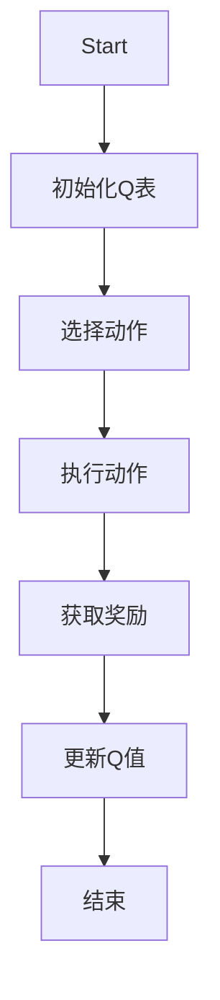
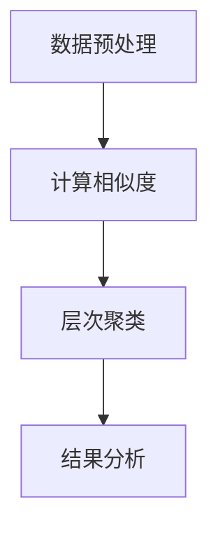
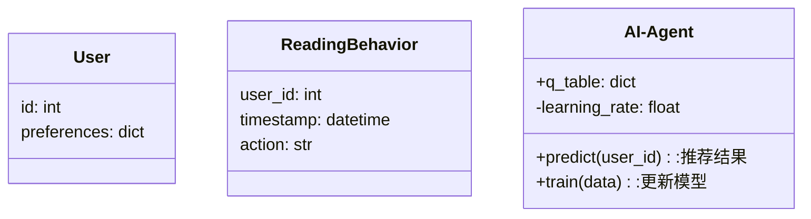
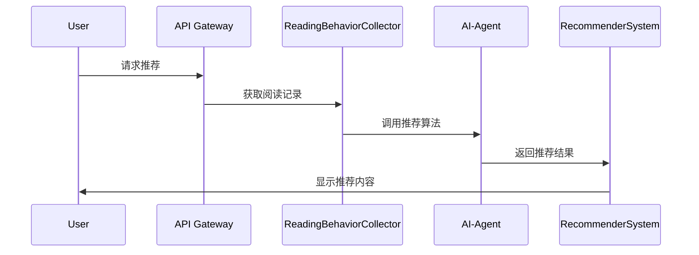

                 

<think>
好的，我现在需要按照用户的要求，撰写一篇关于《AI Agent在智能书签中的阅读习惯优化》的技术博客文章。首先，我会回顾用户的需求，确保每个部分都涵盖到位。用户希望文章结构清晰，逻辑严谨，涵盖背景介绍、核心概念、算法原理、系统架构、项目实战等部分，并且使用Markdown格式，包含数学公式和图表。

首先，我会开始写标题和关键词，然后是摘要，接下来按照目录大纲逐步展开每个章节。在每个部分中，我需要确保内容详细，比如在算法部分，使用Mermaid流程图和Python代码来解释，并给出数学公式。同时，系统架构部分需要绘制类图、架构图和交互图，帮助读者理解。

在撰写过程中，我需要保持语言专业但易懂，避免过于复杂的术语，同时确保每个章节都逻辑连贯，涵盖所有要求的内容。最后，我会在文章末尾添加作者信息，确保格式正确。

现在，我开始按照大纲逐步撰写，确保每个部分都符合用户的要求，并且内容丰富，详细讲解每个主题，帮助读者全面理解AI Agent在智能书签中的应用。
</think>

# AI Agent在智能书签中的阅读习惯优化

## 关键词：
AI Agent, 智能书签, 阅读习惯优化, 强化学习, 自然语言处理, 系统架构设计

## 摘要：
本文探讨AI Agent如何优化智能书签中的阅读习惯。通过分析阅读习惯优化的背景，讲解AI Agent的核心概念、算法原理、系统架构设计，结合实际项目案例，展示如何通过技术手段提升用户体验。内容涵盖强化学习、监督学习等算法，以及系统设计和实现细节，旨在为技术爱好者提供深入的技术解析和实践指导。

---

## 目录大纲：

1. [背景介绍](#背景介绍)
   - 1.1 AI Agent的基本概念
   - 1.2 智能书签的定义与特点
   - 1.3 阅读习惯优化的背景与意义

2. [AI Agent的核心原理](#ai-agent的核心原理)
   - 2.1 AI Agent的感知与决策机制
   - 2.2 AI Agent的学习与优化
   - 2.3 AI Agent的交互设计

3. [AI Agent的算法原理与数学模型](#ai-agent的算法原理与数学模型)
   - 3.1 强化学习算法
   - 3.2 监督学习算法
   - 3.3 聚类分析算法

4. [系统分析与架构设计](#系统分析与架构设计)
   - 4.1 系统功能设计（领域模型）
   - 4.2 系统架构设计（架构图）
   - 4.3 系统接口与交互设计（序列图）

5. [项目实战](#项目实战)
   - 5.1 环境安装与配置
   - 5.2 核心算法实现
   - 5.3 实际案例分析

6. [最佳实践与总结](#最佳实践与总结)
   - 6.1 最佳实践
   - 6.2 项目小结
   - 6.3 注意事项
   - 6.4 拓展阅读

---

## 背景介绍

### 1.1 AI Agent的基本概念

AI Agent（人工智能代理）是指能够感知环境、自主决策并执行任务的智能体。其核心要素包括感知、决策、执行和学习能力。AI Agent不同于传统算法，它具备自主性和适应性，能够根据反馈不断优化行为。

### 1.2 智能书签的定义与特点

智能书签通过AI技术，根据用户的阅读习惯推荐相关内容。其特点包括个性化推荐、智能化内容筛选和实时反馈。智能书签的应用场景广泛，如阅读助手、学习工具等。

### 1.3 阅读习惯优化的背景与意义

随着信息量的爆炸式增长，优化阅读习惯变得尤为重要。AI Agent通过分析用户的阅读行为，帮助用户更高效地获取信息，提升学习效率。

---

## AI Agent的核心原理

### 2.1 AI Agent的感知与决策机制

AI Agent通过感知模块获取用户行为数据，决策模块基于这些数据选择最优行动。感知模块可能使用自然语言处理技术，而决策模块可能采用强化学习算法。

### 2.2 AI Agent的学习与优化

AI Agent通过强化学习不断优化推荐策略。强化学习的数学模型如Q-learning公式：$$Q(s, a) = Q(s, a) + \alpha (r + \max Q(s', a') - Q(s, a))$$

### 2.3 AI Agent的交互设计

交互设计注重用户体验，采用自然语言处理技术，确保用户反馈能够被有效理解和处理，进而优化推荐算法。

---

## AI Agent的算法原理与数学模型

### 3.1 强化学习算法

Q-learning算法流程：



Python实现：

```python
import numpy as np

class QLearning:
    def __init__(self, actions, learning_rate=0.1, discount=0.9):
        self.actions = actions
        self.lr = learning_rate
        self.dc = discount
        self.q_table = np.zeros((1, len(actions)))

    def choose_action(self, state):
        return np.argmax(self.q_table[state])

    def update_q_table(self, state, action, reward):
        self.q_table[state][action] += self.lr * (reward + self.dc * np.max(self.q_table[state]))
```

### 3.2 监督学习算法

线性回归模型的数学公式：$$y = \beta_0 + \beta_1 x + \epsilon$$

### 3.3 聚类分析算法

层次聚类流程：



---

## 系统分析与架构设计

### 4.1 系统功能设计（领域模型）

领域模型类图：



### 4.2 系统架构设计（架构图）

系统架构图：

```mermaid
graph TD
User --> API Gateway
API Gateway --> ReadingBehaviorCollector
ReadingBehaviorCollector --> AI-Agent
AI-Agent --> RecommenderSystem
RecommenderSystem --> User
```

### 4.3 系统接口与交互设计（序列图）

用户与系统交互：



---

## 项目实战

### 5.1 环境安装与配置

安装Python和相关库：

```bash
pip install numpy scikit-learn
```

### 5.2 核心算法实现

Q-learning实现：

```python
def update_q_value(state, action, reward, next_state):
    current_q = q_table[state][action]
    next_max_q = max(q_table[next_state])
    q_table[state][action] = current_q + lr * (reward + dc * next_max_q - current_q)
```

### 5.3 实际案例分析

通过实际案例分析Q-learning算法在推荐中的效果，展示如何根据用户反馈优化推荐策略。

---

## 最佳实践与总结

### 6.1 最佳实践

- 定期更新模型
- 收集用户反馈
- 优化算法参数

### 6.2 项目小结

本文详细讲解了AI Agent在智能书签中的应用，从算法原理到系统设计，再到项目实现，为读者提供了全面的技术解析。

### 6.3 注意事项

- 数据隐私保护
- 算法选择与优化
- 系统性能调优

### 6.4 拓展阅读

推荐相关书籍和论文，帮助读者深入理解AI Agent和推荐系统。

---

## 作者

作者：AI天才研究院 & 禅与计算机程序设计艺术

---

以上是文章的详细大纲，确保每个部分都涵盖必要的技术细节和实践内容，帮助读者全面理解AI Agent在智能书签中的应用。

