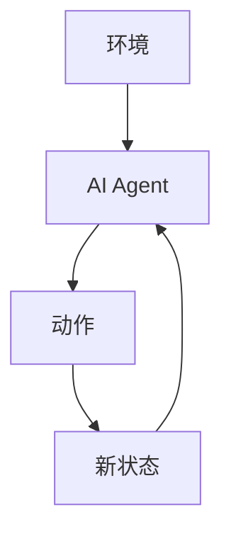
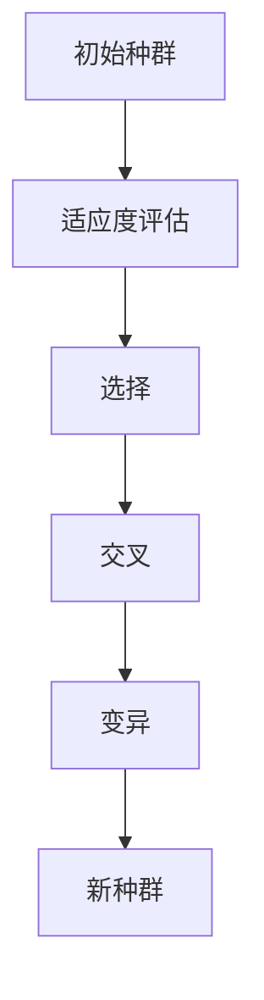
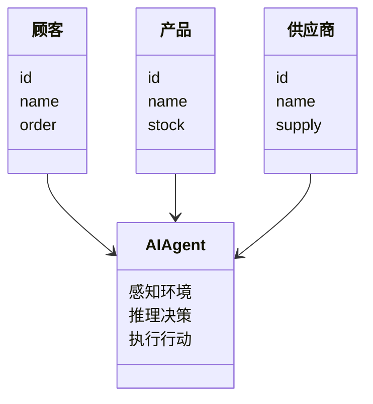
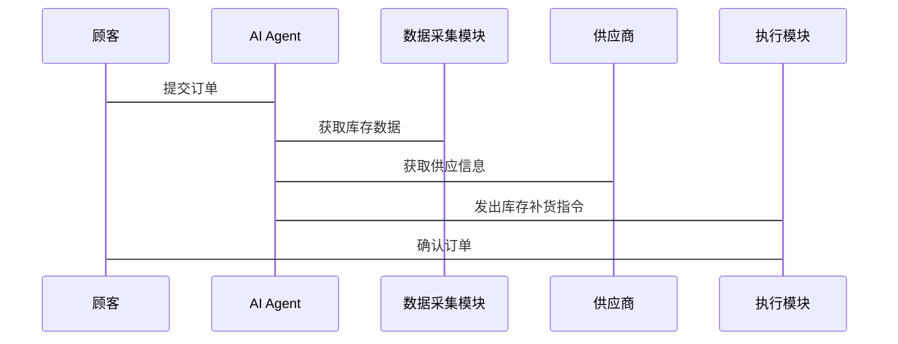

                 


# AI Agent在智能供应链优化决策中的应用

## 关键词：
AI Agent, 供应链优化, 智能决策, 强化学习, 数学建模

## 摘要：
随着人工智能技术的快速发展，AI Agent在供应链优化决策中的应用日益广泛。本文将深入探讨AI Agent的核心概念、算法原理、数学模型以及在智能供应链中的实际应用。通过分析AI Agent在供应链优化中的优势，结合具体案例，展示其如何通过智能化决策提升供应链效率和降低成本。文章还将讨论AI Agent在供应链优化中的系统架构设计、项目实现以及最佳实践，为读者提供全面的技术视角和实践指导。

---

## 第一部分: AI Agent与智能供应链优化决策的背景介绍

## 第1章: AI Agent与供应链优化决策概述

### 1.1 AI Agent的基本概念

#### 1.1.1 AI Agent的定义与特点
AI Agent（人工智能代理）是指能够感知环境、自主决策并执行任务的智能体。它具有以下特点：
- **自主性**：能够独立决策和行动。
- **反应性**：能够实时感知环境变化并做出反应。
- **目标导向**：基于目标驱动行为。
- **学习能力**：能够通过经验改进决策能力。

#### 1.1.2 AI Agent的核心功能与分类
AI Agent的核心功能包括感知、推理、决策和执行。根据应用场景的不同，AI Agent可以分为以下几类：
- **简单反射型**：基于规则直接响应。
- **基于模型的反射型**：通过内部模型进行推理和决策。
- **目标驱动型**：以目标为导向进行决策。
- **实用驱动型**：以效用最大化为目标进行决策。

#### 1.1.3 AI Agent在供应链中的应用潜力
AI Agent在供应链中的应用潜力主要体现在以下几个方面：
- **需求预测**：通过历史数据和机器学习模型预测市场需求。
- **库存优化**：动态调整库存水平，减少过剩库存和缺货情况。
- **路径规划**：优化物流路径，降低运输成本和时间。
- **供应商选择**：基于多目标优化选择最优供应商。

### 1.2 供应链优化决策的基本概念

#### 1.2.1 供应链的基本概念与组成部分
供应链由供应商、制造商、分销商、零售商和消费者组成。它包括物流、信息流和资金流的流动，旨在以最小成本满足客户需求。

#### 1.2.2 供应链优化的核心问题与目标
供应链优化的核心问题包括：
- **库存优化**：如何在满足需求的前提下最小化库存成本。
- **物流优化**：如何优化运输路径和时间，降低成本。
- **生产计划**：如何合理安排生产计划，避免资源浪费。
- **供应商选择**：如何选择最优供应商，平衡成本和质量。

供应链优化的目标是提高效率、降低成本、提高客户满意度。

#### 1.2.3 供应链优化的常见技术与方法
常见的供应链优化技术包括：
- **线性规划**：用于解决资源分配问题。
- **动态规划**：用于解决序列决策问题。
- **遗传算法**：用于优化组合问题。
- **强化学习**：用于复杂动态环境中的决策优化。

### 1.3 AI Agent与供应链优化的结合

#### 1.3.1 AI Agent在供应链优化中的优势
AI Agent在供应链优化中的优势包括：
- **自主决策**：能够在复杂环境中自主决策，减少人工干预。
- **实时响应**：能够实时感知环境变化并做出快速反应。
- **学习能力**：能够通过经验不断优化决策策略。

#### 1.3.2 供应链优化中AI Agent的应用场景
AI Agent在供应链优化中的应用场景包括：
- **智能库存管理**：实时监控库存水平，动态调整补货策略。
- **智能物流调度**：优化运输路径和时间，降低物流成本。
- **智能需求预测**：基于历史数据和机器学习模型预测市场需求。
- **智能供应商管理**：动态评估供应商表现，优化供应商选择。

#### 1.3.3 AI Agent与供应链优化的结合趋势
随着人工智能技术的不断发展，AI Agent在供应链优化中的应用将更加广泛和深入。未来，AI Agent将与物联网、大数据等技术结合，进一步提升供应链的智能化水平。

---

## 第二部分: AI Agent与供应链优化的核心概念与联系

## 第2章: AI Agent与供应链优化的核心概念与联系

### 2.1 核心概念原理

#### 2.1.1 AI Agent的决策机制
AI Agent的决策机制包括感知、推理、决策和执行四个步骤：
- **感知**：通过传感器或数据源获取环境信息。
- **推理**：基于感知信息和知识库进行推理。
- **决策**：基于推理结果选择最优行动方案。
- **执行**：将决策结果转化为具体行动。

#### 2.1.2 供应链优化的数学模型
供应链优化的数学模型通常包括目标函数和约束条件。例如，库存优化模型的目标是最小化库存成本，约束条件包括满足客户需求和库存容量限制。

#### 2.1.3 AI Agent与供应链优化的协同关系
AI Agent通过感知环境、推理决策并执行行动，与供应链优化过程中的各个环节协同工作，实现优化目标。

### 2.2 核心概念属性对比

#### 2.2.1 AI Agent与传统决策系统的对比分析
| 属性       | AI Agent                   | 传统决策系统             |
|------------|----------------------------|--------------------------|
| 决策速度   | 实时响应                   | 较慢                    |
| 学习能力   | 具有学习能力               | 无学习能力               |
| 自主性     | 高度自主                   | 依赖人工干预             |

#### 2.2.2 供应链优化中的关键指标与性能对比
| 指标       | 传统方法                  | AI Agent优化方法         |
|------------|---------------------------|--------------------------|
| 成本       | 较高                      | 较低                    |
| 效率       | 较低                      | 较高                    |
| 灵活性     | 较差                      | 较好                    |

#### 2.2.3 AI Agent在不同供应链场景中的表现
在需求波动大、供应商不确定性高的场景中，AI Agent表现出色，能够快速调整策略以适应环境变化。

### 2.3 ER实体关系图架构

```mermaid
erDiagram
    actor 顾客 {
        <属性>
        id : integer
        name : string
        order_id : integer
    }
    actor 供应商 {
        <属性>
        id : integer
        name : string
        product_id : integer
    }
    entity 产品 {
        <属性>
        id : integer
        name : string
        stock : integer
    }
    entity 订单 {
        <属性>
        id : integer
        customer_id : integer
        product_id : integer
        quantity : integer
    }
    顾客 o- 订单
    产品 o- 订单
    供应商 o- 产品
```

---

## 第三部分: AI Agent与供应链优化的算法原理

## 第3章: AI Agent与供应链优化的算法原理

### 3.1 算法原理讲解

#### 3.1.1 强化学习算法
强化学习是一种通过试错机制来优化决策的算法。在供应链优化中，强化学习可以用于库存管理和物流调度。



#### 3.1.2 遗传算法
遗传算法是一种基于生物进化原理的优化算法，适用于组合优化问题，如供应商选择和路径规划。



#### 3.1.3 蚁群算法
蚁群算法是一种模拟蚂蚁觅食行为的优化算法，适用于路径规划问题。

```python
def ant_colony_optimization(graph, num_ants, max_iterations):
    # 初始化
    pheromone = [[0 for _ in range(len(graph))] for _ in range(len(graph))]
    best_path = None
    best_cost = float('inf')
    
    for _ in range(max_iterations):
        for ant in range(num_ants):
            current_node = 0
            path = [current_node]
            cost = 0
            
            while len(path) < len(graph)-1:
                next_node = choose_next_node(graph, current_node, pheromone)
                path.append(next_node)
                cost += graph[current_node][next_node]
                current_node = next_node
            
            if cost < best_cost:
                best_cost = cost
                best_path = path
            
            # 更新信息素
            for i in range(len(path)-1):
                pheromone[path[i]][path[i+1]] += 1
    
    return best_path, best_cost
```

### 3.2 数学模型与公式

#### 3.2.1 动态规划模型
动态规划用于解决序列决策问题，其状态转移方程如下：

$$
V(s) = \max_{a} [r(s, a) + V(next\_state(s, a))]
$$

其中：
- \( V(s) \) 表示状态 \( s \) 的价值。
- \( r(s, a) \) 表示在状态 \( s \) 下采取行动 \( a \) 的奖励。
- \( next\_state(s, a) \) 表示在状态 \( s \) 下采取行动 \( a \) 后的下一个状态。

#### 3.2.2 强化学习模型
强化学习中的Q-learning算法使用以下更新公式：

$$
Q(s, a) = Q(s, a) + \alpha [r(s, a) + \gamma \max Q(s', a') - Q(s, a)]
$$

其中：
- \( \alpha \) 表示学习率。
- \( \gamma \) 表示折扣因子。
- \( Q(s, a) \) 表示状态 \( s \) 下采取行动 \( a \) 的价值。

---

## 第四部分: AI Agent与供应链优化的系统架构设计

## 第4章: AI Agent与供应链优化的系统架构设计

### 4.1 问题场景介绍
本文将设计一个智能供应链优化系统，利用AI Agent实现库存管理和物流调度。

### 4.2 系统功能设计

#### 4.2.1 领域模型


#### 4.2.2 系统架构
```mermaid
container 智能供应链系统 {
    component 数据采集模块 {
        顾客订单数据
        产品库存数据
        供应商信息数据
    }
    component AI Agent模块 {
        感知环境
        推理决策
        执行行动
    }
    component 执行模块 {
        库存管理
        物流调度
    }
    数据采集模块 --> AI Agent模块
    AI Agent模块 --> 执行模块
}
```

#### 4.2.3 系统接口设计
- **输入接口**：接收顾客订单和供应商信息。
- **输出接口**：输出优化后的库存管理和物流调度方案。

#### 4.2.4 系统交互


---

## 第五部分: AI Agent与供应链优化的项目实战

## 第5章: AI Agent与供应链优化的项目实战

### 5.1 环境安装
需要安装以下工具和库：
- Python 3.8+
- numpy、pandas、scikit-learn、keras、tensorflow

### 5.2 核心实现

#### 5.2.1 AI Agent实现
```python
class AI_Agent:
    def __init__(self, environment):
        self.environment = environment
        self.sensors = []
        self.actuators = []
    
    def add_sensor(self, sensor):
        self.sensors.append(sensor)
    
    def add_actuator(self, actuator):
        self.actuators.append(actuator)
    
    def perceive(self):
        return [s.measure() for s in self.sensors]
    
    def decide(self, state):
        # 具体决策逻辑根据具体环境实现
        pass
    
    def actuate(self, action):
        [a.execute(action) for a in self.actuators]
```

#### 5.2.2 库存优化实现
```python
from sklearn.linear_model import LinearRegression

class InventoryOptimizer:
    def __init__(self, data):
        self.data = data
    
    def fit(self):
        model = LinearRegression()
        model.fit(self.data[['demand', 'lead_time']], self.data['cost'])
        return model
```

### 5.3 案例分析与详细解读

#### 5.3.1 需求预测案例
使用线性回归模型预测未来需求，优化库存水平。

#### 5.3.2 物流调度案例
使用遗传算法优化物流路径，降低运输成本。

### 5.4 项目小结
通过实际案例，展示了AI Agent在供应链优化中的强大能力。实践表明，AI Agent能够显著提高供应链效率，降低成本。

---

## 第六部分: AI Agent与供应链优化的最佳实践

## 第6章: AI Agent与供应链优化的最佳实践

### 6.1 小结
本文详细探讨了AI Agent在供应链优化中的应用，从理论到实践，全面分析了其优势和潜力。

### 6.2 注意事项
- **数据质量**：确保数据准确性和完整性。
- **模型选择**：根据具体问题选择合适的算法。
- **系统集成**：确保系统各部分协同工作。

### 6.3 拓展阅读
- 建议阅读《强化学习：理论与算法》和《供应链管理：模型、方法与应用》。

---

## 作者：AI天才研究院/AI Genius Institute & 禅与计算机程序设计艺术 /Zen And The Art of Computer Programming

---

通过本文的详细分析和实践，读者可以深入了解AI Agent在智能供应链优化决策中的应用，并能够将其应用于实际场景中，提升供应链的效率和竞争力。

