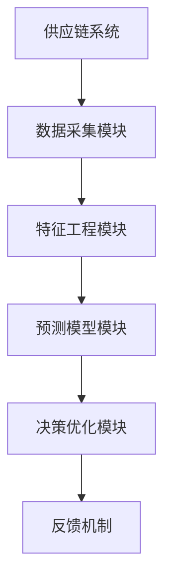
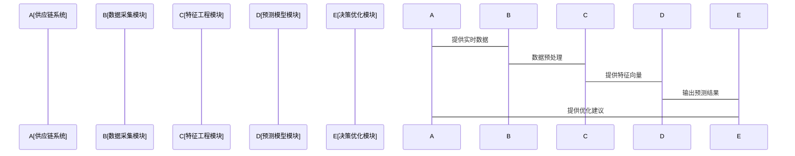

                 


# AI Agent在智能供应链需求预测中的应用

## 关键词：AI Agent, 智能供应链, 需求预测, 机器学习, 时间序列分析, 强化学习, 深度学习

## 摘要：  
随着人工智能技术的快速发展，AI Agent（人工智能代理）在供应链管理中的应用越来越广泛。本文将探讨AI Agent如何在智能供应链的需求预测中发挥作用，分析其核心算法原理、系统架构设计以及实际应用场景。通过结合时间序列分析、集成学习和深度学习等技术，AI Agent能够显著提升需求预测的准确性和效率，为供应链优化提供强有力的支持。本文还将讨论AI Agent在实际应用中的优势与挑战，并展望其未来的发展方向。

---

# 第一部分: AI Agent与智能供应链概述

## 第1章: AI Agent的基本概念

### 1.1 AI Agent的定义与特点

AI Agent（人工智能代理）是指能够感知环境、自主决策并执行任务的智能实体。与传统算法相比，AI Agent具有以下特点：

- **自主性**：能够在没有外部干预的情况下独立运作。
- **反应性**：能够实时感知环境变化并做出响应。
- **学习能力**：通过数据和经验不断优化自身的决策能力。
- **协作性**：能够与其他Agent或系统进行协作，完成复杂任务。

### 1.2 智能供应链的基本概念

智能供应链是指通过智能化技术（如物联网、大数据和人工智能）优化供应链各个环节（采购、生产、物流、销售等）的管理过程。AI Agent在智能供应链中的作用至关重要，它能够帮助企业在复杂多变的市场环境中做出更高效的决策。

## 第2章: AI Agent在供应链中的应用背景

### 2.1 供应链需求预测的挑战

传统的需求预测方法（如统计分析）往往依赖于历史数据，难以应对市场波动、供应链复杂性增加等问题。具体挑战包括：

- **数据量与复杂性**：现代供应链涉及海量数据，且数据类型多样（如结构化数据、文本数据、图像数据等）。
- **动态变化**：市场需求、供应商能力、物流成本等因素不断变化，传统模型难以实时调整。
- **多目标优化**：需求预测需要在多个目标（如成本最小化、库存最优化、客户满意度最大化）之间找到平衡。

### 2.2 AI Agent的优势与适用场景

AI Agent通过结合强化学习和深度学习等技术，能够有效解决上述挑战。其优势包括：

- **实时决策**：AI Agent能够实时处理数据并做出决策，显著提高预测的及时性。
- **自适应性**：能够根据环境变化自动调整预测模型和策略。
- **多目标优化**：通过强化学习，AI Agent可以在多个目标之间找到最优平衡。

AI Agent适用于供应链中的多种场景，如库存优化、需求预测、物流路径规划等。

---

# 第二部分: 需求预测的核心理论

## 第3章: 时间序列分析基础

### 3.1 时间序列的基本概念

时间序列是指按照时间顺序排列的数据，通常用于分析随时间变化的变量。时间序列分析的目标是通过历史数据预测未来趋势。

#### 3.1.1 时间序列的组成部分
时间序列通常包括以下组成部分：
- **趋势（Trend）**：长期向上或向下的趋势。
- **季节性（Seasonality）**：周期性波动，如节假日效应。
- **周期性（Cyclicality）**：非固定周期的波动。
- **随机性（Noise）**：不可预测的随机波动。

### 3.2 机器学习在时间序列预测中的应用

#### 3.2.1 机器学习的基本原理
机器学习通过训练模型从数据中学习特征，从而实现预测。常用算法包括线性回归、支持向量机（SVM）、随机森林等。

#### 3.2.2 时间序列预测的特征工程
特征工程是时间序列预测的关键步骤，包括：
- **滑动窗口（Moving Window）**：利用过去若干时间点的数据作为特征。
- **差分（Differencing）**：通过差分消除趋势或季节性。
- **滞后特征（Lagged Features）**：将过去的时间点作为当前的特征。

#### 3.2.3 常见时间序列预测模型
- **ARIMA模型**：广泛应用于时间序列预测，结合自回归和移动平均。
- **Prophet模型**：由Facebook开源，适用于具有明显趋势和季节性的数据。

---

## 第4章: 集成学习与深度学习模型

### 4.1 集成学习的基本原理

集成学习通过组合多个弱模型（如决策树、线性回归）来提升整体性能。常见的集成方法包括：
- **Bagging**：通过随机采样生成多个训练集，分别训练弱模型。
- **Boosting**：通过加权训练数据，逐步提升模型性能。

### 4.2 深度学习模型在需求预测中的应用

#### 4.2.1 RNN与LSTM的基本原理
循环神经网络（RNN）和长短期记忆网络（LSTM）适用于处理序列数据，能够捕捉时间序列中的长期依赖关系。

- **RNN结构**：
  - 输入层 → 隐藏层 → 输出层。
  - 隐藏层的状态可以传递到下一个时间步。

- **LSTM结构**：
  - 包含记忆单元（Cell）和门控机制（Input Gate、Forget Gate、Output Gate）。
  - 能够更好地处理长期依赖关系。

#### 4.2.2 Transformer模型的原理与应用
Transformer模型通过自注意力机制（Self-Attention）捕捉序列中的全局依赖关系，已被广泛应用于自然语言处理领域，但在时间序列预测中也展现出潜力。

---

# 第三部分: AI Agent的算法原理

## 第5章: 强化学习算法

### 5.1 强化学习的基本原理

强化学习是一种通过试错机制学习策略的方法。AI Agent通过与环境交互，获得奖励或惩罚，并调整策略以最大化累积奖励。

- **环境（Environment）**：AI Agent所处的外部世界，如供应链系统。
- **状态（State）**：环境的当前情况，如库存水平、订单需求。
- **动作（Action）**：AI Agent的决策，如调整订单量。
- **奖励（Reward）**：AI Agent获得的反馈，如预测准确率。

### 5.2 强化学习算法的实现步骤

1. **初始化**：设置初始状态和参数。
2. **与环境交互**：AI Agent根据当前策略选择动作。
3. **获得奖励**：根据动作和状态，环境返回奖励。
4. **更新策略**：根据奖励调整策略参数。
5. **重复步骤2-4**：直到达到预设的终止条件。

### 5.3 强化学习在需求预测中的应用

AI Agent可以通过强化学习优化需求预测策略，例如：
- **库存管理**：通过预测需求调整库存水平，减少缺货和过剩。
- **动态定价**：根据市场需求和竞争情况调整产品价格。

---

## 第6章: 推荐系统与协同过滤

### 6.1 推荐系统的基本原理

推荐系统通过分析用户行为和偏好，为用户推荐相关的产品或服务。协同过滤是一种常用的推荐技术，通过用户相似性或物品相似性进行推荐。

- **基于用户的协同过滤**：
  - 找出与当前用户相似的其他用户，推荐他们喜欢的物品。
- **基于物品的协同过滤**：
  - 找出与当前物品相似的其他物品，推荐给当前用户。

### 6.2 协同过滤在需求预测中的应用

通过分析历史销售数据和用户行为，AI Agent可以利用协同过滤技术预测潜在的需求，优化供应链的响应速度。

---

# 第四部分: 系统设计与架构

## 第7章: 系统架构设计

### 7.1 系统功能模块划分

AI Agent驱动的智能供应链需求预测系统通常包括以下功能模块：
- **数据采集模块**：从供应链系统中获取实时数据。
- **特征工程模块**：对数据进行预处理和特征提取。
- **预测模型模块**：训练和部署需求预测模型。
- **决策优化模块**：根据预测结果优化供应链策略。

### 7.2 系统架构设计

使用Mermaid图展示系统架构：



### 7.3 系统接口设计

- **数据接口**：与供应链系统对接，获取实时数据。
- **模型接口**：与预测模型对接，输出预测结果。
- **用户接口**：供用户查看预测结果和优化建议。

### 7.4 系统交互流程

使用Mermaid图展示系统交互流程：



---

# 第五部分: 项目实战

## 第8章: 项目实现

### 8.1 环境安装

安装所需的Python库：
- `numpy`
- `pandas`
- `scikit-learn`
- `keras` 或 `tensorflow`
- `matplotlib`

### 8.2 核心代码实现

#### 8.2.1 数据预处理

```python
import pandas as pd
import numpy as np

# 加载数据
data = pd.read_csv('demand_data.csv')

# 数据清洗
data = data.dropna()
data = data[~data['demand'].isconstant()]

# 特征工程
from sklearn.preprocessing import MinMaxScaler
scaler = MinMaxScaler()
data['scaled_demand'] = scaler.fit_transform(data[['demand']])
```

#### 8.2.2 模型训练与评估

```python
from sklearn.model_selection import train_test_split
from sklearn.metrics import mean_squared_error

# 划分训练集和测试集
X_train, X_test, y_train, y_test = train_test_split(X, y, test_size=0.2, random_state=42)

# 训练模型
from keras.models import Sequential
from keras.layers import LSTM, Dense

model = Sequential()
model.add(LSTM(50, input_shape=(timesteps, features)))
model.add(Dense(1))
model.compile(optimizer='adam', loss='mean_squared_error')

# 训练
model.fit(X_train, y_train, epochs=50, batch_size=32, validation_split=0.2)

# 评估
y_pred = model.predict(X_test)
rmse = np.sqrt(mean_squared_error(y_test, y_pred))
print(f'RMSE: {rmse}')
```

#### 8.2.3 结果分析

通过训练好的模型，我们可以输出未来的需求预测结果，并根据预测结果优化供应链策略。

---

## 第9章: 项目总结与优化

### 9.1 项目小结

通过本项目，我们实现了基于AI Agent的需求预测系统，验证了AI Agent在供应链管理中的有效性。

### 9.2 系统优化建议

- **模型优化**：尝试不同的深度学习模型（如Transformer）提升预测精度。
- **数据优化**：引入更多维度的数据（如天气、节假日）提高预测的准确性。
- **系统优化**：优化系统架构，提升系统的实时性和响应速度。

---

# 第六部分: 最佳实践与未来展望

## 第10章: 最佳实践

### 10.1 实践中的注意事项

- **数据质量**：确保数据的完整性和准确性。
- **模型调优**：通过交叉验证和超参数优化提升模型性能。
- **系统监控**：实时监控系统的运行状态，及时发现和解决问题。

### 10.2 未来发展方向

- **多模态预测**：结合文本、图像等多种数据源进行预测。
- **实时预测**：进一步提升系统的实时性，实现动态预测。
- **自适应优化**：开发更智能的AI Agent，能够自动适应环境变化。

---

## 结语

AI Agent在智能供应链需求预测中的应用前景广阔。通过结合强化学习、深度学习等技术，AI Agent能够显著提升供应链的效率和竞争力。未来，随着技术的不断发展，AI Agent将在供应链管理中发挥更大的作用。

---

## 参考文献

1. Goodfellow, I., Bengio, Y., & Courville, A. (2016). Deep Learning. MIT Press.
2. Hochreiter, S., & Schmidhuber, J. (1997). Long short-term memory. Neural computation.
3. Vaswani, A., et al. (2017). Attention is all you need. NIPS.

---

## 附录

### 附录A: 常见问题解答

- **Q1: AI Agent与传统算法的主要区别是什么？**  
  AI Agent具有自主性和学习能力，能够实时调整策略，而传统算法通常需要手动调整参数。

- **Q2: 如何选择合适的模型？**  
  根据数据特征和业务需求选择模型，可以通过实验进行对比。

---

## 作者

作者：AI天才研究院/AI Genius Institute  
联系邮箱：contact@aicourse.org  
官方网站：https://www.aicourse.org  

---

# END

