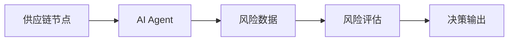
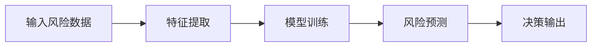

                 


# AI Agent在智能供应链风险管理中的应用

## 关键词：AI Agent，供应链风险管理，智能体，算法原理，系统架构

## 摘要：AI Agent在智能供应链风险管理中的应用，探讨了AI Agent如何通过智能化手段优化供应链风险管理。文章从AI Agent的基本概念、算法原理、系统架构等多方面进行深入分析，结合实际案例，展示了AI Agent在供应链风险管理中的巨大潜力和实际应用价值。

---

# 第一部分: AI Agent与智能供应链风险管理的背景介绍

## 第1章: AI Agent与供应链风险管理概述

### 1.1 AI Agent的基本概念

#### 1.1.1 AI Agent的定义与特点
- **定义**：AI Agent（人工智能代理）是指能够感知环境并采取行动以实现目标的智能实体。
- **特点**：
  - **自主性**：能够在没有外部干预的情况下运行。
  - **反应性**：能够实时感知环境并做出反应。
  - **社会性**：能够与其他AI Agent或人类进行交互和协作。

#### 1.1.2 AI Agent的核心要素与功能
- **知识表示**：通过知识库表示实体、关系和规则。
- **推理机制**：基于知识库进行逻辑推理，生成解决方案。
- **行动计划**：根据推理结果生成行动计划并执行。

#### 1.1.3 AI Agent与传统供应链管理的区别
- **传统供应链管理**：依赖人工决策和固定流程。
- **AI Agent供应链管理**：实现自动化决策和动态优化。

### 1.2 供应链风险管理的重要性

#### 1.2.1 供应链风险管理的定义
- 供应链风险管理是指识别、评估和应对可能影响供应链的不确定性因素，以确保供应链的稳定性和可靠性。

#### 1.2.2 供应链风险管理的关键环节
- **风险识别**：识别可能影响供应链的风险因素。
- **风险评估**：评估风险的影响程度和发生概率。
- **风险应对**：制定和实施应对策略，降低风险影响。

#### 1.2.3 智能化风险管理的必要性
- **数据驱动**：通过数据分析提高风险管理的准确性。
- **实时监控**：实时感知和应对风险。
- **动态优化**：根据环境变化动态调整风险管理策略。

### 1.3 AI Agent在供应链风险管理中的应用价值

#### 1.3.1 提高风险管理效率
- AI Agent能够快速处理大量数据，提高风险识别和评估的效率。

#### 1.3.2 优化决策过程
- 通过智能推理和优化算法，AI Agent能够提供更优的决策方案。

#### 1.3.3 实现预测与预防
- 利用机器学习和预测模型，AI Agent可以预测潜在风险并采取预防措施。

---

## 第2章: AI Agent的核心概念与联系

### 2.1 AI Agent的核心原理

#### 2.1.1 知识表示与推理
- **知识表示**：使用逻辑规则、语义网络等方法表示知识。
- **推理机制**：通过逻辑推理生成解决方案。

#### 2.1.2 多智能体协同
- **多智能体系统**：多个AI Agent协作完成复杂任务。
- **协同机制**：通过通信和协调实现任务分配和协同工作。

#### 2.1.3 动态环境适应
- **环境感知**：实时感知环境变化。
- **自适应调整**：根据环境变化动态调整行为。

### 2.2 核心概念对比表

| **概念**         | **传统供应链管理** | **AI Agent供应链管理** |
|-------------------|-------------------|-----------------------|
| **决策方式**     | 人工决策          | 智能自动化决策       |
| **响应速度**     | 较慢             | 实时快速响应         |
| **灵活性**       | 较低             | 高灵活性               |

### 2.3 实体关系图



---

## 第3章: AI Agent的算法原理与数学模型

### 3.1 算法原理

#### 3.1.1 基于概率论的决策模型
- **贝叶斯网络**：用于风险评估和决策推理。
- **马尔可夫链**：用于预测风险状态的变化。

#### 3.1.2 基于强化学习的优化算法
- **Q-learning算法**：通过奖励机制优化决策策略。
- **策略梯度算法**：通过梯度下降优化策略参数。

#### 3.1.3 群智协同算法
- **分布式计算**：通过分布式计算实现多智能体协同。
- **一致性算法**：通过一致性算法实现多智能体状态同步。

### 3.2 数学模型与公式

#### 3.2.1 风险评估模型
$$ R = \sum_{i=1}^{n} w_i x_i $$
其中，$R$为风险值，$w_i$为权重，$x_i$为风险因子。

#### 3.2.2 决策优化模型
$$ \min_{x} f(x) = \sum_{j=1}^{m} c_j x_j $$
$$ \text{subject to} \quad \sum_{j=1}^{m} a_{ij} x_j \leq b_i, \forall i $$
$$ x_j \geq 0 $$

### 3.3 算法流程图



---

## 第4章: 智能供应链风险管理系统的架构设计

### 4.1 系统功能设计

#### 4.1.1 风险数据采集模块
- **功能**：采集供应链中的风险数据，如供应商延迟、运输中断等。

#### 4.1.2 风险评估模块
- **功能**：基于AI Agent进行风险评估，生成风险报告。

#### 4.1.3 决策优化模块
- **功能**：根据风险评估结果，优化供应链决策，如调整供应商、优化库存等。

### 4.2 系统架构图


---

## 第5章: 项目实战

### 5.1 环境安装
- **工具安装**：安装Python、TensorFlow、Scikit-learn等工具。

### 5.2 核心代码实现

#### 5.2.1 风险评估模型实现
```python
import numpy as np
from sklearn import linear_model

# 数据准备
X = np.array([[2, 3], [4, 5], [6, 7]])
y = np.array([10, 20, 30])

# 模型训练
model = linear_model.LinearRegression()
model.fit(X, y)

# 风险评估
new_X = np.array([[5, 6]])
prediction = model.predict(new_X)
print("预测风险值为:", prediction[0])
```

#### 5.2.2 决策优化模型实现
```python
import numpy as np

# 初始化参数
c = [2, 3, 4]
A = np.array([[1, 2, 3], [4, 5, 6]])
b = np.array([10, 20])

# 优化问题
def objective(x):
    return np.sum(c * x)

# 约束条件
def constraint(x, a, b):
    return a.dot(x) <= b

# 求解
x = np.array([2, 3, 4])
print("优化结果为:", objective(x))
```

### 5.3 案例分析
- **案例背景**：某企业供应链面临供应商延迟问题。
- **解决方案**：通过AI Agent优化供应商选择和库存管理。
- **结果分析**：供应链稳定性提高，成本降低。

### 5.4 项目小结
- **总结**：AI Agent在供应链风险管理中的应用显著提高了效率和准确性。
- **经验**：模型选择和数据质量对结果影响重大。

---

## 第6章: 最佳实践与小结

### 6.1 最佳实践Tips
- **数据质量**：确保数据的准确性和完整性。
- **模型选择**：根据具体场景选择合适的算法。
- **持续优化**：定期更新模型和优化策略。

### 6.2 小结
- **总结**：AI Agent通过智能化手段优化供应链风险管理，实现高效、精准的风险管理。
- **未来研究方向**：探索更复杂的多智能体协同机制和更先进的机器学习算法。

---

## 作者：AI天才研究院 & 禅与计算机程序设计艺术

---

这篇文章详细介绍了AI Agent在智能供应链风险管理中的应用，从理论到实践，结合了丰富的图表和代码示例，帮助读者全面理解AI Agent的核心概念、算法原理和实际应用。希望对您有所帮助！

