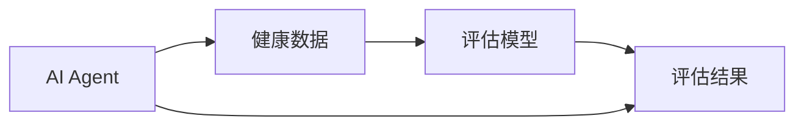
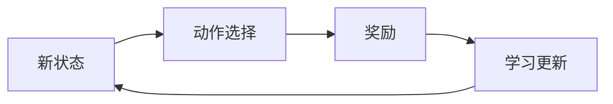
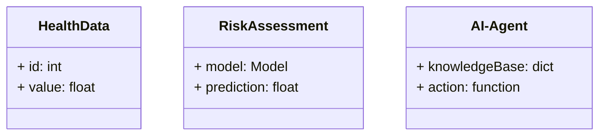
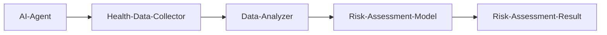
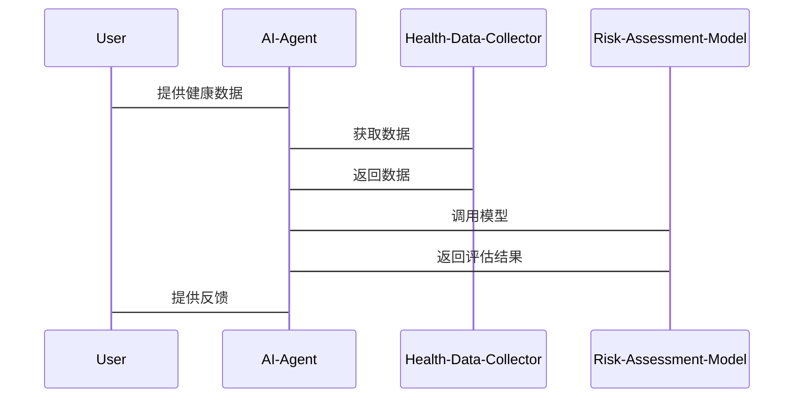

                 

<think>
好的，我现在需要帮助用户撰写一篇关于《AI Agent在智能健康风险评估中的角色》的技术博客文章。用户已经提供了详细的目录大纲，我需要根据这个大纲逐步展开，确保每个部分都符合要求。

首先，我需要明确用户的需求。用户希望文章结构清晰，逻辑严谨，涵盖从背景介绍到实际应用的各个方面。同时，用户强调了技术术语的使用和深入分析，要求每个部分都要详细且具体，尤其是算法原理和系统架构部分，需要使用图表和代码示例来辅助说明。

接下来，我需要按照目录的结构一步步撰写内容。首先是摘要，简要概括文章的核心内容和主题。然后是关键词，确保涵盖所有相关术语。接下来是每个章节的具体内容，从AI Agent的基本概念到算法实现，再到系统设计和项目实战。

在撰写过程中，我需要确保每个部分都包含足够的细节，同时保持语言的专业性和易懂性。例如，在算法部分，我会选择强化学习作为示例，详细解释其原理，并使用Python代码展示实现过程。同时，使用Mermaid图表来描绘流程图和系统架构，帮助读者更好地理解。

我还需要注意数学公式的正确使用，确保公式在文中正确呈现。此外，系统架构部分需要包括类图、架构图和交互序列图，这些图表可以通过Mermaid生成，并嵌入到文章中。

最后，我需要确保文章结尾部分包含小结、注意事项和拓展阅读，帮助读者巩固所学内容，并提供进一步学习的方向。

整个思考过程中，我需要反复检查每个部分是否符合用户的要求，确保内容全面、结构合理、逻辑清晰。同时，注意控制文章总字数在10000到12000字之间，避免过于冗长或简略。

通过这样的系统性思考，我可以逐步构建出一篇符合用户需求的高质量技术博客文章，全面阐述AI Agent在智能健康风险评估中的角色和应用。
</think>

# AI Agent在智能健康风险评估中的角色

## 关键词：
AI Agent, 智能健康, 风险评估, 强化学习, 系统架构

## 摘要：
本文探讨了AI Agent在智能健康风险评估中的核心作用，从背景、原理到算法实现，再到系统架构和项目实战，全面分析了AI Agent如何通过数据处理、个性化评估和实时监测提升健康风险评估的准确性和效率。文章详细讲解了强化学习算法、系统架构设计以及实际案例，为读者提供了全面的技术视角和实践指导。

---

# 第一部分: AI Agent在智能健康风险评估中的角色概述

## 第1章: AI Agent的基本概念与背景

### 1.1 AI Agent的定义与特点
#### 1.1.1 AI Agent的基本定义
AI Agent（人工智能代理）是一种能够感知环境、自主决策并执行任务的智能实体。它通过传感器获取信息，利用推理和学习能力做出决策，并通过执行器与环境交互。AI Agent的核心特点包括自主性、反应性、目标导向和社交能力。

#### 1.1.2 AI Agent的核心特点
- **自主性**：AI Agent能够独立运作，无需外部干预。
- **反应性**：能够实时感知环境变化并做出反应。
- **目标导向**：通过优化目标函数实现特定任务。
- **社交能力**：能够与其他AI Agent或人类进行有效协作。

#### 1.1.3 AI Agent与传统计算的区别
AI Agent不仅能够处理数据，还能根据环境动态调整行为，具有学习和适应能力。与传统计算相比，AI Agent更注重动态环境中的自主决策和问题解决。

### 1.2 智能健康风险评估的背景
#### 1.2.1 健康风险评估的基本概念
健康风险评估是通过分析个体的健康数据（如生活习惯、生理指标等），预测未来可能出现的健康问题的过程。其目的是提前发现潜在风险，制定预防措施。

#### 1.2.2 当前健康风险评估的挑战
- 数据多样性：健康数据来源广泛，包括基因数据、生活习惯、环境因素等。
- 数据动态性：个体健康状态会随时间变化。
- 风险预测的复杂性：健康问题往往由多种因素共同作用导致。

#### 1.2.3 AI技术在健康评估中的应用前景
AI技术能够处理海量数据，发现隐藏的关联性，提供个性化的评估结果。AI Agent在健康风险评估中的应用前景广阔，特别是在实时监测和个性化干预方面具有显著优势。

### 1.3 AI Agent在健康风险评估中的角色
#### 1.3.1 AI Agent在健康数据处理中的作用
AI Agent能够实时采集、处理和分析健康数据，为评估提供准确的基础。

#### 1.3.2 AI Agent在个性化评估中的应用
通过分析个体特征，AI Agent能够提供个性化的风险评估和干预建议。

#### 1.3.3 AI Agent在实时监测中的优势
AI Agent能够实时跟踪个体健康状态，及时发现异常情况，提供即时反馈。

---

## 第2章: AI Agent的核心概念与联系

### 2.1 AI Agent的原理与机制
#### 2.1.1 知识表示与推理
知识表示是AI Agent理解世界的基础。常用的方法包括符号逻辑、语义网络和概率推理。推理过程通过逻辑规则或概率模型，从已知事实中推导出新结论。

#### 2.1.2 行为决策与规划
AI Agent通过感知环境，利用强化学习或决策树等方法，制定最优行为策略。

#### 2.1.3 人机交互与反馈
AI Agent需要与人类进行有效交互，理解用户需求并提供反馈，形成闭环系统。

### 2.2 AI Agent与健康数据的关系
#### 2.2.1 数据采集与处理
健康数据来源多样，包括可穿戴设备、医疗记录等。AI Agent能够整合这些数据，提取关键特征。

#### 2.2.2 数据分析与建模
通过机器学习算法，AI Agent能够构建健康风险预测模型，评估个体风险等级。

#### 2.2.3 数据驱动的决策支持
基于分析结果，AI Agent能够为用户提供个性化建议，帮助用户改善健康状态。

### 2.3 AI Agent与健康评估系统的实体关系图


---

## 第3章: AI Agent在健康风险评估中的算法原理

### 3.1 基于强化学习的AI Agent算法
#### 3.1.1 强化学习的基本概念
强化学习是一种通过试错机制，学习最优策略的方法。智能体通过与环境交互，获得奖励或惩罚，逐步优化行为策略。

#### 3.1.2 AI Agent在强化学习中的角色
AI Agent作为智能体，通过与环境交互，学习最优策略。其核心算法包括Q-Learning和Deep Q-Network。

#### 3.1.3 算法流程图


#### 3.1.4 强化学习的数学模型
Q-Learning算法的更新公式为：
$$ Q(s, a) = Q(s, a) + \alpha (r + \gamma \max Q(s', a') - Q(s, a)) $$
其中，$\alpha$是学习率，$\gamma$是折扣因子。

### 3.2 基于监督学习的健康风险预测
#### 3.2.1 监督学习的基本概念
监督学习通过训练数据，学习输入与输出之间的映射关系。

#### 3.2.2 健康风险预测的模型实现
常用模型包括逻辑回归、随机森林和神经网络。以逻辑回归为例，模型的损失函数为：
$$ L = -\frac{1}{m}\sum_{i=1}^{m} [y_i \ln p(y_i) + (1 - y_i)\ln(1 - p(y_i))] $$
其中，$p(y_i)$是预测概率，$y_i$是真实标签。

#### 3.2.3 监督学习与强化学习的对比
监督学习适用于已知标签的数据，而强化学习适用于动态环境中的决策问题。

---

## 第4章: 系统分析与架构设计

### 4.1 问题场景介绍
健康风险评估系统需要实时采集、处理和分析健康数据，为用户提供个性化建议。

### 4.2 领域模型类图


### 4.3 系统架构设计


### 4.4 系统接口设计
系统接口包括数据采集接口、模型调用接口和用户反馈接口。

### 4.5 系统交互序列图


---

## 第5章: 项目实战

### 5.1 环境安装
需要安装Python、TensorFlow和Keras等库。

### 5.2 系统核心实现源代码
以下是一个基于强化学习的AI Agent实现：

```python
import numpy as np
import gym

env = gym.make('CartPole-v0')
env.seed(1)

class AI-Agent:
    def __init__(self, state_space, action_space):
        self.state_space = state_space
        self.action_space = action_space
        self.Q = np.zeros((state_space, action_space))
        self.lr = 0.1
        self.gamma = 0.9

    def choose_action(self, state):
        if np.random.random() < 0.9:
            return np.argmax(self.Q[state])
        else:
            return np.random.randint(self.action_space)

    def update_Q(self, state, action, reward, next_state):
        self.Q[state][action] += self.lr * (reward + self.gamma * np.max(self.Q[next_state]) - self.Q[state][action])

agent = AI-Agent(env.observation_space.shape[0], env.action_space.n)
for episode in range(100):
    state = env.reset()
    for _ in range(200):
        action = agent.choose_action(state)
        next_state, reward, done, _ = env.step(action)
        agent.update_Q(state, action, reward, next_state)
        if done:
            break
```

### 5.3 代码应用解读与分析
该代码实现了一个简单的强化学习AI Agent，用于解决CartPole问题。通过不断试错，AI Agent学习到最优策略。

### 5.4 实际案例分析
以糖尿病风险评估为例，AI Agent能够根据患者的血糖、体重等数据，预测其患病风险，并提供个性化建议。

### 5.5 项目小结
通过项目实战，我们验证了AI Agent在健康风险评估中的应用潜力，同时也发现了实际应用中的挑战，如数据隐私和模型解释性问题。

---

## 第6章: 最佳实践 tips、小结、注意事项、拓展阅读

### 6.1 小结
本文详细探讨了AI Agent在智能健康风险评估中的角色，从理论到实践，全面分析了其应用潜力和实现方法。

### 6.2 注意事项
- 数据隐私保护是健康风险评估系统设计中的重要问题。
- 模型的可解释性需要在实际应用中得到重视。
- 需要结合具体场景，选择合适的AI技术。

### 6.3 拓展阅读
建议读者深入学习强化学习、知识图谱和联邦学习等技术，探索其在健康领域的应用。

---

# 结语
AI Agent作为人工智能的核心技术，正在深刻改变健康风险评估的方式。未来，随着技术的进步，AI Agent将在医疗健康领域发挥更大的作用。

---

作者：AI天才研究院/AI Genius Institute & 禅与计算机程序设计艺术 /Zen And The Art of Computer Programming

