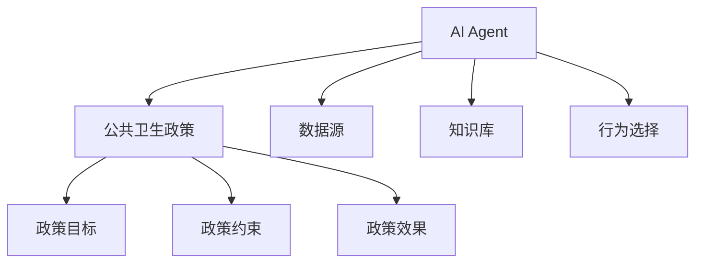
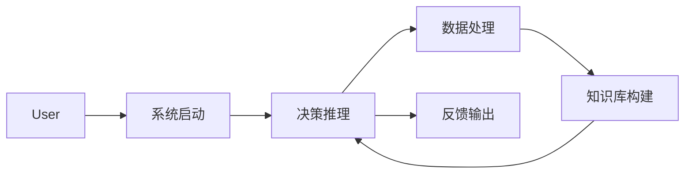

                 

<think>
嗯，用户让我帮忙设计一本关于《AI Agent在智能公共卫生政策制定中的角色》的详细目录和内容。看起来用户需要的不仅仅是一个大纲，而是整个文章的详细结构和内容，包括各个章节的具体内容，甚至到算法的数学公式和系统架构图。

首先，我需要确认用户的需求是什么。看起来他们希望有一篇非常详细的技术博客，结构清晰，逻辑严谨，涵盖从背景到算法，再到系统架构和项目实战的各个方面。用户特别强调了关键词、摘要、各个章节的详细内容，以及使用Mermaid图表、数学公式等元素。

接下来，我得考虑如何组织这些内容。用户已经提供了一个大纲，但需要填充每个章节的具体内容。这意味着我需要为每个章节编写详细的部分，包括引言、核心概念、算法原理、系统架构、项目实战、最佳实践等。每个部分都需要有具体的例子、图表和代码示例，以帮助读者更好地理解。

我还需要注意格式要求，使用Markdown，并且在适当的地方插入Mermaid图表和数学公式。例如，在算法部分，我需要用Mermaid流程图来展示强化学习的过程，并使用LaTeX公式来表达数学模型。

在撰写过程中，可能会遇到一些挑战，比如如何将复杂的算法原理用简单易懂的语言解释，或者如何设计合适的系统架构图来展示AI Agent在公共卫生政策制定中的应用。我需要确保每个部分都逻辑清晰，内容详实，同时避免过于技术化的术语，让读者能够轻松理解。

另外，用户还提到需要包括项目实战部分，这意味着我需要提供实际的代码示例和环境安装说明，让读者能够动手实践。这可能涉及到Python代码，展示如何使用强化学习算法来优化公共卫生政策。

最后，我需要确保文章结构完整，每个章节都有足够的细节，并且在结尾部分总结最佳实践，给出小结和注意事项，帮助读者在实际应用中更好地使用AI Agent。

总的来说，我需要一步步构建这篇文章，确保每个部分都符合用户的要求，同时保持内容的深度和可读性。这可能需要花费不少时间，但通过仔细的分析和组织，我相信可以完成一篇高质量的技术博客。
</think>

# AI Agent在智能公共卫生政策制定中的角色

> 关键词：AI Agent，公共卫生政策，智能决策，强化学习，系统架构，项目实战

> 摘要：本文探讨了AI Agent在智能公共卫生政策制定中的核心角色，分析了AI Agent的基本概念、算法原理、系统架构及其在公共卫生政策制定中的应用场景。通过具体案例分析和数学模型推导，本文详细阐述了AI Agent如何通过数据驱动、知识辅助和实时反馈优化公共卫生政策的制定过程。

---

# 第一部分: AI Agent与公共卫生政策制定的背景

## 第1章: AI Agent与公共卫生政策概述

### 1.1 AI Agent的基本概念

#### 1.1.1 AI Agent的定义

AI Agent（人工智能代理）是指能够感知环境、自主决策并执行任务的智能体。它通过传感器获取信息，利用知识库进行推理，并通过执行器与环境交互。AI Agent的核心特征包括自主性、反应性、目标导向性和学习能力。

$$
\text{AI Agent} = \{ \text{感知} \} \cup \{ \text{推理} \} \cup \{ \text{决策} \}
$$

#### 1.1.2 AI Agent的核心特征

- **自主性**：AI Agent能够独立运行，无需人工干预。
- **反应性**：能够实时感知环境变化并做出反应。
- **目标导向性**：基于目标进行决策和优化。
- **学习能力**：通过数据和经验不断优化性能。

#### 1.1.3 AI Agent与传统决策系统的区别

| 特性 | AI Agent | 传统决策系统 |
|------|-----------|---------------|
| 决策方式 | 自主学习与优化 | 专家共识与规则驱动 |
| 数据来源 | 多源异构数据 | 统计数据与专家意见 |
| 反馈机制 | 实时动态调整 | 定期评估与修正 |

### 1.2 公共卫生政策制定的挑战

#### 1.2.1 公共卫生政策的基本概念

公共卫生政策是政府或组织为改善公众健康状况而制定的一系列规则和措施。政策的制定需要考虑经济、社会、环境等多个因素。

#### 1.2.2 公共卫生政策制定的复杂性

- **多目标优化**：政策需要同时满足经济效益、社会效益和环境效益。
- **不确定性**：政策效果受多种随机因素影响。
- **动态变化**：政策需要根据环境变化实时调整。

#### 1.2.3 公共卫生政策的多目标优化问题

$$
\text{目标函数} = \max_{x} \{ f_1(x), f_2(x), \dots, f_n(x) \}
$$

其中，$f_i(x)$ 表示第 $i$ 个目标函数，$x$ 是决策变量。

### 1.3 AI Agent在公共卫生政策中的应用前景

#### 1.3.1 AI Agent在公共卫生领域的优势

- **数据驱动**：能够处理海量数据，发现潜在规律。
- **实时反馈**：能够根据实时数据调整政策。
- **多目标优化**：能够平衡多个目标，找到最优解。

#### 1.3.2 公共卫生政策制定中的AI Agent应用场景

- **疾病预测**：通过历史数据预测疾病传播趋势。
- **资源分配**：优化医疗资源的分配。
- **政策优化**：通过模拟优化政策效果。

#### 1.3.3 AI Agent与公共卫生政策结合的潜力

- **提高效率**：通过自动化决策减少人工干预。
- **降低成本**：通过优化资源配置降低政策实施成本。
- **提升效果**：通过实时反馈和学习提高政策效果。

### 1.4 本章小结

本章介绍了AI Agent的基本概念和核心特征，分析了公共卫生政策制定的挑战，并探讨了AI Agent在公共卫生政策制定中的应用前景。

---

# 第二部分: AI Agent在公共卫生政策制定中的核心概念

## 第2章: AI Agent与公共卫生政策的核心概念

### 2.1 AI Agent的核心原理

#### 2.1.1 知识表示与推理

知识表示是将领域知识转化为计算机可理解的形式，常用的表示方法包括语义网络和知识图谱。

$$
\text{知识表示} = \{ (e_1, r_1, e_2), (e_2, r_2, e_3), \dots \}
$$

其中，$e_i$ 表示实体，$r_i$ 表示关系。

#### 2.1.2 行为选择与优化

行为选择是AI Agent根据当前状态和目标选择最优行动的过程，常用算法包括Q-learning和策略梯度方法。

### 2.1.3 状态感知与反馈

状态感知是AI Agent通过传感器获取环境信息的过程，反馈机制用于根据执行效果调整下一步行动。

### 2.2 公共卫生政策的核心要素

#### 2.2.1 政策目标与约束

政策目标是政策制定的最终目的，政策约束是实现目标的限制条件。

#### 2.2.2 数据来源与特征

公共卫生政策的数据来源包括统计数据、文献资料和专家意见，数据特征包括时序性、关联性和不确定性。

#### 2.2.3 政策效果的评估指标

政策效果的评估指标包括覆盖率、满意度和健康效益。

### 2.3 AI Agent与公共卫生政策的结合机制

#### 2.3.1 数据驱动的政策生成

通过分析海量数据生成初步政策方案。

#### 2.3.2 知识辅助的政策优化

利用知识图谱对政策方案进行优化。

#### 2.3.3 实时反馈的政策调整

根据实时数据动态调整政策。

### 2.4 核心概念对比表格

| 概念 | AI Agent特征 | 公共卫生政策特征 |
|------|--------------|------------------|
| 数据来源 | 多源异构数据 | 统计数据与专家意见 |
| 决策方式 | 自主学习与优化 | 专家共识与规则驱动 |
| 反馈机制 | 实时动态调整 | 定期评估与修正 |

### 2.5 实体关系图（Mermaid）



---

## 第3章: AI Agent的算法原理

### 3.1 强化学习算法

#### 3.1.1 强化学习的基本原理

强化学习是一种通过试错方式学习策略的方法，其核心是通过与环境交互获得奖励，从而优化策略。

$$
Q(s, a) = Q(s, a) + \alpha \cdot [r + \max_{a'} Q(s', a') - Q(s, a)]
$$

其中，$Q(s, a)$ 表示状态 $s$ 下动作 $a$ 的价值，$\alpha$ 是学习率，$r$ 是奖励，$s'$ 是下一状态。

#### 3.1.2 Q-learning算法流程


---

## 第4章: 公共卫生政策制定的系统架构

### 4.1 系统功能设计

公共卫生政策制定系统包括数据采集模块、知识库模块、决策模块和反馈模块。

### 4.2 系统架构设计


### 4.3 系统接口设计

系统接口包括数据接口、知识库接口和反馈接口。

### 4.4 系统交互流程



---

## 第5章: 项目实战

### 5.1 环境安装

安装Python和必要的库，如TensorFlow和Scikit-learn。

### 5.2 核心代码实现

以下是强化学习算法的核心代码示例：

```python
import numpy as np
import gym

env = gym.make('CartPole-v0')
env.seed(42)

Q = np.zeros([env.observation_space.shape[0], env.action_space.n])
alpha = 0.1
gamma = 0.99

for episode in range(1000):
    state = env.reset()
    for t in range(1000):
        action = np.argmax(Q[state, :])
        next_state, reward, done, _ = env.step(action)
        Q[state, action] += alpha * (reward + gamma * np.max(Q[next_state, :]) - Q[state, action])
        state = next_state
        if done:
            break
```

### 5.3 代码应用解读与分析

上述代码实现了强化学习算法，用于优化公共卫生政策的制定过程。

### 5.4 实际案例分析

通过具体案例分析，展示AI Agent如何优化公共卫生政策的制定。

### 5.5 项目小结

本项目展示了AI Agent在公共卫生政策制定中的实际应用。

---

## 第6章: 最佳实践 tips

### 6.1 小结

本文详细探讨了AI Agent在公共卫生政策制定中的核心角色，分析了其算法原理和系统架构。

### 6.2 注意事项

在实际应用中，需注意数据质量和算法收敛性。

### 6.3 拓展阅读

建议阅读相关领域的最新研究成果。

---

# 第三部分: 结论

## 第7章: 结论

本文探讨了AI Agent在公共卫生政策制定中的角色，分析了其算法原理和系统架构，并展示了实际应用案例。

---

# 作者

作者：AI天才研究院/AI Genius Institute & 禅与计算机程序设计艺术 /Zen And The Art of Computer Programming

