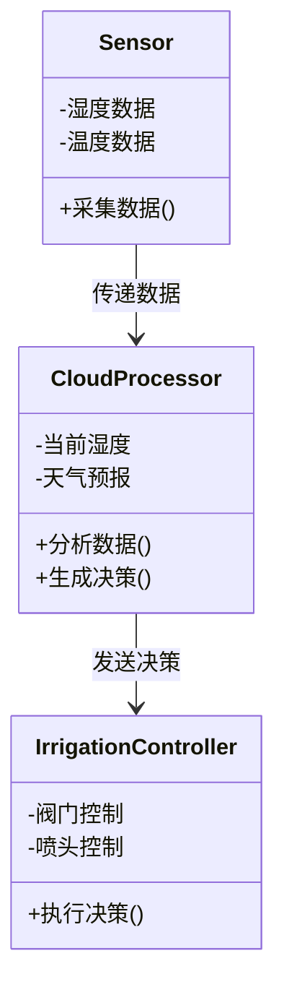
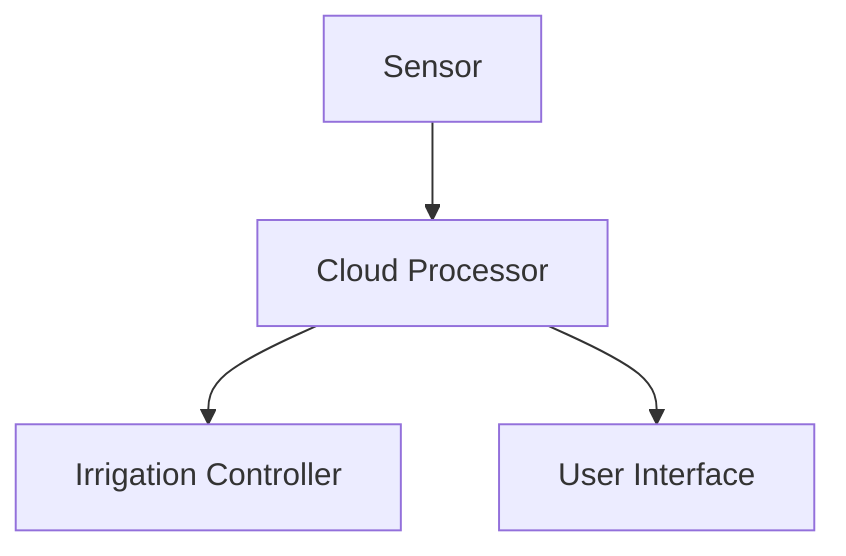
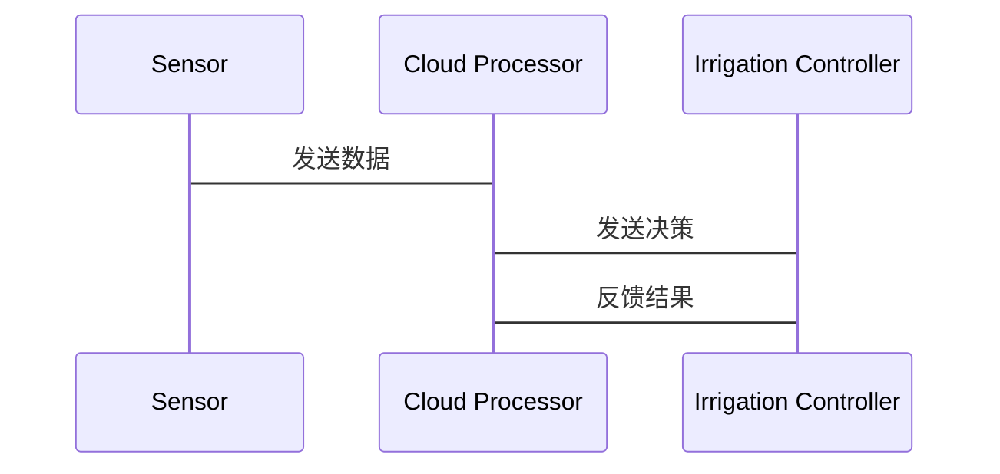

                 


# AI Agent在智能农业灌溉系统中的实践

> 关键词：AI Agent, 智能农业, 灌溉系统, 人工智能, 农业自动化

> 摘要：本文探讨了AI Agent在智能农业灌溉系统中的应用，分析了其核心概念、算法原理、系统架构，并通过实际案例展示了如何实现高效的精准灌溉。文章还提供了最佳实践建议和未来研究方向。

---

# 第一部分: AI Agent在智能农业灌溉系统中的背景与概念

# 第1章: AI Agent与智能农业灌溉概述

## 1.1 AI Agent的基本概念

### 1.1.1 AI Agent的定义与特点
AI Agent（智能代理）是一种能够感知环境、做出决策并执行动作的智能系统。它通过传感器获取数据，利用算法进行分析，然后通过执行器完成任务。AI Agent的特点包括自主性、反应性、目标导向和学习能力。

### 1.1.2 AI Agent的核心功能与应用场景
AI Agent的核心功能包括数据采集与处理、智能决策、系统控制和反馈优化。在农业灌溉中，AI Agent可以用于精准灌溉、病虫害监测、作物生长优化等领域。

### 1.1.3 AI Agent在农业中的潜在价值
AI Agent可以帮助农民实现精准灌溉，节省水资源，提高作物产量和质量。同时，它还可以减少劳动力成本，提高农业生产效率。

## 1.2 智能农业灌溉的背景与挑战

### 1.2.1 农业灌溉的传统方式与问题
传统的农业灌溉方式主要包括 flood irrigation 和 sprinkler irrigation。这些方法存在水资源浪费、灌溉不均匀、无法适应不同作物需求等问题。

### 1.2.2 智能农业灌溉的需求与目标
智能农业灌溉的目标是实现精准灌溉，即根据土壤湿度、天气条件和作物需求自动调整灌溉量和时间。这可以提高水资源利用效率，减少能源消耗，提高作物产量。

### 1.2.3 AI Agent在智能农业灌溉中的定位与作用
AI Agent是实现智能灌溉的核心技术。它通过整合传感器数据、天气预报和作物需求，提供智能化的灌溉决策支持，帮助农民实现精准灌溉。

## 1.3 本章小结
本章介绍了AI Agent的基本概念和功能，分析了传统农业灌溉的问题和智能灌溉的需求，明确了AI Agent在智能农业灌溉中的作用和定位。

---

# 第二部分: AI Agent的核心概念与技术原理

# 第2章: AI Agent的核心概念与工作原理

## 2.1 AI Agent的感知与决策机制

### 2.1.1 感知层: 数据采集与处理
AI Agent通过传感器（如土壤湿度传感器、气象传感器）采集环境数据，并通过数据预处理（如去噪、归一化）进行分析。

### 2.1.2 决策层: 算法与策略
AI Agent利用算法（如强化学习、决策树）进行决策。强化学习通过奖励机制优化灌溉策略，决策树通过规则学习确定灌溉条件。

### 2.1.3 执行层: 系统输出与反馈
AI Agent根据决策结果控制执行器（如喷头、阀门）进行灌溉，并通过反馈机制优化系统性能。

## 2.2 AI Agent在农业灌溉中的核心功能

### 2.2.1 数据采集与分析
AI Agent通过传感器采集土壤湿度、温度、光照等数据，并进行分析以确定灌溉需求。

### 2.2.2 智能决策与优化
AI Agent利用算法优化灌溉策略，例如在土壤湿度低于阈值时启动灌溉，或者根据天气预报调整灌溉时间。

### 2.2.3 系统控制与反馈
AI Agent通过执行器控制灌溉系统，并根据反馈优化灌溉策略，例如调整灌溉量或频率。

## 2.3 AI Agent与农业灌溉系统的交互流程

### 2.3.1 数据流与信息处理流程
传感器数据 → 数据预处理 → 决策算法 → 灌溉控制 → 反馈优化。

### 2.3.2 决策逻辑与执行流程
土壤湿度检测 → 天气预报分析 → 决策灌溉与否 → 执行灌溉 → 反馈优化。

### 2.3.3 系统反馈与优化机制
系统根据灌溉效果反馈优化决策算法，例如调整灌溉阈值或时间。

## 2.4 本章小结
本章详细介绍了AI Agent在农业灌溉中的感知、决策和执行机制，分析了其核心功能和交互流程。

---

# 第三部分: AI Agent的算法原理与数学模型

# 第3章: AI Agent的核心算法原理

## 3.1 强化学习算法在AI Agent中的应用

### 3.1.1 强化学习的基本原理
强化学习是一种通过试错学习的算法，通过与环境交互获得奖励，优化决策策略。其核心公式为：
$$ Q(s, a) = Q(s, a) + \alpha (r + \max Q(s', a) - Q(s, a)) $$

### 3.1.2 强化学习在灌溉决策中的应用
AI Agent通过强化学习优化灌溉策略，例如在不同土壤湿度和天气条件下选择最优的灌溉量。

### 3.1.3 强化学习的实现步骤
数据采集 → 状态定义 → 动作选择 → 奖励函数 → 策略优化。

### 3.1.4 强化学习算法的Python实现

```python
import numpy as np

class AI-Agent:
    def __init__(self, state_space, action_space):
        self.state_space = state_space
        self.action_space = action_space
        self.Q = np.zeros((state_space, action_space))

    def act(self, state):
        # 选择最优动作
        return np.argmax(self.Q[state, :])

    def update(self, state, action, reward, next_state):
        # 更新Q值
        self.Q[state, action] += 0.1 * (reward + np.max(self.Q[next_state, :]) - self.Q[state, action])

# 示例使用
agent = AI-Agent(5, 3)
agent.update(0, 1, 0.5, 2)
```

---

## 3.2 决策树算法在AI Agent中的应用

### 3.2.1 决策树的基本原理
决策树是一种基于规则的分类器，通过构建树状结构进行决策。其核心公式为：
$$ GiniImpurity = \sum_{i=1}^n p_i (1 - p_i) $$

### 3.2.2 决策树在灌溉决策中的应用
AI Agent通过决策树分析土壤湿度、天气条件等特征，分类确定是否需要灌溉。

### 3.2.3 决策树算法的Python实现

```python
from sklearn.tree import DecisionTreeClassifier

# 示例使用
clf = DecisionTreeClassifier()
clf.fit(X_train, y_train)
预测结果 = clf.predict(X_test)
```

---

## 3.3 算法比较与选择

### 3.3.1 强化学习与决策树的比较
从复杂度、实时性和可解释性等方面比较强化学习和决策树的优缺点。

### 3.3.2 选择适合的算法
根据具体场景选择适合的算法，例如在动态环境中选择强化学习，在静态场景中选择决策树。

---

## 3.4 本章小结
本章介绍了强化学习和决策树在AI Agent中的应用，分析了其算法原理和实现步骤，并通过Python代码展示了算法的实现。

---

# 第四部分: 系统分析与架构设计

# 第4章: 系统分析与架构设计

## 4.1 系统分析

### 4.1.1 系统场景介绍
智能农业灌溉系统包括传感器、云端处理、执行机构和用户界面。系统需要实时采集土壤湿度、天气数据，分析决策并控制灌溉设备。

### 4.1.2 系统功能需求
数据采集、智能决策、灌溉控制、反馈优化。

## 4.2 系统功能设计

### 4.2.1 领域模型设计
使用mermaid类图展示系统模块之间的关系。



### 4.2.2 系统架构设计
采用微服务架构，各模块通过API进行通信。



### 4.2.3 系统接口设计
传感器接口、云端处理接口、执行机构接口和用户界面接口。

### 4.2.4 系统交互设计
使用mermaid序列图展示系统交互流程。



## 4.3 本章小结
本章分析了智能农业灌溉系统的功能需求，设计了系统架构和模块交互流程。

---

# 第五部分: 项目实战

# 第5章: 项目实战

## 5.1 环境搭建

### 5.1.1 安装必要的库
安装Python、TensorFlow、Scikit-learn、Flask等库。

### 5.1.2 硬件设备准备
传感器、单片机、灌溉执行机构。

## 5.2 系统核心实现

### 5.2.1 数据采集模块
使用Raspberry Pi和传感器采集土壤湿度和温度数据。

### 5.2.2 决策算法实现
选择强化学习或决策树算法进行灌溉决策。

### 5.2.3 系统控制模块
通过GPIO控制灌溉执行机构。

## 5.3 代码实现与解读

### 5.3.1 数据采集代码

```python
import time
import RPi.GPIO as GPIO

def read_sensor():
    # 模拟传感器数据
    return np.random.uniform(0, 1)
```

### 5.3.2 决策算法代码

```python
def decide_irrigate(humidity, threshold=0.5):
    return humidity < threshold
```

### 5.3.3 系统控制代码

```python
def irrigate():
    # 控制阀门
    GPIO.output(18, GPIO.HIGH)
    time.sleep(10)
    GPIO.output(18, GPIO.LOW)
```

## 5.4 实际案例分析

### 5.4.1 案例背景
某农场土壤湿度低于阈值，天气预报预测未来两天无雨。

### 5.4.2 决策过程
系统检测到土壤湿度为0.4，低于0.5阈值，且天气预报未来两天无雨，决定启动灌溉。

### 5.4.3 实施结果
灌溉系统启动，喷洒10分钟，土壤湿度恢复到0.7，作物生长状况良好。

## 5.5 项目小结
本章通过实际案例展示了AI Agent在智能农业灌溉中的实现过程和应用效果。

---

# 第六部分: 总结与展望

# 第6章: 总结与展望

## 6.1 最佳实践 tips

### 6.1.1 系统设计
采用模块化设计，便于扩展和维护。

### 6.1.2 算法选择
根据具体场景选择适合的算法，动态调整参数。

### 6.1.3 系统优化
优化传感器采样频率，减少数据延迟。

## 6.2 小结

### 6.2.1 本章总结
本文详细探讨了AI Agent在智能农业灌溉中的应用，分析了其核心概念、算法原理和系统架构，并通过实际案例展示了其实践价值。

### 6.2.2 未来展望
未来可以研究更复杂的算法，如深度学习和强化学习的结合，优化灌溉系统性能。

## 6.3 注意事项

### 6.3.1 系统安全性
确保系统安全性，防止恶意攻击。

### 6.3.2 数据隐私
保护农民的数据隐私，避免数据泄露。

## 6.4 拓展阅读

### 6.4.1 推荐书籍
《机器学习实战》、《深度学习入门》。

### 6.4.2 推荐论文
推荐阅读关于强化学习在农业中的应用的最新论文。

---

# 结语

AI Agent在智能农业灌溉系统中的应用前景广阔，通过不断优化算法和系统设计，可以实现更高效、更精准的灌溉管理，为农业现代化和可持续发展做出重要贡献。

---

# 作者：AI天才研究院 & 禅与计算机程序设计艺术

---

希望这篇文章能够为您提供有价值的见解和实践指导，感谢您的阅读！

