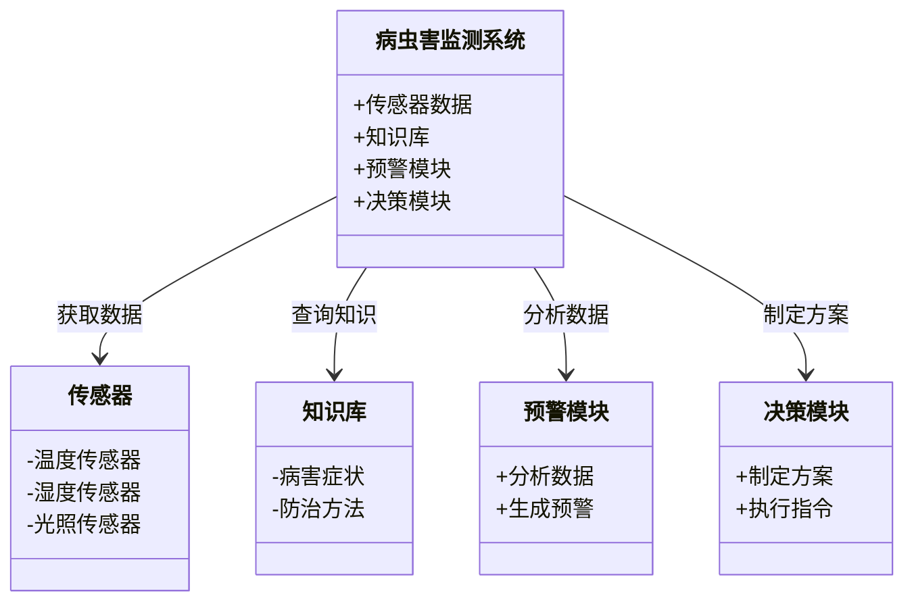
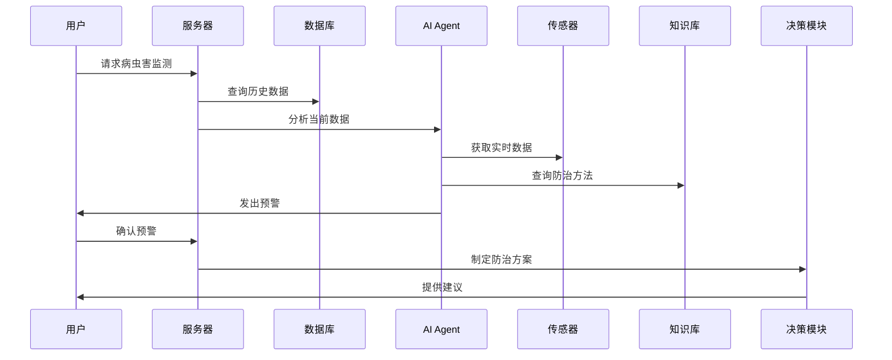

                 


# AI Agent在智能农业病虫害防控中的实践

> 关键词：AI Agent, 农业病虫害, 智能农业, 人工智能, 农业技术

> 摘要：本文深入探讨了AI Agent在智能农业病虫害防控中的应用实践。从背景、核心概念、技术原理、系统设计到项目实战，系统性地分析了AI Agent如何通过智能化手段提升农业病虫害的监测、预警和防控能力。文章结合理论与实践，详细阐述了AI Agent在农业病虫害防控中的算法原理、系统架构、项目实现和最佳实践，为读者提供了全面的技术视角。

---

# 第一部分: AI Agent 在智能农业病虫害防控中的背景与概念

## 第1章: AI Agent 的基本概念与农业应用

### 1.1 AI Agent 的基本概念

AI Agent（智能体）是指能够感知环境、自主决策并采取行动以实现目标的智能实体。在农业领域，AI Agent 可以通过传感器、摄像头等设备采集数据，结合历史数据和知识库进行分析，提供病虫害监测、预警和防治建议。

#### 1.1.1 AI Agent 的定义与特点

AI Agent 的特点包括：

- **自主性**：能够自主感知环境并采取行动。
- **反应性**：能够实时响应环境变化。
- **知识驱动**：依赖知识库进行推理和决策。
- **协作性**：能够与其他 Agent 或系统协作完成任务。

#### 1.1.2 AI Agent 与传统农业技术的区别

传统的农业病虫害防控方法主要依赖人工观察和经验判断，而 AI Agent 则通过自动化感知、数据分析和智能决策，显著提高了效率和准确性。

#### 1.1.3 AI Agent 在农业中的应用潜力

AI Agent 在农业中的潜力包括：

- **精准监测**：通过传感器和图像识别技术，实时监测病虫害的发生。
- **智能预警**：基于历史数据和模型预测，提前预警病虫害风险。
- **决策支持**：为农民提供科学的防治建议，优化资源利用。

### 1.2 农业病虫害防控的现状与挑战

#### 1.2.1 病虫害对农业生产的威胁

病虫害是影响农业生产的主要因素之一，可能导致农作物减产、品质下降，甚至绝收。传统防控方法效率低、成本高，且难以应对复杂多变的病虫害。

#### 1.2.2 传统病虫害防控方法的局限性

- **人工监测**：依赖人工观察，效率低且易受主观因素影响。
- **化学防治**：过度依赖农药，可能导致环境污染和抗药性问题。
- **单一监测**：缺乏多维度数据的整合分析，难以实现精准防控。

#### 1.2.3 智能化防控的需求与趋势

随着人工智能技术的发展，智能化病虫害防控成为农业现代化的重要方向。AI Agent 的引入能够显著提升监测精度和决策效率。

### 1.3 AI Agent 在农业病虫害防控中的作用

#### 1.3.1 AI Agent 的核心功能与优势

AI Agent 在农业病虫害防控中的核心功能包括：

- **数据采集**：通过传感器和图像识别技术，实时采集农田环境数据。
- **知识推理**：基于知识库和模型，分析数据并生成预警信息。
- **行为决策**：根据分析结果，制定防治方案并执行行动。

其优势在于能够实现数据的实时分析、精准监测和智能决策。

#### 1.3.2 AI Agent 在病虫害监测中的应用

AI Agent 可以通过图像识别技术，快速识别病虫害种类和严重程度。例如，基于卷积神经网络（CNN）的图像分类模型可以识别病斑特征，辅助判断病害类型。

#### 1.3.3 AI Agent 在决策支持中的作用

AI Agent 可以结合气象数据、土壤条件和病虫害历史数据，预测病虫害的发生概率，并提供防治建议。例如，当预测到某地区可能爆发某种病害时，AI Agent 可以建议农民提前采取防治措施。

---

# 第二部分: AI Agent 的核心概念与技术原理

## 第2章: AI Agent 的核心概念与系统架构

### 2.1 AI Agent 的核心概念

#### 2.1.1 知识表示与推理

知识表示是将农业领域的知识（如病虫害症状、防治方法）转化为计算机可理解的形式。推理则是基于知识库进行逻辑推理，得出结论。

#### 2.1.2 行为决策与规划

行为决策是根据当前状态和目标，选择最优行动方案。规划则是制定实现目标的详细步骤。

#### 2.1.3 多 Agent 协作与通信

多 Agent 系统通过协作完成复杂任务，通信是 Agent 之间交换信息的关键。

### 2.2 AI Agent 的技术原理

#### 2.2.1 数据采集与处理

AI Agent 通过传感器、摄像头等设备采集农田环境数据，并进行预处理和特征提取。

#### 2.2.2 知识库构建与管理

知识库包含农业领域的专业知识，如病虫害症状、防治方法等。知识库的构建需要结合领域专家知识和数据挖掘技术。

#### 2.2.3 行为决策算法

行为决策算法包括逻辑推理、概率推理和强化学习等方法，用于制定最优行动方案。

### 2.3 AI Agent 的系统架构

#### 2.3.1 分层架构

分层架构将系统分为感知层、知识层和决策层，各层之间通过接口进行交互。

#### 2.3.2 分布式架构

分布式架构适用于大规模农田监测，多个 Agent 分布在不同区域，通过通信协议协作完成任务。

#### 2.3.3 集成架构

集成架构将多种技术（如传感器、图像识别、知识推理）有机结合，形成完整的解决方案。

---

## 2.4 本章小结

本章详细介绍了 AI Agent 的核心概念和技术原理，分析了其在农业病虫害防控中的应用潜力。通过知识表示、行为决策和多 Agent 协作，AI Agent 能够实现智能化的病虫害监测和防控。

---

# 第三部分: AI Agent 的算法原理与数学模型

## 第3章: AI Agent 的算法原理

### 3.1 知识表示与推理算法

#### 3.1.1 语义网络表示

语义网络是一种知识表示方法，通过节点和边表示概念及其关系。例如，可以用节点表示“病害”，边表示“由...引起”。

#### 3.1.2 逻辑推理算法

逻辑推理算法包括命题逻辑和谓词逻辑推理。例如，基于谓词逻辑的推理可以验证病害的因果关系。

#### 3.1.3 概率推理算法

概率推理算法用于处理不确定性的知识。例如，贝叶斯网络可以计算某种病害发生的概率。

### 3.2 行为决策与规划算法

#### 3.2.1 状态空间搜索

状态空间搜索算法（如 BFS 和 DFS）用于探索所有可能的状态，找到最优路径。

#### 3.2.2 动态规划算法

动态规划算法用于优化决策过程，避免重复计算。例如，可以用于规划病虫害防治的最优步骤。

#### 3.2.3 强化学习算法

强化学习算法通过试错学习，找到最优行动策略。例如，可以训练 AI Agent 在不同环境下选择最佳的防治措施。

### 3.3 多 Agent 协作算法

#### 3.3.1 通信协议设计

通信协议定义了 Agent 之间信息交换的格式和规则，确保协作高效。

#### 3.3.2 协作任务分配

任务分配算法（如基于角色的分配）确保每个 Agent 负责特定任务，提高整体效率。

#### 3.3.3 冲突解决机制

冲突解决算法用于处理 Agent 之间的冲突，如资源竞争或决策冲突。

---

## 3.4 本章小结

本章深入探讨了 AI Agent 的算法原理，包括知识表示与推理、行为决策与规划、多 Agent 协作等方面。通过这些算法，AI Agent 能够实现智能化的病虫害监测和防控。

---

## 3.5 数学模型与公式

### 3.5.1 逻辑推理公式

逻辑推理可以通过谓词逻辑表示，例如：

$$ P(\text{病害发生}) = \text{true} $$

$$ \text{如果} (P(\text{病害发生}) \text{且} Q(\text{未采取措施})) \rightarrow R(\text{发出预警}) $$

### 3.5.2 贝叶斯网络公式

贝叶斯网络可以表示概率关系，例如：

$$ P(A|B) = \frac{P(B|A)P(A)}{P(B)} $$

其中，$A$ 是病害发生的事件，$B$ 是某种环境条件。

---

# 第四部分: AI Agent 的系统设计与实现

## 第4章: AI Agent 的系统设计

### 4.1 系统需求分析

#### 4.1.1 功能需求

- 数据采集与处理
- 知识推理与预警
- 行为决策与执行

#### 4.1.2 性能需求

- 实时性：能够快速响应环境变化。
- 准确性：确保病虫害监测的准确性。
- 可扩展性：支持不同规模的农田监测。

#### 4.1.3 接口需求

- 传感器接口：与温度、湿度等传感器连接。
- 数据库接口：与农业知识库和历史数据对接。
- 用户接口：提供人机交互界面，供农民查看预警信息和执行建议。

### 4.2 系统架构设计

#### 4.2.1 领域模型设计

领域模型可以通过 Mermaid 类图表示，展示系统的主要模块及其交互关系。



#### 4.2.2 系统架构设计

系统架构可以通过 Mermaid 架构图表示，展示各个模块的部署和交互。

```mermaid
archiecture图
    客户端 --> 服务器: 发送请求
    服务器 --> 数据库: 查询数据
    服务器 --> AI Agent: 调用算法
    AI Agent --> 传感器: 获取数据
    AI Agent --> 知识库: 查询知识
    服务器 --> 客户端: 返回结果
```

#### 4.2.3 系统接口设计

系统接口设计需要定义 API 接口，例如：

- `GET /sensors/data`：获取传感器数据
- `POST /agent/decision`：提交决策请求
- `GET /alerts`：获取预警信息

#### 4.2.4 系统交互设计

系统交互可以通过 Mermaid 序列图表示，展示用户与系统的交互流程。



---

## 4.3 本章小结

本章详细分析了 AI Agent 系统的设计，包括需求分析、架构设计和交互设计。通过模块化设计和标准化接口，确保系统的高效运行和可扩展性。

---

# 第五部分: 项目实战

## 第5章: 项目实战与分析

### 5.1 项目环境安装

#### 5.1.1 系统需求

- 操作系统：Linux 或 Windows
- Python 版本：3.6+

#### 5.1.2 依赖安装

```bash
pip install numpy matplotlib scikit-learn
```

### 5.2 核心代码实现

#### 5.2.1 数据采集模块

```python
import numpy as np

def collect_data(sensor_type):
    # 模拟传感器数据采集
    data = np.random.normal(20, 2, 100)  # 示例数据
    return data
```

#### 5.2.2 知识推理模块

```python
from sklearn import tree

def infer_disease(symptoms):
    # 假设 symptoms 是一个特征向量
    clf = tree.DecisionTreeClassifier()
    clf.fit(X_train, y_train)
    prediction = clf.predict(symptoms)
    return prediction
```

#### 5.2.3 行为决策模块

```python
def decide_action(probability):
    if probability > 0.8:
        return "发出预警"
    elif probability > 0.5:
        return "监测数据"
    else:
        return "无需处理"
```

#### 5.2.4 多 Agent 协作模块

```python
import threading

class Agent(threading.Thread):
    def run(self):
        while True:
            # 与其他 Agent 通信并协作
            pass
```

---

## 5.3 项目实战与分析

### 5.3.1 代码应用解读

以上代码展示了 AI Agent 系统的核心功能，包括数据采集、知识推理和行为决策。数据采集模块通过传感器获取环境数据，知识推理模块利用机器学习模型分析数据，行为决策模块根据推理结果制定行动方案。

### 5.3.2 实际案例分析

以某农田的病虫害监测为例：

1. **数据采集**：传感器获取温度、湿度等数据。
2. **知识推理**：基于病害症状和环境数据，模型预测病害概率。
3. **行为决策**：根据预测结果，系统发出预警或提供防治建议。

### 5.3.3 案例分析与详细讲解

假设某地区连续多日高温高湿，AI Agent 通过图像识别技术检测到叶片出现黄斑，结合历史数据和知识库，判断为某种真菌病害。系统预测病害可能在接下来的 3 天内爆发，因此发出预警并建议农民立即喷洒对应的 fungicide。

---

## 5.4 项目小结

本章通过实际案例展示了 AI Agent 在病虫害监测中的应用。通过数据采集、知识推理和行为决策，AI Agent 能够实现智能化的病虫害监测和防控，显著提高农业生产效率。

---

## 5.5 最佳实践

### 5.5.1 小贴士

- 数据质量是 AI Agent 性能的关键，确保数据的准确性和完整性。
- 定期更新知识库，保持模型的准确性。
- 在多 Agent 系统中，合理设计通信协议和任务分配算法，避免冲突。

### 5.5.2 项目小结

通过本项目，我们验证了 AI Agent 在农业病虫害防控中的有效性。系统实现了实时监测、智能预警和决策支持，显著提高了病虫害防控的效率和准确性。

### 5.5.3 注意事项

- 数据隐私：确保农业数据的安全性，避免信息泄露。
- 模型泛化能力：在不同环境和病害类型下，验证模型的适用性。
- 系统维护：定期更新模型和知识库，确保系统的持续有效性。

### 5.5.4 拓展阅读

- 《机器学习实战》：学习机器学习算法的基础知识。
- 《分布式系统：原理与实现》：了解多 Agent 系统的设计与实现。
- 《农业信息技术》：深入理解农业领域的技术应用。

---

## 5.6 本章小结

本章通过项目实战，展示了 AI Agent 在农业病虫害监测中的具体应用。从环境安装、代码实现到案例分析，详细讲解了 AI Agent 的实现过程和应用效果。通过最佳实践和注意事项，为读者提供了宝贵的参考。

---

## 作者：AI天才研究院/AI Genius Institute & 禅与计算机程序设计艺术 /Zen And The Art of Computer Programming

---

**结语**：AI Agent 在智能农业病虫害防控中的应用前景广阔，随着人工智能技术的不断发展，AI Agent 将在农业领域发挥越来越重要的作用。通过本文的系统性分析，我们相信 AI Agent 将成为未来农业智能化发展的重要推动力。

