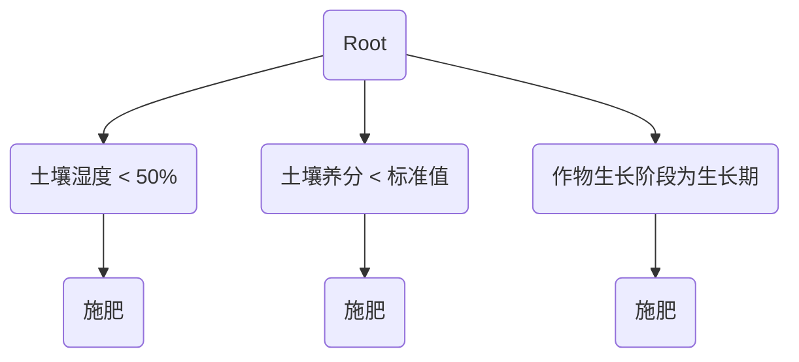
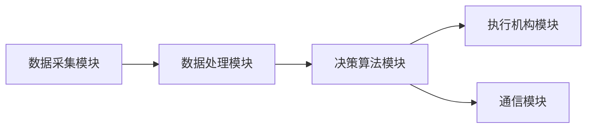

                 

<think>
嗯，用户需要我根据他们的要求，撰写一篇关于《AI Agent在智能农业精准施肥中的实践》的技术博客文章。我需要确保文章符合他们的格式和内容要求，包括详细的章节结构、技术细节和实际案例分析。

首先，我需要明确文章的标题和关键词。标题已经给出，是《AI Agent在智能农业精准施肥中的实践》，关键词包括AI Agent、智能农业、精准施肥、人工智能、农业自动化、智能决策等。

接下来是摘要部分，要简明扼要地概括文章的核心内容和主题思想。摘要应说明AI Agent在精准施肥中的应用，以及其在农业智能化中的重要性。

然后，按照目录大纲，我需要分章节详细展开每个部分。每个章节都需要有详细的讲解，包括核心概念、算法原理、系统架构设计、项目实战等。

在写作过程中，我需要确保每个章节都有足够的技术细节，比如使用图表（如Mermaid流程图、类图、架构图等）来辅助说明，同时提供相应的数学模型和公式，使用LaTeX格式进行展示。

我还需要注意文章的结构和逻辑，确保内容条理清晰，符合用户要求的10000到12000字的字数范围。

最后，文章末尾需要添加作者信息，确保格式正确，内容完整。

总之，我需要一步步按照用户的要求，详细撰写每个部分，确保技术内容准确，结构合理，语言专业且易懂。
</think>

# AI Agent在智能农业精准施肥中的实践

**关键词：** AI Agent, 智能农业, 精准施肥, 人工智能, 农业自动化, 智能决策

**摘要：**  
随着农业智能化的快速发展，AI Agent（人工智能代理）在精准施肥中的应用逐渐成为农业现代化的重要推动力。本文详细探讨了AI Agent的核心概念、工作原理及其在精准施肥中的实际应用。通过分析AI Agent如何通过感知、决策和执行层实现精准施肥，结合具体算法和系统架构设计，展示了AI Agent在农业中的巨大潜力。文章最后通过一个实际案例分析，进一步验证了AI Agent在精准施肥中的有效性和优势。

---

## 第1章: AI Agent概述

### 1.1 AI Agent的基本概念

#### 1.1.1 什么是AI Agent
AI Agent（人工智能代理）是指能够感知环境、自主决策并执行任务的智能实体。它能够通过传感器获取信息，利用算法进行分析和决策，并通过执行机构完成目标。AI Agent的核心在于其智能化和自主性。

#### 1.1.2 AI Agent的核心特征
AI Agent具有以下核心特征：
- **自主性**：能够在没有人工干预的情况下独立运作。
- **反应性**：能够实时感知环境变化并做出响应。
- **目标导向**：具有明确的目标，并根据目标调整行为。
- **学习能力**：能够通过数据和经验不断优化自身的决策能力。

#### 1.1.3 AI Agent与传统自动化的区别
传统的自动化系统通常基于固定的程序和规则运行，缺乏灵活性和适应性。而AI Agent能够根据环境变化动态调整行为，具有更强的适应性和智能性。

### 1.2 AI Agent在农业中的应用前景

#### 1.2.1 农业现代化与智能化
随着科技的进步，农业正在从传统的人工劳动向机械化、自动化和智能化转变。AI Agent作为智能化的核心技术，为农业现代化提供了新的可能性。

#### 1.2.2 AI Agent在农业中的潜在应用场景
AI Agent在农业中的应用场景包括作物监测、病虫害防治、精准施肥、灌溉管理等。通过AI Agent的实时感知和决策能力，农业管理可以更加高效和精准。

#### 1.2.3 AI Agent在精准农业中的价值
精准农业的目标是实现资源的最优利用，提高农业生产效率。AI Agent通过实时数据采集、分析和决策，能够帮助农民实现精准施肥，减少资源浪费，提高作物产量和质量。

### 1.3 本章小结
本章介绍了AI Agent的基本概念和核心特征，并探讨了其在农业中的应用前景。AI Agent的智能化和自主性使其成为精准农业的重要工具。

---

## 第2章: 智能农业与精准施肥的背景

### 2.1 农业现代化与智能化

#### 2.1.1 传统农业的局限性
传统农业依赖大量的人工劳动，效率低下，且资源浪费严重。例如，传统施肥方式可能导致肥料的过度使用，造成环境污染和资源浪费。

#### 2.1.2 农业现代化的驱动力
科技的进步和可持续发展的需求推动了农业现代化。通过引入人工智能、物联网等技术，农业正在向智能化方向发展。

#### 2.1.3 精准农业的概念与目标
精准农业是指在正确的时间、正确的位置，以正确的剂量施用资源（如肥料、水等），以实现最大产量和资源效率。其目标是通过精确管理，减少资源浪费，提高农业生产效率。

### 2.2 精准施肥的背景与挑战

#### 2.2.1 传统施肥方式的问题
传统施肥方式通常基于经验或固定计划，无法根据土壤条件、作物需求和环境变化进行实时调整。这可能导致肥料的浪费和环境污染。

#### 2.2.2 精准施肥的定义与优势
精准施肥是指根据实时数据和模型预测，制定最优的施肥方案。其优势在于能够提高肥料利用率，减少环境负担，同时提高作物产量和质量。

#### 2.2.3 精准施肥中的技术挑战
精准施肥面临的技术挑战包括数据采集的准确性、决策模型的优化、执行机构的精确控制等。

### 2.3 AI Agent在精准施肥中的作用

#### 2.3.1 AI Agent如何实现精准施肥
AI Agent通过传感器采集土壤湿度、养分含量、作物生长状态等数据，利用决策算法制定最优施肥方案，并通过执行机构实现精准施肥。

#### 2.3.2 AI Agent在施肥决策中的优势
AI Agent能够实时分析数据，结合历史数据和模型预测，制定最优的施肥策略。相比传统施肥方式，AI Agent的决策更加精准和高效。

#### 2.3.3 AI Agent与农业物联网的结合
AI Agent可以与农业物联网（IoT）结合，通过物联网设备采集数据，AI Agent进行分析和决策，并通过物联网设备执行施肥任务。

### 2.4 本章小结
本章介绍了精准施肥的背景与挑战，并探讨了AI Agent在精准施肥中的作用和优势。AI Agent通过实时感知、智能决策和精确执行，能够显著提高精准施肥的效果。

---

## 第3章: AI Agent的核心概念与原理

### 3.1 AI Agent的核心概念

#### 3.1.1 感知层
感知层是AI Agent获取环境信息的模块。通过传感器（如土壤湿度传感器、养分传感器等），AI Agent能够实时采集土壤和作物的相关数据。

#### 3.1.2 决策层
决策层是AI Agent的核心模块，负责根据感知层获取的数据和模型预测结果，制定最优的施肥方案。常用的决策算法包括决策树、随机森林等。

#### 3.1.3 执行层
执行层是AI Agent的执行机构，负责根据决策层的指令完成施肥任务。执行机构可以是自动化的施肥设备或智能控制系统。

### 3.2 AI Agent的工作原理

#### 3.2.1 数据采集与处理
AI Agent通过传感器采集土壤湿度、养分含量、作物生长状态等数据，并对数据进行预处理和分析。

#### 3.2.2 决策算法
AI Agent利用机器学习算法（如决策树、支持向量机等）对数据进行分析，生成最优的施肥方案。

#### 3.2.3 执行与反馈
AI Agent根据决策结果，通过执行机构完成施肥任务，并实时反馈执行结果，调整后续决策。

### 3.3 AI Agent的感知与决策模型

#### 3.3.1 数据流图
以下是一个AI Agent的简要数据流图（使用Mermaid）：


#### 3.3.2 决策树模型
决策树是一种常用的决策算法。以下是决策树的简要结构（使用Mermaid）：



#### 3.3.3 优化算法
优化算法用于在决策过程中寻找最优解。常用的优化算法包括遗传算法、粒子群优化等。

### 3.4 本章小结
本章详细介绍了AI Agent的核心概念和工作原理，包括感知层、决策层和执行层。通过数据流图和决策树模型，展示了AI Agent如何实现精准施肥。

---

## 第4章: AI Agent在精准施肥中的系统架构设计

### 4.1 系统整体架构

#### 4.1.1 系统模块划分
AI Agent精准施肥系统主要包括以下模块：
- 数据采集模块
- 数据处理模块
- 决策算法模块
- 执行机构模块
- 通信模块

#### 4.1.2 模块之间的关系
以下是系统模块的关系图（使用Mermaid）：



#### 4.1.3 系统的可扩展性
系统架构设计时考虑了可扩展性，各模块之间通过接口通信，便于后续功能的扩展和升级。

### 4.2 数据采集与处理模块

#### 4.2.1 数据来源
数据来源包括土壤传感器、气象传感器、作物监测设备等。

#### 4.2.2 数据预处理
数据预处理包括数据清洗、数据归一化等步骤，确保数据的准确性和一致性。

#### 4.2.3 数据存储
数据存储采用数据库（如MySQL）或云存储（如AWS S3）进行存储和管理。

### 4.3 决策与执行模块

#### 4.3.1 决策算法
决策算法包括机器学习模型（如随机森林、支持向量机）和优化算法（如遗传算法）。

#### 4.3.2 执行机构
执行机构包括自动化的施肥设备和智能控制系统，能够根据决策结果完成施肥任务。

#### 4.3.3 反馈机制
反馈机制用于实时监控施肥效果，并根据反馈结果调整后续决策。

### 4.4 系统接口与通信

#### 4.4.1 系统接口设计
系统接口采用RESTful API进行设计，便于与其他系统（如物联网平台）进行集成。

#### 4.4.2 通信协议
通信协议采用MQTT协议，确保数据传输的实时性和高效性。

#### 4.4.3 接口安全性
系统接口采用身份验证和权限控制，确保系统的安全性。

### 4.5 本章小结
本章详细介绍了AI Agent精准施肥系统的整体架构，包括数据采集、数据处理、决策算法和执行机构等模块的设计。

---

## 第5章: AI Agent在精准施肥中的算法实现

### 5.1 算法选择与优化

#### 5.1.1 算法选择依据
算法选择依据包括数据类型、问题规模、计算复杂度等因素。

#### 5.1.2 算法优化策略
算法优化策略包括参数调整、模型简化等方法，以提高算法的效率和准确性。

#### 5.1.3 算法评估指标
算法评估指标包括准确率、召回率、F1值等。

### 5.2 精准施肥决策模型

#### 5.2.1 模型构建
模型构建包括数据特征提取、模型训练和验证。

#### 5.2.2 模型训练
模型训练采用机器学习算法（如随机森林）进行训练，并通过交叉验证优化模型参数。

#### 5.2.3 模型验证
模型验证通过测试数据集进行，评估模型的准确性和泛化能力。

### 5.3 算法实现与代码解读

#### 5.3.1 环境安装
需要安装的环境包括Python、机器学习库（如scikit-learn）、数据处理库（如pandas）等。

#### 5.3.2 核心代码实现
以下是AI Agent决策算法的简要实现代码（Python）：

```python
from sklearn.ensemble import RandomForestClassifier
from sklearn.model_selection import train_test_split
import pandas as pd

# 数据加载
data = pd.read_csv('fertilizer_data.csv')

# 数据分割
X = data[[' soil_humidity', ' soil_nitrogen', 'crop_stage']]
y = data['fertilizer_recommendation']

X_train, X_test, y_train, y_test = train_test_split(X, y, test_size=0.2, random_state=42)

# 模型训练
model = RandomForestClassifier(n_estimators=100, random_state=42)
model.fit(X_train, y_train)

# 模型预测
y_pred = model.predict(X_test)
print("预测结果:", y_pred)
print("真实标签:", y_test.values)
```

#### 5.3.3 代码功能解读
上述代码实现了基于随机森林算法的精准施肥决策模型。模型通过训练数据进行学习，并对测试数据进行预测，输出施肥推荐方案。

### 5.4 本章小结
本章详细介绍了AI Agent在精准施肥中的算法实现，包括算法选择、模型构建和代码实现等内容。

---

## 第6章: 项目实战

### 6.1 环境安装

#### 6.1.1 安装Python和相关库
需要安装Python 3.6及以上版本，并安装以下库：
- scikit-learn
- pandas
- numpy
- matplotlib

#### 6.1.2 安装硬件设备
需要安装土壤传感器、气象传感器等硬件设备，并配置相应的通信协议。

### 6.2 系统核心实现源代码

#### 6.2.1 数据采集模块代码
以下是数据采集模块的代码示例：

```python
import serial
import time

# 连接传感器
ser = serial.Serial('COM3', 9600)

def get_sensor_data():
    while True:
        if ser.in_waiting > 0:
            data = ser.readline().decode().strip()
            return data
        time.sleep(1)

# 获取数据
soil_humidity = float(get_sensor_data())
soil_nitrogen = float(get_sensor_data())
crop_stage = int(get_sensor_data())
```

#### 6.2.2 决策算法模块代码
以下是决策算法模块的代码示例：

```python
from sklearn.ensemble import RandomForestClassifier

# 数据处理
data = pd.read_csv('fertilizer_data.csv')
X = data[[' soil_humidity', ' soil_nitrogen', 'crop_stage']]
y = data['fertilizer_recommendation']

# 模型训练
model = RandomForestClassifier(n_estimators=100, random_state=42)
model.fit(X, y)

# 决策推理
def decide_fertilizer(soil_humidity, soil_nitrogen, crop_stage):
    new_data = pd.DataFrame({
        ' soil_humidity': [soil_humidity],
        ' soil_nitrogen': [soil_nitrogen],
        'crop_stage': [crop_stage]
    })
    prediction = model.predict(new_data)
    return prediction[0]

# 示例决策
print(decide_fertilizer(soil_humidity, soil_nitrogen, crop_stage))
```

#### 6.2.3 执行机构模块代码
以下是执行机构模块的代码示例：

```python
import RPi.GPIO as GPIO

# 初始化GPIO
GPIO.setmode(GPIO.BCM)
GPIO.setup(18, GPIO.OUT)

# 控制施肥设备
def apply_fertilizer():
    GPIO.output(18, GPIO.HIGH)
    time.sleep(1)
    GPIO.output(18, GPIO.LOW)

# 根据决策结果执行施肥
if decide_fertilizer(...):
    apply_fertilizer()
```

### 6.3 实际案例分析

#### 6.3.1 案例背景
假设某农场种植水稻，土壤湿度为40%，土壤氮含量为50 mg/kg，作物处于生长期。

#### 6.3.2 数据采集与处理
通过传感器获取土壤湿度和氮含量数据，并结合作物生长阶段，生成决策输入。

#### 6.3.3 决策算法推理
决策算法根据输入数据，生成施肥推荐方案：建议施加适量氮肥。

#### 6.3.4 执行机构操作
根据决策结果，执行机构启动施肥设备，完成精准施肥任务。

#### 6.3.5 结果分析
通过对比传统施肥方式和AI Agent决策方式，AI Agent的决策能够显著提高肥料利用率，减少资源浪费。

### 6.4 本章小结
本章通过实际案例展示了AI Agent在精准施肥中的应用。通过数据采集、算法推理和执行机构的操作，AI Agent能够实现高效的精准施肥。

---

## 第7章: 最佳实践与展望

### 7.1 最佳实践

#### 7.1.1 数据质量管理
确保数据的准确性和完整性，是AI Agent决策模型的基础。

#### 7.1.2 系统安全性
系统设计时应注重安全性，防止数据泄露和系统攻击。

#### 7.1.3 模型优化
通过不断优化算法和模型，提高AI Agent的决策准确性和效率。

### 7.2 小结
本文详细探讨了AI Agent在精准施肥中的实践，从理论到实际应用，全面展示了其在智能农业中的巨大潜力。

### 7.3 注意事项

#### 7.3.1 数据隐私
在数据采集和处理过程中，应注重数据隐私保护，避免个人信息泄露。

#### 7.3.2 系统兼容性
系统设计时应考虑不同设备和平台的兼容性，确保系统的广泛适用性。

#### 7.3.3 系统维护
定期维护和更新系统，确保系统的稳定性和先进性。

### 7.4 拓展阅读
推荐读者进一步阅读以下内容：
- 《机器学习实战》
- 《Python机器学习》
- 《物联网技术与应用》

---

## 作者：AI天才研究院/AI Genius Institute & 禅与计算机程序设计艺术 /Zen And The Art of Computer Programming

---

**摘要**：本文详细探讨了AI Agent在精准施肥中的实践，从理论到实际应用，全面展示了其在智能农业中的巨大潜力。通过AI Agent的感知、决策和执行能力，精准施肥能够实现资源的最优利用，提高农业生产效率。本文通过实际案例分析和系统设计，验证了AI Agent在精准施肥中的有效性和优势。

