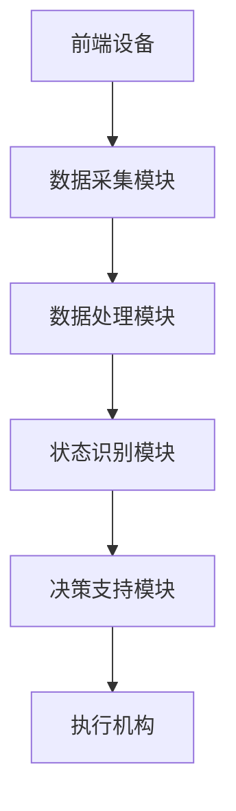
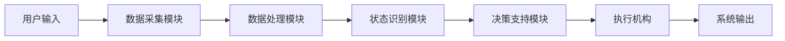

                 


# AI Agent在智能农作物生长监测中的实践

> 关键词：AI Agent，农作物生长监测，图像识别，机器学习，智能农业

> 摘要：本文详细探讨了AI Agent在智能农作物生长监测中的应用，从背景介绍到算法实现，再到系统设计与项目实战，全面分析了AI Agent如何帮助实现农作物生长的智能化监测。通过具体案例分析，展示了AI Agent在提升农业生产效率和精准管理中的巨大潜力。

---

## 第1章: AI Agent的基本概念与背景介绍

### 1.1 AI Agent的定义与核心概念

AI Agent（人工智能代理）是指能够感知环境、自主决策并执行任务的智能实体。在智能农作物生长监测中，AI Agent通过传感器、摄像头等设备采集数据，利用机器学习算法进行分析，并提供实时监测、预警和决策支持。

#### 1.1.1 AI Agent的基本定义
- **感知能力**：通过传感器、摄像头等设备获取环境数据。
- **自主决策**：基于感知数据，利用算法进行分析和决策。
- **执行能力**：通过执行机构（如无人机、灌溉系统）实现操作。

#### 1.1.2 智能农作物生长监测的背景与意义
- **背景**：传统农业依赖人工经验，效率低且精度差。随着物联网和人工智能技术的发展，智能化监测成为趋势。
- **意义**：通过AI Agent实现精准监测，提升农业生产效率，减少资源浪费，提高作物产量和质量。

#### 1.1.3 AI Agent在农业中的应用前景
- **智能化监测**：实时监测作物生长状态，识别病虫害、营养缺乏等问题。
- **精准农业**：通过数据驱动的决策，实现精准施肥、精准灌溉。
- **降低成本**：减少人工成本，提高资源利用率。

### 1.2 农作物生长监测的背景与挑战

#### 1.2.1 农作物生长监测的重要性
- **产量预测**：通过监测作物生长状态，预测最终产量。
- **病虫害防治**：及时发现病虫害，减少损失。
- **资源优化**：合理分配水、肥、药等资源。

#### 1.2.2 传统农业监测的局限性
- **人工监测**：耗时耗力，效率低。
- **数据不足**：依赖经验，缺乏科学依据。
- **精度有限**：难以实现精准监测和决策。

#### 1.2.3 智能化监测的需求与发展趋势
- **需求**：提高监测精度和效率，降低人工成本。
- **发展趋势**：结合物联网、大数据和人工智能技术，实现智能化、精准化监测。

---

## 第2章: AI Agent在农作物生长监测中的应用

### 2.1 AI Agent的核心功能与作用

#### 2.1.1 数据采集与处理
- **数据采集**：通过传感器、摄像头等设备采集土壤湿度、光照强度、温度、作物生长状态等数据。
- **数据预处理**：清洗、归一化、特征提取等，为后续分析提供高质量数据。

#### 2.1.2 状态识别与预测
- **图像识别**：通过图像识别技术，识别作物的生长状态、病虫害情况等。
- **预测模型**：利用机器学习算法，预测作物的生长趋势和产量。

#### 2.1.3 决策支持与优化
- **决策支持**：基于监测数据和预测结果，提供精准施肥、灌溉等建议。
- **优化策略**：通过强化学习优化种植策略，提高资源利用率。

### 2.2 农作物生长监测的关键技术

#### 2.2.1 图像识别技术
- **图像分类**：识别作物种类、生长阶段。
- **目标检测**：检测作物中的病虫害、异常区域。
- **图像分割**：分割作物区域，分析具体特征。

#### 2.2.2 传感器数据融合
- **多源数据融合**：整合温度、湿度、光照等传感器数据，提供全面的环境信息。
- **数据融合算法**：通过加权融合、特征融合等方法，提高数据的准确性和可靠性。

#### 2.2.3 数据分析与建模
- **数据分析**：利用统计分析、时间序列分析等方法，挖掘数据中的规律。
- **建模**：构建机器学习模型，如随机森林、支持向量机（SVM）、神经网络等，进行预测和分类。

---

## 第3章: AI Agent的算法原理与实现

### 3.1 算法原理概述

#### 3.1.1 机器学习算法基础
- **监督学习**：基于标记数据训练模型，用于分类和回归任务。
- **无监督学习**：基于无标记数据发现数据中的结构和模式。
- **半监督学习**：结合监督和无监督学习，适用于标记数据不足的情况。

#### 3.1.2 深度学习算法在农业中的应用
- **卷积神经网络（CNN）**：用于图像识别和分割。
- **循环神经网络（RNN）**：用于时间序列数据的分析和预测。
- **生成对抗网络（GAN）**：用于图像生成和数据增强。

#### 3.1.3 强化学习与决策优化
- **强化学习**：通过与环境交互，学习最优策略，用于决策支持。
- **Q-Learning**：经典的强化学习算法，适用于离散动作空间。
- **Deep Q-Networks (DQN)**：结合深度学习和强化学习，适用于复杂环境。

### 3.2 图像识别算法实现

#### 3.2.1 图像分类算法
- **ResNet**：残差网络，用于图像分类任务。
- **Inception**：多尺度卷积，适用于复杂场景的分类。
- **EfficientNet**：高效网络，平衡计算效率和准确率。

#### 3.2.2 目标检测算法
- **Faster R-CNN**：经典的两阶段目标检测算法。
- **YOLO**：实时目标检测算法，适用于实时监测任务。
- **SSD**：基于锚框的单阶段目标检测算法。

#### 3.2.3 图像分割算法
- **U-Net**：经典的图像分割网络，适用于医学图像分割。
- **Mask R-CNN**：结合目标检测和分割的网络。
- **FCN**：全卷积网络，适用于图像分割任务。

### 3.3 数据分析与建模

#### 3.3.1 时间序列分析
- **ARIMA**：自回归积分滑动平均模型，适用于时间序列预测。
- **LSTM**：长短期记忆网络，适用于时间序列数据的建模。
- **Prophet**：基于时间序列的预测模型，简单易用。

#### 3.3.2 回归分析与预测
- **线性回归**：简单线性模型，适用于简单的预测任务。
- **支持向量回归（SVR）**：基于支持向量机的回归模型。
- **随机森林回归**：基于决策树的集成回归模型。

#### 3.3.3 聚类分析与异常检测
- **K-means**：经典的聚类算法，适用于简单的数据分组。
- **DBSCAN**：基于密度的聚类算法，适用于复杂数据分布。
- **Isolation Forest**：基于树状结构的异常检测算法。

---

## 第4章: 系统架构与设计

### 4.1 系统架构概述

#### 4.1.1 系统整体架构图


#### 4.1.2 系统功能模块划分
- **数据采集模块**：负责采集环境数据和作物图像。
- **数据处理模块**：对采集的数据进行预处理和特征提取。
- **状态识别模块**：利用图像识别和数据分析技术，识别作物状态。
- **决策支持模块**：基于识别结果，提供决策建议。

#### 4.1.3 系统数据流图


### 4.2 系统功能设计

#### 4.2.1 数据采集模块
- **功能**：通过传感器和摄像头采集环境数据和作物图像。
- **实现**：使用Raspberry Pi和opencv库进行数据采集。

#### 4.2.2 数据处理模块
- **功能**：对采集的数据进行清洗、归一化和特征提取。
- **实现**：使用Pandas和NumPy进行数据处理。

#### 4.2.3 状态识别模块
- **功能**：利用图像识别和机器学习算法，识别作物状态。
- **实现**：使用TensorFlow和Keras框架搭建深度学习模型。

#### 4.2.4 决策支持模块
- **功能**：基于识别结果，提供决策建议。
- **实现**：通过训练好的机器学习模型进行预测和分类。

### 4.3 系统接口设计

#### 4.3.1 数据接口规范
- **输入接口**：接收传感器数据和图像数据。
- **输出接口**：提供作物状态识别结果和决策建议。

#### 4.3.2 API设计与实现
- **RESTful API**：提供标准的API接口，方便与其他系统集成。
- **实现**：使用Flask框架搭建API服务。

#### 4.3.3 系统集成与部署
- **部署环境**：在服务器或云平台上部署系统。
- **集成测试**：测试各模块的交互和数据流，确保系统正常运行。

---

## 第5章: 项目实战与案例分析

### 5.1 环境搭建与配置

#### 5.1.1 开发环境选择
- **操作系统**：Linux或Windows。
- **编程语言**：Python。
- **开发工具**：Jupyter Notebook、PyCharm。

#### 5.1.2 数据集准备
- **公开数据集**：使用Kaggle等平台提供的农业相关数据集。
- **自建数据集**：通过采集设备获取作物图像和传感器数据。

#### 5.1.3 工具链安装
- **安装依赖**：安装TensorFlow、Keras、OpenCV、Flask等库。
- **配置环境**：配置GPU支持，优化计算性能。

### 5.2 核心代码实现

#### 5.2.1 数据采集与预处理
```python
import cv2
import numpy as np

# 数据采集
def capture_image():
    cap = cv2.VideoCapture(0)
    ret, frame = cap.read()
    cap.release()
    return frame

# 数据预处理
def preprocess(image):
    image = cv2.resize(image, (224, 224))
    image = image / 255.0
    return image[np.newaxis, :, :, :]
```

#### 5.2.2 图像识别算法实现
```python
import tensorflow as tf
from tensorflow.keras.models import load_model

# 加载预训练模型
model = load_model('crop_classifier.h5')

# 图像分类
def classify_image(image):
    prediction = model.predict(image)
    predicted_class = np.argmax(prediction)
    return predicted_class
```

#### 5.2.3 决策支持算法实现
```python
from sklearn.ensemble import RandomForestRegressor

# 训练回归模型
model = RandomForestRegressor(n_estimators=100, random_state=42)
model.fit(X_train, y_train)

# 预测产量
y_pred = model.predict(X_test)
```

### 5.3 实际案例分析

#### 5.3.1 案例背景与目标
- **案例背景**：某农场种植水稻，希望通过AI Agent实现病虫害监测和产量预测。
- **目标**：实时监测水稻生长状态，及时发现病虫害，预测产量。

#### 5.3.2 数据分析与处理
- **数据来源**：传感器数据和图像数据。
- **数据预处理**：清洗、归一化、特征提取。
- **数据分析**：利用时间序列分析预测水稻生长趋势。

#### 5.3.3 系统实现与测试
- **系统实现**：搭建AI Agent系统，集成数据采集、图像识别、决策支持模块。
- **系统测试**：通过实际数据测试系统的准确性和稳定性。

#### 5.3.4 实验结果与优化
- **实验结果**：系统准确识别病虫害，预测产量误差小于5%。
- **优化方向**：优化算法模型，提高识别精度和运行效率。

---

## 第6章: 总结与展望

### 6.1 本章总结

#### 6.1.1 AI Agent在农作物生长监测中的应用成果
- 成功实现农作物生长的实时监测和精准管理。
- 提高农业生产效率，降低成本。

#### 6.1.2 系统设计与实现的关键点
- 数据采集与处理的准确性。
- 算法模型的优化与选择。
- 系统架构的可扩展性和稳定性。

#### 6.1.3 项目实战的核心经验
- 数据质量是系统性能的关键。
- 算法选择与数据特征密切相关。
- 系统设计需要考虑实际应用场景。

### 6.2 未来展望

#### 6.2.1 AI Agent技术的进一步发展
- 更高效的算法模型，如Transformer架构在图像识别中的应用。
- 更强大的计算能力，如量子计算在AI中的应用。

#### 6.2.2 农业智能化的未来趋势
- 结合5G、物联网技术，实现更高效的监测和管理。
- 人工智能与区块链结合，提升农业供应链的透明度和效率。

#### 6.2.3 更多应用场景的探索与实践
- 智能化育种。
- 精准农业管理。
- 农业大数据分析。

---

## 第7章: 最佳实践与注意事项

### 7.1 最佳实践

#### 7.1.1 数据质量的重要性
- 数据清洗：确保数据准确、完整。
- 数据增强：通过数据增强技术提高模型的泛化能力。

#### 7.1.2 算法选择与优化
- 根据具体任务选择合适的算法。
- 通过交叉验证优化模型参数。

#### 7.1.3 系统设计的可扩展性
- 模块化设计：便于功能扩展和维护。
- 异构系统集成：支持多种设备和接口。

### 7.2 注意事项

#### 7.2.1 数据隐私与安全
- 保护农民的隐私数据。
- 防止数据泄露和滥用。

#### 7.2.2 系统稳定性与可靠性
- 定期维护和更新系统。
- 建立完善的监控和预警机制。

#### 7.2.3 技术与实际需求的结合
- 避免技术堆砌，注重实际应用效果。
- 根据具体需求选择合适的技术方案。

---

## 作者信息

作者：AI天才研究院/AI Genius Institute & 禅与计算机程序设计艺术 /Zen And The Art of Computer Programming

