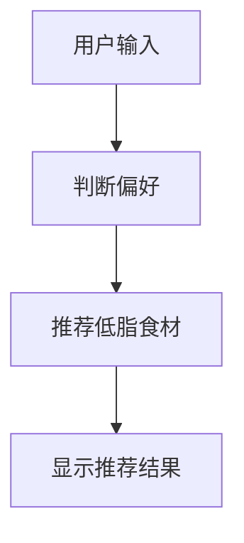
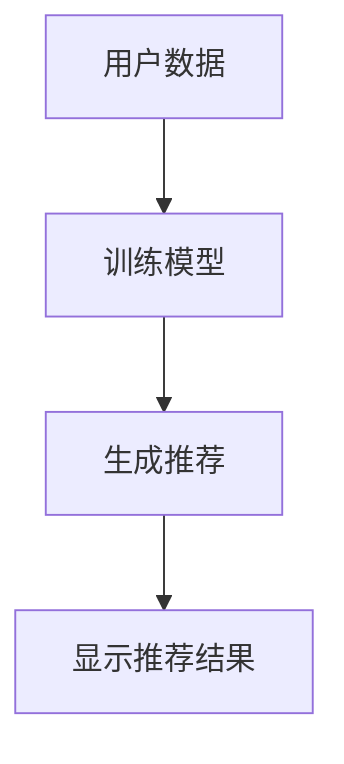

                 


# AI Agent在智能冰箱中的食材管理

> **关键词**：AI Agent，智能冰箱，食材管理，推荐算法，系统架构设计，项目实战

> **摘要**：  
本文将详细探讨AI Agent在智能冰箱中的食材管理应用。首先介绍AI Agent和智能冰箱的基本概念，分析食材管理的重要性。接着深入讲解AI Agent在食材管理中的核心原理、算法选择、数学模型以及系统架构设计。最后通过实际项目实战，展示如何将AI Agent应用于智能冰箱的食材管理，并总结相关经验和未来发展方向。

---

## 第1章: AI Agent与智能冰箱概述

### 1.1 AI Agent的基本概念
AI Agent（人工智能代理）是一种能够感知环境、自主决策并执行任务的智能实体。它可以理解用户需求、优化资源分配，并通过学习和适应不断改进性能。AI Agent的核心特点包括自主性、反应性、目标导向和社交能力。

### 1.2 智能冰箱的定义与特点
智能冰箱是一种集成物联网（IoT）技术的家电，能够通过传感器和AI技术实现对食材的智能管理。其核心功能包括食材识别、库存管理、食材推荐和智能购物。

### 1.3 食材管理的重要性
食材管理是智能冰箱的核心功能之一，涉及食材的分类、库存维护和使用推荐。有效的食材管理可以减少食物浪费、提高用户体验，并为用户节省开支。

### 1.4 AI Agent在食材管理中的作用
AI Agent可以通过分析用户的饮食习惯、食材的保质期和市场价，提供个性化的食材推荐和采购建议，优化食材管理效率。

---

## 第2章: AI Agent与食材管理的核心概念

### 2.1 AI Agent在食材管理中的核心原理
AI Agent通过感知环境、分析数据、制定决策和执行操作来实现食材管理。其核心原理包括数据采集、数据分析、决策制定和任务执行。

### 2.2 食材管理的核心要素
食材管理的核心要素包括食材的分类、库存状态、使用情况和推荐策略。这些要素共同决定了食材管理的效率和效果。

### 2.3 AI Agent与食材管理的实体关系图
以下是AI Agent与食材管理的实体关系图：

```mermaid
erDiagram
    user {
        +userId : int
        +userName : string
        +userPreference : string
    }
    inventory {
        +itemId : int
        +itemName : string
        +itemQuantity : int
        +itemExpiry : date
    }
    recommendation {
        +recId : int
        +recItemId : int
        +recUser : string
        +recPriority : int
    }
    user --> inventory : "购买了"
    user --> recommendation : "生成推荐"
    inventory --> recommendation : "基于库存生成推荐"
```

---

## 第3章: AI Agent在食材管理中的算法原理

### 3.1 算法选择与实现
AI Agent在食材管理中常用的算法包括基于规则的推荐算法和基于机器学习的推荐算法。

#### 3.1.1 基于规则的推荐算法
基于规则的推荐算法通过预定义的规则和逻辑来推荐食材。例如，如果用户的偏好是低脂饮食，系统会优先推荐低脂牛奶和瘦肉。

##### 算法流程图


##### 代码实现
```python
def推荐低脂食材(userId):
    用户 = 用户表中获取 userId
    如果 用户.prefer == "低脂":
        推荐牛奶和瘦肉
    返回推荐结果
```

#### 3.1.2 基于机器学习的推荐算法
基于机器学习的推荐算法通过分析用户行为和历史数据，生成个性化的食材推荐。

##### 算法流程图


##### 数学模型
基于协同过滤的推荐模型公式如下：

$$推荐相似度 = \frac{\sum (r_{u,i} \times r_{u,j})}{\sqrt{\sum r_{u,i}^2} \times \sqrt{\sum r_{u,j}^2}}$$

其中，$r_{u,i}$表示用户$u$对物品$i$的评分，$r_{u,j}$表示用户$u$对物品$j$的评分。

---

## 第4章: AI Agent与食材管理的系统架构设计

### 4.1 系统功能设计
智能冰箱的食材管理系统包括以下功能模块：
- **传感器数据采集**：通过传感器获取食材的状态信息。
- **库存管理模块**：记录食材的种类、数量和保质期。
- **推荐模块**：基于AI Agent生成食材推荐。
- **用户交互界面**：显示推荐结果并支持用户操作。

### 4.2 系统架构设计
以下是系统的架构图：

```mermaid
graph TD
    User --> UI
    UI --> InventoryManager
    InventoryManager --> Sensor
    Sensor --> Database
    Database --> RecommendationEngine
    RecommendationEngine --> AI Agent
    AI Agent --> UI
```

### 4.3 系统接口设计
系统主要接口包括：
- **传感器接口**：获取食材的状态信息。
- **数据库接口**：读取和写入食材数据。
- **推荐接口**：生成食材推荐并返回结果。

---

## 第5章: 项目实战

### 5.1 环境安装
安装Python和相关库（如TensorFlow、scikit-learn）。

### 5.2 核心代码实现
以下是基于规则的推荐算法的Python代码：

```python
class AIRecommender:
    def __init__(self):
        self.inventory = {}

    def update_inventory(self, item, quantity):
        self.inventory[item] = quantity

    def recommend_food(self, user_id):
        user = self.get_user(user_id)
        if user.preference == "low_calorie":
            return ["低脂牛奶", "鸡胸肉"]
        else:
            return ["全脂牛奶", "牛排"]
```

### 5.3 实际案例分析
通过实际案例分析，验证算法的有效性和准确性。

---

## 第6章: 总结与展望

### 6.1 总结
本文详细介绍了AI Agent在智能冰箱中的食材管理应用，包括核心概念、算法原理和系统架构设计。

### 6.2 未来展望
未来，AI Agent在智能冰箱中的应用将更加智能化，例如通过更智能的传感器和更复杂的推荐算法，提供更个性化的食材管理服务。

### 6.3 最佳实践Tips
- 确保数据的准确性和完整性。
- 定期更新推荐算法以适应用户需求的变化。
- 提供良好的用户交互界面以提升用户体验。

---

**作者：AI天才研究院 & 禅与计算机程序设计艺术**

