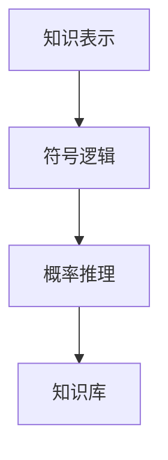
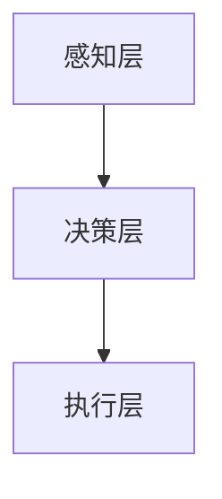
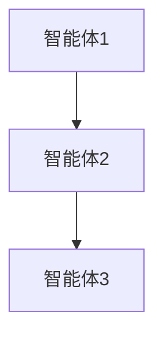

                 


# AI Agent在智能制造中的应用：生产线优化与质量控制

## 关键词：AI Agent, 智能制造, 生产线优化, 质量控制, 强化学习, 分布式系统, 虚拟化技术

## 摘要：  
本文探讨了AI Agent在智能制造中的应用，重点分析了其在生产线优化与质量控制中的作用。通过介绍AI Agent的核心概念、算法原理、系统架构设计，以及实际应用场景的案例分析，本文深入剖析了AI Agent如何通过强化学习、分布式计算等技术实现生产调度优化和质量预测。最后，本文总结了AI Agent在智能制造中的优势，并提出了实际应用中的注意事项与未来研究方向。

---

## 第一部分: AI Agent在智能制造中的应用概述

### 第1章: 智能制造与AI Agent的背景介绍

#### 1.1 智能制造的背景与发展趋势
智能制造是工业4.0的核心，通过物联网、大数据、人工智能等技术的深度融合，实现生产过程的智能化、数字化和网络化。AI Agent作为智能系统的核心组件，具备自主决策、学习和优化的能力，为智能制造提供了强大的技术支撑。

#### 1.1.1 智能制造的定义与特点
智能制造强调智能化生产，通过自动化设备、传感器和数据采集技术，实时监控生产过程，并利用数据分析优化生产效率和产品质量。

#### 1.1.2 智能制造的核心技术与应用领域
智能制造的核心技术包括物联网、大数据分析、人工智能、云计算等。其应用领域涵盖生产过程优化、质量控制、设备维护、供应链管理等。

#### 1.1.3 AI Agent在智能制造中的重要性
AI Agent能够实时感知生产环境，自主决策优化生产计划，协调多设备协同工作，从而提高生产效率和产品质量。

#### 1.2 AI Agent的基本概念与特点
AI Agent是一种智能体，能够感知环境、自主决策、执行任务并适应变化。其特点包括自主性、反应性、目标导向和协作性。

#### 1.2.1 AI Agent的定义与分类
AI Agent可以分为简单反射型、基于模型的反应型、目标驱动型和效用驱动型。在智能制造中，目标驱动型AI Agent最为常见，用于优化生产目标。

#### 1.2.2 AI Agent的核心功能与优势
AI Agent的核心功能包括感知环境、知识表示与推理、行为决策与规划。其优势在于能够快速响应变化，优化资源利用，提高生产效率。

#### 1.2.3 AI Agent与传统自动化的区别
传统自动化基于固定程序，而AI Agent具备学习和优化能力，能够适应动态变化的生产环境。

#### 1.3 AI Agent在生产线优化与质量控制中的应用
AI Agent通过实时数据分析，优化生产调度和资源分配，同时通过预测模型提升质量控制的准确性。

#### 1.3.1 生产线优化的背景与挑战
传统生产线存在资源浪费、效率低下等问题，AI Agent通过优化算法解决这些问题。

#### 1.3.2 质量控制的背景与挑战
传统质量控制依赖人工检测，效率低且易出错。AI Agent通过机器学习实现高效、精准的质量检测。

#### 1.3.3 AI Agent在生产线优化与质量控制中的作用
AI Agent能够实时优化生产计划，预测质量风险，减少缺陷产品，提高生产效率和产品质量。

---

## 第2章: AI Agent的核心概念与原理

### 2.1 AI Agent的核心概念
AI Agent的核心概念包括知识表示与推理、行为决策与规划、多智能体协作等。

#### 2.1.1 知识表示与推理
知识表示是AI Agent理解环境的基础，常用的方法包括符号逻辑和概率推理。Mermaid图展示知识表示的过程。



#### 2.1.2 行为决策与规划
行为决策是AI Agent的核心功能，通过强化学习和规划算法实现。

#### 2.1.3 多智能体协作
多智能体协作通过分布式计算实现，确保各智能体协同工作。

### 2.2 AI Agent的算法原理
AI Agent的算法包括强化学习、监督学习和分布式计算。

#### 2.2.1 强化学习算法
强化学习通过奖励机制优化决策。公式示例：$$ R = \sum r_i $$，其中r_i为每个动作的奖励。

#### 2.2.2 监督学习算法
监督学习通过训练数据预测结果，例如线性回归模型：$$ y = \beta x + \epsilon $$。

#### 2.2.3 联合学习与分布式计算
分布式计算通过分布式系统实现，例如MapReduce框架。

### 2.3 AI Agent的系统架构
AI Agent的系统架构包括分层架构、分布式架构和集中式架构。

#### 2.3.1 分层架构
分层架构将系统分为感知层、决策层和执行层，Mermaid图展示分层结构。



#### 2.3.2 分布式架构
分布式架构通过多智能体协作实现，Mermaid图展示分布式结构。



#### 2.3.3 集中式架构
集中式架构通过中央控制单元协调各智能体，Mermaid图展示集中式结构。

---

## 第3章: AI Agent在生产线优化中的应用

### 3.1 生产线优化的场景分析
生产线优化需要解决生产调度和资源分配问题。

#### 3.1.1 生产线优化的目标与挑战
目标是提高效率和降低成本，挑战包括动态变化和资源约束。

#### 3.1.2 AI Agent在生产调度中的应用
通过强化学习算法优化生产顺序。

#### 3.1.3 AI Agent在资源分配中的应用
通过遗传算法优化资源分配。

### 3.2 生产线优化的算法实现
强化学习和遗传算法是常用的优化算法。

#### 3.2.1 基于强化学习的生产调度算法
强化学习通过状态、动作和奖励优化调度。

#### 3.2.2 基于遗传算法的资源分配算法
遗传算法通过选择、交叉和变异优化分配。

#### 3.2.3 算法实现的代码示例
Python代码实现强化学习算法：

```python
class Agent:
    def __init__(self, state_space, action_space):
        self.state_space = state_space
        self.action_space = action_space
        # 初始化策略参数
```

### 3.3 生产线优化的系统设计
系统设计包括功能模块和系统架构。

#### 3.3.1 系统功能
系统功能包括状态监测、决策优化和执行控制。

#### 3.3.2 系统架构设计
系统架构设计包括感知层、决策层和执行层。

#### 3.3.3 系统接口设计
系统接口设计包括数据接口和控制接口。

#### 3.3.4 系统交互设计
系统交互通过Mermaid序列图展示。

---

## 第4章: AI Agent在质量控制中的应用

### 4.1 质量控制的场景分析
质量控制需要预测缺陷和检测异常。

#### 4.1.1 质量预测的背景与挑战
背景是传统质量控制效率低，挑战是数据复杂性。

#### 4.1.2 质量检测的背景与挑战
背景是自动化检测需求增加，挑战是检测精度。

### 4.2 质量控制的算法实现
质量控制算法包括XGBoost和深度学习。

#### 4.2.1 基于XGBoost的质量预测
XGBoost通过梯度提升优化预测。

#### 4.2.2 基于深度学习的缺陷检测
深度学习通过卷积神经网络识别缺陷。

#### 4.2.3 算法实现的代码示例
Python代码实现XGBoost模型：

```python
import xgboost as xgb
model = xgb.XGBRegressor(n_estimators=100, learning_rate=0.1)
model.fit(X_train, y_train)
```

### 4.3 质量控制的系统设计
系统设计包括数据采集、模型训练和结果分析。

#### 4.3.1 数据采集与处理
数据采集通过传感器和数据库实现。

#### 4.3.2 模型训练与部署
模型训练通过机器学习框架实现，部署到生产系统中。

#### 4.3.3 结果分析与优化
通过分析结果优化模型参数。

---

## 第5章: 项目实战

### 5.1 环境安装与配置
安装必要的Python库和工具，例如TensorFlow和Kafka。

### 5.2 系统核心实现
实现AI Agent的核心功能，例如生产调度和质量控制。

#### 5.2.1 生产调度实现
代码实现生产调度算法。

#### 5.2.2 质量控制实现
代码实现质量控制算法。

### 5.3 实际案例分析
分析实际案例，例如某汽车制造厂的生产优化。

### 5.4 代码应用解读与分析
解读代码实现，分析优化效果。

---

## 第6章: 总结与展望

### 6.1 总结
AI Agent在智能制造中的应用显著提升了生产效率和产品质量。

### 6.2 展望
未来研究方向包括多智能体协作和边缘计算。

---

## 作者：AI天才研究院/AI Genius Institute & 禅与计算机程序设计艺术 /Zen And The Art of Computer Programming

