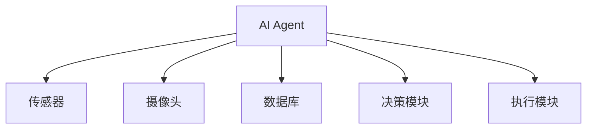
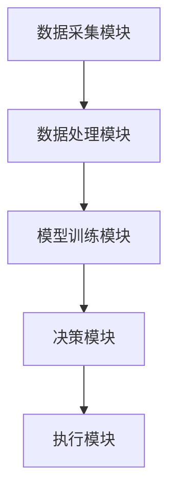
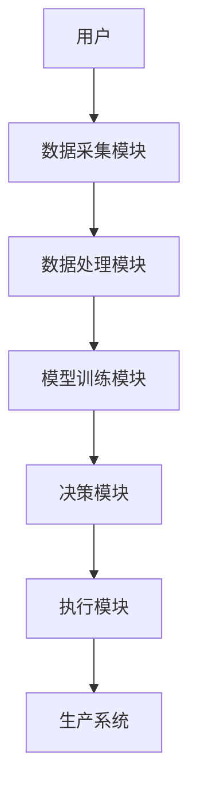

                 

<think>
好的，我现在需要帮助用户撰写一篇关于《AI Agent在智能制造质量控制中的应用》的技术博客文章。用户希望我按照特定的目录大纲结构来写，每个部分都要详细且有深度，同时使用专业的技术语言。

首先，我会仔细阅读用户提供的需求，确保完全理解他们的期望。用户希望文章有清晰的逻辑结构，包括摘要、关键词，以及详细的章节内容，每个章节下还有子章节，内容需要丰富具体，详细讲解每个核心概念和算法原理。

接下来，我需要确保文章的格式正确，使用markdown，并且在每个部分嵌入必要的图表，如流程图、类图等，使用mermaid语法。同时，数学公式需要使用latex格式，并在独立段落中使用$$包裹，段落内使用$包裹。

我还需要注意文章的整体长度，大约在10000到12000字之间，这意味着每个章节需要详细展开，不能过于简略。此外，文章的最后需要添加作者信息，格式为“作者：AI天才研究院 & 禅与计算机程序设计艺术”。

在撰写过程中，我会逐步分析每个章节的内容，确保涵盖所有关键点。例如，在“AI Agent与智能制造质量控制的背景介绍”部分，我需要定义基本概念，对比AI Agent与传统自动化，分析智能制造中的质量控制挑战和需求。

接下来，在算法原理部分，我需要详细解释强化学习、监督学习和深度学习在质量控制中的应用，并通过mermaid流程图展示算法流程，同时提供Python代码示例，以便读者更好地理解和实现。

在系统分析与架构设计部分，我会介绍系统功能模块、架构设计、接口设计和交互流程，使用mermaid图来展示系统结构和交互过程。这些图表将帮助读者更直观地理解系统的工作原理。

最后，在项目实战部分，我需要通过具体案例展示AI Agent的实际应用，包括项目背景、环境配置、核心代码实现和案例分析。这将使读者能够将理论知识应用到实际中，提升文章的实用价值。

在撰写过程中，我需要确保语言简洁专业，逻辑清晰，结构紧凑。每个部分的详细讲解将帮助读者逐步理解AI Agent在智能制造质量控制中的应用，从理论到实践，全面掌握相关知识。

总的来说，我需要按照用户的要求，一步步构建这篇文章，确保每个部分都符合他们的期望，同时提供高质量、有深度的内容，满足读者的需求。
</think>

# AI Agent在智能制造质量控制中的应用

> 关键词：AI Agent, 智能制造, 质量控制, 机器学习, 计算机视觉, 强化学习, 深度学习

> 摘要：本文系统探讨了AI Agent在智能制造质量控制中的应用，从基本概念、核心算法、系统架构到实际案例，全面解析了AI Agent如何提升制造业的质量控制能力。通过理论分析与实践结合，本文为读者提供了一套完整的解决方案。

---

# 第一部分: AI Agent与智能制造质量控制概述

## 第1章: AI Agent与智能制造质量控制的背景介绍

### 1.1 AI Agent的基本概念

#### 1.1.1 什么是AI Agent
AI Agent（人工智能代理）是一种能够感知环境、自主决策并执行任务的智能实体。它可以是一个软件程序、一个机器人，甚至是嵌入在设备中的算法。AI Agent的核心目标是通过智能决策和行动，优化特定场景下的任务执行效率。

#### 1.1.2 AI Agent的核心特征
- **自主性**：能够在没有外部干预的情况下自主完成任务。
- **反应性**：能够实时感知环境变化并做出响应。
- **学习能力**：通过数据和经验不断优化自身的决策能力。
- **协作性**：能够与其他AI Agent或系统协同工作。

#### 1.1.3 AI Agent与传统自动化的区别
传统的自动化系统基于固定的规则和程序执行任务，而AI Agent具备更强的智能性和适应性，能够根据环境变化动态调整行为。

| 特性 | 传统自动化 | AI Agent |
|------|------------|-----------|
| 决策方式 | 基于固定规则 | 基于实时感知和学习 |
| 灵活性 | 低 | 高 |
| 适应性 | 低 | 高 |

### 1.2 智能制造的基本概念

#### 1.2.1 智能制造的定义
智能制造是一种通过物联网、大数据、人工智能等技术，实现生产过程智能化、数字化和网络化的制造模式。

#### 1.2.2 智能制造的核心技术
- **物联网技术**：实现设备、产品和系统的互联。
- **大数据技术**：从海量数据中提取有价值的信息。
- **人工智能技术**：用于智能决策和优化。
- **云计算技术**：提供弹性计算资源。

#### 1.2.3 智能制造的发展趋势
- **智能化**：从自动化向智能化升级。
- **数字化**：从局部数字化向全数字化转型。
- **网络化**：从孤岛式系统向网络化协同转变。

### 1.3 智能制造质量控制的挑战与需求

#### 1.3.1 制造业质量控制的痛点
- **人工成本高**：传统质量控制依赖大量人工检查。
- **效率低**：手动检查速度慢，容易出错。
- **数据孤岛**：各部门数据分散，难以统一分析。
- **复杂性高**：现代制造业流程复杂，质量控制难度大。

#### 1.3.2 智能制造对质量控制的新要求
- **实时性**：能够快速响应生产过程中的异常。
- **精准性**：实现高精度的质量检测。
- **智能化**：能够自主优化质量控制流程。
- **可追溯性**：实现产品质量的全生命周期追溯。

#### 1.3.3 AI Agent在质量控制中的应用潜力
AI Agent能够通过实时感知、数据分析和智能决策，显著提升质量控制的效率和准确性。

### 1.4 本章小结
本章介绍了AI Agent和智能制造的基本概念，分析了智能制造质量控制的挑战与需求，并探讨了AI Agent在质量控制中的应用潜力。

---

## 第2章: AI Agent在智能制造质量控制中的核心概念与联系

### 2.1 AI Agent的核心原理

#### 2.1.1 AI Agent的感知与决策机制
AI Agent通过传感器、摄像头等设备感知环境信息，利用机器学习算法分析数据，生成决策。

#### 2.1.2 AI Agent的学习与自适应能力
AI Agent能够通过监督学习、无监督学习和强化学习等方法，不断优化自身的决策模型。

#### 2.1.3 AI Agent的通信与协作能力
AI Agent能够与其他AI Agent或系统通过API、消息队列等方式进行通信，实现协作任务。

### 2.2 智能制造质量控制的关键技术

#### 2.2.1 机器学习在质量控制中的应用
机器学习用于从历史数据中训练质量预测模型，识别潜在的质量问题。

#### 2.2.2 计算机视觉在质量检测中的应用
计算机视觉技术用于图像识别，能够快速检测产品表面的缺陷。

#### 2.2.3 自然语言处理在质量反馈中的应用
自然语言处理技术用于分析客户反馈，提取质量问题并优化产品设计。

### 2.3 AI Agent与智能制造质量控制的系统架构

#### 2.3.1 系统整体架构图


#### 2.3.2 AI Agent在系统中的角色定位
AI Agent作为系统的核心，负责数据的采集、分析和决策。

#### 2.3.3 系统各模块之间的关系
- **传感器**：采集生产环境中的数据。
- **摄像头**：采集产品的图像信息。
- **数据库**：存储历史数据和模型。
- **决策模块**：基于数据生成决策。
- **执行模块**：根据决策执行操作。

### 2.4 本章小结
本章详细介绍了AI Agent的核心原理，并探讨了其在智能制造质量控制中的应用，通过系统架构图展示了各模块之间的关系。

---

## 第3章: AI Agent在智能制造质量控制中的算法原理

### 3.1 基于强化学习的质量控制算法

#### 3.1.1 强化学习的基本原理
强化学习是一种通过试错机制，学习最优策略的方法。AI Agent通过与环境交互，获得奖励或惩罚，逐步优化决策模型。

#### 3.1.2 在质量控制中的应用
强化学习可以用于优化生产参数，例如温度、压力等，以提高产品质量。

#### 3.1.3 算法实现步骤
1. 初始化策略参数。
2. 与环境交互，获取状态和奖励。
3. 更新策略参数，优化奖励函数。
4. 重复上述步骤，直到达到目标。

#### 3.1.4 实例代码
```python
import numpy as np

# 初始化策略参数
theta = np.random.rand(10, 1)

# 定义奖励函数
def reward_function(state):
    return np.dot(state, theta)

# 强化学习循环
for _ in range(1000):
    state = get_current_state()
    action = np.argmax(reward_function(state))
    next_state, reward = step(action)
    theta = theta + learning_rate * (reward - np.dot(state, theta)) * state
```

### 3.2 基于监督学习的质量检测算法

#### 3.2.1 监督学习的基本原理
监督学习通过训练数据，学习输入与输出之间的映射关系，用于分类或回归任务。

#### 3.2.2 在图像识别中的应用
监督学习用于训练图像分类模型，识别产品中的缺陷。

#### 3.2.3 算法实现步骤
1. 收集标注数据。
2. 训练分类模型。
3. 使用模型进行预测。
4. 评估模型性能，优化参数。

#### 3.2.4 实例代码
```python
import tensorflow as tf
from tensorflow.keras import layers

# 定义模型
model = tf.keras.Sequential([
    layers.Conv2D(32, (3,3), activation='relu', input_shape=(64, 64, 3)),
    layers.MaxPooling2D((2,2)),
    layers.Conv2D(64, (3,3), activation='relu'),
    layers.MaxPooling2D((2,2)),
    layers.Flatten(),
    layers.Dense(128, activation='relu'),
    layers.Dense(10, activation='softmax')
])

# 编译模型
model.compile(optimizer='adam', loss='sparse_categorical_crossentropy', metrics=['accuracy'])
```

### 3.3 基于深度学习的质量预测算法

#### 3.3.1 深度学习的基本原理
深度学习通过多层神经网络，学习数据的高层次特征。

#### 3.3.2 在质量预测中的应用
深度学习用于预测产品质量，优化生产流程。

#### 3.3.3 算法实现步骤
1. 收集数据。
2. 构建神经网络模型。
3. 训练模型。
4. 使用模型进行预测。

#### 3.3.4 实例代码
```python
import torch
import torch.nn as nn

# 定义模型
class QualityPredictor(nn.Module):
    def __init__(self):
        super(QualityPredictor, self).__init__()
        self.fc1 = nn.Linear(10, 64)
        self.fc2 = nn.Linear(64, 32)
        self.fc3 = nn.Linear(32, 1)

    def forward(self, x):
        x = torch.relu(self.fc1(x))
        x = torch.relu(self.fc2(x))
        x = self.fc3(x)
        return x

# 初始化模型
model = QualityPredictor()
criterion = nn.MSELoss()
optimizer = torch.optim.Adam(model.parameters(), lr=0.001)
```

### 3.4 本章小结
本章详细介绍了几种常用的算法原理，并通过实例代码展示了其在质量控制中的应用。

---

## 第4章: AI Agent在智能制造质量控制中的系统分析与架构设计

### 4.1 系统功能设计

#### 4.1.1 系统功能模块划分
- **数据采集模块**：采集生产数据。
- **数据处理模块**：对数据进行清洗和预处理。
- **模型训练模块**：训练质量控制模型。
- **决策模块**：生成质量控制决策。
- **执行模块**：执行决策。

#### 4.1.2 功能模块的实现目标
- **数据采集模块**：实时采集生产环境中的数据。
- **数据处理模块**：对数据进行清洗和特征提取。
- **模型训练模块**：训练高质量的质量控制模型。
- **决策模块**：基于模型输出决策。
- **执行模块**：根据决策执行操作。

#### 4.1.3 功能模块之间的关系


### 4.2 系统架构设计

#### 4.2.1 分层架构设计
- **感知层**：负责数据采集。
- **计算层**：负责数据处理和模型训练。
- **应用层**：负责决策和执行。

#### 4.2.2 微服务架构设计
- **数据采集服务**：负责数据采集。
- **数据处理服务**：负责数据清洗和预处理。
- **模型训练服务**：负责模型训练。
- **决策服务**：负责生成决策。
- **执行服务**：负责执行决策。

#### 4.2.3 架构设计的优缺点分析
- **优点**：模块化设计，易于扩展和维护。
- **缺点**：需要较高的开发和维护成本。

### 4.3 系统接口设计

#### 4.3.1 系统内部接口设计
- **数据采集模块与数据处理模块接口**：传递原始数据。
- **数据处理模块与模型训练模块接口**：传递处理后的数据。
- **模型训练模块与决策模块接口**：传递训练好的模型。

#### 4.3.2 系统与外部系统的接口设计
- **与生产系统接口**：传递生产参数和状态。
- **与数据库接口**：存储和检索数据。
- **与用户界面接口**：展示质量控制结果。

#### 4.3.3 接口设计的注意事项
- **数据格式**：统一接口数据格式，避免格式不一致。
- **通信协议**：选择合适的通信协议，如HTTP、MQTT等。
- **安全性**：确保接口的安全性，防止数据泄露。

### 4.4 系统交互流程设计

#### 4.4.1 系统交互流程图


#### 4.4.2 关键交互步骤说明
1. 用户触发数据采集模块。
2. 数据采集模块采集数据并传递给数据处理模块。
3. 数据处理模块对数据进行清洗和预处理。
4. 数据处理模块传递数据到模型训练模块。
5. 模型训练模块训练模型并传递给决策模块。
6. 决策模块生成决策并传递给执行模块。
7. 执行模块执行决策并反馈结果。

#### 4.4.3 交互设计的优化建议
- **减少不必要的步骤**：优化交互流程，减少延迟。
- **增加缓存机制**：在数据处理和模型训练中增加缓存，提高效率。
- **实现并行处理**：在可能的情况下，实现并行处理，提高系统性能。

### 4.5 本章小结
本章详细分析了系统的功能设计、架构设计和交互设计，并通过流程图展示了系统的交互流程。

---

## 第5章: AI Agent在智能制造质量控制中的项目实战

### 5.1 项目背景与目标

#### 5.1.1 项目背景介绍
某汽车制造企业希望引入AI Agent技术，提升其生产线的质量控制能力。

#### 5.1.2 项目目标设定
- 实现生产线的实时质量监控。
- 提高产品质量检测的准确性。
- 降低人工成本。

#### 5.1.3 项目范围界定
- 覆盖生产线的前三个环节。
- 仅针对外观缺陷检测。

### 5.2 项目环境安装与配置

#### 5.2.1 开发环境的选择
- **操作系统**：Linux
- **编程语言**：Python
- **框架**：TensorFlow、Keras

#### 5.2.2 开发工具的安装
- 安装Python、Jupyter Notebook、TensorFlow等工具。

#### 5.2.3 依赖库的安装与配置
- 使用`pip`安装必要的依赖库，如`numpy`、`tensorflow`、`opencv-python`等。

### 5.3 项目核心代码实现

#### 5.3.1 数据采集模块
```python
import cv2

def capture_image():
    cap = cv2.VideoCapture(0)
    ret, frame = cap.read()
    if ret:
        cv2.imwrite("product_image.jpg", frame)
    cap.release()
```

#### 5.3.2 数据处理模块
```python
import numpy as np

def preprocess_image(image_path):
    image = cv2.imread(image_path)
    gray = cv2.cvtColor(image, cv2.COLOR_BGR2GRAY)
    return gray.reshape(1, -1)
```

#### 5.3.3 模型训练模块
```python
import tensorflow as tf
from tensorflow.keras import layers

def build_model(input_shape):
    model = tf.keras.Sequential([
        layers.Dense(64, activation='relu', input_shape=input_shape),
        layers.Dense(1, activation='sigmoid')
    ])
    model.compile(optimizer='adam', loss='binary_crossentropy', metrics=['accuracy'])
    return model

model = build_model((64, 64))
model.fit(X_train, y_train, epochs=10, batch_size=32)
```

#### 5.3.4 决策模块
```python
def make_decision(model, input_data):
    prediction = model.predict(input_data)
    return prediction > 0.5
```

#### 5.3.5 执行模块
```python
def execute_decision(decision):
    if decision:
        print("调整生产参数")
    else:
        print("继续生产")
```

### 5.4 项目小结
本章通过一个具体的项目案例，展示了AI Agent在智能制造质量控制中的实际应用，并提供了核心代码的实现。

---

## 作者信息
作者：AI天才研究院 & 禅与计算机程序设计艺术

---

以上是关于《AI Agent在智能制造质量控制中的应用》的完整目录大纲和部分正文内容。如需进一步扩展或补充，请随时告知！

