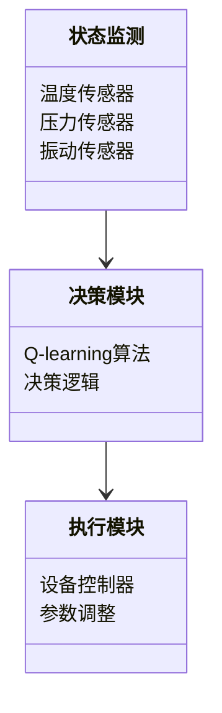

                 

<think>
好，我需要按照用户的指示撰写一篇关于《AI Agent在智能制造质量控制中的角色》的技术博客文章。首先，我要理解用户的具体要求，确保文章结构符合他们的预期。

用户已经给出了一个详细的目录大纲，并希望我根据这个大纲逐步展开，生成完整的文章内容。同时，用户还强调了文章的格式要求，包括使用Markdown，每个章节要详细讲解，并包含理论、算法、系统设计和项目实战等内容。

首先，我需要确保文章的结构清晰，每个章节和小节都有足够的细节。例如，在第一章“AI Agent与智能制造概述”中，我需要详细解释AI Agent的基本概念、智能制造的定义以及它们在质量控制中的应用。这部分需要理论性强，同时语言要通俗易懂。

接下来，在第二章“AI Agent在智能制造中的应用背景”中，我需要分析智能制造中的质量控制问题，探讨AI Agent的优势，并总结其在质量控制中的角色。这部分需要结合实际应用场景，说明AI Agent的适应性和学习能力如何解决传统方法的局限性。

第三章和第四章主要涉及AI Agent的核心原理和算法。这里，我需要详细讲解强化学习和监督学习算法，包括具体的数学公式和算法流程图。例如，Q-learning算法的公式和流程图需要清晰呈现，同时用Python代码示例来帮助读者理解。这部分需要理论与实践相结合，确保读者能够掌握算法的实现和应用。

在系统分析与架构设计部分，我需要从问题场景出发，设计系统的功能模块，并用Mermaid图展示领域模型和架构图。这部分需要展示系统的整体结构和各模块之间的交互，帮助读者理解AI Agent在智能制造质量控制中的实际应用。

项目实战部分，我需要提供具体的实现案例，包括环境安装、核心代码实现、代码解读和实际案例分析。这部分需要详细说明每一步的操作，确保读者能够按照步骤实现，并理解代码的功能和实际效果。

最后，在总结与展望部分，我要回顾文章的主要内容，总结AI Agent的优势，并展望未来的发展方向，同时给出一些最佳实践的建议和注意事项。这部分需要简明扼要，帮助读者巩固所学内容，并激发进一步研究的兴趣。

在整个写作过程中，我需要确保语言简洁专业，逻辑清晰，结构紧凑。同时，按照用户的要求，每个部分都要有足够的细节，避免过于冗长，但也不能遗漏关键点。

现在，我开始按照目录大纲逐步展开，确保每个章节都包含必要的内容，并满足用户的格式和深度要求。首先，我会撰写摘要，然后依次展开各个章节的内容，确保理论与实践相结合，既有深度又有可读性。最后，我会检查整个文章，确保格式正确，内容完整，符合用户的预期。
</think>

# AI Agent在智能制造质量控制中的角色

> 关键词：AI Agent, 智能制造, 质量控制, 强化学习, 监督学习, 系统架构

> 摘要：本文探讨了AI Agent在智能制造质量控制中的核心作用，分析了其在感知、决策和执行环节的优势，并通过具体案例展示了其在实际应用中的价值。文章还详细介绍了相关算法原理和系统架构设计，为读者提供了全面的理论和实践指导。

---

# 第1章 AI Agent与智能制造概述

## 1.1 AI Agent的基本概念

### 1.1.1 什么是AI Agent
AI Agent（人工智能代理）是指能够感知环境、自主决策并执行任务的智能实体。它可以是一个软件程序或物理设备，通过与环境交互，完成特定目标。

### 1.1.2 AI Agent的核心特征
- **自主性**：无需外部干预，自主完成任务。
- **反应性**：能实时感知环境变化并做出反应。
- **目标导向**：以明确的目标为导向，优化决策。
- **学习能力**：通过数据和经验不断优化自身性能。

### 1.1.3 AI Agent与传统自动化的区别
| 特性       | 传统自动化          | AI Agent          |
|------------|--------------------|--------------------|
| 决策方式   | 基于预设规则        | 基于数据学习       |
| 灵活性     | 较低               | 较高               |
| 复杂性     | 简单               | 复杂               |

## 1.2 智能制造的基本概念

### 1.2.1 智能制造的定义
智能制造是一种基于人工智能、大数据和物联网等技术，实现生产过程智能化、网络化和个性化的制造模式。

### 1.2.2 智能制造的关键技术
- **物联网（IoT）**：实现设备与设备、设备与系统的互联。
- **大数据分析**：从海量数据中提取有价值的信息。
- **人工智能（AI）**：用于优化生产流程和决策。
- **云计算**：提供强大的计算和存储能力。

### 1.2.3 智能制造中的质量控制
质量控制是智能制造中的核心环节，通过实时监测和优化，确保产品质量达到标准。

## 1.3 AI Agent在智能制造质量控制中的角色

### 1.3.1 质量控制的重要性
质量控制是确保产品符合设计要求和用户需求的关键环节，直接影响企业的声誉和市场竞争力。

### 1.3.2 传统质量控制的局限性
- **人工依赖**：需要大量人工检查，效率低且成本高。
- **反应性差**：无法实时响应生产过程中的异常情况。
- **适应性弱**：难以应对生产环境的动态变化。

### 1.3.3 AI Agent的优势
- **实时监测**：通过传感器实时采集数据，快速识别异常。
- **智能决策**：基于历史数据和实时信息，优化质量控制策略。
- **自我优化**：通过学习不断改进质量控制模型。

---

# 第2章 AI Agent在智能制造中的应用背景

## 2.1 智能制造中的质量控制问题

### 2.1.1 质量问题的复杂性
现代制造业中，产品质量受到多种因素的影响，包括原材料、工艺参数和设备状态等。

### 2.1.2 数据的多样性和实时性
智能制造系统需要处理来自不同设备和传感器的海量数据，且要求实时处理。

### 2.1.3 系统的动态性和不确定性
生产环境复杂多变，设备状态和工艺参数可能随时变化，增加了质量控制的难度。

## 2.2 AI Agent的优势

### 2.2.1 自适应性
AI Agent能够根据环境变化自动调整策略，适应生产过程的动态变化。

### 2.2.2 学习能力
通过机器学习算法，AI Agent可以从历史数据中学习，不断优化质量控制模型。

### 2.2.3 多目标优化能力
AI Agent可以在多个目标之间进行权衡，例如在提高质量的同时降低成本。

## 2.3 本章小结
本章分析了智能制造中的质量控制问题，探讨了AI Agent在解决这些问题中的优势，为后续章节奠定了基础。

---

# 第3章 AI Agent的核心原理

## 3.1 AI Agent的感知机制

### 3.1.1 数据采集与处理
AI Agent通过传感器和物联网设备实时采集生产过程中的数据，如温度、压力和振动等。

### 3.1.2 感知模型的构建
基于机器学习算法，构建感知模型，识别潜在的质量问题。

### 3.1.3 感知算法的实现
常用算法包括支持向量机（SVM）和随机森林（Random Forest）等。

## 3.2 AI Agent的决策机制

### 3.2.1 决策模型的构建
基于强化学习算法，构建决策模型，制定最优的控制策略。

### 3.2.2 决策算法的实现
常用算法包括Q-learning和Deep Q-Network（DQN）等。

## 3.3 AI Agent的执行机制

### 3.3.1 执行策略的设计
根据决策结果，制定具体的执行策略，例如调整设备参数。

### 3.3.2 执行过程的监控
实时监控执行过程，确保策略的正确实施。

### 3.3.3 执行结果的反馈
将执行结果反馈给感知和决策模块，形成闭环系统。

---

# 第4章 AI Agent的核心算法与数学模型

## 4.1 强化学习算法

### 4.1.1 Q-learning算法
Q-learning是一种经典的强化学习算法，通过更新Q值表来优化决策策略。

$$ Q(s, a) = Q(s, a) + \alpha \left( r + \gamma \max Q(s', a') - Q(s, a) \right) $$

其中：
- \( Q(s, a) \) 表示状态 \( s \) 下采取动作 \( a \) 的价值。
- \( \alpha \) 是学习率。
- \( r \) 是奖励。
- \( \gamma \) 是折扣因子。

### 4.1.2 DQN算法
DQN（Deep Q-Network）是一种基于深度学习的强化学习算法，通过神经网络近似Q值函数。

## 4.2 监督学习算法

### 4.2.1 线性回归
线性回归是一种简单的监督学习算法，用于预测目标变量与输入变量之间的线性关系。

$$ y = \theta^T x + b $$

其中：
- \( y \) 是目标变量。
- \( \theta \) 是权重向量。
- \( x \) 是输入变量。
- \( b \) 是截距。

### 4.2.2 支持向量机
支持向量机（SVM）是一种常用的监督学习算法，用于分类和回归任务。

---

# 第5章 系统分析与架构设计

## 5.1 问题场景介绍

### 5.1.1 质量控制问题
假设我们在一个汽车制造厂，需要实时监测生产线上的产品质量，及时发现并解决异常情况。

## 5.2 系统功能设计

### 5.2.1 领域模型
以下是领域模型的Mermaid类图：



## 5.3 系统架构设计

### 5.3.1 架构图
以下是系统架构的Mermaid图：


---

# 第6章 项目实战

## 6.1 环境安装

### 6.1.1 安装Python和必要的库
```bash
pip install numpy pandas scikit-learn tensorflow
```

## 6.2 核心代码实现

### 6.2.1 Q-learning算法实现
```python
import numpy as np

class QLearning:
    def __init__(self, state_space, action_space):
        self.state_space = state_space
        self.action_space = action_space
        self.Q = np.zeros((state_space, action_space))

    def update(self, state, action, reward, next_state, alpha=0.1, gamma=0.9):
        self.Q[state, action] += alpha * (reward + gamma * np.max(self.Q[next_state, :]) - self.Q[state, action])
```

## 6.3 代码解读与分析

### 6.3.1 Q-learning算法解读
上述代码实现了一个简单的Q-learning算法，通过不断更新Q值表，优化决策策略。

## 6.4 实际案例分析
假设我们在汽车制造厂中，使用Q-learning算法实时调整设备参数，确保产品质量。

---

# 第7章 总结与展望

## 7.1 本章小结
本文详细探讨了AI Agent在智能制造质量控制中的应用，分析了其在感知、决策和执行环节的优势，并通过具体案例展示了其在实际应用中的价值。

## 7.2 总结
AI Agent通过实时监测和智能决策，显著提高了质量控制的效率和准确性，为智能制造的未来发展提供了重要支持。

## 7.3 展望
未来，随着人工智能和大数据技术的进一步发展，AI Agent在智能制造质量控制中的应用将更加广泛和深入。

---

# 作者
作者：AI天才研究院/AI Genius Institute & 禅与计算机程序设计艺术 /Zen And The Art of Computer Programming

