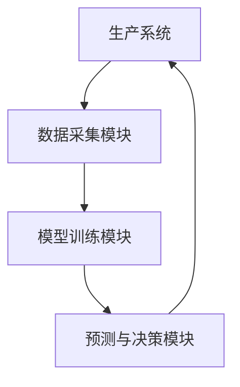
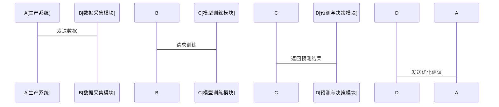

                 


# AI Agent在智能制造质量预测中的角色

> **关键词**：AI Agent, 智能制造, 质量预测, 强化学习, 智能系统设计  
> **摘要**：本文探讨了AI Agent在智能制造质量预测中的核心作用，分析了AI Agent的基本概念、算法原理及其在智能制造中的应用场景，通过实际案例展示了AI Agent如何通过数据采集、模型训练和结果分析提升质量预测的准确性和效率，为智能制造系统的优化提供了新的思路。

---

# 第一部分: AI Agent与智能制造的背景与概念

## 第1章: AI Agent的基本概念与作用

### 1.1 AI Agent的定义与核心特征

#### 1.1.1 AI Agent的定义
AI Agent（人工智能代理）是指能够感知环境、自主决策并执行任务的智能实体。它通过传感器获取数据，利用算法进行分析和推理，并通过执行器与环境交互。AI Agent可以是软件程序，也可以是硬件设备，其核心目标是实现特定任务的自动化和智能化。

#### 1.1.2 AI Agent的核心特征
- **自主性**：AI Agent能够自主决策，无需人工干预。
- **反应性**：能够实时感知环境变化并做出响应。
- **目标导向**：通过目标驱动进行决策和行动。
- **学习能力**：能够通过数据和经验不断优化性能。

#### 1.1.3 AI Agent与传统自动化系统的区别
| 特性 | 传统自动化系统 | AI Agent |
|------|----------------|----------|
| 决策方式 | 基于预设规则 | 基于数据学习和优化 |
| 灵活性 | 较低 | 较高 |
| 复杂环境处理能力 | 有限 | 强大 |

### 1.2 智能制造的基本概念

#### 1.2.1 智能制造的定义
智能制造是一种基于人工智能、大数据、物联网等技术的制造模式，强调生产过程的智能化、数字化和自动化。

#### 1.2.2 智能制造的关键技术
- 人工智能（AI）
- 大数据处理
- 物联网（IoT）
- 自动化技术
- 云计算

#### 1.2.3 智能制造的典型应用场景
- 智能工厂
- 智能物流
- 智能监控

### 1.3 AI Agent在智能制造中的角色

#### 1.3.1 AI Agent在智能制造中的定位
AI Agent作为智能制造系统中的关键组件，负责数据采集、分析、决策和执行。

#### 1.3.2 AI Agent的核心功能与价值
- 数据采集与处理
- 模型训练与优化
- 预测与决策
- 实时监控与反馈

#### 1.3.3 AI Agent在智能制造中的发展趋势
随着AI技术的进步，AI Agent在智能制造中的应用将更加广泛，功能也将更加智能化和多样化。

---

## 第2章: 智能制造质量预测的挑战与AI Agent的解决方案

### 2.1 智能制造质量预测的背景与问题

#### 2.1.1 质量预测的定义与重要性
质量预测是通过分析生产过程中的数据，预测最终产品的质量状态，从而提前采取措施确保产品质量。

#### 2.1.2 智能制造中质量预测的挑战
- 数据复杂性高
- 模型更新频繁
- 多因素影响

#### 2.1.3 质量预测对智能制造的价值
- 提高产品质量
- 降低生产成本
- 提升生产效率

### 2.2 AI Agent在质量预测中的作用

#### 2.2.1 数据采集与处理
AI Agent通过传感器采集生产过程中的实时数据，并进行清洗和预处理。

#### 2.2.2 模型训练与优化
AI Agent利用机器学习算法训练质量预测模型，并通过反馈不断优化模型性能。

#### 2.2.3 预测结果的分析与反馈
AI Agent分析预测结果，提供改进建议，并将结果反馈到生产系统中。

### 2.3 AI Agent与传统质量预测方法的对比

#### 2.3.1 传统质量预测方法的局限性
- 依赖人工经验
- 模型更新慢
- 处理复杂场景能力有限

#### 2.3.2 AI Agent的优势与创新
- 数据驱动
- 自适应能力强
- 多因素综合分析

#### 2.3.3 两种方法的适用场景对比
| 场景 | 传统质量预测 | AI Agent |
|------|--------------|----------|
| 数据来源 | 单一 | 多源 |
| 模型更新 | 定期 | 实时 |
| 处理复杂性 | 低 | 高 |

---

## 第3章: AI Agent的核心概念与原理

### 3.1 AI Agent的核心概念

#### 3.1.1 状态空间与动作空间
- **状态空间**：所有可能的状态的集合，表示环境的当前情况。
- **动作空间**：所有可能的动作的集合，表示AI Agent可以采取的行动。

#### 3.1.2 策略与价值函数
- **策略**：AI Agent在给定状态下选择动作的概率分布。
- **价值函数**：评估一个状态或动作的好坏，帮助AI Agent做出决策。

#### 3.1.3 探索与利用的平衡
AI Agent需要在探索新策略和利用已知策略之间找到平衡，以最大化长期收益。

### 3.2 AI Agent的算法原理

#### 3.2.1 强化学习的基本原理
强化学习是一种通过试错机制学习策略的方法，AI Agent通过与环境交互，获得奖励或惩罚，从而优化策略。

#### 3.2.2 监督学习与无监督学习的结合
- **监督学习**：基于标注数据训练模型。
- **无监督学习**：发现数据中的隐含结构。

#### 3.2.3 贝叶斯网络与决策树的应用
- **贝叶斯网络**：用于概率推理和决策。
- **决策树**：用于分类和回归任务。

### 3.3 AI Agent的核心算法与实现

#### 3.3.1 Q-Learning算法
Q-Learning是一种基于价值函数的强化学习算法，通过更新Q值表来优化策略。

#### 3.3.2 DQN算法
DQN（Deep Q-Network）算法结合了深度神经网络和Q-Learning，能够处理高维状态空间。

#### 3.3.3 蒙特卡洛树搜索（MCTS）
MCTS结合了随机采样和树搜索，适用于复杂博弈环境。

---

## 第4章: AI Agent的数学模型与公式

### 4.1 强化学习的基本公式

#### 4.1.1 Q-Learning的更新公式
$$ Q(s, a) \leftarrow Q(s, a) + \alpha [r + \max Q(s', a') - Q(s, a)] $$
其中：
- \( s \)：当前状态
- \( a \)：当前动作
- \( r \)：获得的奖励
- \( s' \)：下一个状态
- \( \alpha \)：学习率

#### 4.1.2 DQN的损失函数
$$ \text{Loss} = \mathbb{E}[(r + \gamma \max Q(s', a') - Q(s, a))^2] $$
其中：
- \( \gamma \)：折扣因子
- \( \mathbb{E} \)：期望值

### 4.2 贝叶斯网络的公式

#### 4.2.1 贝叶斯网络的概率公式
$$ P(A|B) = \frac{P(B|A)P(A)}{P(B)} $$
其中：
- \( P(A|B) \)：B发生的条件下A发生的概率
- \( P(B|A) \)：A发生的条件下B发生的概率
- \( P(A) \)：A发生的先验概率
- \( P(B) \)：B发生的先验概率

---

## 第5章: 系统分析与架构设计方案

### 5.1 问题场景介绍
智能制造工厂需要实时监控生产过程，预测产品质量，优化生产流程。

### 5.2 系统功能设计

#### 5.2.1 数据采集模块
负责采集生产过程中的各种数据，如温度、压力、时间等。

#### 5.2.2 模型训练模块
利用机器学习算法训练质量预测模型，并通过反馈不断优化模型。

#### 5.2.3 预测与决策模块
基于模型预测结果，生成优化建议，并指导生产系统执行。

### 5.3 系统架构设计

#### 5.3.1 系统架构图


#### 5.3.2 系统交互流程图


---

## 第6章: 项目实战

### 6.1 环境安装
- 安装Python、TensorFlow、Keras等工具。

### 6.2 核心实现源代码

#### 6.2.1 数据采集模块
```python
import pandas as pd

def collect_data():
    # 采集数据
    data = pd.DataFrame({'temperature': [25, 30, 28, ...],
                         'pressure': [10, 15, 12, ...],
                         'time': [1, 2, 3, ...]})
    return data
```

#### 6.2.2 模型训练模块
```python
import tensorflow as tf
from tensorflow.keras import layers

def build_model():
    model = tf.keras.Sequential([
        layers.Dense(64, activation='relu'),
        layers.Dense(1, activation='sigmoid')
    ])
    model.compile(optimizer='adam', loss='binary_crossentropy')
    return model
```

### 6.3 实际案例分析
通过具体案例展示AI Agent如何优化质量预测过程。

### 6.4 项目小结
总结项目实现的关键点和经验教训。

---

## 第7章: 总结与展望

### 7.1 总结
AI Agent在智能制造质量预测中的应用价值显著，能够有效提升预测精度和效率。

### 7.2 展望
未来，随着AI技术的进一步发展，AI Agent在智能制造中的应用将更加广泛和深入。

### 7.3 最佳实践 tips
- 数据质量是关键
- 模型需要持续优化
- 系统架构要灵活扩展

---

**作者**：AI天才研究院/AI Genius Institute & 禅与计算机程序设计艺术 /Zen And The Art of Computer Programming

