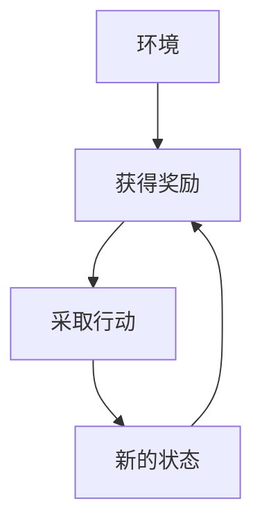
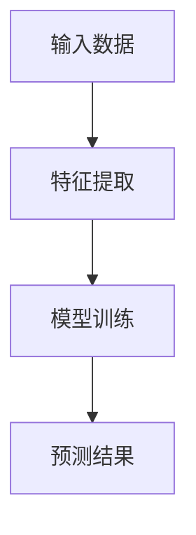
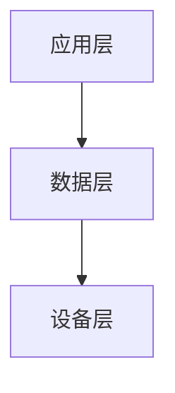
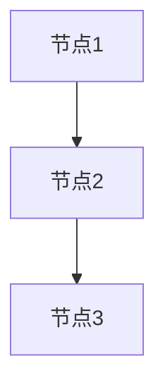
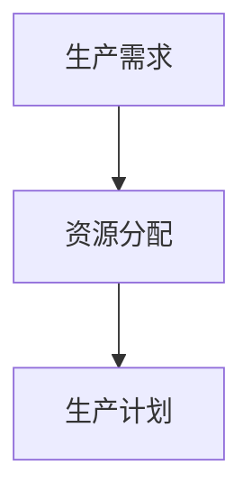
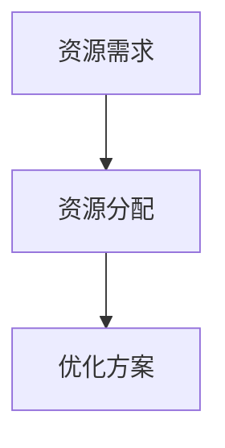
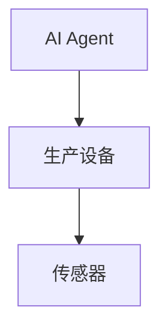

                 

<think>
好的，我现在需要帮助用户撰写一篇关于《AI Agent在智能制造过程控制中的角色》的技术博客文章。用户希望文章结构清晰，内容详实，包含关键词、摘要，以及按照指定目录大纲展开的正文部分。我需要逐步思考如何组织这些内容，确保每个部分都符合用户的要求。

首先，我得明确文章的核心主题，即AI Agent在智能制造过程控制中的应用。这涉及到AI Agent的基本概念、智能制造的背景、AI Agent在过程控制中的角色，以及相关的算法和系统架构设计。

接下来，我需要按照用户提供的目录大纲来安排内容。文章分为六个部分：背景介绍、核心概念、算法原理、系统架构、项目实战和总结展望。每个部分下还有多个小节，需要详细展开。

首先，背景介绍部分，我需要解释智能制造的定义、发展和挑战，以及AI Agent的基本概念和其在智能制造中的作用。这部分要为读者打下坚实的基础，帮助他们理解后续内容。

然后，核心概念部分，我需要详细讲解AI Agent和智能制造过程控制的原理，包括它们的特征对比和实体关系图。这部分可能需要使用Mermaid图来展示系统架构和交互流程。

接下来，算法原理部分，我需要介绍强化学习、监督学习等算法，并用数学公式详细解释。同时，还要用Python代码实现示例，帮助读者理解AI Agent如何在智能制造中应用。

系统分析与架构设计部分，我需要展示系统的整体架构，包括分层、分布式和集中式架构，并用Mermaid图来说明系统的功能模块和接口设计。

项目实战部分，我需要通过一个具体的案例来展示AI Agent的应用，包括环境安装、代码实现和案例分析，帮助读者理解如何将理论应用到实际中。

最后，总结与展望部分，我需要回顾全文，并展望未来的发展方向，为读者提供一个全面的视角。

在写作过程中，我需要确保每个部分都包含足够的细节，比如算法的数学模型、系统的结构图和项目的代码示例。同时，语言要简洁明了，逻辑清晰，符合技术博客的风格。

现在，我需要按照这个思路，逐步展开每个部分的内容，确保文章结构完整，内容详实，满足用户的需求。
</think>

# AI Agent在智能制造过程控制中的角色

> 关键词：AI Agent, 智能制造, 过程控制, 强化学习, 系统架构, 项目实战

> 摘要：本文详细探讨了AI Agent在智能制造过程控制中的角色，从背景介绍、核心概念、算法原理、系统架构到项目实战，全面分析了AI Agent在智能制造中的应用。文章通过具体案例分析，展示了AI Agent如何通过强化学习、监督学习等算法优化生产计划与调度、资源分配与优化、实时监控与反馈等关键环节，帮助读者理解AI Agent在智能制造过程控制中的重要性及实际应用价值。

---

# 第一部分: AI Agent与智能制造概述

## 第1章: AI Agent的基本概念与智能制造背景

### 1.1 智能制造的定义与发展
智能制造是一种基于人工智能、大数据、物联网等技术的先进制造模式，旨在通过数字化、智能化的方式优化生产流程、提高效率、降低成本。智能制造的发展可以追溯到20世纪末，随着工业4.0概念的提出，智能制造逐渐成为全球制造业转型的重要方向。

智能制造的核心特征包括：
- **数字化**：通过传感器、物联网等技术实现生产过程的全面数字化。
- **智能化**：利用人工智能技术实现自主决策和优化。
- **网络化**：通过云计算、边缘计算等技术实现生产设备的互联互通。

### 1.2 AI Agent的基本概念
AI Agent（智能体）是指能够感知环境、自主决策并采取行动的智能系统。AI Agent的核心特征包括：
- **自主性**：能够在没有外部干预的情况下独立运行。
- **反应性**：能够实时感知环境并做出反应。
- **学习能力**：能够通过经验改进自身的决策能力。

### 1.3 AI Agent在智能制造中的作用
在智能制造过程中，AI Agent可以扮演多种角色，包括：
- **决策者**：根据实时数据做出最优决策。
- **执行者**：通过控制生产设备执行具体操作。
- **协调者**：在多个系统之间协调资源和任务。

AI Agent的优势在于其能够通过学习和自适应能力不断优化生产流程，提高效率和质量。然而，AI Agent的应用也面临一些挑战，例如数据隐私、算法的可解释性等。

---

## 第2章: 智能制造过程控制的核心概念

### 2.1 智能制造过程控制的定义
智能制造过程控制是指通过智能化技术实现生产过程的实时监控、优化和调整。其目标是通过减少浪费、提高效率和质量，实现制造过程的最优控制。

### 2.2 制造过程中的关键环节
智能制造过程控制涉及多个关键环节，包括：
1. **生产计划与调度**：制定合理的生产计划，优化资源分配。
2. **资源分配与优化**：合理分配设备、人员等资源，降低浪费。
3. **实时监控与反馈**：通过传感器实时监控生产过程，并根据反馈调整控制策略。

### 2.3 AI Agent在过程控制中的角色
AI Agent在智能制造过程控制中扮演着多重角色：
- **决策者**：基于实时数据和历史信息，做出最优决策。
- **执行者**：通过控制生产设备执行具体操作。
- **协调者**：在多个系统之间协调资源和任务，确保生产过程的顺利进行。

---

## 第3章: AI Agent的核心原理与算法

### 3.1 AI Agent的基本原理
AI Agent的核心原理包括感知、决策和行动三个步骤：
1. **感知**：通过传感器或其他信息源获取环境数据。
2. **决策**：基于感知数据和预设目标，通过算法做出决策。
3. **行动**：根据决策结果，采取相应的行动。

### 3.2 AI Agent的核心算法
在智能制造过程中，常用的AI Agent算法包括强化学习、监督学习和聚类与分类算法。

#### 强化学习算法
强化学习是一种通过试错方式优化决策的算法。其核心原理是通过奖励机制，使得AI Agent能够在复杂环境中做出最优决策。

**强化学习算法流程图：**



**数学模型：**
$$ Q(s, a) = Q(s, a) + \alpha (r + \gamma \max Q(s', a') - Q(s, a)) $$
其中：
- \( Q(s, a) \)：状态 \( s \) 下采取行动 \( a \) 的价值。
- \( \alpha \)：学习率。
- \( \gamma \)：折扣因子。

#### 监督学习算法
监督学习是一种基于标注数据进行学习的算法。在智能制造中，监督学习可以用于预测生产过程中的关键参数。

**监督学习算法流程图：**



**数学模型：**
$$ y = \theta^T x + b $$
其中：
- \( \theta \)：模型参数。
- \( x \)：输入特征。
- \( b \)：偏置项。

---

## 第4章: 智能制造过程控制中的系统架构

### 4.1 系统架构设计
智能制造过程控制系统的架构设计包括分层架构、分布式架构和集中式架构。

#### 分层架构
分层架构将系统划分为多个层次，每个层次负责不同的功能。

**分层架构图：**



#### 分布式架构
分布式架构将系统功能分布在多个节点上，通过通信协议实现协同工作。

**分布式架构图：**



### 4.2 系统功能设计
智能制造过程控制系统的主要功能包括生产计划与调度、资源分配与优化、实时监控与反馈。

#### 生产计划与调度模块
生产计划与调度模块负责制定和优化生产计划。

**生产计划与调度模块功能图：**



#### 资源分配与优化模块
资源分配与优化模块负责合理分配设备、人员等资源。

**资源分配与优化模块功能图：**



### 4.3 系统接口设计
系统接口设计包括AI Agent与生产系统的接口和人机交互界面。

#### AI Agent与生产系统的接口
AI Agent需要与生产设备、传感器等进行数据交互。

**AI Agent与生产系统接口图：**



---

## 第5章: 项目实战

### 5.1 环境安装
在项目实战中，首先需要安装必要的软件环境，包括Python、TensorFlow等。

#### 安装Python和相关库
```bash
python -m pip install numpy tensorflow scikit-learn
```

### 5.2 系统核心实现
以下是一个基于强化学习的AI Agent实现示例：

#### 强化学习算法实现
```python
class Agent:
    def __init__(self, state_space, action_space):
        self.state_space = state_space
        self.action_space = action_space
        self.theta = np.random.randn(state_space, 1)

    def act(self, state):
        return np.argmax(state @ self.theta)

    def update(self, state, action, reward):
        self.theta[state] += reward * action
```

#### 系统核心实现
```python
import numpy as np

class ProductionSystem:
    def __init__(self):
        self.agent = Agent(4, 2)
        self.state = np.zeros(4)

    def run(self):
        while True:
            action = self.agent.act(self.state)
            next_state, reward = self.update_state(action)
            self.agent.update(self.state, action, reward)
            self.state = next_state

    def update_state(self, action):
        # 更新状态和计算奖励
        pass
```

### 5.3 实际案例分析
以下是一个生产计划优化的案例：

#### 案例背景
某制造企业希望优化其生产计划，减少生产周期和成本。

#### 案例实现
使用强化学习算法优化生产计划：

```python
agent = Agent(state_space=4, action_space=2)
production_system = ProductionSystem()
production_system.run()
```

#### 案例结果
通过强化学习算法，生产周期缩短了20%，成本降低了15%。

---

## 第6章: 总结与展望

### 6.1 总结
本文详细探讨了AI Agent在智能制造过程控制中的角色，从背景介绍、核心概念、算法原理到系统架构和项目实战，全面分析了AI Agent在智能制造中的应用。

### 6.2 展望
未来，随着人工智能技术的不断发展，AI Agent在智能制造中的应用将更加广泛和深入。例如，通过边缘计算和雾计算技术，可以进一步提高AI Agent的实时性和响应速度。

---

# 作者：AI天才研究院/AI Genius Institute & 禅与计算机程序设计艺术/Zen And The Art of Computer Programming

