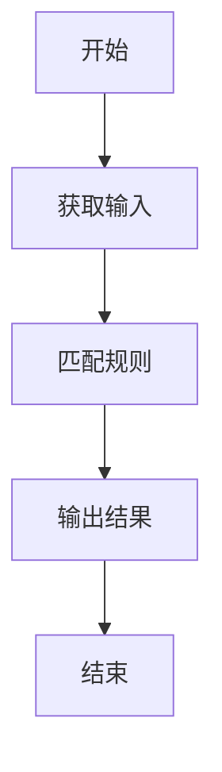
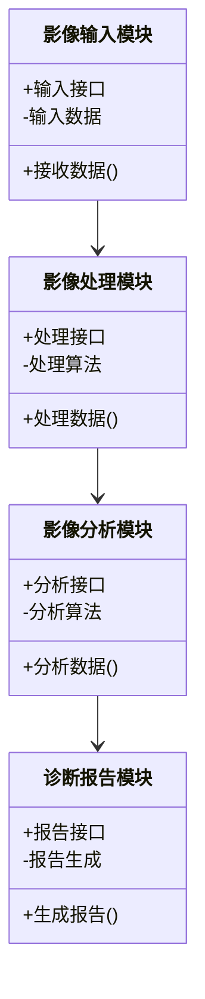
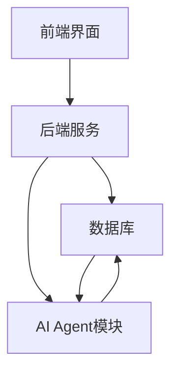
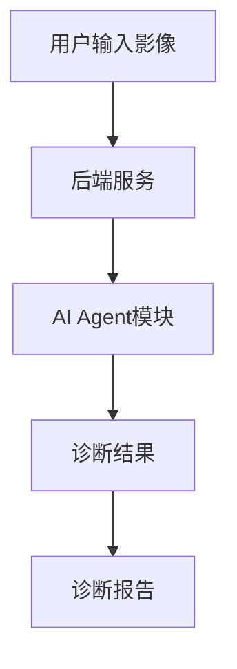

                 


# AI Agent在智能医疗影像分析中的角色

> 关键词：AI Agent, 智能医疗, 影像分析, 机器学习, 深度学习, 医疗影像

> 摘要：AI Agent在医疗影像分析中的角色日益重要，其通过感知、推理和行动能力，帮助医生提高诊断准确性、效率和患者体验。本文从AI Agent的基本概念、算法原理、系统架构到实际案例，详细分析其在智能医疗影像分析中的应用，并探讨未来发展方向。

---

# 第一部分: AI Agent在智能医疗影像分析中的背景与概述

## 第1章: AI Agent的基本概念与医疗影像分析的背景

### 1.1 AI Agent的定义与核心特征
AI Agent是一种智能体，能够感知环境、自主决策并采取行动以实现目标。其核心特征包括：
1. **自主性**：无需外部干预，自主完成任务。
2. **反应性**：实时感知环境并动态调整行为。
3. **推理能力**：基于感知信息进行逻辑推理。
4. **学习能力**：通过数据优化决策模型。

**AI Agent与传统AI的区别**：
- AI Agent具备更强的自主性和适应性，能够与动态环境交互。
- 传统AI系统通常依赖预定义规则，缺乏自主决策能力。

### 1.2 医疗影像分析的背景与挑战
医疗影像分析是医学领域的重要工具，用于疾病诊断和治疗规划。然而，面临以下挑战：
1. **数据量大**：医学影像数据复杂且数量庞大。
2. **诊断精度要求高**：误诊或漏诊可能导致严重后果。
3. **医生资源有限**：医疗影像分析依赖专业医生，资源紧张。

### 1.3 AI Agent在医疗影像分析中的角色
AI Agent通过以下方式助力医疗影像分析：
1. **辅助诊断**：识别病灶，提供诊断建议。
2. **提高效率**：快速处理大量影像数据。
3. **个性化治疗**：基于影像数据制定个性化治疗方案。

---

## 第2章: AI Agent在医疗影像分析中的技术基础

### 2.1 AI Agent的核心技术
AI Agent在医疗影像分析中主要依赖以下技术：
1. **机器学习**：用于分类和预测。
2. **深度学习**：用于图像识别和分割。
3. **自然语言处理**：用于医学文献分析。
4. **计算机视觉**：用于图像处理和特征提取。

### 2.2 医疗影像分析的关键技术
1. **图像分割**：将影像分割为不同区域。
2. **图像识别**：识别特定病灶。
3. **图像配准**：对齐不同影像。
4. **图像增强**：改善影像质量。

### 2.3 AI Agent在医疗影像分析中的算法基础
1. **基于规则的推理算法**：适用于简单任务，如基于特定特征的病灶识别。
2. **基于机器学习的分类算法**：如支持向量机（SVM）和随机森林（Random Forest）。
3. **基于深度学习的图像处理算法**：如卷积神经网络（CNN）用于图像分割。

---

# 第二部分: AI Agent在医疗影像分析中的算法与数学模型

## 第3章: AI Agent的核心算法原理

### 3.1 基于规则的推理算法
基于规则的推理算法通过预定义的规则进行推理，适用于简单任务。

#### 算法流程图


#### 算法实现代码
```python
def rule_based_classifier(image):
    if image.has_feature1 and not image.has_feature2:
        return "病灶1"
    elif not image.has_feature1 and image.has_feature2:
        return "病灶2"
    else:
        return "无病灶"
```

### 3.2 基于机器学习的分类算法
基于机器学习的分类算法通过训练模型进行分类。

#### 逻辑回归算法
逻辑回归用于分类问题，其数学模型为：
$$ P(y=1|x) = \frac{1}{1 + e^{- (w^T x + b)}} $$

#### 支持向量机算法
支持向量机用于分类，其数学模型为：
$$ \text{目标函数} = \min_{w,b,\xi} \frac{1}{2} ||w||^2 + C \sum_{i=1}^n \xi_i $$
$$ \text{约束条件} = y_i (w^T x_i + b) \geq 1 - \xi_i, \xi_i \geq 0 $$

### 3.3 基于深度学习的图像处理算法
基于深度学习的图像处理算法通过卷积神经网络（CNN）进行图像分割。

#### 卷积神经网络算法
CNN用于图像分割，其网络结构包括卷积层、池化层和上采样层。

---

# 第三部分: AI Agent在医疗影像分析中的系统架构设计

## 第4章: 医疗影像分析的系统架构设计

### 4.1 系统功能设计
医疗影像分析系统功能模块包括：
1. **影像输入模块**：接收医学影像数据。
2. **影像处理模块**：包括图像增强和配准。
3. **影像分析模块**：基于AI Agent进行病灶识别。
4. **诊断报告模块**：生成诊断报告。

#### 系统功能模块的类图


### 4.2 系统架构设计
医疗影像分析系统的架构包括：
1. **前端界面**：用户交互界面。
2. **后端服务**：处理和分析影像数据。
3. **数据库**：存储影像数据和诊断结果。
4. **AI Agent模块**：执行智能分析任务。

#### 系统架构图


### 4.3 系统接口设计
1. **影像输入接口**：接收医学影像数据。
2. **影像处理接口**：调用图像处理算法。
3. **诊断接口**：返回诊断结果。

### 4.4 系统交互流程图


---

# 第四部分: AI Agent在医疗影像分析中的项目实战

## 第5章: 项目实战——基于AI Agent的肺癌筛查系统

### 5.1 项目背景
肺癌筛查需要高精度的影像分析，AI Agent能够辅助医生快速识别肺部病灶。

### 5.2 环境配置
1. **Python**：3.8+
2. **深度学习框架**：TensorFlow或Keras
3. **图像处理库**：OpenCV
4. **数据集**：公开肺癌影像数据集

### 5.3 核心代码实现
1. **图像分割代码**：
```python
import cv2
import numpy as np

def segment_lungs(image):
    # 图像预处理
    gray = cv2.cvtColor(image, cv2.COLOR_BGR2GRAY)
    _, binary = cv2.threshold(gray, 127, 255, cv2.THRESH_BINARY)
    return binary
```

2. **AI Agent诊断接口**：
```python
def ai_agent_diagnosis(image):
    # 调用AI Agent进行诊断
    diagnosis = agent.predict(image)
    return diagnosis
```

### 5.4 实际案例分析
案例：患者肺部影像中存在可疑结节，AI Agent通过图像分割和分类算法，准确识别出肺结节，并生成诊断报告。

### 5.5 项目总结
通过AI Agent辅助诊断，肺癌筛查的效率和准确性显著提高，减轻了医生的工作负担。

---

# 第五部分: 未来趋势与挑战

## 第6章: 未来趋势与挑战

### 6.1 未来发展趋势
1. **多模态数据融合**：结合多种医学数据（如影像和基因数据）进行综合诊断。
2. **AI Agent的可解释性**：提升算法的透明度，增强医生的信任。
3. **实时性提升**：优化算法速度，实现实时影像分析。

### 6.2 挑战与建议
1. **数据隐私**：加强数据加密和隐私保护。
2. **算法优化**：持续改进AI Agent的诊断精度。
3. **医生培训**：加强对医生的AI技术培训，提升其对AI工具的使用能力。

---

# 作者：AI天才研究院（AI Genius Institute） & 禅与计算机程序设计艺术（Zen And The Art of Computer Programming）

---

这篇博客文章系统地介绍了AI Agent在智能医疗影像分析中的角色，从背景、算法、系统架构到实际案例，全面分析了AI Agent的应用价值和未来发展方向。希望对读者在智能医疗领域有所帮助！

