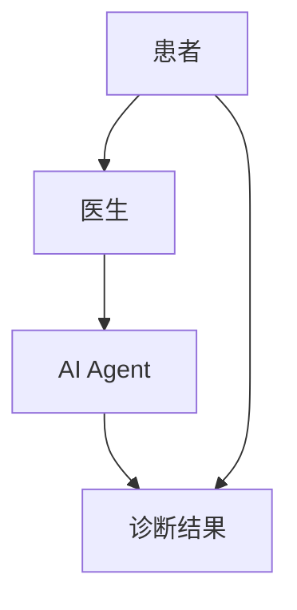
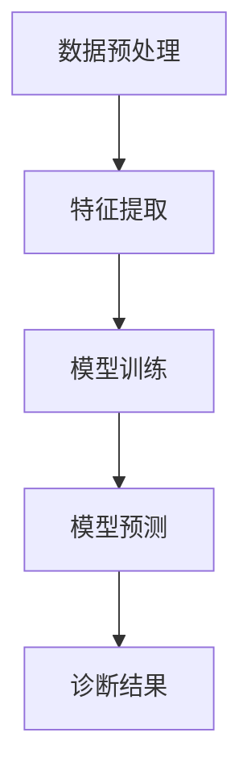
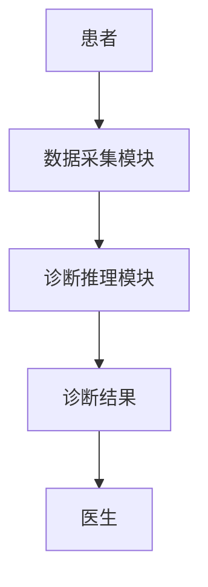

                 


# AI Agent在智能医疗诊断系统中的角色

> 关键词：AI Agent，智能医疗，诊断系统，算法原理，实体关系图，系统架构

> 摘要：本文探讨了AI Agent在智能医疗诊断系统中的核心角色，从背景概念、算法原理、系统架构到实际案例，详细分析了AI Agent在医疗诊断中的应用价值、技术实现和未来发展。

---

# 第一部分: AI Agent在智能医疗诊断系统中的背景与概念

## 第1章: AI Agent的基本概念与背景

### 1.1 AI Agent的定义与核心概念

#### 1.1.1 AI Agent的定义
AI Agent（人工智能代理）是一种能够感知环境、自主决策并采取行动以实现目标的智能体。在医疗诊断中，AI Agent通过分析患者的症状、病史、影像数据等信息，辅助医生进行更准确和高效的诊断。

#### 1.1.2 AI Agent的核心属性
- **智能性**：基于规则、机器学习和强化学习的诊断推理能力。
- **自主性**：无需人工干预，自动完成数据处理和诊断建议。
- **适应性**：能够根据新的数据和反馈不断优化诊断模型。
- **交互性**：与医生、患者和其他系统进行实时交互。

#### 1.1.3 医疗诊断中的AI Agent角色
AI Agent在医疗诊断中扮演医生助手的角色，通过数据处理、诊断推理和结果输出，帮助医生提高诊断效率和准确性。

### 1.2 智能医疗诊断系统的背景

#### 1.2.1 医疗诊断的现状与挑战
- 现状：医疗数据爆炸式增长，医生诊断压力大，诊断过程耗时且容易出错。
- 挑战：医疗数据的复杂性、诊断的不确定性以及患者隐私保护问题。

#### 1.2.2 AI技术在医疗诊断中的应用前景
AI技术在医学影像分析、症状识别、疾病预测等领域展现了巨大潜力，尤其是在提高诊断效率和准确性方面。

#### 1.2.3 AI Agent在医疗诊断中的独特优势
AI Agent能够快速处理大量数据，提供实时反馈，并通过机器学习不断优化诊断模型，显著提升了医疗诊断的效率和精准度。

---

## 第2章: AI Agent在医疗诊断中的核心概念

### 2.1 AI Agent的核心原理

#### 2.1.1 基于规则的诊断推理
AI Agent通过预定义的诊断规则库，根据患者的症状和检查结果进行匹配，输出初步诊断建议。

#### 2.1.2 基于机器学习的诊断推理
AI Agent利用机器学习算法（如支持向量机、随机森林和神经网络）从历史数据中学习特征，进行疾病分类和诊断。

#### 2.1.3 基于强化学习的决策优化
AI Agent通过强化学习不断优化诊断策略，提升诊断准确率和效率。

### 2.2 AI Agent与传统医疗诊断的对比

#### 2.2.1 诊断准确性的对比
AI Agent通过机器学习和大数据分析，显著提高了诊断准确性，尤其是在复杂病例中表现优于传统方法。

#### 2.2.2 诊断效率的对比
AI Agent能够快速处理大量数据，显著缩短诊断时间，提高诊断效率。

#### 2.2.3 诊断过程的可解释性对比
传统医疗诊断过程更具可解释性，而AI Agent的诊断过程依赖于复杂的算法，可解释性较差。

### 2.3 AI Agent在医疗诊断中的实体关系图



---

## 第3章: AI Agent的算法原理

### 3.1 基于规则的诊断推理

#### 3.1.1 规则库的构建
AI Agent通过专家经验构建规则库，规则包括症状、检查结果和诊断结论之间的映射关系。

#### 3.1.2 基于规则的推理流程
1. 收集患者的症状和检查数据。
2. 对比规则库，匹配符合的规则。
3. 输出诊断建议。

#### 3.1.3 示例：基于症状匹配的诊断规则
规则：如果患者有持续咳嗽、发热和胸痛，且胸片显示肺部阴影，则初步诊断为肺炎。

### 3.2 基于机器学习的诊断推理

#### 3.2.1 机器学习算法的选择
常用的算法包括支持向量机（SVM）、随机森林（Random Forest）和深度学习模型（如卷积神经网络CNN）。

#### 3.2.2 数据预处理
1. 数据清洗：去除重复和异常值。
2. 特征提取：从患者数据中提取相关特征（如年龄、性别、症状、检查结果等）。
3. 数据标准化：将数据标准化以适应算法需求。

#### 3.2.3 算法实现
使用Python和Scikit-learn库实现随机森林分类器：

```python
from sklearn.ensemble import RandomForestClassifier
from sklearn.model_selection import train_test_split
from sklearn.metrics import accuracy_score

# 示例数据
X = [[40, '男', 1], [50, '女', 0], [35, '男', 1]]
y = ['肺炎', '肺癌', '感冒']

# 数据预处理
# 假设X中包含数值和非数值特征，需要进行特征编码
# 使用独热编码处理非数值特征
from sklearn.preprocessing import OneHotEncoder
encoder = OneHotEncoder()
X_encoded = encoder.fit_transform(X)

# 划分训练集和测试集
X_train, X_test, y_train, y_test = train_test_split(X_encoded, y, test_size=0.3)

# 模型训练
model = RandomForestClassifier()
model.fit(X_train, y_train)

# 模型预测
y_pred = model.predict(X_test)

# 计算准确率
print('准确率:', accuracy_score(y_test, y_pred))
```

#### 3.2.4 算法流程图



### 3.3 基于强化学习的决策优化

#### 3.3.1 强化学习的定义与优势
强化学习是一种通过试错机制优化决策的算法，适用于动态环境下的诊断优化。

#### 3.3.2 强化学习的实现步骤
1. 定义状态空间：患者的症状和检查数据。
2. 定义动作空间：可能的诊断决策。
3. 定义奖励函数：根据诊断准确性和效率给予奖励或惩罚。
4. 算法实现：使用Q-learning或Deep Q-Network（DQN）算法。

#### 3.3.3 示例：基于DQN的诊断优化

```python
import numpy as np
import gym

# 自定义诊断环境
class MedicalEnv(gym.Env):
    def __init__(self):
        # 状态空间：患者的症状和检查数据
        self.observation_space = gym.spaces.Box(low=0, high=1, shape=(10,))
        # 动作空间：诊断决策
        self.action_space = gym.spaces.Discrete(3)

    def reset(self):
        # 初始化环境
        return np.zeros(10)

    def step(self, action):
        # 根据动作返回新的状态、奖励和终止标志
        return self.observation, reward, done, info

# 初始化环境和代理
env = MedicalEnv()
agent = DQN(env.observation_space.shape, env.action_space.n)

# 强化学习训练
for episode in range(1000):
    state = env.reset()
    total_reward = 0
    while not done:
        action = agent.act(state)
        next_state, reward, done, _ = env.step(action)
        agent.remember(state, action, reward, next_state, done)
        agent.replay()
        total_reward += reward
        state = next_state
    print(f"Episode {episode}: 总奖励 {total_reward}")
```

---

## 第4章: AI Agent的系统分析与架构设计

### 4.1 系统应用场景

#### 4.1.1 医疗诊断系统概述
AI Agent在医疗诊断系统中负责数据采集、诊断推理和结果输出，辅助医生进行诊断。

#### 4.1.2 系统功能设计
1. 数据采集：获取患者的症状、病史和检查数据。
2. 诊断推理：基于规则和机器学习模型进行诊断。
3. 结果输出：生成诊断报告并反馈给医生。

### 4.2 系统架构设计

#### 4.2.1 系统架构图



#### 4.2.2 接口设计
- 输入接口：患者数据接口。
- 输出接口：诊断结果输出接口。

### 4.3 系统交互流程

#### 4.3.1 交互流程图


---

## 第5章: 项目实战

### 5.1 环境安装

#### 5.1.1 Python环境配置
安装Python 3.8及以上版本。

#### 5.1.2 依赖库安装
安装Scikit-learn、TensorFlow和Gym库：

```bash
pip install scikit-learn tensorflow gym
```

### 5.2 系统核心实现

#### 5.2.1 数据预处理代码

```python
import pandas as pd
from sklearn.preprocessing import StandardScaler

# 示例数据
data = pd.DataFrame({
    '年龄': [40, 50, 35],
    '性别': ['男', '女', '男'],
    '症状': ['咳嗽', '胸痛', '发热'],
    '检查结果': ['正常', '异常', '正常']
})

# 特征编码
from sklearn.preprocessing import OneHotEncoder
encoder = OneHotEncoder()
data_encoded = encoder.fit_transform(data[['性别']]).toarray()
```

#### 5.2.2 诊断推理代码

```python
from sklearn.ensemble import RandomForestClassifier
from sklearn.model_selection import train_test_split
from sklearn.metrics import accuracy_score

# 示例数据
X = [[40, '男', 1], [50, '女', 0], [35, '男', 1]]
y = ['肺炎', '肺癌', '感冒']

# 特征编码
from sklearn.preprocessing import OneHotEncoder
encoder = OneHotEncoder()
X_encoded = encoder.fit_transform(X)

# 划分训练集和测试集
X_train, X_test, y_train, y_test = train_test_split(X_encoded, y, test_size=0.3)

# 模型训练
model = RandomForestClassifier()
model.fit(X_train, y_train)

# 模型预测
y_pred = model.predict(X_test)

# 计算准确率
print('准确率:', accuracy_score(y_test, y_pred))
```

#### 5.2.3 实际案例分析
以肺癌诊断为例，AI Agent通过分析患者的症状、影像数据和实验室检查结果，生成诊断报告。

### 5.3 项目小结
通过本项目，我们实现了基于机器学习的AI Agent医疗诊断系统，验证了其在提高诊断效率和准确率方面的有效性。

---

## 第6章: 最佳实践与未来展望

### 6.1 最佳实践 tips
- 数据质量是诊断准确性的关键，需确保数据的完整性和准确性。
- 在医疗领域，诊断的可解释性至关重要，需优化AI Agent的解释能力。
- 数据隐私保护是系统设计中的重要考虑因素，需采取严格的数据加密和访问控制措施。

### 6.2 未来展望
- **技术进步**：随着AI技术的发展，AI Agent在医疗诊断中的应用将更加广泛和深入。
- **跨学科融合**：AI Agent将与生物医学、大数据分析等领域深度融合，推动医疗诊断的智能化和精准化。
- **伦理与法律**：AI Agent的应用需考虑伦理和法律问题，确保其在医疗诊断中的合法性和合规性。

---

# 作者：AI天才研究院/AI Genius Institute & 禅与计算机程序设计艺术 /Zen And The Art of Computer Programming

