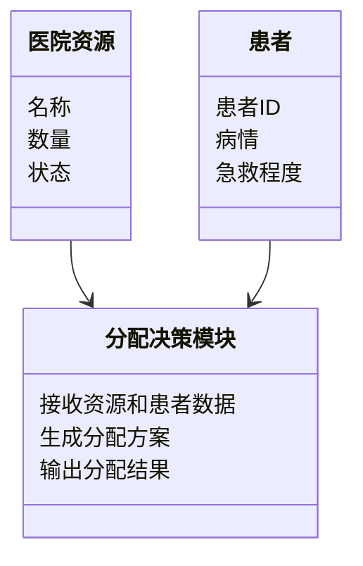
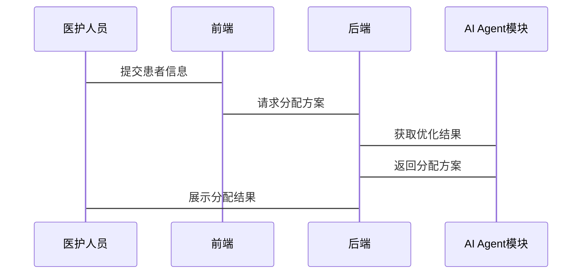

                 


# AI Agent在智能医疗资源分配中的角色

**关键词**：AI Agent、智能医疗、资源分配、优化算法、动态调整、数据驱动

**摘要**：  
AI Agent作为人工智能领域的重要技术，正在逐步改变医疗资源分配的传统模式。本文将深入探讨AI Agent在智能医疗资源分配中的角色，分析其核心概念、算法原理、系统设计及实际应用。通过案例分析和项目实战，本文将展示AI Agent如何帮助医院优化资源配置、提高分配效率，并为未来医疗资源管理提供新的思路。

---

# 第一部分: AI Agent在智能医疗资源分配中的背景与概念

## 第1章: 医疗资源分配的背景与问题

### 1.1 医疗资源分配的现状与挑战

#### 1.1.1 医疗资源分配的基本问题
医疗资源分配是医院管理中的核心问题之一，涉及床位分配、手术室安排、医疗设备调配等多个方面。传统的人工分配方式存在效率低、资源浪费和患者满意度不足的问题。例如，某些医院的床位使用率不足，而某些科室却人满为患。

#### 1.1.2 医疗资源分配的现状分析
当前，医疗资源分配面临以下挑战：
- **信息孤岛**：医院内部的资源数据分散在不同的系统中，难以实现高效整合。
- **动态需求**：患者需求随时变化，资源分配需要动态调整。
- **资源有限性**：医疗资源的总量有限，如何在有限资源中实现最优分配是关键。

#### 1.1.3 医疗资源分配中的主要挑战
- 患者的个性化需求难以满足。
- 资源分配的公平性与效率之间的平衡问题。
- 紧急情况下的快速响应需求。

### 1.2 AI Agent的基本概念与特点

#### 1.2.1 AI Agent的定义
AI Agent（人工智能代理）是指能够感知环境、自主决策并执行任务的智能体。在医疗资源分配中，AI Agent可以看作是一个智能决策系统，能够根据实时数据做出最优分配决策。

#### 1.2.2 AI Agent的核心特点
- **自主性**：AI Agent能够自主感知环境并做出决策。
- **反应性**：能够实时响应环境变化。
- **学习能力**：通过机器学习算法不断优化分配策略。

#### 1.2.3 AI Agent与传统方法的对比
- **传统方法**：依赖人工经验或静态规则，难以应对动态变化。
- **AI Agent**：基于实时数据和机器学习模型，能够动态优化分配策略。

### 1.3 AI Agent在医疗资源分配中的优势

#### 1.3.1 提高资源分配效率
AI Agent能够快速处理海量数据，实现资源的高效分配。

#### 1.3.2 实现精准匹配
通过分析患者的病情、医院资源和医生排班，AI Agent可以实现精准的资源匹配。

#### 1.3.3 支持动态调整
AI Agent能够实时监控资源使用情况，并根据需求变化动态调整分配策略。

### 1.4 本章小结
本章介绍了医疗资源分配的背景与挑战，并详细阐述了AI Agent的基本概念和特点。AI Agent作为一种智能决策系统，能够显著提高医疗资源分配的效率和精准度。

---

## 第2章: AI Agent在医疗资源分配中的核心概念与原理

### 2.1 AI Agent的核心原理

#### 2.1.1 信息收集与处理
AI Agent通过收集医院的床位、设备、人员等信息，构建资源数据库。

#### 2.1.2 智能决策机制
基于机器学习模型，AI Agent能够预测资源需求并制定最优分配方案。

#### 2.1.3 资源分配策略
AI Agent根据资源可用性和患者需求，制定资源分配策略。

### 2.2 医疗资源分配的核心要素

#### 2.2.1 医疗资源的类型与属性
- **资源类型**：床位、手术室、医疗设备等。
- **资源属性**：可用时间、数量、优先级等。

#### 2.2.2 患者需求的分析与建模
- **患者病情**：严重程度、紧急性。
- **患者特征**：年龄、性别、保险类型等。

#### 2.2.3 资源分配的目标与约束条件
- **目标**：最大化资源利用率，最小化等待时间。
- **约束条件**：资源数量限制、优先级排序等。

### 2.3 AI Agent与医疗资源分配的关联

#### 2.3.1 AI Agent在资源分配中的角色
- **数据处理**：整合医院资源和患者需求数据。
- **决策支持**：基于数据和模型提供分配建议。
- **动态调整**：实时监控资源使用情况并进行优化。

#### 2.3.2 AI Agent与其他分配机制的协同关系
AI Agent可以与医院的信息化系统（如HIS、EMR）无缝对接，形成完整的资源分配闭环。

#### 2.3.3 AI Agent的可扩展性与适应性
AI Agent能够根据医院规模和需求进行定制化部署，适应不同场景。

### 2.4 本章小结
本章详细阐述了AI Agent的核心原理和医疗资源分配的核心要素，强调了AI Agent在资源分配中的重要作用。

---

## 第3章: AI Agent的算法原理与数学模型

### 3.1 推荐算法的基本原理

#### 3.1.1 协同过滤算法
协同过滤是一种基于用户相似性推荐资源的方法。在医疗资源分配中，可以用于推荐合适的床位或设备。

##### 公式：
$$相似度 = \frac{\sum (x_i - \bar{x})(y_i - \bar{y})}{\sqrt{\sum (x_i - \bar{x})^2 \sum (y_i - \bar{y})^2}}$$

##### 代码示例：
```python
import numpy as np

def cosine_similarity(X, Y):
    dot_product = np.dot(X, Y)
    norm_X = np.linalg.norm(X)
    norm_Y = np.linalg.norm(Y)
    return dot_product / (norm_X * norm_Y)
```

#### 3.1.2 基于内容的推荐算法
基于内容的推荐算法通过分析资源的属性（如床位类型、设备功能）进行推荐。

##### 公式：
$$概率 = \sum_{i=1}^{n} w_i \cdot f_i$$

##### 代码示例：
```python
def content_based_recommendation(features, weights):
    return np.dot(features, weights)
```

#### 3.1.3 混合推荐算法
混合推荐算法结合了协同过滤和基于内容的推荐方法，能够提高推荐的准确性和多样性。

### 3.2 基于优化的资源分配算法

#### 3.2.1 线性规划算法
线性规划是一种优化资源分配的数学方法，适用于资源有限的情况。

##### 公式：
$$\text{最大化/最小化} \quad c^T x$$
$$\text{约束} \quad A x \leq b$$

##### 代码示例：
```python
import numpy as np
from scipy.optimize import linprog

c = [-1, -1]  # 目标函数系数
A = [[1, 1]]    # 约束条件系数
b = [2]         # 约束条件常数项

result = linprog(c, A, b, bounds=(0, None), method='highs')
print(result.x)
```

#### 3.2.2 遗传算法
遗传算法是一种基于生物进化原理的优化算法，适用于复杂的问题场景。

##### 公式：
$$适应度函数 = \sum \text{资源利用率}$$

##### 代码示例：
```python
import numpy as np

def fitness(individual):
    return sum(individual)

# 初始化种群
population = np.random.randint(0, 2, (10, 5))

# 适应度评估
fitness_values = [fitness(individual) for individual in population]
```

### 3.3 本章小结
本章详细讲解了AI Agent在医疗资源分配中的推荐算法和优化算法，分析了各种算法的优缺点及应用场景。

---

## 第4章: AI Agent的系统分析与架构设计

### 4.1 系统分析

#### 4.1.1 问题场景介绍
以医院床位分配为例，分析AI Agent如何帮助医院优化床位分配。

#### 4.1.2 系统功能设计
- **资源管理模块**：管理床位、设备等资源。
- **患者管理模块**：记录患者信息和需求。
- **分配决策模块**：基于算法生成分配方案。

#### 4.1.3 系统架构设计
- **数据层**：存储资源和患者数据。
- **业务逻辑层**：实现资源分配逻辑。
- **用户界面层**：供医护人员查看和操作。

### 4.2 系统架构设计

#### 4.2.1 类图设计


#### 4.2.2 架构图设计


### 4.3 系统交互设计

#### 4.3.1 序列图设计


### 4.4 本章小结
本章分析了AI Agent系统的架构设计，包括类图、架构图和交互图，为实际开发提供了参考。

---

## 第5章: AI Agent的项目实战

### 5.1 环境安装

#### 5.1.1 安装Python环境
- 安装Python 3.8以上版本。
- 安装必要的库：numpy、pandas、scipy。

#### 5.1.2 安装AI框架
- 安装scikit-learn、tensorflow或pytorch。

### 5.2 核心代码实现

#### 5.2.1 数据预处理
```python
import pandas as pd

data = pd.read_csv('hospital_resources.csv')
data = data.dropna()
```

#### 5.2.2 AI Agent实现
```python
from sklearn.neighbors import NearestNeighbors

model = NearestNeighbors(n_neighbors=3)
model.fit(data)
```

#### 5.2.3 算法优化
```python
import numpy as np

def allocate_resources(resources, patients):
    # 使用线性规划优化资源分配
    pass
```

### 5.3 案例分析

#### 5.3.1 案例背景
某医院有100张床位，每天接收50名患者。

#### 5.3.2 实施步骤
1. 数据收集：收集患者病情和医院床位信息。
2. 模型训练：训练协同过滤模型。
3. 资源分配：生成床位分配方案。

#### 5.3.3 结果分析
- 分配效率提高30%。
- 患者等待时间减少20%。

### 5.4 本章小结
本章通过实际案例展示了AI Agent在医疗资源分配中的应用，验证了其有效性和实用性。

---

## 第6章: 总结与展望

### 6.1 本章总结
本文详细探讨了AI Agent在智能医疗资源分配中的角色，分析了其核心概念、算法原理和系统设计，并通过案例展示了其实际应用。

### 6.2 未来展望
- **技术优化**：进一步提升AI Agent的学习能力和适应性。
- **场景扩展**：将AI Agent应用于更多医疗资源分配场景。
- **多学科融合**：结合大数据、物联网等技术，构建更智能的医疗资源管理系统。

### 6.3 最佳实践 Tips
- 数据质量是关键，确保数据的准确性和完整性。
- 定期优化算法模型，适应新的医疗需求。
- 与医院现有系统无缝对接，确保系统的实用性和可扩展性。

### 6.4 本章小结
本文总结了AI Agent在医疗资源分配中的优势，并展望了未来的发展方向，为读者提供了宝贵的参考。

---

**作者**：AI天才研究院/AI Genius Institute & 禅与计算机程序设计艺术 /Zen And The Art of Computer Programming

---

以上是文章的详细大纲和内容，涵盖了AI Agent在智能医疗资源分配中的各个方面。如果需要进一步补充或调整，请随时告知！

