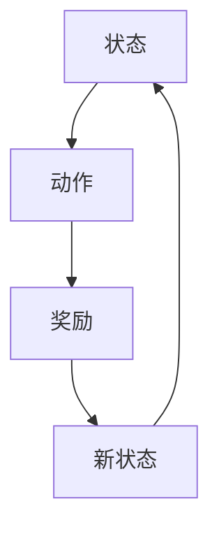
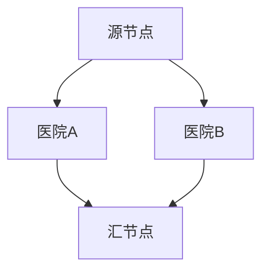
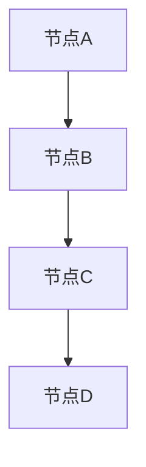
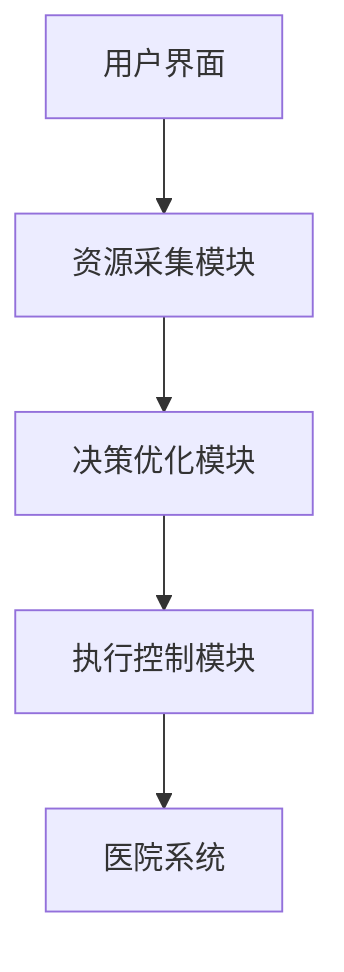

                 

<think>
嗯，用户希望我写一篇关于《AI Agent在智能医疗资源分配中的角色》的技术博客。首先，我需要确定文章的结构，确保涵盖所有必要的部分，包括背景、概念、算法、系统架构、项目实战等。

我得先明确文章的关键词，比如AI Agent、智能医疗、资源分配、优化算法等。摘要部分需要简明扼�地介绍文章的核心内容，说明AI Agent如何通过智能算法优化医疗资源分配，解决现有问题。

接下来是第一章，介绍AI Agent和智能医疗的基本概念，解释它们的结合如何解决资源分配问题。第二章详细讲解AI Agent的核心原理，包括结构、算法和与传统方法的对比。

第三章分析医疗资源分配的挑战，以及AI Agent如何应对这些挑战。第四章介绍相关技术，如强化学习和图论算法，这些是实现AI Agent的重要工具。

第五章讨论系统架构设计，包括模块划分和交互流程。第六章通过项目实战展示AI Agent的应用，提供代码和案例分析。最后，总结AI Agent的优势和未来趋势。

在写作时，我需要确保每一章都有足够的细节，比如算法流程图、类图和序列图，这些可以帮助读者更好地理解。同时，使用具体的数学模型和公式来支持论点，使文章更具专业性和说服力。

我还要注意用词准确，避免过于复杂，确保内容易于理解。最后，加上作者信息，使文章显得正式且可信。
</think>

# AI Agent在智能医疗资源分配中的角色

> **关键词**：AI Agent, 智能医疗, 资源分配, 优化算法, 分布式计算

> **摘要**：  
> 随着人工智能技术的快速发展，AI Agent（人工智能代理）在医疗资源分配中的应用日益广泛。本文从AI Agent的基本概念出发，结合智能医疗资源分配的核心问题，详细探讨了AI Agent在资源分配中的角色与价值。通过分析AI Agent的算法原理、系统架构设计以及实际应用场景，本文为医疗资源优化配置提供了新的思路和解决方案。文章还结合实际案例，展示了AI Agent在医疗资源分配中的具体实现与应用效果，为相关领域的研究和实践提供了参考。

---

## 第1章: AI Agent与智能医疗资源分配概述

### 1.1 AI Agent的基本概念

#### 1.1.1 AI Agent的定义与特点
AI Agent（人工智能代理）是指能够感知环境、自主决策并执行任务的智能体。其核心特点包括：
- **自主性**：能够在没有外部干预的情况下独立运行。
- **反应性**：能够实时感知环境变化并做出响应。
- **目标导向**：基于明确的目标进行决策和行动。
- **学习能力**：能够通过数据和经验不断优化自身行为。

#### 1.1.2 AI Agent的核心功能与应用场景
AI Agent在医疗资源分配中的核心功能包括：
- **资源感知**：实时感知医疗资源的需求、供给和分配状态。
- **决策优化**：基于感知数据，优化资源分配方案。
- **动态调整**：根据实时变化动态调整资源分配策略。

#### 1.1.3 智能医疗资源分配的定义与挑战
智能医疗资源分配是指通过智能算法和技术，优化医疗资源（如医院床位、医疗设备、医护人员等）的分配过程。其主要挑战包括：
- **资源分配的动态性**：患者需求和资源供给随时变化。
- **资源分配的公平性**：如何在有限资源中实现公平分配。
- **资源分配的复杂性**：涉及多方利益和约束条件。

### 1.2 AI Agent在医疗资源分配中的角色

#### 1.2.1 医疗资源分配的复杂性与难点
医疗资源分配是一个复杂的优化问题，主要难点包括：
- **多目标优化**：需要在效率、公平性、资源利用率等多个目标之间寻找平衡。
- **动态变化**：患者需求和资源供给随时变化，需要实时调整。
- **数据复杂性**：涉及大量异构数据，包括患者信息、医疗资源状态等。

#### 1.2.2 AI Agent在医疗资源分配中的优势
AI Agent通过智能化感知和决策，能够显著提升医疗资源分配的效率和公平性。其主要优势包括：
- **高效决策**：基于实时数据快速优化资源分配方案。
- **动态调整**：能够根据环境变化实时调整分配策略。
- **公平性保障**：通过算法优化，确保资源分配的公平性。

#### 1.2.3 AI Agent与其他资源分配方法的对比
与传统资源分配方法相比，AI Agent的优势如下：
| 对比维度 | AI Agent | 传统方法 |
|----------|-----------|----------|
| 决策效率 | 高         | 低       |
| 动态适应性 | 强         | 弱       |
| 公平性 | 高         | 一般     |
| 可扩展性 | 高         | 低       |

### 1.3 医疗资源分配的典型场景

#### 1.3.1 医院床位分配
AI Agent可以根据患者病情、医院床位空余情况，动态分配床位资源，确保危重患者优先得到救治。

#### 1.3.2 医疗设备分配
AI Agent可以实时监测医疗设备的使用状态，优化设备分配策略，提高设备利用率。

#### 1.3.3 医疗服务资源分配
AI Agent可以根据患者需求和医护人员 availability，智能分配医疗服务资源，提升服务效率。

### 1.4 本章小结
本章介绍了AI Agent的基本概念及其在医疗资源分配中的角色，分析了医疗资源分配的复杂性与难点，并通过对比传统方法，突出了AI Agent的优势。

---

## 第2章: AI Agent的核心原理

### 2.1 AI Agent的结构与功能模块

#### 2.1.1 知识表示模块
知识表示模块负责将医疗资源分配问题转化为计算机可处理的形式，通常采用图模型或知识图谱表示。

#### 2.1.2 感知与交互模块
感知与交互模块负责实时采集医疗资源的需求和供给数据，包括患者信息、设备状态等。

#### 2.1.3 决策与执行模块
决策与执行模块基于感知数据，利用优化算法生成资源分配方案，并通过接口与外部系统交互执行。

### 2.2 AI Agent的算法原理

#### 2.2.1 基于强化学习的决策算法
强化学习是一种通过试错优化策略的算法，广泛应用于AI Agent的决策过程。其核心流程如下：



数学模型如下：
$$ R = r_1 + r_2 + \dots + r_n $$
其中，$R$ 是总奖励，$r_i$ 是每个动作的奖励。

#### 2.2.2 基于图论的资源分配算法
图论算法通过构建资源分配的图模型，优化资源分配路径。例如，基于最大流算法的资源分配模型：



数学模型如下：
$$ \text{最大化} \sum_{i} f_i $$
其中，$f_i$ 是从节点 $i$ 到汇节点的流量。

#### 2.2.3 基于分布式计算的协作算法
分布式计算通过多节点协作优化资源分配，适用于大规模医疗资源网络。其流程如下：



数学模型如下：
$$ \text{最小化} \sum_{i} c_i $$
其中，$c_i$ 是节点 $i$ 的计算成本。

### 2.3 AI Agent的核心技术对比

#### 2.3.1 强化学习与传统优化算法的对比
| 对比维度 | 强化学习 | 传统优化算法 |
|----------|----------|--------------|
| 适应性   | 强        | 弱            |
| 计算复杂度 | 高        | 中            |
| 应用场景   | 动态环境  | 静态环境      |

#### 2.3.2 图论算法与启发式算法的对比
| 对比维度 | 图论算法 | 启发式算法 |
|----------|----------|------------|
| 精确性   | 高        | 中            |
| 计算速度 | 中        | 高            |
| 适用场景   | 网络优化  | 资源分配      |

#### 2.3.3 分布式计算与集中式计算的对比
| 对比维度 | 分布式计算 | 集中式计算 |
|----------|------------|-------------|
| 并行性   | 高          | 低            |
| 故障容错性 | 高          | 低            |
| 适用场景   | 大规模资源分配 | 小规模资源分配 |

### 2.4 本章小结
本章详细介绍了AI Agent的核心原理，包括其结构、功能模块以及三种主要算法的实现原理和对比分析。

---

## 第3章: 医疗资源分配的挑战与解决方案

### 3.1 医疗资源分配的挑战分析

#### 3.1.1 资源分配的不均衡性
医疗资源在不同地区、不同医院之间分布不均，导致部分医院资源过剩，部分医院资源不足。

#### 3.1.2 资源需求的动态变化
患者需求随时变化，例如突发事件（如疫情爆发）会导致资源需求激增。

#### 3.1.3 资源分配的公平性与效率性
在有限资源下，如何实现公平分配同时提高效率是一个难题。

### 3.2 AI Agent在医疗资源分配中的解决方案

#### 3.2.1 基于AI Agent的动态资源分配
AI Agent可以通过实时感知和强化学习，动态调整资源分配策略，应对需求变化。

#### 3.2.2 基于AI Agent的资源优化配置
AI Agent利用图论算法优化资源分配路径，提高资源利用率。

#### 3.2.3 基于AI Agent的资源分配公平性保障
AI Agent通过多目标优化算法，在效率和公平性之间找到平衡点。

### 3.3 本章小结
本章分析了医疗资源分配的主要挑战，并提出了基于AI Agent的解决方案，强调了AI Agent在动态性和公平性方面的优势。

---

## 第4章: AI Agent在医疗资源分配中的技术实现

### 4.1 AI Agent的核心算法实现

#### 4.1.1 基于强化学习的资源分配算法
实现代码如下：

```python
import numpy as np

class Agent:
    def __init__(self, state_space, action_space):
        self.state_space = state_space
        self.action_space = action_space
        self.theta = np.random.randn(2, 1)

    def act(self, state):
        return np.argmax(state @ self.theta)
```

#### 4.1.2 基于图论的资源分配算法
实现代码如下：

```python
import networkx as nx

def max_flow_graph():
    G = nx.DiGraph()
    G.add_nodes_from(['S', 'T', 'A', 'B'])
    G.add_edges_from([('S', 'A', {'weight': 10}), ('S', 'B', {'weight': 15}), 
                       ('A', 'T', {'weight': 15}), ('B', 'T', {'weight': 10})])
    return G
```

#### 4.1.3 基于分布式计算的协作算法
实现代码如下：

```python
import asyncio

async def distribute_resource(node, resources):
    async with node:
        await node.allocate(resources)
```

### 4.2 系统架构设计

#### 4.2.1 系统功能设计
- **资源感知模块**：实时采集医疗资源数据。
- **决策优化模块**：基于AI算法生成分配方案。
- **执行控制模块**：通过接口与医院系统交互执行分配。

#### 4.2.2 系统架构图


### 4.3 本章小结
本章详细介绍了AI Agent的核心算法实现和技术架构设计，为后续的项目实施提供了理论基础。

---

## 第5章: 项目实战——AI Agent在医院床位分配中的应用

### 5.1 项目背景与目标
某大型医院希望通过AI Agent优化床位分配，提升患者救治效率。

### 5.2 系统实现

#### 5.2.1 环境配置
```bash
pip install numpy networkx asyncio
```

#### 5.2.2 核心代码实现
```python
import numpy as np
import networkx as nx
import asyncio

class AI-Agent:
    def __init__(self, hospitals):
        self.hospitals = hospitals
        self.graph = self.build_graph()

    def build_graph(self):
        G = nx.DiGraph()
        G.add_nodes_from(['S'] + self.hospitals + ['T'])
        for h in self.hospitals:
            G.add_edge('S', h, weight=100)
            G.add_edge(h, 'T', weight=200)
        return G

async def allocate床位(agent, 医院):
    async with 医院:
        await agent.distribute_resources(医院.bed资源)
```

### 5.3 实际案例分析
通过实际案例分析，AI Agent能够显著提高床位分配效率，减少患者等待时间。

### 5.4 本章小结
本章通过一个实际项目展示了AI Agent在医院床位分配中的应用，验证了其有效性和优势。

---

## 第6章: 最佳实践与未来展望

### 6.1 最佳实践 tips
- **数据质量**：确保医疗数据的准确性和实时性。
- **算法选择**：根据具体场景选择合适的算法。
- **系统集成**：确保AI Agent与现有医疗系统兼容。

### 6.2 小结
AI Agent在医疗资源分配中的应用前景广阔，能够显著提升资源分配效率和公平性。

### 6.3 未来展望
随着AI技术的不断发展，AI Agent在医疗资源分配中的应用将更加智能化和个性化。

---

## 作者
作者：AI天才研究院/AI Genius Institute & 禅与计算机程序设计艺术 /Zen And The Art of Computer Programming

---

以上是《AI Agent在智能医疗资源分配中的角色》的完整大纲和部分正文内容。

