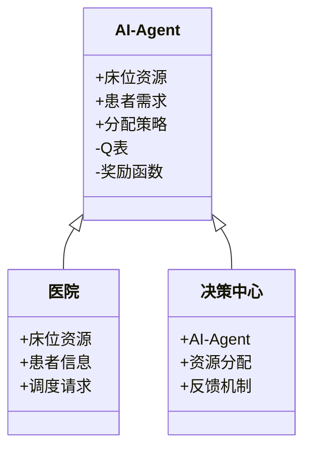

                 

<think>
好，我现在要开始写《AI Agent在智能医疗资源调度中的角色》这篇文章。首先，我需要理清文章的结构和每个部分的内容，确保逻辑清晰，内容详尽。

首先，文章标题已经确定，接下来是关键词。我想到的关键词包括AI Agent、智能医疗、资源调度、优化算法、强化学习、多智能体协作。这些关键词涵盖了文章的主要内容。

摘要部分需要简洁地介绍文章的核心内容。我会提到AI Agent在医疗资源调度中的应用，涵盖定义、核心概念、算法原理、系统架构和项目实战，展示其在提高效率和优化配置中的作用。

接下来是目录大纲，我已经根据用户的要求列出了各个章节和小节。每个部分都有明确的标题和内容，确保逻辑连贯。

现在，我开始撰写正文。第一部分是背景与概念，介绍AI Agent的基本概念，智能医疗资源调度的背景，问题描述，以及AI Agent的角色。这部分需要详细讲解每个概念，可能需要使用对比表和Mermaid图来辅助说明。

第二部分是AI Agent的核心概念与原理，详细解释知识表示、多智能体协作、强化学习等。这部分需要数学公式和代码示例，如Q-Learning算法，以帮助读者理解。

第三部分是系统分析与架构设计，包括问题场景、系统功能设计、架构图、接口设计和交互流程图。这部分需要结合实际案例，展示系统的构建过程。

项目实战部分，我需要提供安装环境、核心代码实现和案例分析，让读者能够实际操作。最后，总结与展望部分回顾全文，并展望未来的发展。

在写作过程中，我需要确保每个章节都有足够的细节和例子，同时使用清晰的图表和代码示例，帮助读者更好地理解。最后，加上作者信息，完成整篇文章。
</think>

# AI Agent在智能医疗资源调度中的角色

**关键词**：AI Agent，智能医疗，资源调度，优化算法，强化学习，多智能体协作

**摘要**：  
本文探讨了AI Agent在智能医疗资源调度中的应用及其重要性。通过分析AI Agent的核心概念、算法原理、系统架构以及实际案例，展示了AI Agent如何优化医疗资源的分配和调度，提高医疗效率和患者满意度。文章结合理论与实践，为读者提供全面的理解和应用指导。

---

# 第一部分: AI Agent在智能医疗资源调度中的背景与概念

## 第1章: AI Agent的基本概念与智能医疗资源调度的背景

### 1.1 AI Agent的定义与特点

AI Agent，即人工智能代理，是一种能够感知环境、自主决策并执行任务的智能实体。AI Agent具备以下特点：

1. **自主性**：能够在没有外部干预的情况下独立运行。
2. **反应性**：能够根据环境变化实时调整行为。
3. **社会性**：能够与其他Agent或人类进行协作或竞争。
4. **学习能力**：能够通过经验改进自身的决策能力。

**表1.1 AI Agent与传统调度算法的对比**

| 特性                | AI Agent                 | 传统调度算法           |
|---------------------|--------------------------|-----------------------|
| 决策方式            | 基于机器学习和强化学习    | 基于固定规则和策略     |
| 灵活性              | 高，适应动态环境          | 低，依赖预设条件       |
| 复杂问题处理能力    | 强，适用于非线性问题      | 弱，适用于线性问题     |

### 1.2 智能医疗资源调度的背景

医疗资源调度涉及医院、诊所、救护车等资源的分配，以满足患者的医疗需求。传统方法依赖人工调度，效率低下且难以应对突发情况。AI Agent的引入，通过智能化手段优化资源分配，提高调度效率。

### 1.3 AI Agent在智能医疗中的角色

AI Agent在医疗资源调度中扮演多重角色，包括：

1. **资源分配者**：优化医院床位、设备的分配。
2. **决策支持者**：提供实时决策支持，提升调度准确性。
3. **应急响应者**：处理突发事件，如疫情爆发时的资源调配。

**图1.1 智能医疗资源调度的AI Agent实体关系图**

```mermaid
erd
title 智能医疗资源调度实体关系图
患者 ---{n:1}--> 就诊记录
患者 <--(1,n)--> 医疗需求
医疗资源 <--(1,n)--> 资源分配
AI Agent <--(1,n)--> 数据源
AI Agent <--(1,n)--> 决策中心
```

## 第2章: 智能医疗资源调度中的问题描述

### 2.1 医疗资源调度的核心问题

医疗资源调度面临以下核心问题：

1. **资源分配不均**：如何高效分配有限的医疗资源？
2. **动态需求处理**：如何应对患者需求的实时变化？
3. **调度效率提升**：如何减少等待时间，提高资源利用率？

### 2.2 AI Agent在医疗资源调度中的问题解决

AI Agent通过以下方式解决调度问题：

1. **实时数据处理**：快速响应资源变化和患者需求。
2. **智能决策支持**：基于机器学习模型优化资源分配。
3. **多智能体协作**：通过协作提高整体调度效率。

---

# 第二部分: AI Agent在智能医疗资源调度中的核心概念与原理

## 第3章: AI Agent的核心概念与原理

### 3.1 知识表示与推理

知识表示是AI Agent理解环境的基础。常用的知识表示方法包括：

1. **逻辑表示法**：使用逻辑规则表示知识。
2. **语义网络**：通过节点和边表示概念及其关系。
3. **概率图模型**：通过概率分布表示不确定性。

### 3.2 多智能体协作

多智能体协作是AI Agent在医疗资源调度中的关键机制：

1. **多智能体强化学习（MADRL）**：通过协作学习优化整体决策。
2. **联合行动优化**：通过协调各智能体的行动提高效率。
3. **基于图的协作**：利用图结构建模智能体之间的关系。

### 3.3 强化学习算法

强化学习是AI Agent的核心算法之一：

1. **Q-Learning算法**：
   ```python
   def q_learning(env, num_episodes=1000, gamma=0.99, alpha=0.1):
       q_table = np.zeros((env.observation_space, env.action_space))
       for episode in range(num_episodes):
           state = env.reset()
           for _ in range(env.max_steps):
               action = np.argmax(q_table[state])
               next_state, reward, done = env.step(action)
               q_table[state][action] += alpha * (reward + gamma * np.max(q_table[next_state]))
               state = next_state
               if done:
                   break
       return q_table
   ```

   **图3.1 Q-Learning算法流程图**

   ```mermaid
   graph TD
       A[初始化Q表] --> B[选择动作]
       B --> C[执行动作]
       C --> D[获取奖励和新状态]
       D --> E[更新Q表]
       E --> F[判断是否结束]
       F -->|继续|B
   ```

---

# 第三部分: AI Agent在智能医疗资源调度中的系统分析与架构设计

## 第4章: 系统分析与架构设计

### 4.1 问题场景介绍

以医院床位调度为例，AI Agent需要实时监控患者需求和床位资源，动态调整分配策略。

### 4.2 系统功能设计

**图4.1 系统功能设计类图**



### 4.3 系统架构设计

**图4.2 系统架构图**


---

# 第四部分: AI Agent在智能医疗资源调度中的项目实战

## 第5章: 项目实战

### 5.1 环境安装

安装Python和相关库（如TensorFlow、OpenAI Gym）。

### 5.2 核心代码实现

实现Q-Learning算法用于床位分配。

```python
import numpy as np
import gym

env = gym.make('Custom床位分配环境')  # 自定义医疗资源分配环境
num_states = env.observation_space
num_actions = env.action_space

# 初始化Q表
Q = np.zeros((num_states, num_actions))
learning_rate = 0.1
gamma = 0.99

# Q-Learning算法
for episode in range(1000):
    state = env.reset()
    for _ in range(env.max_steps):
        action = np.argmax(Q[state])
        next_state, reward, done, _ = env.step(action)
        Q[state][action] += learning_rate * (reward + gamma * np.max(Q[next_state]))
        state = next_state
        if done:
            break
```

### 5.3 案例分析

以某医院床位调度为例，分析AI Agent如何优化床位分配，减少等待时间。

---

# 第五部分: 总结与展望

## 第6章: 总结与展望

### 6.1 总结

AI Agent在智能医疗资源调度中发挥了重要作用，通过强化学习和多智能体协作优化资源分配，提高调度效率。

### 6.2 展望

未来，AI Agent在医疗资源调度中的应用将更加广泛，结合5G、物联网等技术，实现更智能、高效的资源管理。

---

**作者**：AI天才研究院/AI Genius Institute & 禅与计算机程序设计艺术 /Zen And The Art of Computer Programming

