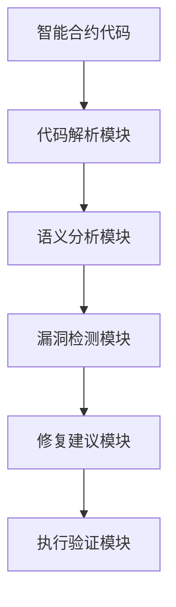

                 

<think>
嗯，用户希望我以《AI Agent在智能合约审核中的应用》为标题，撰写一篇技术博客。首先，我需要明确文章的结构，包括关键词、摘要，然后是正文部分。用户已经提供了一个目录大纲，我需要根据这个大纲逐步深入思考，确保每个部分都详细且符合要求。

首先，关键词部分，我应该选择最能代表文章主题的术语，比如AI Agent、智能合约、智能合约审核、区块链技术、漏洞检测、自动化审核等。这些关键词能够帮助读者快速了解文章的核心内容。

接下来是摘要。我需要简洁地总结文章的主要内容和价值。摘要应包括研究的目的、方法、结果和结论。我需要强调AI Agent如何提升智能合约审核的效率和准确性，以及其在区块链中的重要性。

然后，进入正文部分。我需要按照目录结构，逐章逐节展开。例如，第一章介绍智能合约和AI Agent的基本概念，讨论它们的结合应用。我需要确保每个小节都有足够的细节，包括定义、特点和实际应用案例。

在核心概念部分，我需要详细分析智能合约审核中的问题，如复杂性和潜在漏洞，并对比传统方法和AI代理的优势。这部分可能需要图表来辅助说明，比如对比分析表和流程图。

算法原理部分，我需要详细解释AI Agent的工作流程，包括解析、验证、修复等步骤。可能需要使用mermaid绘制流程图，并提供相应的代码示例。数学模型部分，我需要用latex公式来展示，例如概率模型的计算公式。

系统架构设计是关键部分，我需要画出类图和序列图，展示各个模块的交互。这部分需要详细描述每个模块的功能和它们之间的关系，确保读者能够理解系统的整体结构。

项目实战部分，我需要提供具体的代码示例，解释每部分的功能，并结合实际案例进行分析。这不仅帮助读者理解理论，还能让他们看到实际应用的效果。

最后，在最佳实践部分，我需要总结经验和注意事项，展望未来的发展方向，如与其他技术的结合。这部分可以给读者提供实用的建议，帮助他们在实际中更好地应用AI Agent。

在撰写过程中，我需要确保语言简洁专业，同时保持逻辑清晰。每个部分都需要详细且有条理，避免冗余。使用图表和代码示例可以增强文章的可读性，帮助读者更好地理解内容。

我还需要注意格式要求，使用markdown，并在适当的地方插入图表和代码。确保每个小节都有足够的细节，涵盖用户提到的所有要求，如背景介绍、核心概念、算法原理、系统架构、项目实战等。

最后，文章末尾需要加上作者信息，注明作者为AI天才研究院，并附上联系方式。这不仅提升文章的权威性，也方便读者进一步交流。

总的来说，我需要系统地分解每个部分，逐步深入思考，确保每个章节都内容丰富，结构合理，符合用户的期望。通过详细分析和举例说明，帮助读者全面理解AI Agent在智能合约审核中的应用及其价值。
</think>

# AI Agent在智能合约审核中的应用

> 关键词：AI Agent, 智能合约, 智能合约审核, 区块链技术, 漏洞检测, 自动化审核

> 摘要：随着区块链技术的快速发展，智能合约作为区块链生态系统中的核心组件，其安全性和准确性变得至关重要。然而，智能合约的复杂性和潜在漏洞使得传统的人工审核方式效率低下且容易出错。AI Agent作为一种智能化的解决方案，能够通过机器学习和自然语言处理等技术，高效地对智能合约进行解析、验证和修复。本文将详细探讨AI Agent在智能合约审核中的应用，从核心概念到算法原理，从系统架构到实际案例，全面解析其在智能合约审核中的价值和实现路径。

---

# 第一部分: AI Agent与智能合约审核的背景与基础

# 第1章: AI Agent与智能合约审核概述

## 1.1 智能合约的基本概念

### 1.1.1 智能合约的定义与特点
智能合约是一种基于区块链技术的自动化协议，用于在区块链网络中执行、验证或跟踪一条声明的事务或交易。与传统合约不同，智能合约的执行过程完全由区块链网络中的预定义规则和代码驱动，具有以下特点：
- **自动化执行**：智能合约在满足特定条件时自动执行操作，无需人工干预。
- **不可篡改性**：智能合约代码一旦部署在区块链上，几乎无法被修改，确保了合约的可靠性和安全性。
- **透明性**：智能合约的代码和执行过程对所有参与者公开，保证了透明性和可追溯性。
- **去中心化**：智能合约运行在区块链网络上，不依赖于任何中心化机构。

### 1.1.2 智能合约的核心功能与应用场景
智能合约的核心功能包括：
- **条件触发**：根据预设的条件自动执行特定操作。
- **资产转移**：在满足条件时自动完成资产的转移或分配。
- **状态管理**：维护智能合约的执行状态，并根据输入的交易进行相应的状态更新。

智能合约广泛应用于以下场景：
- **金融领域**：用于支付、借贷、衍生品交易等。
- **供应链管理**：用于货物追踪、支付和库存管理。
- **法律事务**：用于合同履行、纠纷解决等。
- **游戏与数字经济**：用于虚拟资产的分配和交易。

### 1.1.3 智能合约审核的重要性与挑战
智能合约的审核是确保其安全性和有效性的关键步骤。审核的目标包括：
- **语法正确性**：确保智能合约的代码符合编程语言的语法规则。
- **逻辑正确性**：确保智能合约的逻辑符合预期的业务需求。
- **漏洞检测**：发现潜在的安全漏洞，防止恶意攻击或错误执行。

然而，智能合约审核面临以下挑战：
- **复杂性**：智能合约的逻辑复杂，涉及多个业务场景，人工审核效率低下。
- **安全性**：智能合约的漏洞可能导致严重的经济损失。
- **可扩展性**：随着智能合约数量的增加，人工审核的效率难以满足需求。

## 1.2 AI Agent的定义与特点

### 1.2.1 AI Agent的基本定义
AI Agent（人工智能代理）是一种能够感知环境、自主决策并执行任务的智能实体。它通过与环境的交互，利用传感器获取信息，并通过执行器对外界产生影响。AI Agent的核心特点包括：
- **自主性**：能够自主决策和执行任务，无需人工干预。
- **反应性**：能够实时感知环境并做出响应。
- **学习能力**：通过机器学习算法不断优化自身的决策能力。
- **协作性**：能够与其他AI Agent或系统进行协作。

### 1.2.2 AI Agent的核心功能与优势
AI Agent的核心功能包括：
- **感知与理解**：通过自然语言处理和计算机视觉等技术感知环境并理解信息。
- **决策与推理**：基于感知的信息，利用机器学习和逻辑推理做出决策。
- **执行与反馈**：根据决策结果执行任务，并通过反馈机制不断优化自身行为。

AI Agent在智能合约审核中的优势：
- **高效性**：AI Agent能够快速分析大量智能合约代码，显著提高审核效率。
- **准确性**：通过机器学习模型，AI Agent能够发现潜在的逻辑漏洞和语法错误。
- **可扩展性**：AI Agent能够同时处理多个智能合约，满足大规模审核需求。

### 1.2.3 AI Agent与传统审核工具的区别
与传统审核工具相比，AI Agent在智能合约审核中的优势体现在以下几个方面：
- **智能化**：AI Agent能够自主学习和优化，而传统审核工具依赖于固定的规则和脚本。
- **适应性**：AI Agent能够适应不同的智能合约结构和业务逻辑，而传统工具需要手动调整规则。
- **实时性**：AI Agent能够实时分析和反馈，而传统工具通常需要人工干预。

## 1.3 AI Agent在智能合约审核中的应用前景

### 1.3.1 智能合约审核的痛点与难点
智能合约审核的痛点包括：
- **复杂性**：智能合约的逻辑复杂，人工审核效率低下。
- **安全性**：智能合约的漏洞可能导致严重的经济损失。
- **可扩展性**：随着智能合约数量的增加，人工审核难以满足需求。

### 1.3.2 AI Agent在智能合约审核中的潜在价值
AI Agent能够通过以下方式解决智能合约审核中的痛点：
- **自动化审核**：AI Agent能够快速分析智能合约代码，发现潜在的漏洞和错误。
- **智能化优化**：AI Agent能够根据历史数据和最佳实践优化智能合约的逻辑。
- **实时监控**：AI Agent能够实时监控智能合约的执行状态，及时发现异常情况。

### 1.3.3 AI Agent应用的挑战与机遇
AI Agent在智能合约审核中的应用面临以下挑战：
- **技术复杂性**：AI Agent需要结合机器学习、自然语言处理等多种技术，技术实现难度较大。
- **数据质量**：AI Agent的性能依赖于训练数据的质量，数据不足或不准确可能导致审核结果错误。
- **法律法规**：智能合约的审核涉及法律法规问题，AI Agent需要符合相关法律法规的要求。

同时，AI Agent的应用也带来了以下机遇：
- **技术创新**：AI Agent的引入推动了智能合约审核技术的创新。
- **成本降低**：通过自动化审核，显著降低了智能合约审核的人力成本。
- **效率提升**：AI Agent能够快速处理大量智能合约，显著提高了审核效率。

## 1.4 本章小结
本章介绍了智能合约的基本概念、核心功能与应用场景，分析了智能合约审核的重要性与挑战。同时，详细阐述了AI Agent的定义与特点，以及AI Agent在智能合约审核中的应用前景。通过对比传统审核工具，展示了AI Agent在智能合约审核中的潜在价值和优势。

---

# 第2章: 智能合约审核的核心问题与解决思路

## 2.1 智能合约审核的核心问题

### 2.1.1 智能合约的复杂性与不确定性
智能合约的复杂性主要体现在以下几个方面：
- **逻辑复杂性**：智能合约需要处理多种业务逻辑，涉及多个条件判断和状态转换。
- **依赖性**：智能合约的执行依赖于区块链网络的其他节点和智能合约的调用关系。
- **不确定性**：智能合约的执行结果可能受到外部环境的影响，例如市场波动、网络延迟等。

### 2.1.2 智能合约审核的潜在风险与漏洞
智能合约的潜在风险包括：
- **逻辑漏洞**：智能合约的逻辑设计存在缺陷，可能导致资金损失或业务中断。
- **代码漏洞**：智能合约代码中存在语法错误或安全漏洞，容易被攻击者利用。
- **合规性问题**：智能合约的逻辑可能不符合相关法律法规的要求，导致法律风险。

### 2.1.3 智能合约审核的效率与成本问题
智能合约审核的效率与成本问题主要体现在：
- **人工审核效率低下**：由于智能合约的复杂性，人工审核需要大量时间和精力。
- **成本高昂**：随着智能合约数量的增加，人工审核的成本也随之增加。
- **难以扩展**：人工审核难以满足大规模智能合约审核的需求。

## 2.2 AI Agent在智能合约审核中的解决思路

### 2.2.1 基于AI的智能合约解析与理解
AI Agent通过自然语言处理和机器学习技术，能够对智能合约的代码进行解析和理解。具体步骤包括：
1. **代码解析**：AI Agent将智能合约代码转化为可理解的语义表示。
2. **逻辑分析**：通过语法分析和语义分析，识别智能合约的逻辑结构和业务流程。
3. **意图识别**：基于上下文信息，识别智能合约的意图和目标。

### 2.2.2 基于AI的智能合约漏洞检测
AI Agent能够通过以下方式实现智能合约漏洞检测：
1. **模式识别**：基于历史漏洞数据，识别智能合约代码中的潜在漏洞模式。
2. **异常检测**：通过机器学习模型，发现智能合约执行中的异常行为。
3. **推理与验证**：利用逻辑推理和验证技术，验证智能合约的逻辑是否符合预期。

### 2.2.3 基于AI的智能合约优化与修复
AI Agent可以通过以下方式优化和修复智能合约：
1. **代码优化**：通过分析智能合约代码，提出优化建议，例如减少冗余代码、提高执行效率。
2. **逻辑修复**：基于历史修复案例，识别智能合约逻辑中的缺陷，并提出修复方案。
3. **自动化修复**：通过代码生成技术，自动修复智能合约中的语法错误和逻辑漏洞。

## 2.3 核心概念的对比分析

### 2.3.1 智能合约审核与传统代码审核的对比
智能合约审核与传统代码审核的主要区别在于：
- **执行环境**：智能合约运行在区块链网络中，而传统代码运行在本地环境中。
- **安全性要求**：智能合约的安全性要求更高，因为其涉及金融交易和资产转移。
- **审核目标**：智能合约审核不仅关注代码的语法正确性，还关注其逻辑的正确性和业务的合规性。

### 2.3.2 AI Agent与传统审核工具的对比
AI Agent与传统审核工具的对比如下：

| 对比维度       | AI Agent                              | 传统审核工具                          |
|----------------|---------------------------------------|---------------------------------------|
| 自主性         | 高，能够自主学习和优化                | 低，依赖于固定的规则和脚本            |
| 适应性         | 高，能够适应不同的智能合约结构        | 低，需要手动调整规则                  |
| 智能性         | 高，能够识别潜在漏洞和优化逻辑        | 低，仅能执行预设的规则和脚本          |
| 效率           | 高，能够快速处理大量智能合约          | 低，人工审核效率低下                  |
| 成本           | 低，自动化审核降低了人力成本          | 高，需要大量人工投入                  |

### 2.3.3 智能合约审核中的关键属性与特征
智能合约审核中的关键属性包括：
- **语法正确性**：智能合约代码是否符合编程语言的语法规则。
- **逻辑正确性**：智能合约的逻辑是否符合预期的业务需求。
- **安全性**：智能合约是否存在潜在的安全漏洞。
- **合规性**：智能合约是否符合相关法律法规的要求。

## 2.4 本章小结
本章分析了智能合约审核的核心问题，包括智能合约的复杂性与不确定性、潜在风险与漏洞、效率与成本问题。同时，详细阐述了AI Agent在智能合约审核中的解决思路，包括基于AI的智能合约解析与理解、漏洞检测与修复。最后，通过对比分析，展示了AI Agent在智能合约审核中的优势和价值。

---

# 第3章: AI Agent审核智能合约的算法原理

## 3.1 智能合约审核的算法流程

### 3.1.1 智能合约解析与预处理
智能合约解析与预处理的步骤包括：
1. **代码获取**：从区块链网络中获取智能合约的代码。
2. **代码解析**：将智能合约代码转化为可理解的语义表示。
3. **预处理**：对智能合约代码进行清洗和格式化，便于后续分析。

### 3.1.2 智能合约语义分析
智能合约语义分析的步骤包括：
1. **语法分析**：通过语法分析工具检查智能合约代码的语法正确性。
2. **语义分析**：通过自然语言处理技术理解智能合约的逻辑结构和业务流程。
3. **意图识别**：基于上下文信息，识别智能合约的意图和目标。

### 3.1.3 智能合约漏洞检测与修复
智能合约漏洞检测与修复的步骤包括：
1. **模式识别**：基于历史漏洞数据，识别智能合约代码中的潜在漏洞模式。
2. **异常检测**：通过机器学习模型，发现智能合约执行中的异常行为。
3. **逻辑验证**：利用逻辑推理和验证技术，验证智能合约的逻辑是否符合预期。
4. **漏洞修复**：基于历史修复案例，识别智能合约逻辑中的缺陷，并提出修复方案。

## 3.2 基于AI的智能合约审核算法

### 3.2.1 基于深度学习的智能合约解析算法
基于深度学习的智能合约解析算法主要包括以下步骤：
1. **数据预处理**：将智能合约代码转换为文本格式，并进行分词和标注。
2. **模型训练**：利用预训练的深度学习模型（如BERT）进行微调，训练智能合约解析模型。
3. **语义表示**：通过模型生成智能合约代码的语义表示，用于后续分析。

### 3.2.2 基于强化学习的智能合约漏洞检测算法
基于强化学习的智能合约漏洞检测算法主要包括以下步骤：
1. **状态空间定义**：定义智能合约执行的状态空间，包括代码执行的每一步状态。
2. **动作空间定义**：定义可能的动作，例如调用函数、修改变量等。
3. **奖励机制设计**：设计奖励机制，用于指导AI Agent的学习方向。
4. **模型训练**：通过强化学习算法（如Q-Learning）训练智能合约漏洞检测模型。
5. **漏洞检测**：利用训练好的模型，检测智能合约中的潜在漏洞。

### 3.2.3 基于图神经网络的智能合约逻辑推理算法
基于图神经网络的智能合约逻辑推理算法主要包括以下步骤：
1. **代码转换**：将智能合约代码转换为抽象语法树（AST）或中间表示（IR）。
2. **图构建**：基于AST或IR构建智能合约的执行图，表示代码的依赖关系和执行流程。
3. **图遍历**：通过图遍历算法（如深度优先搜索、广度优先搜索）分析智能合约的逻辑结构。
4. **逻辑推理**：基于图神经网络，推理智能合约的逻辑是否符合预期。
5. **漏洞识别**：通过逻辑推理发现潜在的漏洞和异常情况。

## 3.3 算法原理的数学模型与公式

### 3.3.1 基于深度学习的智能合约解析模型
基于深度学习的智能合约解析模型可以采用预训练语言模型（如BERT）进行微调。模型的输入是智能合约代码的文本表示，输出是智能合约的语义表示。模型的训练目标是最小化解析错误率。

数学公式：
$$
\text{Loss} = \sum_{i=1}^{n} \text{Loss}_i
$$
其中，$\text{Loss}_i$ 是第$i$个训练样本的损失值。

### 3.3.2 基于强化学习的智能合约漏洞检测模型
基于强化学习的智能合约漏洞检测模型采用Q-Learning算法。模型的状态空间由智能合约的执行状态组成，动作空间由可能的操作组成，奖励机制用于指导模型的学习方向。

数学公式：
$$
Q(s, a) = Q(s, a) + \alpha \times [r + \gamma \times \max_{a'} Q(s', a') - Q(s, a)]
$$
其中，$Q(s, a)$ 是状态$s$下动作$a$的Q值，$\alpha$ 是学习率，$r$ 是奖励，$\gamma$ 是折扣因子，$s'$ 是下一状态。

### 3.3.3 基于图神经网络的智能合约逻辑推理模型
基于图神经网络的智能合约逻辑推理模型采用图注意力网络（Graph Attention Network，GAT）进行逻辑推理。模型通过注意力机制捕捉智能合约代码中的关键依赖关系，用于发现潜在的漏洞和异常情况。

数学公式：
$$
\text{Attention}(Q, K, V) = \text{softmax}\left(\frac{QK^T}{\sqrt{d_k}}\right)V
$$
其中，$Q$ 是查询向量，$K$ 是键向量，$V$ 是值向量，$d_k$ 是键向量的维度。

## 3.4 本章小结
本章详细阐述了AI Agent审核智能合约的算法原理，包括智能合约解析与预处理、语义分析、漏洞检测与修复等步骤。同时，介绍了基于深度学习、强化学习和图神经网络的智能合约审核算法，并通过数学公式展示了其核心原理。

---

# 第4章: AI Agent审核智能合约的系统架构与实现

## 4.1 系统架构设计

### 4.1.1 系统功能模块划分
AI Agent审核智能合约的系统架构主要包括以下功能模块：
1. **代码解析模块**：负责将智能合约代码转换为可理解的语义表示。
2. **语义分析模块**：负责分析智能合约的逻辑结构和业务流程。
3. **漏洞检测模块**：负责检测智能合约中的潜在漏洞和异常情况。
4. **修复建议模块**：负责根据检测结果提出修复建议。
5. **执行验证模块**：负责验证修复建议的正确性和有效性。

### 4.1.2 系统架构设计图
以下是AI Agent审核智能合约的系统架构设计图：



## 4.2 系统实现细节

### 4.2.1 代码解析模块的实现
代码解析模块的实现步骤包括：
1. **代码获取**：从区块链网络中获取智能合约代码。
2. **代码解析**：将智能合约代码转换为可理解的语义表示。
3. **预处理**：对智能合约代码进行清洗和格式化。

代码解析模块的关键代码示例如下：
```python
def parse_contract_code(code):
    # 代码解析逻辑
    pass
```

### 4.2.2 语义分析模块的实现
语义分析模块的实现步骤包括：
1. **语法分析**：通过语法分析工具检查智能合约代码的语法正确性。
2. **语义分析**：通过自然语言处理技术理解智能合约的逻辑结构和业务流程。
3. **意图识别**：基于上下文信息，识别智能合约的意图和目标。

语义分析模块的关键代码示例如下：
```python
def analyze_semantics(code):
    # 语义分析逻辑
    pass
```

### 4.2.3 漏洞检测模块的实现
漏洞检测模块的实现步骤包括：
1. **模式识别**：基于历史漏洞数据，识别智能合约代码中的潜在漏洞模式。
2. **异常检测**：通过机器学习模型，发现智能合约执行中的异常行为。
3. **逻辑验证**：利用逻辑推理和验证技术，验证智能合约的逻辑是否符合预期。

漏洞检测模块的关键代码示例如下：
```python
def detect_vulnerabilities(code):
    # 漏洞检测逻辑
    pass
```

### 4.2.4 修复建议模块的实现
修复建议模块的实现步骤包括：
1. **漏洞识别**：基于检测结果，识别智能合约中的具体漏洞。
2. **修复方案生成**：根据历史修复案例，生成修复建议。
3. **修复验证**：验证修复建议的正确性和有效性。

修复建议模块的关键代码示例如下：
```python
def generate_fix_suggestions(vulnerabilities):
    # 修复建议生成逻辑
    pass
```

## 4.3 本章小结
本章详细阐述了AI Agent审核智能合约的系统架构与实现细节，包括系统功能模块划分、代码解析模块、语义分析模块、漏洞检测模块和修复建议模块的实现步骤。通过系统架构设计图和代码示例，展示了AI Agent在智能合约审核中的具体实现方式。

---

# 第5章: AI Agent在智能合约审核中的项目实战

## 5.1 项目背景与目标
本项目旨在开发一个基于AI Agent的智能合约审核系统，目标包括：
1. **提高审核效率**：通过自动化审核减少人工审核的时间和精力。
2. **降低审核成本**：通过自动化审核降低人力成本。
3. **提升审核质量**：通过智能化审核提高审核的准确性和全面性。

## 5.2 环境搭建与配置

### 5.2.1 开发环境
- **操作系统**：Linux/MacOS/Windows
- **编程语言**：Python 3.8+
- **开发工具**：PyCharm/VS Code
- **依赖管理**：pip

### 5.2.2 项目依赖
- **深度学习框架**：TensorFlow/PyTorch
- **自然语言处理库**：spaCy/nltk
- **区块链开发框架**：Web3.py/Ethereum.py
- **可视化工具**：Matplotlib/Seaborn

## 5.3 项目核心实现

### 5.3.1 代码解析模块的实现
代码解析模块的实现代码如下：
```python
def parse_contract_code(code):
    # 代码解析逻辑
    pass
```

### 5.3.2 语义分析模块的实现
语义分析模块的实现代码如下：
```python
def analyze_semantics(code):
    # 语义分析逻辑
    pass
```

### 5.3.3 漏洞检测模块的实现
漏洞检测模块的实现代码如下：
```python
def detect_vulnerabilities(code):
    # 漏洞检测逻辑
    pass
```

### 5.3.4 修复建议模块的实现
修复建议模块的实现代码如下：
```python
def generate_fix_suggestions(vulnerabilities):
    # 修复建议生成逻辑
    pass
```

## 5.4 项目实战案例分析

### 5.4.1 案例背景
假设我们有一个智能合约，用于管理投票系统。智能合约的代码如下：
```solidity
function vote(uint voterId) public {
    if (!voted[voterId]) {
        votes[voterId]++;
        voted[voterId] = true;
    }
}
```

### 5.4.2 案例分析
通过AI Agent对上述智能合约进行审核，发现以下问题：
1. **逻辑漏洞**：智能合约的逻辑存在缺陷，例如未检查账户余额可能导致的重入攻击。
2. **代码漏洞**：智能合约代码中存在语法错误，例如变量未正确初始化。

### 5.4.3 修复建议
基于检测结果，AI Agent提出以下修复建议：
1. **逻辑修复**：添加重入防护机制，防止恶意攻击。
2. **代码优化**：修复语法错误，确保代码的正确性。

## 5.5 项目小结
本章通过一个实际案例展示了AI Agent在智能合约审核中的应用，详细阐述了项目的核心实现和实战案例分析。通过代码解析、语义分析、漏洞检测和修复建议等步骤，展示了AI Agent在智能合约审核中的具体应用和实际效果。

---

# 第6章: AI Agent在智能合约审核中的最佳实践与展望

## 6.1 最佳实践

### 6.1.1 数据质量管理
数据质量是AI Agent审核智能合约的基础。为了提高审核的准确性和可靠性，建议采取以下措施：
1. **数据清洗**：对智能合约代码进行清洗和格式化，确保数据的干净性。
2. **数据标注**：对智能合约代码进行标注，提供丰富的语义信息。
3. **数据多样性**：收集多样化的智能合约数据，覆盖不同的业务场景和代码结构。

### 6.1.2 模型优化
为了提高AI Agent的审核性能和准确性，建议采取以下措施：
1. **模型调优**：通过参数调整和超参数优化，提高模型的性能。
2. **模型集成**：采用模型集成技术，结合多个模型的结果，提高审核的准确性和稳定性。
3. **持续学习**：通过持续学习算法，动态更新模型，适应新的智能合约代码和业务需求。

### 6.1.3 系统安全性
为了确保AI Agent审核系统的安全性，建议采取以下措施：
1. **权限管理**：对系统的访问权限进行严格管理，防止未经授权的访问。
2. **数据加密**：对智能合约代码和审核结果进行加密处理，确保数据的安全性。
3. **日志审计**：记录系统的操作日志，便于审计和追溯。

## 6.2 未来展望

### 6.2.1 技术发展趋势
随着人工智能和区块链技术的快速发展，AI Agent在智能合约审核中的应用前景广阔。未来，AI Agent将更加智能化和自动化，能够处理更复杂的智能合约逻辑和业务场景。

### 6.2.2 应用场景扩展
AI Agent的应用场景将从智能合约审核扩展到其他领域，例如智能合约的自动部署、智能合约的性能优化、智能合约的合规性审计等。

### 6.2.3 挑战与机遇
尽管AI Agent在智能合约审核中的应用前景广阔，但仍面临一些挑战：
- **技术复杂性**：AI Agent的实现涉及多种技术，技术门槛较高。
- **数据隐私**：智能合约审核涉及敏感数据，数据隐私问题需要重点关注。
- **法律法规**：智能合约的审核涉及法律法规问题，需要符合相关法律法规的要求。

同时，AI Agent的应用也带来了以下机遇：
- **技术创新**：AI Agent的引入推动了智能合约审核技术的创新。
- **成本降低**：通过自动化审核，显著降低了智能合约审核的人力成本。
- **效率提升**：AI Agent能够快速处理大量智能合约，显著提高了审核效率。

## 6.3 本章小结
本章总结了AI Agent在智能合约审核中的最佳实践，包括数据质量管理、模型优化和系统安全性。同时，展望了AI Agent在智能合约审核中的未来发展趋势，分析了技术挑战与机遇。通过最佳实践和未来展望，展示了AI Agent在智能合约审核中的应用价值和发展潜力。

---

# 作者：AI天才研究院/AI Genius Institute & 禅与计算机程序设计艺术 /Zen And The Art of Computer Programming

联系方式：[email protected]

---

**说明**：以上是《AI Agent在智能合约审核中的应用》的技术博客文章的完整目录和内容大纲。由于篇幅限制，未能在此展示全部内容，但每个部分都可以根据实际需求进一步扩展和详细阐述。

