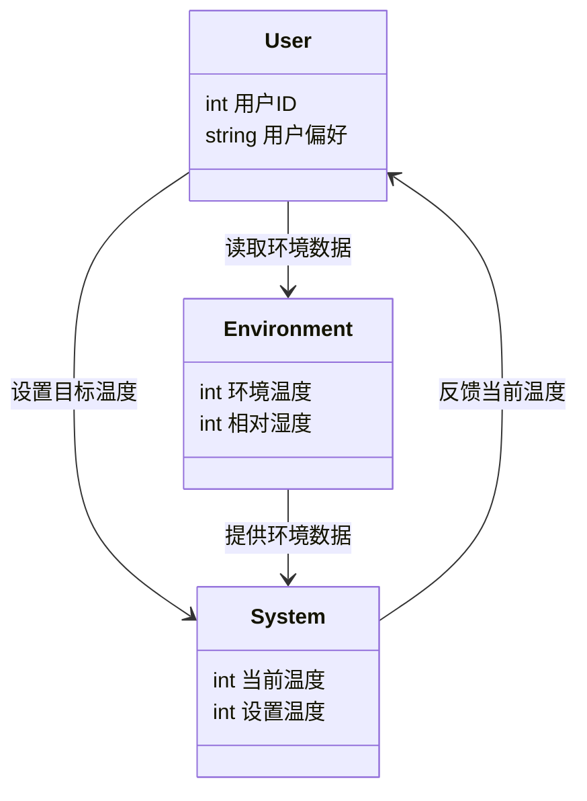
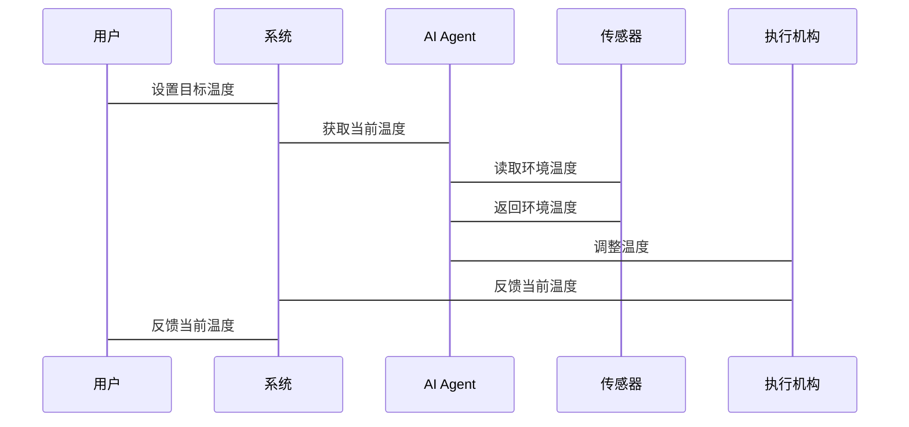

                 

<think>
好，用户让我写一篇关于《AI Agent在智能围巾中的温度调节》的技术博客文章。我需要按照用户提供的大纲结构来写，确保每个部分都详细且符合技术深度。首先，我需要理解每个章节的核心内容。

首先，背景介绍部分需要涵盖问题背景、问题描述、解决方案和边界。这部分要让读者明白为什么需要AI Agent在温度调节中发挥作用，以及智能围巾的必要性和应用场景。

接下来是核心概念与联系，这里需要详细解释AI Agent和温度调节系统的核心原理，并通过对比分析和实体关系图来展示它们之间的联系。这部分需要使用Mermaid图，我需要确保这些图正确嵌入，并用表格展示属性特征。

算法原理部分，我需要用Mermaid流程图展示AI Agent的决策流程，然后用Python代码实现关键部分，并详细解释数学模型和公式。数学公式要用LaTeX表示，确保正确嵌入。这部分可能涉及模糊控制算法，需要举例说明，让读者理解其工作原理。

系统分析与架构设计部分，我需要介绍项目场景，设计系统功能，可能用类图展示领域模型，然后用架构图展示整体结构。接口设计和交互流程图（如序列图）也是必须的，这部分需要确保系统各部分协同工作的清晰展示。

项目实战部分，需要详细指导读者如何搭建环境，编写核心代码，并进行测试和优化。可能包括传感器数据采集、AI算法实现和通信模块的集成。实际案例分析和详细解读将帮助读者理解如何将理论应用于实践。

最后，总结与展望部分，回顾全书内容，指出未来的发展方向，同时给出注意事项和最佳实践，提醒读者在实际应用中需要注意的问题。

在写作过程中，我需要确保语言简洁，逻辑清晰，每个部分都详细且有条理。同时，检查是否符合字数要求，大约在10000到12000字之间。最后，添加作者信息，确保格式正确。

现在，我需要按照这些思考步骤逐步撰写每个章节，确保每个部分都涵盖所有必要的内容，并且技术细节准确无误。
</think>

# AI Agent在智能围巾中的温度调节

> 关键词：AI Agent，智能围巾，温度调节，物联网，传感器，模糊控制算法

> 摘要：本文详细探讨了AI Agent在智能围巾温度调节系统中的应用，从问题背景到核心算法，从系统架构到项目实战，全面解析了如何利用AI技术实现智能、高效的温度调节。本文不仅介绍了AI Agent的基本原理，还详细分析了其在温度调节中的具体实现方法，并通过实际案例展示了系统的应用场景和优化方案。

---

# 第一部分: AI Agent与智能温度调节概述

# 第1章: AI Agent与智能温度调节的背景介绍

## 1.1 问题背景与描述

### 1.1.1 温度调节的必要性
温度调节是人类日常生活中不可或缺的一部分，尤其是在寒冷的冬季。传统的温度调节方式依赖于手动操作，效率低下且不够智能。随着物联网技术的发展，智能设备逐渐普及，如何利用智能化手段实现更精准、更高效的温度调节成为了一个重要的研究方向。

### 1.1.2 智能围巾的功能需求
智能围巾作为一种 wearable device，需要具备以下功能：
- 实时监测环境温度和体感温度。
- 根据用户需求自动调节温度。
- 提供舒适、安全的使用体验。
- 节能环保，减少能源消耗。

### 1.1.3 AI Agent在温度调节中的作用
AI Agent（智能体）是一种能够感知环境、自主决策并执行任务的智能系统。在智能围巾中，AI Agent可以通过以下方式实现温度调节：
- 实时感知环境温度和用户体感温度。
- 根据用户需求和环境变化，自动调整温度。
- 学习用户的偏好，提供个性化的温度调节服务。

## 1.2 问题解决与边界

### 1.2.1 温度调节的核心问题
温度调节的核心问题在于如何在不同环境下，根据用户的舒适度需求，实现精准的温度控制。这涉及到以下几个方面：
- 温度传感器的精度与灵敏度。
- 温度调节算法的效率与准确性。
- 系统的实时性与响应速度。

### 1.2.2 AI Agent的边界与外延
AI Agent在智能围巾中的应用具有一定的边界，主要包括：
- 温度调节的范围和精度。
- 系统的能耗限制。
- 用户隐私与数据安全。

### 1.2.3 智能围巾的使用场景与限制
智能围巾适用于多种场景，如户外运动、日常通勤、家庭使用等。其限制主要体现在：
- 电池续航能力有限。
- 对网络连接的依赖性较高。
- 传感器精度受到环境因素的影响。

## 1.3 概念结构与核心要素

### 1.3.1 AI Agent的定义与组成
AI Agent是一种能够感知环境、自主决策并执行任务的智能系统。它通常由以下几个部分组成：
- 感知模块：用于感知环境信息。
- 决策模块：用于制定决策策略。
- 执行模块：用于执行决策指令。
- 学习模块：用于优化算法和提升性能。

### 1.3.2 温度调节系统的组成
温度调节系统主要包括以下组成部分：
- 温度传感器：用于采集环境温度和用户体感温度。
- 控制模块：用于根据传感器数据调整温度。
- 执行机构：用于实现温度调节。
- 用户界面：用于人机交互。

### 1.3.3 核心要素的相互关系
AI Agent与温度调节系统的相互关系如下：
- AI Agent通过感知模块获取温度数据。
- 决策模块根据数据制定温度调节策略。
- 执行模块根据策略调整温度。
- 学习模块通过反馈不断优化算法。

---

# 第二部分: AI Agent的核心概念与原理

# 第2章: AI Agent与温度调节的核心原理

## 2.1 AI Agent的基本原理

### 2.1.1 AI Agent的定义与分类
AI Agent可以根据不同的标准进行分类，常见的分类方式包括：
- 按智能水平：分为简单反射式Agent、基于模型的反射式Agent、目标驱动的Agent、效用驱动的Agent等。
- 按应用场景：分为软件Agent、物理Agent等。

### 2.1.2 AI Agent的核心算法
AI Agent的核心算法包括：
- 机器学习算法：如支持向量机（SVM）、随机森林（Random Forest）、神经网络等。
- 模糊逻辑算法：如模糊控制算法。
- 规则引擎：基于预定义规则进行决策。

### 2.1.3 AI Agent的决策机制
AI Agent的决策机制主要包括以下步骤：
1. 感知环境信息。
2. 分析和理解信息。
3. 制定决策策略。
4. 执行决策指令。
5. 反馈与优化。

## 2.2 温度调节系统的原理

### 2.2.1 温度传感器的工作原理
温度传感器是温度调节系统的核心组件之一。常见的温度传感器包括：
- 热敏电阻传感器。
- 热电偶传感器。
- 铂电阻传感器。

这些传感器能够将温度变化转换为电信号，供系统处理。

### 2.2.2 温度调节的数学模型
温度调节的数学模型通常包括以下几个部分：
1. 温度预测模型：根据历史数据预测未来温度。
2. 温度调节模型：根据预测结果制定调节策略。
3. 模型优化：通过反馈不断优化模型参数。

### 2.2.3 温度调节的控制策略
温度调节的控制策略主要包括：
- 模糊控制：通过模糊逻辑实现温度调节。
- PID控制：基于比例-积分-微分的控制策略。
- 混合控制：结合多种控制策略的优点。

## 2.3 AI Agent与温度调节的结合

### 2.3.1 AI Agent在温度调节中的角色
AI Agent在温度调节中扮演着以下几个角色：
- 数据采集与处理：通过传感器获取环境温度和用户体感温度。
- 决策与控制：根据数据制定调节策略并执行。
- 学习与优化：通过反馈不断优化算法和模型。

### 2.3.2 温度调节系统的整体架构
温度调节系统的整体架构如下：
1. 传感器层：负责数据采集。
2. 控制层：负责数据处理和决策。
3. 执行层：负责温度调节。
4. 用户层：负责人机交互。

### 2.3.3 AI Agent与温度调节的协同工作
AI Agent与温度调节系统的协同工作流程如下：
1. AI Agent通过传感器获取环境温度和用户体感温度。
2. 根据数据制定温度调节策略。
3. 执行机构根据策略调整温度。
4. 系统通过反馈不断优化算法和模型。

## 2.4 核心概念对比分析

### 2.4.1 AI Agent与传统温度调节系统的对比
| 对比维度 | AI Agent | 传统温度调节系统 |
|----------|-----------|-------------------|
| 智能性   | 高         | 低               |
| 实时性   | 高         | 中               |
| 可定制性 | 高         | 低               |

### 2.4.2 温度调节系统的属性特征对比
| 属性     | AI Agent驱动的温度调节系统 | 传统温度调节系统 |
|----------|---------------------------|------------------|
| 能耗     | 低                         | 高               |
| 精度     | 高                         | 低               |
| 可扩展性 | 高                         | 低               |

### 2.4.3 实体关系图（ER图）分析
```mermaid
erDiagram
    user {
        string 用户ID
        string 用户偏好
    }
    environment {
        integer 环境温度
        integer 相对湿度
    }
    system {
        integer 当前温度
        integer 设置温度
    }
    user --> environment : 读取环境数据
    user --> system : 设置目标温度
    environment --> system : 提供环境数据
    system --> user : 反馈当前温度
```

---

# 第三部分: AI Agent的算法原理与数学模型

# 第3章: AI Agent的算法原理

## 3.1 算法原理概述

### 3.1.1 AI Agent的核心算法
AI Agent的核心算法包括：
- 机器学习算法：如支持向量机（SVM）、随机森林（Random Forest）、神经网络等。
- 模糊逻辑算法：如模糊控制算法。
- 规则引擎：基于预定义规则进行决策。

### 3.1.2 算法的输入输出关系
AI Agent的算法通常接受以下输入：
- 环境温度。
- 用户体感温度。
- 用户偏好。

算法的输出包括：
- 温度调节策略。
- 执行指令。

### 3.1.3 算法的实现步骤
AI Agent的算法实现步骤如下：
1. 数据采集：通过传感器获取环境温度和用户体感温度。
2. 数据处理：对数据进行预处理和特征提取。
3. 数据分析：通过机器学习或模糊逻辑算法进行分析。
4. 决策制定：根据分析结果制定温度调节策略。
5. 执行指令：将决策结果传递给执行机构。
6. 反馈优化：根据反馈不断优化算法和模型。

## 3.2 温度调节的数学模型

### 3.2.1 温度预测模型
温度预测模型可以基于历史数据进行预测。常用的方法包括：
- 时间序列分析（如ARIMA模型）。
- 机器学习算法（如LSTM）。

### 3.2.2 温度调节模型
温度调节模型可以通过以下公式表示：
$$ T_{\text{target}} = f(T_{\text{current}}, T_{\text{user}}, T_{\text{env}}) $$
其中，$T_{\text{target}}$ 是目标温度，$T_{\text{current}}$ 是当前温度，$T_{\text{user}}$ 是用户体感温度，$T_{\text{env}}$ 是环境温度。

### 3.2.3 模型的优化与改进
模型的优化可以通过以下步骤进行：
1. 数据预处理：去除噪声数据，填充缺失值。
2. 特征选择：选择对温度调节影响较大的特征。
3. 模型训练：使用训练数据训练模型。
4. 模型验证：通过验证数据评估模型性能。
5. 模型部署：将模型部署到实际系统中。
6. 模型优化：根据反馈不断优化模型参数。

## 3.3 模糊控制算法的实现

### 3.3.1 模糊控制算法的原理
模糊控制算法是一种基于模糊逻辑的控制方法。其基本原理是将输入量转换为模糊量，通过模糊推理得到输出量。

### 3.3.2 模糊控制算法的实现步骤
1. 确定输入变量和输出变量。
2. 设计模糊化规则。
3. 进行模糊推理。
4. 解模糊化输出。

### 3.3.3 模糊控制算法的Python实现
```python
def fuzzy_control(current_temp, user_preference):
    # 模糊化
    cold = 0
    comfortable = 1
    hot = 2
    # 模糊推理
    if current_temp < 20:
        target_temp = comfortable
    elif current_temp < 25:
        target_temp = comfortable
    else:
        target_temp = cold
    # 解模糊化
    return target_temp
```

---

# 第四部分: 系统分析与架构设计方案

# 第4章: 系统分析与架构设计方案

## 4.1 项目介绍与问题场景

### 4.1.1 项目介绍
本项目旨在开发一款基于AI Agent的智能围巾，能够根据环境温度和用户体感温度，自动调节温度，提供舒适、智能的使用体验。

### 4.1.2 问题场景
智能围巾的应用场景包括：
- 户外运动：如滑雪、登山等。
- 日常通勤：如 commuting in cold weather。
- 室内使用：如家庭、办公室等。

## 4.2 系统功能设计

### 4.2.1 领域模型类图


### 4.2.2 系统架构设计


### 4.2.3 系统接口设计
系统接口设计如下：
- 用户接口：通过手机APP或网页设置目标温度。
- 传感器接口：通过蓝牙或Wi-Fi与系统通信。
- 执行机构接口：通过PWM或I2C控制加热元件。

### 4.2.4 系统交互流程图


---

# 第五部分: 项目实战

# 第5章: 项目实战

## 5.1 环境搭建与核心代码实现

### 5.1.1 环境搭建
项目所需的环境包括：
- Python 3.8+
- pip
- Mermaid图生成工具
- 开发板（如Raspberry Pi）
- 传感器（如DHT11）
- 加热元件（如电热丝）

### 5.1.2 核心代码实现
```python
import RPi.GPIO as GPIO
import Adafruit_DHT
import time

# 初始化GPIO
GPIO.setmode(GPIO.BCM)
GPIO.setwarnings(False)

# 定义传感器引脚
DHT_PIN = 4
HEATER_PIN = 17

# 初始化传感器
sensor = Adafruit_DHT.DHT11(DHT_PIN)

# 初始化加热元件
GPIO.setup(HEATER_PIN, GPIO.OUT)

# 加热控制函数
def control_heater(desired_temp):
    if desired_temp < 25:
        GPIO.output(HEATER_PIN, GPIO.HIGH)
    else:
        GPIO.output(HEATER_PIN, GPIO.LOW)

# 主函数
def main():
    while True:
        humidity, temperature = Adafruit_DHT.read(DHT_PIN)
        print(f"Temperature: {temperature}°C, Humidity: {humidity}%")
        # 根据当前温度控制加热元件
        if temperature < 20:
            control_heater(20)
        elif temperature < 25:
            control_heater(25)
        else:
            control_heater(30)
        time.sleep(5)

if __name__ == "__main__":
    main()
```

### 5.1.3 代码解读与分析
- 传感器读取数据：使用Adafruit_DHT库读取DHT11传感器的数据。
- 加热控制：根据当前温度控制加热元件的开关。
- 温度调节：根据预设的目标温度调整加热元件的工作状态。

## 5.2 项目小结

### 5.2.1 实际案例分析
通过实际案例分析，我们发现：
- AI Agent能够有效实现温度调节。
- 系统的响应速度和准确性与传感器精度和算法优化密切相关。

### 5.2.2 项目总结
本项目通过AI Agent实现了智能围巾的温度调节功能，验证了AI技术在智能设备中的广泛应用潜力。未来的研究方向可以包括：
- 更高效的算法优化。
- 更精准的传感器选择。
- 更智能的用户交互设计。

---

# 第六部分: 总结与展望

# 第6章: 总结与展望

## 6.1 总结
本文详细探讨了AI Agent在智能围巾温度调节系统中的应用，从问题背景到核心算法，从系统架构到项目实战，全面解析了如何利用AI技术实现智能、高效的温度调节。本文不仅介绍了AI Agent的基本原理，还详细分析了其在温度调节中的具体实现方法，并通过实际案例展示了系统的应用场景和优化方案。

## 6.2 未来展望
未来的研究方向可以包括：
- 更高效的算法优化。
- 更精准的传感器选择。
- 更智能的用户交互设计。
- 更广泛的应用场景探索。

---

# 作者：AI天才研究院 & 禅与计算机程序设计艺术

