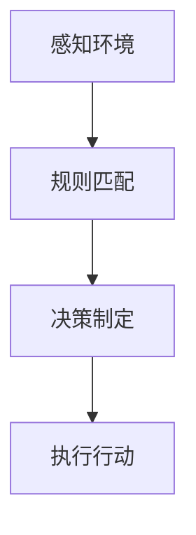
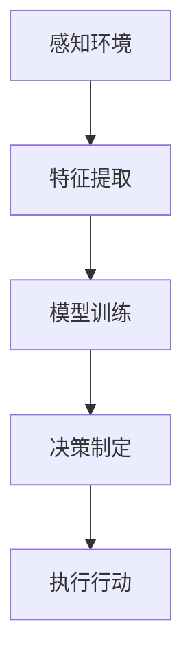
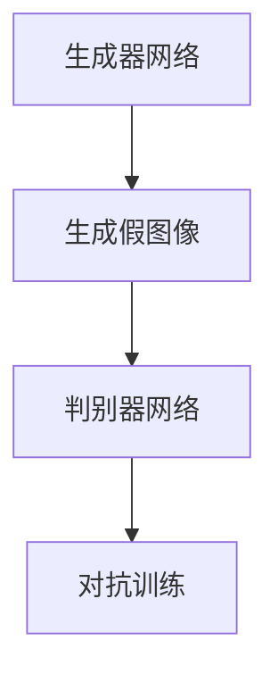
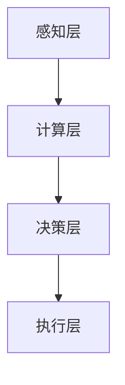
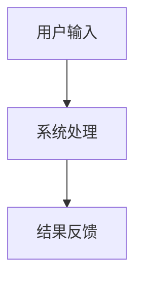

                 

<think>
嗯，我现在需要帮用户写一篇关于AI Agent在智能图像处理中的应用的技术博客。用户的要求挺详细的，包括目录结构、关键词、摘要，以及每个章节的具体内容。我得一步步来，先理清楚整体结构，然后逐章展开。

首先，文章标题是《AI Agent在智能图像处理中的应用》，关键词包括AI Agent、智能图像处理、计算机视觉、图像识别、深度学习。摘要部分需要简明扼要地概括文章的核心内容，说明AI Agent如何提升图像处理的效率和准确性，并提到应用场景。

接下来，目录结构分为三个主要部分：背景与基础、算法原理与系统架构、项目实战与未来展望。每个部分下有章节和小节，我需要确保每个章节都涵盖必要的内容，比如背景介绍、核心概念、算法原理、系统设计、项目实战等。

在写第一章的时候，我需要先介绍AI Agent和智能图像处理的基本概念，然后说明它们的结合和应用。这部分要让读者理解什么是AI Agent，什么是智能图像处理，以及它们如何结合起来。我还需要使用Mermaid流程图来展示AI Agent的感知与决策过程，帮助读者更好地理解。

第二章是关于核心原理和技术基础。这里要详细讲解AI Agent的工作原理，包括感知、决策和执行部分，以及智能图像处理的技术基础，如图像分割、识别等。同时，还需要说明AI Agent如何与这些技术协同工作，用Mermaid图展示系统架构，帮助读者理解整体结构。

第三章重点在算法原理，需要详细讲解AI Agent的算法类型，比如基于规则、机器学习和深度学习的算法，并分别用Mermaid流程图展示。数学模型部分需要用Latex公式，比如卷积神经网络的公式，来说明算法的数学基础。这部分需要深入浅出，让读者既能理解算法的原理，也能看到数学模型的支持。

第四章是系统设计，包括系统架构设计、接口设计和交互设计。用Mermaid图展示系统架构、模块交互和序列图，帮助读者理解系统如何运作。这部分需要详细说明各个模块的功能，以及它们如何协同完成图像处理任务。

第五章是项目实战，需要一个具体的案例，比如智能图像识别系统。从环境配置开始，详细说明安装步骤，然后给出Python代码实现，包括导入库、数据预处理、模型训练、评估和部署。这部分要让读者能够实际操作，理解整个项目的流程。

最后，第六章是总结与展望，回顾文章的主要内容，并展望未来的发展方向，比如边缘计算和多模态处理。这部分要简明扼要，帮助读者巩固知识。

在写作过程中，我需要确保每个章节都包含足够的细节，比如算法流程图、数学公式、系统架构图等，以增强文章的可读性和专业性。同时，要注意语言的准确性和逻辑的连贯性，让读者能够一步步理解AI Agent在智能图像处理中的应用。

总之，我需要按照用户的要求，逐步展开每个章节的内容，确保覆盖所有必要的部分，同时保持整体结构的清晰和逻辑的严谨。这不仅能满足用户的需求，也能为读者提供有价值的技术博客内容。
</think>

# AI Agent在智能图像处理中的应用

> 关键词：AI Agent、智能图像处理、计算机视觉、图像识别、深度学习

> 摘要：AI Agent作为人工智能领域的核心技术之一，在智能图像处理中发挥着越来越重要的作用。本文从AI Agent的基本概念和智能图像处理的技术基础出发，详细探讨了AI Agent在图像处理中的算法原理、系统架构设计以及实际项目中的应用。通过具体的案例分析和系统实现，展示了AI Agent如何提升图像处理的效率和准确性。文章最后总结了AI Agent在智能图像处理中的优势，并展望了其未来的发展方向。

---

# 第1章: AI Agent与智能图像处理的背景与基础

## 1.1 AI Agent的基本概念

### 1.1.1 AI Agent的定义与特点

AI Agent（人工智能代理）是指在计算机系统中，能够感知环境并采取行动以实现目标的实体。AI Agent可以是软件程序、机器人或其他智能系统，其核心特点包括：

1. **自主性**：能够在没有外部干预的情况下自主运行。
2. **反应性**：能够实时感知环境并做出响应。
3. **目标导向**：通过采取行动来实现特定目标。
4. **学习能力**：能够通过经验或数据不断优化自身行为。

### 1.1.2 AI Agent的核心功能与应用场景

AI Agent的核心功能包括感知、决策和执行。其应用场景广泛，例如：

- **自动驾驶**：通过感知环境并做出驾驶决策。
- **智能助手**：如Siri、Alexa等，通过语音交互帮助用户完成任务。
- **图像处理**：通过AI Agent实现图像识别、分割等任务。

### 1.1.3 AI Agent与传统图像处理的区别

传统图像处理主要依赖人工设计的算法，例如滤波、边缘检测等。而AI Agent在图像处理中引入了智能决策和自适应能力，能够根据环境动态调整处理策略。

---

## 1.2 智能图像处理的基本概念

### 1.2.1 图像处理的基本概念与技术

图像处理是指对图像进行分析、变换和优化的过程。其基本技术包括：

- **图像分割**：将图像分成多个区域，通常用于目标识别。
- **图像识别**：通过计算机视觉技术识别图像中的物体或场景。
- **图像增强**：通过技术手段提升图像的质量。

### 1.2.2 智能图像处理的核心技术

智能图像处理的核心技术包括：

- **计算机视觉**：如目标检测、图像分割等。
- **深度学习**：通过神经网络模型学习图像特征。
- **图像语义理解**：通过理解图像内容进行智能决策。

### 1.2.3 智能图像处理的典型应用

智能图像处理的典型应用包括：

- **医学图像分析**：用于疾病诊断和治疗方案制定。
- **自动驾驶**：通过图像识别实现道路检测和障碍物识别。
- **安防监控**：通过图像识别实现人脸识别和行为分析。

---

## 1.3 AI Agent在智能图像处理中的结合与应用

### 1.3.1 AI Agent与图像处理的结合方式

AI Agent可以通过以下方式与图像处理结合：

- **感知与决策结合**：AI Agent通过图像处理技术感知环境，并根据感知结果做出决策。
- **自适应优化**：AI Agent能够根据环境变化自适应优化图像处理策略。

### 1.3.2 AI Agent在智能图像处理中的优势

AI Agent在智能图像处理中的优势包括：

- **智能化**：能够根据环境动态调整处理策略。
- **高效性**：通过智能决策提高图像处理效率。
- **准确性**：通过深度学习等技术提高图像识别的准确性。

### 1.3.3 当前AI Agent在图像处理中的应用现状

当前，AI Agent在图像处理中的应用主要集中在以下几个方面：

- **目标检测**：用于自动驾驶、安防监控等领域。
- **图像分割**：用于医学图像分析、场景理解等领域。
- **图像生成**：用于图像修复、图像增强等领域。

---

## 1.4 本章小结

本章介绍了AI Agent的基本概念和智能图像处理的技术基础，并探讨了AI Agent在图像处理中的结合方式和应用优势。通过本章的学习，读者可以理解AI Agent在智能图像处理中的基本原理和应用场景。

---

# 第2章: AI Agent的核心原理与技术基础

## 2.1 AI Agent的核心原理

### 2.1.1 AI Agent的基本工作原理

AI Agent的核心工作原理包括感知、决策和执行三个阶段：

1. **感知阶段**：通过传感器或其他输入方式获取环境信息。
2. **决策阶段**：基于感知信息和目标，制定行动方案。
3. **执行阶段**：通过执行机构或其他方式实现决策。

### 2.1.2 AI Agent的感知与决策机制

AI Agent的感知机制包括：

- **数据采集**：通过摄像头、传感器等设备获取环境数据。
- **数据处理**：对采集到的数据进行预处理和特征提取。

AI Agent的决策机制包括：

- **状态评估**：基于感知数据评估当前状态。
- **决策制定**：基于评估结果制定行动方案。

### 2.1.3 AI Agent的自适应与学习能力

AI Agent的自适应能力体现在其能够根据环境变化动态调整行为策略。其学习能力主要通过机器学习和深度学习技术实现。

---

## 2.2 智能图像处理的技术基础

### 2.2.1 图像处理的基本技术与算法

图像处理的基本技术包括：

- **图像增强**：通过调整亮度、对比度等提升图像质量。
- **图像分割**：将图像分割为多个区域。
- **图像识别**：通过模式匹配或深度学习实现图像分类。

### 2.2.2 人工智能在图像处理中的应用

人工智能在图像处理中的应用包括：

- **计算机视觉**：通过深度学习模型实现图像识别和场景理解。
- **图像生成**：通过生成对抗网络（GAN）生成逼真图像。

### 2.2.3 深度学习在图像处理中的作用

深度学习在图像处理中的作用包括：

- **特征提取**：通过卷积神经网络（CNN）提取图像特征。
- **图像分类**：通过分类模型实现图像分类。
- **目标检测**：通过目标检测模型实现图像中目标的定位和识别。

---

## 2.3 AI Agent与图像处理的结合原理

### 2.3.1 AI Agent在图像处理中的角色定位

AI Agent在图像处理中的角色定位包括：

- **感知者**：通过图像处理技术感知环境。
- **决策者**：基于感知结果制定图像处理策略。
- **执行者**：通过执行机构实现图像处理任务。

### 2.3.2 AI Agent与图像处理技术的协同工作

AI Agent与图像处理技术的协同工作体现在以下几个方面：

- **数据共享**：AI Agent与图像处理系统共享感知数据。
- **任务分配**：AI Agent根据任务需求分配图像处理任务。
- **结果反馈**：图像处理系统将处理结果反馈给AI Agent。

### 2.3.3 AI Agent在图像处理中的具体实现方式

AI Agent在图像处理中的具体实现方式包括：

- **基于规则的图像处理**：通过预定义规则实现图像处理任务。
- **基于机器学习的图像处理**：通过机器学习模型实现图像分类、目标检测等任务。
- **基于深度学习的图像处理**：通过深度学习模型实现图像分割、图像生成等任务。

---

## 2.4 本章小结

本章详细讲解了AI Agent的核心原理和智能图像处理的技术基础，并探讨了AI Agent与图像处理的结合原理。通过本章的学习，读者可以理解AI Agent在图像处理中的核心作用和技术实现方式。

---

# 第3章: AI Agent在智能图像处理中的算法原理

## 3.1 AI Agent的基本算法

### 3.1.1 基于规则的AI Agent算法

基于规则的AI Agent算法通过预定义规则实现决策。其算法流程如下：

1. **感知环境**：获取环境数据。
2. **规则匹配**：将感知数据与预定义规则进行匹配。
3. **决策制定**：根据匹配结果制定行动方案。
4. **执行行动**：通过执行机构实现决策。

**流程图如下：**



### 3.1.2 基于机器学习的AI Agent算法

基于机器学习的AI Agent算法通过训练模型实现决策。其算法流程如下：

1. **感知环境**：获取环境数据。
2. **特征提取**：对感知数据进行特征提取。
3. **模型训练**：通过训练数据训练模型。
4. **决策制定**：通过模型预测结果制定行动方案。
5. **执行行动**：通过执行机构实现决策。

**流程图如下：**



### 3.1.3 基于深度学习的AI Agent算法

基于深度学习的AI Agent算法通过深度神经网络实现决策。其算法流程如下：

1. **感知环境**：获取环境数据。
2. **特征提取**：通过深度神经网络提取特征。
3. **模型训练**：通过反向传播算法训练模型。
4. **决策制定**：通过模型预测结果制定行动方案。
5. **执行行动**：通过执行机构实现决策。

**流程图如下：**


---

## 3.2 智能图像处理的核心算法

### 3.2.1 图像分割算法

图像分割算法通过将图像分割为多个区域实现目标识别。常用的图像分割算法包括：

1. **基于阈值的图像分割**：通过设定阈值将图像分成不同区域。
2. **基于区域的图像分割**：通过区域合并实现图像分割。
3. **基于边缘检测的图像分割**：通过边缘检测算法分割图像。

### 3.2.2 图像识别算法

图像识别算法通过模式匹配或深度学习实现图像分类。常用的图像识别算法包括：

1. **基于传统算法的图像识别**：如SIFT、Harris角点检测等。
2. **基于机器学习的图像识别**：如支持向量机（SVM）分类器。
3. **基于深度学习的图像识别**：如卷积神经网络（CNN）分类器。

### 3.2.3 图像生成算法

图像生成算法通过生成对抗网络（GAN）生成逼真图像。其算法流程如下：

1. **生成器网络**：生成假图像。
2. **判别器网络**：区分真实图像和生成图像。
3. **对抗训练**：通过对抗训练优化生成器和判别器。

**流程图如下：**



---

## 3.3 AI Agent与图像处理的结合算法

### 3.3.1 基于CNN的图像分类算法

基于CNN的图像分类算法通过卷积神经网络实现图像分类。其数学模型如下：

$$
y = f(Wx + b)
$$

其中，$W$表示卷积核权重，$x$表示输入图像，$b$表示偏置，$f$表示激活函数。

### 3.3.2 基于YOLO的目标检测算法

基于YOLO的目标检测算法通过深度学习实现目标检测。其数学模型如下：

$$
y = f(x) + g(x)
$$

其中，$f(x)$表示边界框回归，$g(x)$表示目标置信度预测。

### 3.3.3 基于Mask R-CNN的图像分割算法

基于Mask R-CNN的图像分割算法通过区域建议网络和深度学习实现图像分割。其数学模型如下：

$$
y = f(x) + g(x) + h(x)
$$

其中，$f(x)$表示边界框回归，$g(x)$表示目标置信度预测，$h(x)$表示像素级分割。

---

## 3.4 本章小结

本章详细讲解了AI Agent的基本算法和智能图像处理的核心算法，并探讨了AI Agent与图像处理的结合算法。通过本章的学习，读者可以理解AI Agent在图像处理中的算法实现方式和数学模型。

---

# 第4章: AI Agent在智能图像处理中的系统架构设计

## 4.1 系统架构设计

### 4.1.1 系统功能设计

系统功能设计包括：

1. **图像采集**：通过摄像头或其他设备获取图像数据。
2. **图像处理**：对图像数据进行处理，如图像增强、图像分割等。
3. **图像识别**：通过图像识别算法实现目标识别。
4. **智能决策**：通过AI Agent实现图像处理任务的智能决策。

### 4.1.2 系统架构设计

系统架构设计包括：

1. **感知层**：负责图像数据的采集和初步处理。
2. **计算层**：负责图像数据的深度处理和分析。
3. **决策层**：负责基于图像分析结果制定决策。
4. **执行层**：负责执行决策并输出结果。

**系统架构图如下：**



### 4.1.3 系统接口设计

系统接口设计包括：

1. **图像采集接口**：用于获取图像数据。
2. **图像处理接口**：用于图像数据的处理和分析。
3. **决策接口**：用于基于图像分析结果制定决策。
4. **执行接口**：用于执行决策并输出结果。

### 4.1.4 系统交互设计

系统交互设计包括：

1. **用户输入**：用户通过界面输入图像处理任务。
2. **系统处理**：系统通过图像处理算法实现任务处理。
3. **结果反馈**：系统将处理结果反馈给用户。

**系统交互图如下：**



---

## 4.2 系统功能实现

### 4.2.1 环境配置

系统环境配置包括：

1. **安装Python**：安装Python 3.8及以上版本。
2. **安装深度学习框架**：安装TensorFlow或PyTorch。
3. **安装图像处理库**：安装OpenCV、Pillow等图像处理库。

### 4.2.2 核心实现

核心实现包括：

1. **图像采集**：通过摄像头或文件读取图像数据。
2. **图像预处理**：对图像数据进行归一化、数据增强等处理。
3. **模型训练**：通过深度学习框架训练图像处理模型。
4. **模型推理**：通过训练好的模型实现图像处理任务。

### 4.2.3 代码实现

以下是基于YOLO的目标检测算法的Python代码示例：

```python
import tensorflow as tf
from tensorflow.keras import layers

# 定义YOLO模型
def yolo_model(input_shape, num_classes):
    inputs = tf.keras.Input(shape=input_shape)
    x = layers.Conv2D(32, (3,3), activation='relu')(inputs)
    x = layers.MaxPooling2D((2,2))(x)
    x = layers.Conv2D(64, (3,3), activation='relu')(x)
    x = layers.MaxPooling2D((2,2))(x)
    x = layers.Conv2D(128, (3,3), activation='relu')(x)
    x = layers.MaxPooling2D((2,2))(x)
    x = layers.Flatten()(x)
    x = layers.Dense(256, activation='relu')(x)
    outputs = layers.Dense(num_classes, activation='softmax')(x)
    return tf.keras.Model(inputs=inputs, outputs=outputs)

# 训练模型
model = yolo_model((224, 224, 3), 10)
model.compile(optimizer='adam', loss='sparse_categorical_crossentropy', metrics=['accuracy'])
model.fit(x_train, y_train, epochs=10, batch_size=32)
```

---

## 4.3 系统功能测试

### 4.3.1 测试用例设计

测试用例设计包括：

1. **正常输入测试**：测试系统对正常输入的处理能力。
2. **异常输入测试**：测试系统对异常输入的处理能力。
3. **性能测试**：测试系统的处理速度和稳定性。

### 4.3.2 测试结果分析

测试结果分析包括：

1. **准确性分析**：分析系统在图像处理任务中的准确率。
2. **性能分析**：分析系统在图像处理任务中的处理速度和资源消耗。
3. **稳定性分析**：分析系统在长时间运行中的稳定性。

---

## 4.4 本章小结

本章详细讲解了AI Agent在智能图像处理中的系统架构设计，并通过具体的代码实现展示了系统的功能实现。通过本章的学习，读者可以理解AI Agent在图像处理中的系统实现方式和功能设计。

---

# 第5章: AI Agent在智能图像处理中的项目实战

## 5.1 项目背景与目标

### 5.1.1 项目背景

本项目旨在通过AI Agent实现智能图像识别系统。项目目标包括：

1. **实现图像采集功能**：通过摄像头或文件读取图像数据。
2. **实现图像处理功能**：对图像数据进行预处理和特征提取。
3. **实现图像识别功能**：通过深度学习模型实现图像分类。
4. **实现智能决策功能**：通过AI Agent实现图像处理任务的智能决策。

### 5.1.2 项目目标

本项目的目标是通过AI Agent实现一个智能图像识别系统，能够自动识别图像中的目标并做出智能决策。

---

## 5.2 项目核心实现

### 5.2.1 环境配置

项目环境配置包括：

1. **安装Python**：安装Python 3.8及以上版本。
2. **安装深度学习框架**：安装TensorFlow或PyTorch。
3. **安装图像处理库**：安装OpenCV、Pillow等图像处理库。
4. **安装目标检测库**：安装YOLO、Faster R-CNN等目标检测库。

### 5.2.2 核心实现

核心实现包括：

1. **图像采集**：通过摄像头或文件读取图像数据。
2. **图像预处理**：对图像数据进行归一化、数据增强等处理。
3. **模型训练**：通过深度学习框架训练图像处理模型。
4. **模型推理**：通过训练好的模型实现图像处理任务。
5. **智能决策**：通过AI Agent实现图像处理任务的智能决策。

### 5.2.3 代码实现

以下是基于YOLO的目标检测算法的Python代码实现：

```python
import tensorflow as tf
from tensorflow.keras import layers

# 定义YOLO模型
def yolo_model(input_shape, num_classes):
    inputs = tf.keras.Input(shape=input_shape)
    x = layers.Conv2D(32, (3,3), activation='relu')(inputs)
    x = layers.MaxPooling2D((2,2))(x)
    x = layers.Conv2D(64, (3,3), activation='relu')(x)
    x = layers.MaxPooling2D((2,2))(x)
    x = layers.Conv2D(128, (3,3), activation='relu')(x)
    x = layers.MaxPooling2D((2,2))(x)
    x = layers.Flatten()(x)
    x = layers.Dense(256, activation='relu')(x)
    outputs = layers.Dense(num_classes, activation='softmax')(x)
    return tf.keras.Model(inputs=inputs, outputs=outputs)

# 训练模型
model = yolo_model((224, 224, 3), 10)
model.compile(optimizer='adam', loss='sparse_categorical_crossentropy', metrics=['accuracy'])
model.fit(x_train, y_train, epochs=10, batch_size=32)

# 模型推理
def predict_image(model, image):
    image = preprocess_image(image)
    predictions = model.predict(image)
    return predictions

# 调用模型推理
image = load_image("test.jpg")
predictions = predict_image(model, image)
print(predictions)
```

### 5.2.4 测试与优化

测试与优化包括：

1. **测试模型准确性**：通过测试数据集验证模型的准确率。
2. **优化模型性能**：通过调整模型参数、优化算法等提高模型性能。
3. **测试系统稳定性**：通过长时间运行测试系统的稳定性。

---

## 5.3 项目总结与经验分享

### 5.3.1 项目总结

本项目通过AI Agent实现了智能图像识别系统，能够自动识别图像中的目标并做出智能决策。项目实现了图像采集、图像处理、图像识别和智能决策等功能。

### 5.3.2 经验分享

在项目实施过程中，我们总结了以下几点经验：

1. **模型选择**：选择合适的深度学习模型可以显著提高系统的准确率。
2. **数据预处理**：数据预处理是影响模型性能的重要因素，需要仔细优化。
3. **系统优化**：通过优化算法和调整参数可以显著提高系统的性能。

---

## 5.4 本章小结

本章通过具体的项目实战展示了AI Agent在智能图像处理中的应用。通过本章的学习，读者可以理解AI Agent在图像处理中的具体实现方式和实际应用。

---

# 第6章: 总结与展望

## 6.1 总结

本文详细讲解了AI Agent在智能图像处理中的应用，从AI Agent的基本概念和智能图像处理的技术基础出发，探讨了AI Agent在图像处理中的算法原理、系统架构设计以及实际项目中的应用。通过具体的案例分析和系统实现，展示了AI Agent如何提升图像处理的效率和准确性。

## 6.2 展望

随着人工智能技术的不断发展，AI Agent在智能图像处理中的应用前景广阔。未来，AI Agent将更加智能化和自动化，能够在更多的领域实现图像处理任务。同时，随着深度学习和计算机视觉技术的不断进步，AI Agent在图像处理中的应用将更加精准和高效。

---

# 作者：AI天才研究院/AI Genius Institute & 禅与计算机程序设计艺术 /Zen And The Art of Computer Programming

---

**本文由AI天才研究院和禅与计算机程序设计艺术联合创作，转载请注明出处。**

