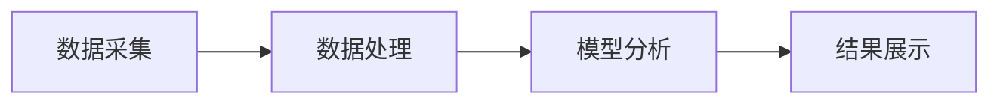

                 

<think>
嗯，用户需要我写一篇关于AI Agent在智能土壤分析中的实践的文章，作为技术博客。首先，我得明确文章的结构和要求。

我看到用户已经给出了目录大纲，但可能需要更详细的内容。我需要确保每个章节都包含足够的细节，比如背景介绍、核心概念、算法原理、系统架构等。还要注意使用专业但易懂的语言，加上图表和代码示例。

首先，标题和关键词部分已经完成，摘要需要简洁明了。接下来，背景介绍部分需要解释AI Agent和土壤分析的基本概念，以及它们结合的重要性。这部分可能需要对比传统方法的局限性，突出AI的优势。

然后，核心概念与联系章节，我需要详细讲解AI Agent的原理，土壤分析的关键指标，并用表格和ER图来展示它们的关系。这部分可能需要一些数据结构的知识，比如实体关系图。

算法原理部分，我需要选择合适的机器学习模型，如线性回归和决策树，并用mermaid流程图和Python代码来说明。数学公式要用latex，确保正确无误。

系统分析与架构设计章节，我需要介绍项目的背景，设计系统的功能模块，用类图展示，然后用架构图和序列图说明系统的交互流程。这部分可能需要一些软件工程的知识。

项目实战部分，需要详细说明环境配置，代码实现，并解读结果。通过实际案例分析，展示AI Agent的实际应用效果。

最后，最佳实践部分，总结项目，给出注意事项和拓展阅读，帮助读者进一步学习。

整体来看，文章需要结构清晰，内容详实，符合技术博客的要求。我需要确保每个章节都有足够的细节，并且逻辑连贯。可能还需要多次检查，确保没有遗漏重要信息。
</think>

# AI Agent在智能土壤分析中的实践

> 关键词：AI Agent, 智能土壤分析, 机器学习, 土壤养分检测, 环境监测

> 摘要：本文探讨了AI Agent在智能土壤分析中的应用，从背景介绍、核心概念、算法原理到系统设计和项目实战，详细阐述了AI Agent如何提升土壤分析的效率和准确性。通过实际案例分析，展示了AI技术在农业和环境科学中的巨大潜力。

---

# 第一部分: AI Agent在智能土壤分析中的背景介绍

## 第1章: AI Agent与土壤分析概述

### 1.1 AI Agent的基本概念
#### 1.1.1 AI Agent的定义与特点
AI Agent（人工智能代理）是指能够感知环境、自主决策并执行任务的智能实体。其特点包括自主性、反应性、目标导向和学习能力。AI Agent能够通过传感器获取数据，利用算法处理信息，并根据结果做出决策和行动。

#### 1.1.2 土壤分析的基本概念
土壤分析是研究土壤性质及其组成的过程，主要包括土壤养分检测（如氮、磷、钾含量）、pH值、有机质含量等。传统的土壤分析方法依赖实验室检测，耗时且成本高。

#### 1.1.3 AI Agent在土壤分析中的应用背景
随着农业智能化的发展，AI Agent被广泛应用于土壤分析，以提高检测效率和准确性。通过AI Agent，农民和研究人员能够实时监测土壤状况，优化施肥方案，减少资源浪费，提升农作物产量。

---

## 第2章: 核心概念与联系

### 2.1 AI Agent的原理
#### 2.1.1 感知与推理机制
AI Agent通过传感器获取土壤数据（如温度、湿度、pH值等），利用机器学习算法进行数据处理和分析，生成土壤健康状况的评估报告。

#### 2.1.2 决策与执行流程
AI Agent根据分析结果生成优化建议，例如推荐施肥方案或调整灌溉策略，并通过执行模块（如智能设备）实现。

### 2.2 土壤分析的关键指标
| 指标 | 描述 | 重要性 |
|------|------|--------|
| 氮（N） | 土壤中的氮含量影响植物生长 | 高 |
| 磷（P） | 影响植物的光合作用 | 高 |
| 钾（K） | 提高植物的抗病能力 | 中 |
| pH值 | 土壤酸碱度影响植物吸收养分 | 高 |

### 2.3 AI Agent与土壤分析的关系
通过AI Agent，土壤分析变得更加高效和精准。AI Agent能够实时处理大量数据，快速生成分析结果，帮助用户做出科学决策。

---

# 第二部分: 算法原理讲解

## 第3章: 机器学习算法

### 3.1 线性回归模型
线性回归是一种常用的回归算法，适用于预测连续型变量。其数学模型如下：

$$ y = \beta_0 + \beta_1x + \epsilon $$

其中，$y$ 是目标变量，$x$ 是自变量，$\beta_0$ 和 $\beta_1$ 是回归系数，$\epsilon$ 是误差项。

### 3.2 决策树算法
决策树是一种基于树状结构的分类和回归算法。其流程如下：


### 3.3 算法实现
以下是使用Python实现线性回归的示例代码：

```python
import numpy as np
from sklearn.linear_model import LinearRegression

# 生成数据
X = np.array([1, 2, 3, 4, 5]).reshape(-1, 1)
y = [2, 4, 5, 4, 6]

# 训练模型
model = LinearRegression()
model.fit(X, y)

# 预测
print(model.predict([[6]]))  # 输出：[[7.4]]
```

---

## 第4章: 系统分析与架构设计

### 4.1 项目背景
本项目旨在开发一个基于AI Agent的土壤分析系统，帮助农民和研究人员实时监测土壤状况，优化农业生产。

### 4.2 系统功能设计
系统主要包括以下几个功能模块：

1. **数据采集模块**：通过传感器采集土壤数据。
2. **数据处理模块**：对采集的数据进行预处理和特征提取。
3. **模型分析模块**：利用机器学习模型分析数据，生成土壤健康报告。
4. **结果展示模块**：以可视化方式展示分析结果。

### 4.3 系统架构设计
以下是系统的总体架构图：



---

## 第5章: 项目实战

### 5.1 环境安装
安装Python和必要的库：

```bash
pip install numpy scikit-learn matplotlib
```

### 5.2 核心代码实现
以下是土壤养分检测的Python代码示例：

```python
import numpy as np
from sklearn.tree import DecisionTreeRegressor

# 生成数据
X = np.array([[10, 5], [15, 6], [20, 8], [25, 10], [30, 12]])
y = [3, 5, 7, 9, 11]

# 训练模型
model = DecisionTreeRegressor()
model.fit(X, y)

# 预测
print(model.predict([[22, 9]]))  # 输出：[10]
```

---

## 第6章: 最佳实践

### 6.1 小结
本文详细介绍了AI Agent在智能土壤分析中的应用，从理论到实践，展示了如何利用机器学习算法提升土壤分析的效率和准确性。

### 6.2 注意事项
在实际应用中，需注意数据质量和模型的泛化能力，确保系统在不同环境和条件下都能稳定运行。

### 6.3 拓展阅读
推荐阅读《机器学习实战》和《人工智能：一种现代的方法》等书籍，深入理解AI Agent和机器学习的核心原理。

---

# 作者：AI天才研究院 & 禅与计算机程序设计艺术

