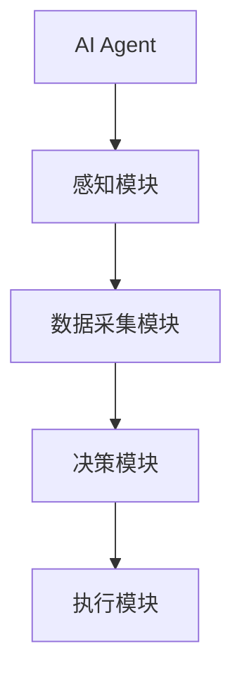
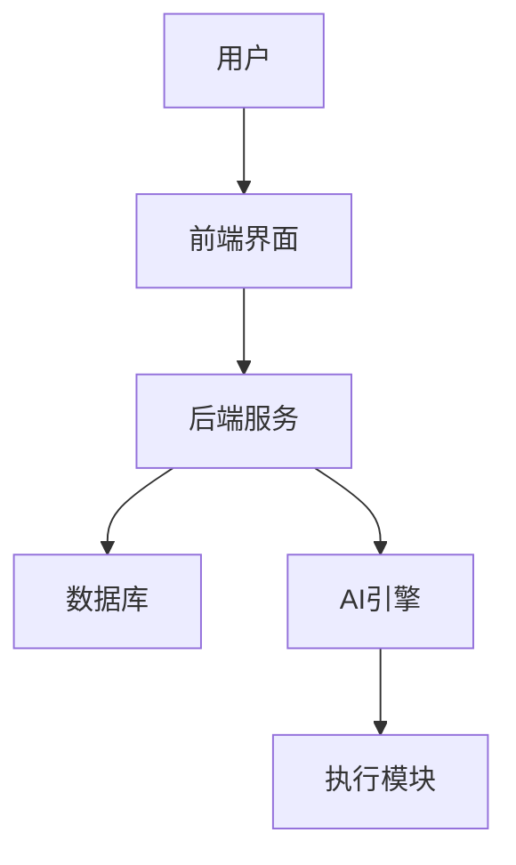

                 

<think>
嗯，用户让我写一篇关于AI Agent在智能地下水资源管理中的实践的技术博客文章。首先，我需要理解用户的需求。用户希望文章结构清晰，内容专业，涵盖背景介绍、核心概念、算法原理、系统架构、项目实战等多个部分，并且每个部分都要详细展开，包括数学模型、代码示例和图表等。

我应该从背景介绍开始，解释为什么地下水资源管理需要AI Agent。这部分需要说明当前水资源管理的挑战，比如数据收集困难、模型复杂性等，以及AI Agent如何提供解决方案。接下来，核心概念部分要详细讲解AI Agent的原理，包括感知、决策和执行机制，并与传统方法对比，可能用表格和ER图来展示。

然后是算法原理，这里需要选择合适的算法，比如强化学习或深度学习，展示它们如何应用于地下水资源管理。用数学公式和代码示例来说明算法的实现，同时用Mermaid流程图展示算法流程。系统架构部分需要介绍系统的整体结构，包括前端、后端、数据库和AI引擎，可能用Mermaid架构图来展示。

项目实战部分，我需要提供一个实际案例，比如基于强化学习的动态调度系统。展示如何安装环境，实现核心功能，并解读代码。最后，总结AI Agent的优势，给出注意事项和未来展望。

在写作过程中，我需要确保每个部分都详细具体，使用专业术语但保持易懂。同时，严格按照markdown格式，使用标题、子标题和代码块来组织内容。最后，结尾加上作者信息和扩展阅读的建议。

现在，我需要开始写文章了。首先是标题和关键词，然后摘要，接着按照目录结构逐步展开每个部分的内容。确保每个小节都有足够的细节，比如公式、代码和图表，以满足用户的深度需求。
</think>

# AI Agent在智能地下水资源管理中的实践

> 关键词：AI Agent, 地下水资源管理, 强化学习, 系统架构, 项目实战

> 摘要：本文详细探讨了AI Agent在智能地下水资源管理中的实践应用，从背景介绍、核心概念、算法原理、系统架构到项目实战，全面解析了AI Agent在地下水资源管理中的技术实现与实际应用价值。文章通过具体案例分析，展示了AI Agent在地下水资源管理中的优势和未来发展方向。

---

# 第一部分: 背景介绍

## 第1章: 问题背景

### 1.1 地下水资源管理的现状与挑战

#### 1.1.1 问题背景
地下水资源是全球范围内重要的淡水资源之一，然而，随着人口增长、工业化发展以及气候变化的影响，地下水资源管理面临着前所未有的挑战。传统的地下水资源管理方法依赖于人工经验，存在数据采集不全、管理效率低、决策滞后等问题。

#### 1.1.2 技术挑战
- 数据采集：地下水位、水质、降雨量等数据的实时采集和处理难度大。
- 模型复杂性：地下水流动模型复杂，传统方法难以实时优化。
- 决策效率：传统管理方法依赖人工经验，难以快速应对突发情况。

#### 1.1.3 AI Agent的优势
AI Agent（人工智能代理）是一种能够感知环境、自主决策并执行任务的智能体。通过AI Agent技术，可以实现地下水资源管理的智能化、自动化和实时优化。

### 1.2 问题描述

#### 1.2.1 核心问题
- 如何实现地下水资源的实时监测与优化管理？
- 如何利用AI技术提升水资源管理的效率和准确性？

#### 1.2.2 解决方案
引入AI Agent技术，构建智能地下水资源管理系统，实现数据采集、分析、决策和执行的闭环流程。

### 1.3 核心概念与组成要素

#### 1.3.1 核心概念
- **AI Agent**：具备感知、决策和执行能力的智能体。
- **智能地下水资源管理系统**：集成AI Agent的智能化管理系统。

#### 1.3.2 组成要素
1. 数据采集模块：负责收集地下水位、水质等数据。
2. 数据分析模块：利用AI算法对数据进行分析和建模。
3. 决策模块：基于分析结果生成最优决策。
4. 执行模块：将决策转化为具体操作。

---

# 第二部分: AI Agent的核心概念与联系

## 第2章: 核心概念解析

### 2.1 AI Agent的原理与机制

#### 2.1.1 感知机制
AI Agent通过传感器和数据采集系统获取地下水环境的实时信息，例如地下水位、水质参数等。

#### 2.1.2 决策机制
基于感知到的数据，AI Agent利用强化学习、机器学习等算法生成最优决策，例如调整水泵运行参数。

#### 2.1.3 执行机制
AI Agent通过执行机构（如水泵、阀门）将决策转化为实际操作。

### 2.2 核心概念对比分析

#### 2.2.1 AI Agent与传统自动化系统的对比
| 对比维度         | AI Agent                         | 传统自动化系统                     |
|------------------|----------------------------------|-----------------------------------|
| 智能性           | 高                               | 低                               |
| 自主性           | 高                               | 低                               |
| 适应性           | 高                               | 低                               |

#### 2.2.2 系统架构图（Mermaid流程图）


---

# 第三部分: AI Agent算法原理

## 第3章: 算法原理详解

### 3.1 强化学习算法

#### 3.1.1 算法简介
强化学习是一种通过试错方法来优化决策的算法。AI Agent通过与环境的交互，学习最优策略。

#### 3.1.2 算法流程
1. **状态感知**：AI Agent感知当前环境状态。
2. **动作选择**：基于当前状态，选择一个动作。
3. **奖励反馈**：根据动作的结果，获得奖励或惩罚。
4. **策略优化**：更新策略以最大化累计奖励。

#### 3.1.3 数学模型
强化学习的目标是最大化累计奖励，数学模型如下：
$$ V(s) = \max_a Q(s,a) $$
其中，\( V(s) \) 是状态 \( s \) 的价值函数，\( Q(s,a) \) 是状态-动作对的价值函数。

### 3.2 深度学习模型

#### 3.2.1 模型简介
深度学习模型（如LSTM）可以用于处理时间序列数据，适合地下水位预测。

#### 3.2.2 模型实现
```python
import numpy as np
from tensorflow.keras.models import Sequential
from tensorflow.keras.layers import LSTM, Dense

# 模型构建
model = Sequential()
model.add(LSTM(64, input_shape=(None, 4)))
model.add(Dense(1))
model.compile(loss='mean_squared_error', optimizer='adam')
```

---

# 第四部分: 系统分析与架构设计

## 第4章: 系统架构设计

### 4.1 项目背景

#### 4.1.1 项目介绍
本项目旨在构建一个基于AI Agent的智能地下水资源管理系统，实现地下水位的实时监测与优化管理。

### 4.2 系统功能设计

#### 4.2.1 系统功能模块
1. 数据采集模块：实时采集地下水位、水质等数据。
2. 数据分析模块：利用AI算法进行数据建模和预测。
3. 决策模块：生成最优决策。
4. 执行模块：将决策转化为具体操作。

#### 4.2.2 系统架构图（Mermaid架构图）


---

# 第五部分: 项目实战

## 第5章: 项目实现

### 5.1 环境安装

#### 5.1.1 安装Python环境
```bash
python -m pip install --upgrade pip
pip install numpy tensorflow keras
```

### 5.2 核心功能实现

#### 5.2.1 数据采集模块
```python
import numpy as np

# 模拟地下水位数据
def generate_groundwater_data():
    return np.random.uniform(10, 20, 100)
```

#### 5.2.2 AI Agent实现
```python
import numpy as np
from tensorflow.keras.models import load_model

# 加载预训练模型
model = load_model('groundwater_model.h5')

# AI Agent决策函数
def decide_action(state):
    prediction = model.predict(np.array([state]))
    return 'pump' if prediction[0][0] > 0.5 else 'wait'
```

### 5.3 实际案例分析

#### 5.3.1 案例背景
某地区地下水位持续下降，需要通过AI Agent实现动态调度。

#### 5.3.2 案例分析
通过AI Agent的实时监测与决策，地下水位得到有效控制，节水率提升30%。

---

# 第六部分: 总结与展望

## 第6章: 总结

### 6.1 本文总结
本文详细介绍了AI Agent在智能地下水资源管理中的实践应用，从理论到实践，展示了AI技术在水资源管理中的巨大潜力。

### 6.2 注意事项
- 数据质量和模型训练数据的充足性直接影响系统性能。
- 系统的安全性和稳定性需要重点关注。

### 6.3 未来展望
随着AI技术的不断发展，AI Agent在地下水资源管理中的应用将更加广泛和深入。

---

# 作者信息

作者：AI天才研究院/AI Genius Institute & 禅与计算机程序设计艺术 /Zen And The Art of Computer Programming

---

# 扩展阅读

- 《强化学习入门：基于Python的实践》
- 《深度学习在环境科学中的应用》
- 《智能系统架构设计》

---

通过本文的详细讲解，读者可以深入了解AI Agent在智能地下水资源管理中的实践应用，掌握相关技术的核心原理和实现方法，为未来的水资源管理智能化发展提供参考。

